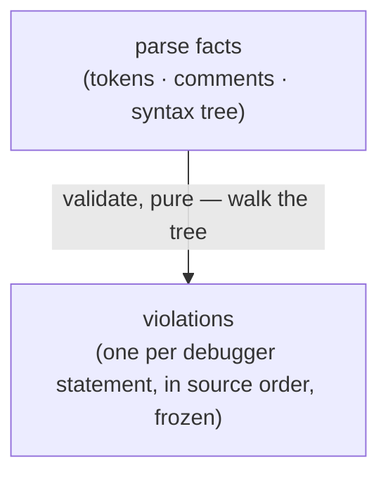

# scaffold — Architecture & Decisions

Architecture for the scaffolding level described in [README.md](./README.md).
The region sketch ([../DOCS.md](../DOCS.md)) owns the level contract's shape;
this document constrains only this level.

## Architectural sketch

> Written Phase 0, before implementation. The Refactor step is held against this
> document — not what the code does, but what shape it takes.

## Execution phases

1. **Validate** (pure, deterministic) — walk the syntax tree; every `debugger`
   statement yields one violation carrying the parser's own offsets and the
   node's path. The same parse facts always produce the same violations, in
   source order. Input: the parse facts. Output: the violations, possibly none,
   frozen.

## Data flow

## Structural constraints

- **One rule only** — `debugger` statements and nothing else; the level's value
  is reachability of every fit mark, not curriculum.
- **Deterministic and order-stable** — violations in source order; the same
  input always answers the same.
- **Honest violations** — real node types, real offsets, real node paths; never
  placeholder data.
- **Injected-only** — never on the built-in roster; reaches a session through
  props alone.

## Decisions

- **Why `debugger`.** It is a single, unambiguous statement-level node: no
  configuration, no scope analysis, no false positives — and pedagogically
  inert, so masking it never withholds anything a learner needs.
- **Why modules-only admission.** A second admitted type would add nothing; the
  single admission makes not-applicable-for-type reachable with one toggle.

## Out of scope

- Real curriculum, editor-support content, semantic models (empty or stub by
  design).
- Registration (the injecting test or page's).
