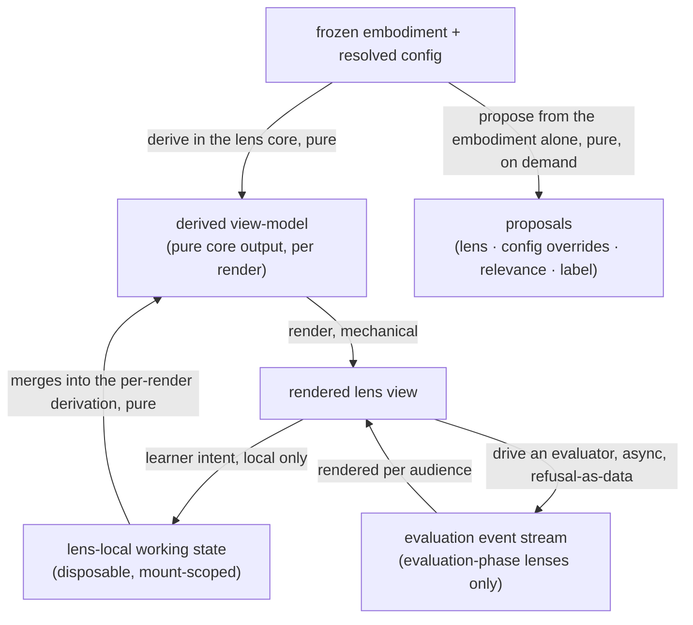

<!-- cspell:ignore Gateable -->

# lenses — Architecture & Decisions

Region-level architecture for the component kind described in
[README.md](./README.md). The package sketch ([../DOCS.md](../DOCS.md)) owns the
package-level shape; this document constrains only this region, at its root
abstraction. Each lens's own directory zooms into that lens.

## Architectural sketch

> Written Phase 0, before implementation. The Refactor step is held against this
> document — not what the code does, but what shape it takes.

**Inbound contract.** A lens comes alive already gated and already mounted: its
applicability ran over the Facts — embody's gate for an attached lens, the
orchestrator's mount-time gate for a panel-excluded one; the lens supplies only
the predicate — and the orchestrator mounted it with the frozen embodiment and
its resolved configuration. Nothing else ever crosses into a lens.

## Execution phases

1. **Derive** (sync, pure) — the lens core — pure functions of the facts and the
   configuration — derives the view-model the component will render, narrowing
   the tagged fact stages it reads. The lens's working state (an answer in
   progress) merges into the derivation; it is local and disposable. Input:
   embodiment + resolved config + local working state. Output: the derived
   view-model.

2. **Render** (mechanical) — the component renders what the core derived; it
   stays a thin wrapper and derives nothing downstream consumers read. Input:
   the derived view-model. Output: the rendered lens view.

3. **Interact** (async at the edges) — learner intent updates local state and
   re-enters Derive. Evaluation-phase lenses drive evaluators behind
   refusal-as-data and render their event streams per audience. A settle
   unmounts the lens: teardown is unmounting, and an unmount cancels whatever
   the lens was driving. Input: the rendered view + learner intent. Output: a
   re-render — or nothing; the next embodiment starts fresh.

4. **Propose** (sync, pure, on demand — independent of any mount) — when asked,
   a lens's recommend derives next-step proposals from the embodiment alone.
   Ranking and rendering them is not this region's act. Input: the embodiment.
   Output: proposals.

## Data flow

## Structural constraints

- **Read-only views.** A lens never mutates the embodiment or its resolved
  configuration; both arrive frozen from upstream owners.
- **Totality at mount.** The gate is the kind's refusal channel; main assumes
  fit held. No defensive re-checking inside components.
- **Core-first.** Every non-trivial derivation lives in the lens core — pure
  functions of the facts and the configuration; components render what the core
  derives.
- **The kind boundary holds.** A lens is never an evaluator; evaluators are
  imported and driven privately by evaluation-phase lenses, and their event
  streams die with the mount that started them.
- **Level consultation stays internal.** A lens may gate or render against a
  language level it imports; no contract field, prop, or export names a level.
- **The module surface is synchronous.** Async work lives inside the component;
  the contract's fields are all sync.
- **Configuration is flat and serializable.** Primitives and primitive arrays
  only — deterministic hashes, no schema drift.

## Decisions

- **Why two-layer modules (pure core + thin component).** The core's tests run
  without a DOM and stay fast; the React boundary is explicit; and the narrowing
  of tagged fact stages happens in one place — the core's signatures — instead
  of being scattered through JSX.
- **Why totality instead of defensive checks.** Both mount paths guarantee fit
  (embody's gate for attached lenses; the orchestrator's mount-time gate for
  panel-excluded ones). A defensive re-check inside main would not protect the
  learner — it would hide the consumer bug that put the lens there.
- **Why teardown is unmounting.** No dispose keeps disposable practice coherent:
  every settle is a fresh program, so lens state must not be worth saving.
  Anything a lens was driving is canceled by the unmount itself.

## Out of scope

- **Attachment and fit computation** — embody runs the gates and attaches the
  refs.
- **Mounting, focus requests, cascade resolution, the enforcement mask** — the
  orchestrator's; this region only declares what a mounted lens receives.
- **Ranking and rendering recommendations** — the orchestrator's, through the
  enforcement mask; a lens only proposes.
- **The evaluator contract** — owned by the evaluators region; consuming lenses
  import it.
- **Language-level content** — validators, documentation, and model builders
  belong to their levels.
- **Per-lens internals** — each lens's directory owns its own architecture.
