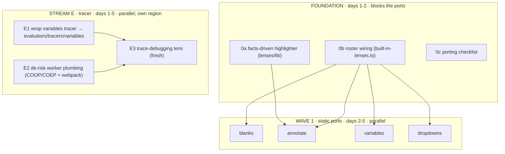

<!-- TRANSITIONAL — delete when the migration completes. Not a permanent region doc. -->

# Lens Migration Playbook

> **DRAFT — not canonical.** Do not follow this file directly. Canonical
> governance is routed by `CLAUDE.md`.

**This is your control panel for the week.** It's written to _you_ — the person
sequencing the work and dispatching agents — not to the agents. Each work item
below carries a goal, the exact source files to quarry, its Definition of Done,
and a **copy-paste agent prompt**. Run the streams in the order the dependency
graph allows; enforce the golden rules; accept nothing that isn't wired in and
green.

Verified against live code 2026-07-22. Scope is locked (see §Decisions).

---

## Context & paths (agents read this first)

**Repo root:**
`/Users/master/Documents/0-teach-code/0-spiralearn/0-curriculum-committee/0-curricula`
**Path convention (cold-start-verified):** bare region refs — `lenses/…`,
`orchestrate/…`, `evaluators/…`, `lib/…` — resolve under
`<repo>/src/lib/study-lenses/`. Refs already prefixed `study-lenses/` or
`study-lenses--deprecated-architecture/` are relative to `<repo>/src/lib/`. The
Gen-1 originals and the tracer/handoff paths are **absolute** in the table
below. **Run/verify the sandbox:** `npm start` (docusaurus start) → open the
orchestrate sandbox page `spiralearn/sandbox/orchestrate/index.mdx`; a wired
lens appears in its phase's `<select>`. This is the "reachable in the sandbox"
check every port's DoD names.

| Reference                                       | Absolute location                                                                                                                                      |
| ----------------------------------------------- | ------------------------------------------------------------------------------------------------------------------------------------------------------ |
| Governance (read before any work)               | `<repo>/CLAUDE.md` (repo root — the governance router) + `<repo>/DEV.md` — at the **repo root**, not under study-lenses                                |
| Package (target)                                | `<repo>/src/lib/study-lenses/`                                                                                                                         |
| Contract docs                                   | `study-lenses/lenses/README.md` · `DOCS.md` · `types.ts` · example `lenses/writeme/`                                                                   |
| Roster seam                                     | `study-lenses/orchestrate/lib/composing/built-in-lenses.ts` (+ `join-level-roster.ts`)                                                                 |
| Quarry (Gen-2, READ-ONLY)                       | `<repo>/src/lib/study-lenses--deprecated-architecture/lenses/`                                                                                         |
| Originals (Gen-1) — **separate committee tree** | `/Users/master/Documents/0-teach-code/0-spiralearn/0-study-lenses-committee/zz--oldd-clauding-and-context-dump/0--study-lenses--it-begins/src/lenses/` |
| Coloring input                                  | `study-lenses/embody/types.ts` (`Tokens`, `Environment`)                                                                                               |
| Engine / evaluators                             | `study-lenses/lib/engine/` · `study-lenses/evaluators/`                                                                                                |
| Tracer (copy A, the complete one)               | `<repo>/src/lib/embody/lib/evaluating/trace/variables/`                                                                                                |
| Tracer handoff notes (Stream E)                 | `<repo>/src/lib/embody/lib/evaluating/.handoff/variables-tracer-launch.md` + `trace-debugging-lens-launch.md`                                          |
| `lib/classifying` (blanks dep)                  | `study-lenses/lib/classifying/`                                                                                                                        |

Every path above was confirmed present 2026-07-22. Agents launched for this work
have both the `0-curricula` and `0-study-lenses-committee` trees in scope.

---

## The situation in one screen

Three generations of study lenses exist. We consolidate the good parts of the
two older trees into the greenfield and bring each lens up to the new `Lens`
contract.

| Gen                   | Path                                            | Use it for                                                                           |
| --------------------- | ----------------------------------------------- | ------------------------------------------------------------------------------------ |
| **Gen 3 — TARGET**    | `study-lenses/lenses/`                          | the destination; new contract; parsons/writeme/debug-props ported (but NOT wired in) |
| **Gen 2 — QUARRY**    | `study-lenses--deprecated-architecture/lenses/` | **structure** — mature per-lens `core.ts`+`lib/`; READ-ONLY (ships live)             |
| **Gen 1 — ORIGINALS** | `.../0--study-lenses--it-begins/src/lenses/`    | **visuals** — Preact + rich CSS; where coloring lives                                |

**Decisions (locked):** (1) coloring = a shared facts-driven read-only
highlighter; (2) quiz + socratize are EXCLUDED (owned by the question-lenses
"indexed-pony" pivot — coordinate the boundary, don't port); (3) four static
ports — blanks, annotate, variables, dropdowns; (4) trace-debugging is IN, as an
independent stream.

## What you're shipping this week

- **Foundation** — the shared highlighter + the roster wiring + a porting
  checklist.
- **Four static lens ports** — blanks, annotate, variables, dropdowns.
- **The variables tracer + trace-debugging lens** — a parallel dynamic stream.
- **(If time) Wave 2** — print, markdown-shell, parsons chip-coloring backfill.



**Coordination read:** Foundation gates the ports (they need `0a` coloring and
`0b` wiring). The four ports are independent of each other — fan them out in
parallel. Stream E lives in a different region (`evaluators/`), so it runs
alongside Wave 1 with no contention; its real gate is **plumbing (E2)**, not
code — run E2 first.

**Dispatch discipline (cold-start-verified):** never dispatch a downstream agent
before its upstream has MERGED. annotate needs 0a landed (its coloring rewrite
consumes 0a's API); every port needs 0b to prove "reachable"; E3 needs E1
**and** E2. Each prompt below restates its prereq — honor it, or the agent
blocks on a missing input (this is exactly what the cold-start dry-run caught).

---

## The contract every lens must hit (your acceptance yardstick)

```ts
type Lens = Gateable & {
	// Gateable = { name, applicability(facts), phase? }
	main: ComponentType<LensProperties>; // React; thin wrapper over a pure core
	config?: (overrides?) => LensConfig; // flat serializable primitives only
	recommend?: (embodiment) => ReadonlyArray<Recommendation>;
};
type LensProperties = { embodiment: Embodiment; config: LensConfig };
// Embodiment = { facts, study };  Facts = { source, tokens, ast, entwined, environment, type }
```

Directory shape:
`README.md · DOCS.md · index.tsx (the Lens object) · core.ts · types.ts · tests/`.
The authoritative references agents must read: `lenses/README.md`,
`lenses/DOCS.md`, `lenses/types.ts`, and — as the best worked example —
`lenses/writeme/` (its README has a per-file porting map).

Phase assignment: blanks/annotate → `source`; variables → `environment`;
trace-debugging → `evaluation` (panel-excluded is fine for v1).

## Golden rules to enforce (reject work that breaks these)

1. **Porting ≠ shipping.** A lens isn't done until it's in
   `orchestrate/lib/composing/built-in-lenses.ts` (empty today) and reachable in
   the sandbox. Wiring is in the Definition of Done, never "later."
2. **Port the pedagogy, not a shell.** The value is the `lib/` engines (blanks'
   `blankenate`, parsons' LIS scorer). The quarry's own DOCS record prior
   "compliant shell" reverts — don't repeat that.
3. **Two-layer module.** A pure `core.ts` (facts+config → view-model, DOM-free
   tests) and a thin `main`. Heavy logic in the core, not the JSX.
4. **Coloring is shared and facts-driven.** DOM lenses consume the `0a`
   highlighter off `facts.tokens`; they don't each re-tokenize or pull in Prism.
5. **embody is type-only; the embodiment is frozen.** No runtime import from
   embody; no mutation of props.
6. **No retired vocabulary in migrated content.** Don't reintroduce terms the
   greenfield killed (e.g. `realm`, the old phase names). There is no committed
   banned-terms file in the tree — confirm the current set with the maintainer
   (0c can pin it); net-new code (0a) is exempt, nothing to migrate.
7. **Follow the repo's governance** — every agent reads `CLAUDE.md` (repo root —
   the governance router), then its own governance file per that router, +
   `DEV.md` and runs the full AR cycle; you hold the human review gate between
   DDD and TDD.

---

## FOUNDATION (do first)

### 0a — Facts-driven read-only highlighter (`lenses/lib/`)

**Goal.** A shared, React-free helper that turns `facts.tokens` into colored
spans for read-only code views, so every DOM lens colors consistently without
Prism. **Why first.** annotate and the parsons backfill consume it; it's the
keystone. **DoD.** Pure helper in `lenses/lib/` with its own tests; renders JS
tokens to semantic-classed spans; theme-aware (light/dark); documented; consumed
by at least one lens in a smoke test.

> **Agent prompt — 0a:** Read `study-lenses/lenses/README.md`,
> `lenses/lib/README.md`, and `study-lenses/embody/types.ts` (the
> `Tokens`/`Facts` shape), plus `CLAUDE.md` (repo root — the governance router),
> then your governance file per that router and `DEV.md`. Then, following the
> full DDD/TDD/AR cycle, build a shared read-only syntax highlighter in
> `study-lenses/lenses/lib/`: a pure, React-free function that takes embody's
> `tokens` fact and returns colored token spans (a data structure the caller
> renders, plus a small CSS contract keyed by token class), theme-aware for
> light/dark. It must NOT re-tokenize, import Prism/CodeMirror, or depend on any
> lens. Cover it with core tests. This is the coloring mechanism every read-only
> DOM lens (parsons, annotate, print) will reuse — design its API for those
> consumers. Do plan-mode design first and stop at the human gate before
> implementing.

### 0b — Roster wiring + policy (`orchestrate/lib/composing/`)

**Goal.** Make ported lenses actually appear. `built-in-lenses.ts` is `[]`
today. **DoD.** The three already-ported lenses (parsons, writeme, debug-props)
are wired and reachable in the sandbox; the join mirrors `join-level-roster.ts`;
the built-in roster policy (which lenses ship by default vs inject-only) is
decided and documented.

> **Agent prompt — 0b:** Read
> `study-lenses/orchestrate/lib/composing/built-in-lenses.ts`,
> `join-level-roster.ts` (the parallel mechanism for levels),
> `study-lenses/WORKFLOWS.md`, and `CLAUDE.md` (repo root — the governance
> router), then your governance file per that router, + `DEV.md`. Wire the
> existing ported lenses (`lenses/parsons`, `lenses/writeme`,
> `lenses/debug-props`) into the built-in lens roster so they mount and are
> reachable in the sandbox, mirroring the level-roster join (append-only,
> duplicate `name` fails loudly). **In lockstep, strip those same three lenses
> from the sandbox harness's injected `lenses` prop at
> `spiralearn/sandbox/orchestrate/index.mdx` (leave only the `notes` demo)** —
> else `joinLensRoster` throws duplicate-name at mount. Propose and document the
> built-in roster policy: which lenses ship by default vs mount only by
> injection. Full AR cycle; human gate before implementing.

### 0c — Porting checklist (one page)

**Goal.** A short, repeatable checklist so every lens port is uniform. **DoD.**
A markdown checklist distilled from `writeme/README.md` + the contract deltas
below, living beside this playbook.

> **Agent prompt — 0c:** Read `lenses/README.md`, `lenses/writeme/README.md` and
> `lenses/writeme/DOCS.md`. Produce a one-page "how to port a lens" checklist:
> the required files, the two-layer split, the Gen-2→Gen-3 and Gen-1→Gen-3
> contract deltas (below), the coloring rule, wiring, and the banned-term grep.
> Terse and scannable.

**Contract deltas to bake into 0c:**

- _Gen 2 → Gen 3 (mechanical):_ `Component`→`main`; `applicableTo(Snippet)`→
  `applicability(Facts)`; phases (`realm` gone, `parse`→`tokens`/`ast`,
  `creation`→`environment`/`evaluation`); drop `Recommendation.blockModelCell`;
  read `facts.*` not `Snippet.status/raw/evaluation`.
- _Gen 1 → Gen 3 (larger):_ Preact→React; **context→props** (read
  `embodiment.facts`, not `useApp().currentFile`);
  `render`/`execute`→`main`+gate; drop the `enableColorize`/SL1 globals.

---

## WAVE 1 — the four static ports (parallel, after Foundation)

For each: **source**, **target**, **dependency**, **DoD**, **prompt**. All share
the same DoD spine: _ported to the Gen-3 contract; two-layer; core+component
tests green; coloring via 0a (or CodeMirror where editable); wired via 0b;
reachable in sandbox; banned-term grep clean; full AR cycle._

### blanks — top pick, unblocked

- **Source:** Gen-2 `study-lenses--deprecated-architecture/lenses/blanks/` (the
  rich one: `index.tsx` 1048, `core.ts`, `lib/blankenate.ts`,
  `lib/evaluate-correctness.ts`, `lib/no-paste-extension.ts`) + Gen-1
  `BlanksLens.jsx` for visuals.
- **Dependency:** package `lib/classifying/` (now present) + CodeMirror.
- **Target:** `lenses/blanks/`, phase `source`.

> **Agent prompt — blanks:** Read `CLAUDE.md` (repo root — the governance
> router), then your governance file per that router, + `DEV.md`,
> `lenses/README.md`/`DOCS.md`/`types.ts`, the 0c porting checklist, and the
> porting source `study-lenses--deprecated-architecture/lenses/blanks/`
> (READ-ONLY quarry — copy, never edit) plus
> `.../it-begins/src/lenses/BlanksLens.jsx` for visual reference. Port the
> fill-in-the-blank lens to `study-lenses/lenses/blanks/` under the Gen-3 `Lens`
> contract: two-layer (pure `core.ts` + thin `main`), gate on parsed AST,
> `blankenate` token-blanking + per-blank correctness grading carried over as
> the load-bearing pedagogy (NOT a shell). Use the package `lib/classifying` for
> token classification and CodeMirror for the editable surface. Wire it into
> `built-in-lenses.ts`. Full DDD→(human gate)→TDD→AR cycle; banned-term grep
> clean.

### annotate — brings coloring + flowchart + drawing

- **Source:** Gen-2 `.../lenses/annotate/` (`index.tsx` 487, `render-code.ts`,
  `render-flowchart.ts`, `annotations/` reducers) + Gen-1 `HighlightLens.jsx`.
- **Decision to make:** its coloring uses `prism-react-renderer`; **prefer the
  0a facts-driven highlighter** and keep `js2flowchart` only for the flowchart
  view (or defer the flowchart to a follow-up). Note the
  `dangerouslySetInnerHTML` SVG-injection security constraint — never pass
  `{debug:true}` into the flowchart renderer.
- **Target:** `lenses/annotate/`, phase `source`.

**Prereq — do not dispatch before 0a merges** (its highlighter is the coloring
you consume). If the 0c checklist isn't written yet, substitute
`study-lenses/lenses/writeme/README.md` + this playbook's "Contract deltas"
section.

> **Agent prompt — annotate:** Read `CLAUDE.md` (repo root — the governance
> router), then your governance file per that router, + `DEV.md`, the lens
> contract docs, the 0c checklist, the 0a highlighter API, and the source
> `study-lenses--deprecated-architecture/lenses/annotate/` (READ-ONLY) +
> `.../it-begins/src/lenses/HighlightLens.jsx`. Port the annotate lens (read
> code as colored view OR flowchart; pen/eraser/notes) to `lenses/annotate/`
> under the Gen-3 contract. Replace the Prism coloring with the shared 0a
> facts-driven highlighter. Keep `js2flowchart` for the flowchart view but
> preserve its injection-safety constraint (never debug-mode inject). Two-layer;
> the annotation reducers are pure-core testable. Wire into
> `built-in-lenses.ts`. Full AR cycle.

### variables — fills the empty `environment` phase

- **Source:** Gen-1 `.../it-begins/src/lenses/VariablesLens.jsx` (510) ONLY — no
  Gen-2 equivalent. It used `shift-scope`; **re-source to the greenfield
  `facts.environment` fact** (eslint-scope; the scope graph is already computed
  — read it, don't re-analyze).
- **Target:** `lenses/variables/`, phase `environment`. This is the showcase
  lens for an otherwise-unrendered fact.

> **Agent prompt — variables:** Read `CLAUDE.md` (repo root — the governance
> router), then your governance file per that router, + `DEV.md`, the lens
> contract docs, the 0c checklist, `study-lenses/embody/types.ts` (the
> `Environment`/scope fact: `Scope`, `ScopeVariable`, `ScopeReference`,
> `resolved`), and the visual source
> `.../it-begins/src/lenses/VariablesLens.jsx` (semantic hover-highlight of a
> variable's bindings/references). Build a `variables` lens in
> `lenses/variables/` for the `environment` phase: hovering an identifier
> highlights all references and the declaration of that binding, derived
> entirely from `facts.environment` (do NOT re-run scope analysis — the fact
> holds it, with positions). Semantic coloring (span-per-binding). Two-layer;
> core tests over the scope fact. Wire into `built-in-lenses.ts`. Full AR cycle.

### dropdowns — simplest, Gen-1-only

- **Source:** Gen-1 `.../it-begins/src/lenses/DropDownsLens.jsx` (734) ONLY.
  Used the Acorn tokenizer to classify tokens → `<select>`s; **read
  `facts.tokens` instead**.
- **Target:** `lenses/dropdowns/`, phase `source`.

> **Agent prompt — dropdowns:** Read `CLAUDE.md` (repo root — the governance
> router), then your governance file per that router, + `DEV.md`, the lens
> contract docs, the 0c checklist, the `facts.tokens` shape in
> `study-lenses/embody/types.ts`, and the source
> `.../it-begins/src/lenses/DropDownsLens.jsx`. Build a `dropdowns` lens in
> `lenses/dropdowns/` for the `source` phase: replace selected token categories
> (keywords/identifiers/operators/…) with `<select>` dropdowns the learner
> fills, with distractors and a difficulty control, grading against the real
> token. Classify from `facts.tokens` (do not re-tokenize). Two-layer; core
> tests. Wire into `built-in-lenses.ts`. Full AR cycle.

---

## STREAM E — the variables tracer + trace-debugging lens (parallel)

This is dynamic (`evaluation` phase) and lives in `evaluators/`, so it doesn't
contend with Wave 1. The tracer is a **thin wrap** (verified), but the
end-to-end lens is gated by runtime plumbing — **run E2 first**.

### E2 — de-risk the worker plumbing (do this before E3, ideally day 1)

- **The two unknowns that can sink the lens:** (1) is the live/Docusaurus site
  **cross-origin-isolated** (COOP/COEP headers) so SharedArrayBuffer works? (2)
  does **webpack** emit a real worker chunk for
  `new URL('./variables-worker-entry.ts', import.meta.url)`?
- **DoD:** a minimal smoke page runs the engine (`lib/engine`) in a worker under
  the actual production bundler + a cross-origin-isolated dev server, proving
  both.

> **Agent prompt — E2:** Read `study-lenses/lib/engine/README.md` + `DOCS.md`
> and the tracer handoff notes. Stand up a minimal smoke page that drives
> `study-lenses/lib/engine` (`evaluate`) in a real Web Worker, under the
> project's actual bundler (Docusaurus/webpack) and a cross-origin-isolated dev
> server (COOP/COEP). Prove: (a) `crossOriginIsolated` is true and
> SharedArrayBuffer works; (b) the
> `new URL(...worker-entry..., import.meta.url)` worker chunk is emitted and
> loads. Report exactly what config (headers, webpack worker settings) is
> required. This gates the trace-debugging lens — surface any blocker loudly.

### E1 — wrap the variables tracer as the first greenfield evaluator

- **Source (quarry copy A — the COMPLETE one):**
  `src/lib/embody/lib/evaluating/trace/variables/` — instrument (Acorn+splice),
  worker setup, thread logic, types, 6 test files incl. a real-worker browser
  suite. **Do NOT use copy B** under `--deprecated-architecture/embody/…`
  (partial orphan).
- **Target:** `study-lenses/evaluators/tracers/variables/` (doesn't exist yet —
  this becomes the first working greenfield evaluator; even `danger/` is
  types-only).
- **Engine re-point (trivial, proven):** swap the 5 engine imports from
  `study-lenses--deprecated-architecture/lib/engine` to
  `study-lenses/lib/engine` (API-identical; only rename
  `Settlement`→`EngineSettlement`).
- **⚠️ The real work — re-source 7 NON-engine deps + one decision (cold-start
  finding; this is NOT the trivial part).** `trace-variables.ts` /
  `instrument-variables.ts` also import `buildScope` (`scope/`),
  `justEnoughJs`+`validateProgram`+`ValidationReport` (`validating/`), and
  `buildNodePathMap`+`getChildNodes`+`ScopeInfo` (`parse-old/`) — all break on
  relocation. Re-point them to `study-lenses/language-levels/jej/`, which HAS
  `build-scope`, `get-child-nodes`, `build-node-path-map`, `just-enough-js` —
  but ships `validate.ts` (NOT `validate-program.ts`) with consolidated types,
  so reconcile the `validate-program`→`validate` rename/signature and the merged
  `types.ts`. Do NOT instead reach back into
  `embody/lib/{scope,validating,parse-old}` at runtime: `parse-old/**` is
  tsconfig-excluded, and a runtime embody-internal import violates the evaluator
  contract's type-only embody edge. Consulting the **jej language level** at
  runtime IS sanctioned — that's the decision.
- **The adapter (`index.ts`):** `name` + non-throwing `applicability` (JEJ
  gate) + `main(spec)` reading `facts.source`, `try/catch` the eager throw →
  `EvaluatorRefusal`, remap each event's discriminant `event`→`kind`, expose
  `settled` from `result` mapping the 5 outcomes → the 3 settlement arms; decide
  the `iterations`(spec)-vs-`seconds`(tracer) cap; re-run its suites on
  `lib/engine` (the tier was typecheck-quarantined — expect type fixes). Effort:
  the engine swap is hours; the jej re-source + reconcile is the multi-day part.

> **Agent prompt — E1:** Read
> `study-lenses/evaluators/README.md`/`DOCS.md`/`types.ts` (the `Evaluator`
> contract), `study-lenses/lib/engine/types.ts`, and the porting source
> `src/lib/embody/lib/evaluating/trace/variables/` (copy A — READ-ONLY; do NOT
> use the partial orphan under `--deprecated-architecture/embody/`). Create
> `study-lenses/evaluators/tracers/variables/` as the first greenfield
> evaluator: move the tier, re-point its 5 engine imports from
> `study-lenses--deprecated-architecture/lib/engine` to
> `study-lenses/lib/engine` (they're API-identical; the only rename is
> `Settlement`→`EngineSettlement`). **Also re-point the ~7 NON-engine imports**
> — `buildScope` (`scope/`), `justEnoughJs`/`validateProgram`/`ValidationReport`
> (`validating/`), `buildNodePathMap`/`getChildNodes`/`ScopeInfo` (`parse-old/`)
> — to `study-lenses/language-levels/jej/` (it has build-scope/get-child-nodes/
> build-node-path-map/just-enough-js); reconcile its `validate.ts` (vs
> `validate-program.ts`) and consolidated types. Do NOT runtime-import embody
> internals (violates the type-only embody edge; `parse-old` is
> tsconfig-excluded). Then add an `index.ts` adapter to the `Evaluator` contract
> — `applicability` runs the JEJ gate without throwing; `main(spec)` reads
> `facts.source`, converts the tracer's eager throw into an `EvaluatorRefusal`,
> remaps each event's `event` discriminant to `kind`, and exposes `settled` from
> the handle's `result` (map the 5 outcomes onto the 3 settlement arms). Decide
> and document the `iterations`-vs-`seconds` cap. Re-run the tier's existing
> fake-transport + real-worker tests against `lib/engine`. Full AR cycle.
> Blocked on E2 proving worker plumbing.

### E3 — the pedagogical trace-debugging lens (fresh build)

- **Source for ideas only:** the Gen-2 `.../lenses/trace-debugging/` is a
  throwaway dev harness — its `core.ts` projections (`formatEvent`,
  `deriveSettlementModel`) are reusable, but build the real lens fresh.
- **⚠️ New event union (cold-start finding):** the Gen-2 projections are written
  against the OLD tracer shape (`event.event`, 5 outcomes, imports
  `VariablesTraceEvent`/`VariablesSettlement` from embody types the greenfield
  does NOT re-export) — they will NOT lift verbatim. Read the CONCRETE new union
  from E1's `evaluators/tracers/variables/types.ts` (once E1 lands), or the
  tracer copy-A `embody/lib/evaluating/trace/variables/types.ts` to start
  against a mock, and apply the `event`→`kind` + 5-outcome→3-arm remap; the
  richer per-evaluator settlement is reached by importing the evaluator
  directly.
- **Target:** `lenses/trace-debugging/`, phase `evaluation`; drives the E1
  evaluator.
- **Depends on:** E1 (the evaluator) + E2 (plumbing proven).

> **Agent prompt — E3:** Read the lens contract docs, `evaluators/README.md`
> (the caller protocol: applicability → drive `main` → pull the stream → cancel
> by unmounting), and the Gen-2 harness
> `study-lenses--deprecated-architecture/lenses/trace-debugging/core.ts` for its
> pure event/settlement projections (reference only). Read the CONCRETE new
> event union from `evaluators/tracers/variables/types.ts` (from E1; or the
> tracer copy-A `embody/lib/evaluating/trace/variables/types.ts` to start
> against a mock) and apply the `event`→`kind` + 5-outcome→3-arm remap — the
> Gen-2 projections won't import cleanly. Build a pedagogical `trace-debugging`
> lens in `lenses/trace-debugging/` (`evaluation` phase) that drives the
> `evaluators/tracers/variables` evaluator behind refusal-as-data, renders the
> variable-lifecycle event stream for the learner (Run/Stop, per-audience where
> relevant, settlement shown in the machine's words), and cancels the run on
> unmount. Two-layer. Wire it in. Full AR cycle. Requires E1 + E2 done.

---

## Definition of Done — apply before you accept any lens

- Ported to the Gen-3 `Lens` contract; two-layer (pure `core.ts` + thin `main`).
- Core tests (no DOM) + component tests (jsdom) green; foreign baseline
  unchanged.
- The load-bearing pedagogy is present (the `lib/` engine ported), not a green
  shell.
- Coloring: via the 0a highlighter (DOM lenses) or CodeMirror (editable) — not
  ad hoc.
- **Wired into `built-in-lenses.ts` and reachable in the sandbox.**
- Banned-term grep clean; full AR cycle complete; your DDD→TDD human gate
  honored.
- Stream E extra: tier suites green **on `lib/engine`**; E2 plumbing proven; the
  lens renders a real run under cross-origin isolation.

## Open questions to settle as you go

- **Built-in roster policy** (0b) — which lenses ship default vs inject-only?
- **quiz/socratize boundary** — confirm with the indexed-pony owner before
  anyone touches question infra; this playbook assumes they're out.
- **annotate deps** — adopt `js2flowchart` for the flowchart, or defer the
  flowchart and ship colored-view-only first?
- **Tracer cap** — accept time-budget-only (`seconds`), or invest to honor
  `EvaluationSpec.iterations`?

## Source pointers (all verified 2026-07-22)

- Target contract: `lenses/types.ts` · `lenses/README.md` · `lenses/DOCS.md` ·
  best example `lenses/writeme/`.
- Quarry (structure, READ-ONLY):
  `study-lenses--deprecated-architecture/lenses/{blanks,annotate}/`.
- Originals (visuals):
  `.../it-begins/src/lenses/{BlanksLens,HighlightLens,VariablesLens,DropDownsLens}.jsx`.
- Coloring input: `study-lenses/embody/types.ts` (`Tokens`, `Environment`).
- Tracer (copy A): `src/lib/embody/lib/evaluating/trace/variables/`. Engine:
  `study-lenses/lib/engine/`. Evaluator contract: `study-lenses/evaluators/`.
- Roster seam: `orchestrate/lib/composing/built-in-lenses.ts` (+
  `join-level-roster.ts`).
