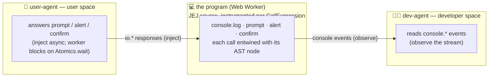

# lenses/agent-lenses — concept exploration

> **🧪 IDEATION, NOT A CONTRACT.** This is a divergent-brainstorming artifact
> with a touch of grounded realism — captured 2026-06-17. It explores whether a
> new _category_ of lens (one driven by small **local** AI agents) is feasible
> and valuable. Nothing here is specced, scheduled, or committed. No `types.ts`,
> no registry entry, no `applicableTo` gate has been touched. If/when this
> graduates, it earns a real `README.md` + `DOCS.md` under `lenses/<name>/` and
> goes through the normal DDD/TDD gates like any other lens. Until then: read it
> as a north-star sketch, not a plan.

## Origin — the idea

Could we build lenses that **visualize small local agents running and
interacting with JEJ programs through the two host channels** — the developer
channel (`console.*`) and the user channel (`prompt` / `alert` / `confirm`, i.e.
"p/a/c")?

The pitch, in the originator's words:

- Agents play **dev** (console access) and **user** (p/a/c access) to _review_
  programs, _test_ programs, or
- to produce **visuals of all audiences interacting in a rhetorical situation**
  (the program/computer, devs, users — and the agent itself, the fourth
  audience).
- The "crazy next level": watch a **dev**-agent _incrementally write and test_ a
  program against a prompt and **user**-agent feedback.
- The [`evaluating/intercept/`](../embody/lib/evaluating/intercept/) layer
  already has "all the right hooks"; agents interact via the **passed
  intercepts**.

Two constraints set up front:

- **PS — local models only.** See
  [`../embody/language-levels/just-enough-javascript/generator/`](../embody/language-levels/just-enough-javascript/generator/)
  for prior art. Today's working spike runs **WebLLM** (`@mlc-ai/web-llm`,
  Qwen2.5-Coder 0.5B/1.5B, in-browser via WebGPU) in
  `spike-jej--slopp/backend-llm.js` (in the sibling `0--home` tree, outside this
  repo).
- **PPS — hoist the model.** If we build these lenses, local-model management
  should be owned **once** by Study Lenses (a shared module imported by
  `lib/`/lenses), not local to a single function the way `generator/` couples to
  it today.

## TL;DR verdict

**Feasible _and_ valuable — but only if "agent" means _animated personification
of an audience_ (where fallibility teaches), not _reliable automation_ (where a
~1 GB local model will disappoint).**

- ✅ **The substrate fits unusually well.** The intercept layer reifies the
  exact dev/user channel split the curriculum is built on. Almost no glue
  needed.
- ✅ **User-agent simulation is feasible on a local model _today_.** Answering a
  `prompt()` in character is short, contextual, low-stakes.
- ⚠️ **Dev-agent _authoring/review_ is aspirational locally.** Writing and
  debugging code is the hardest thing a coder model does; a ~1 GB in-browser
  model will be shaky. This is the most valuable demo _and_ the most fragile
  under the local-only constraint — hold it as a north star, not a v1.
- ⚠️ **These are a new _kind_ of lens** (live/driver), not a frozen-view lens.
  Worth naming honestly.
- 💡 **The durable artifact is a recorded transcript**, not the live model.

## Why the fit is unusually tight (the impedance match)

This is the part that makes the idea more than a bolt-on. The curriculum's
central conceit is that JavaScript makes the developer/user split
**architecturally visible**: `console.log` lives in devtools (developer space),
`prompt`/`alert`/`confirm` live in browser UI (user space) — see
**welcome-to-frogramming/README.md:307**. The intercept layer doesn't merely
_also_ expose those two channels; it reifies that split into its API:

- **Dev channel = observable.** Console events stream out one at a time, each
  linked to the AST node that fired it. An agent "playing dev" consumes that
  stream.
- **User channel = injectable.** You hand
  `createInterceptGenerator(code, { io })` a set of async `io.prompt` /
  `io.alert` / `io.confirm` callbacks, and the worker **blocks until they
  resolve**. An agent "playing user" _is_ those callbacks.

Two facts, verified against the source's own doc-comments, are the load-bearing
ones:

- **Async injection is real and blocking.**
  [`intercept/types.ts`](../embody/lib/evaluating/intercept/types.ts) on the IO
  mock surface: _"Each callback is async-compatible… async returns are awaited
  before learner execution continues (the worker remains blocked until the
  Promise resolves)."_ And on the worker request message: _"Worker is blocked on
  `Atomics.wait` — main thread must show the native dialog and write the
  response to the SharedArrayBuffer."_ ⇒ A local model that takes 3 seconds to
  decide what to type into a `prompt()` is mechanically fine. The worker just
  waits.
- **Local models are a capability-gated spike.** `backend-llm.js` header: _"can
  a ~1 GB in-browser model produce gate-valid AND coherent JEJ…
  Capability-gated: `canRun()` checks WebGPU; `load()` may fail."_

So the originator's framing — "agents play dev (console access) and user (p/a/c
access)" — isn't a metaphor we'd have to engineer. It's a near-exact match with
an API that already exists.

The user-agent only ever sees dialogs; the dev-agent only ever sees console. The
thing the curriculum keeps asserting in prose becomes a watchable animation.

## Grounded realism — the caveats

1. **User-agent feasible now; dev-authoring aspirational.** Short in-character
   responses ≈ within a 0.5–1.5B model's reach. Multi-step write-then-debug ≈
   not reliably. The cruel irony: the most exciting demo collides hardest with
   the local-only constraint.

2. **A new lens _category_.** Every current lens ([`README.md`](./README.md),
   [`types.ts`](./types.ts)) is a **read-only view over a frozen `embodiment`**
   — execution already happened, the lens just renders the streams. An
   agent-driven run is **live, async, stateful**. A lens _can_ do this (it's a
   React component; it can drive the engine on demand), but it's a different
   beast — a "driver" or "simulation" lens. Don't assume it slots into the
   existing mold for free.

3. **The load-bearing artifact is a recorded transcript, not the live model.** A
   live local LLM is nondeterministic, hardware-gated, and the curriculum prizes
   **prediction and traceability**. The intercept layer already supports
   **replay of recorded events** — so the durable, shareable, deterministic
   object is the _captured interaction_. Live agent = the generator; recorded
   transcript = what students actually study. This also makes the model's
   weakness survivable (replay needs no WebGPU).

4. **The weakness can be the pedagogy.** When a naïve user-agent fat-fingers a
   `prompt()` and the program divides by a string, that's not a broken demo —
   that's the lesson. The Vibetoader _twins the user_; watching a fallible
   agent-user break an unclear interface is twinning made watchable. A small,
   dumb model is arguably _better_ for this than a polished one.

5. **Environmental gates are real.** Intercept needs SharedArrayBuffer
   (COOP/COEP headers). WebLLM needs WebGPU. Both must hold for a _live_ run; a
   _replayed_ transcript needs neither. Anything load-bearing for every learner
   should lean on replay.

## Candidate first lenses (KISSy-first)

Ordered by feasibility, not excitement.

### ① The Naïve-User lens — _strongest v1, feasible locally now_

Run the student's program, but a local **user**-agent answers the prompts _in
character_: "a confused beginner," "someone who types garbage," "a non-English
speaker," "a hostile tester." Console output shows as the dev channel; the
dialog exchange as the user channel. The student watches whether the program
survives contact with a realistic user. Pure `io.*` injection — **no new
substrate**. The agent being short and dumb is fine here.

### ② The Rhetorical-Situation animation — _the thesis-embodiment one_

Three lanes — **Dev** (console), **User** (dialogs), **Computer** (AST nodes
lighting up as they evaluate) — with events flowing to the right audience as the
program runs. Start as a **replay/animation over a recorded run** (fully
deterministic, events already linked to AST, no WebGPU). Agents personify dev &
user only as an _optional live layer_ on top. This is the "all audiences
interacting" visual from the original pitch, and the cheap version is genuinely
cheap.

### ③ The Predict-and-Twin agent — _reframes the weak model into an asset_

A **dev**-agent reads the source and **predicts the output before it runs**;
then we run it and show where the agent's prediction diverged from reality. This
is _literally_ the predict-and-twin loop the curriculum is built on
(**welcome-to-frogramming/ontology.md:400**) — and the agent being **wrong** is
the instructive part, not a failure. Sidesteps "is the local model good enough
to review code" by not requiring it to be.

### ④ The Spec → feedback → rewrite loop — _north star, not v1_

A **user**-agent gives feedback against a prompt; a **dev**-agent revises the
program; repeat. Most valuable, least feasible locally. Honest read: this
probably needs a bigger or cloud model, which collides with local-only. Hold it
as the destination the first three walk toward.

## Prerequisite (the PPS): hoist the local-model client

Independent of any lens above, this is sound hygiene and near-zero design risk.
Today `backend-llm.js` is trapped in a spike and the
[`generator/`](../embody/language-levels/just-enough-javascript/generator/)
couples to model loading inline. The obvious shape: a shared module (candidate:
`study-lenses/lib/llm-client/`) exposing a small factory —

- `canRun()` — the WebGPU capability gate,
- `load(model, onProgress)` — fetch-once / load-once / reuse lifecycle,
- `generate(request)` — the chat-completions surface,

— owned **once** and imported by `generator/` _and_ any future agent-lens. It is
a prerequisite for all four ideas above and carries almost no design risk. If we
do nothing else here, this refactor is the safe, clearly-good move.

## Open questions / where to push next

- **Visualization vs. autonomy?** These have very different feasibility curves.
  Drawing the rhetorical situation (idea ②, replay-first) is cheap and
  deterministic. Agents _autonomously doing dev/user work_ (ideas ③/④) is where
  the local-model ceiling bites. Worth deciding which itch we're scratching
  before designing anything.
- **Live vs. recorded as the default surface?** Leaning recorded-transcript for
  anything load-bearing; live as the generator behind it.
- **Where does a "driver lens" actually live?** It breaks the frozen-embodiment
  read-only assumption — does it call the engine itself, or does the
  orchestrator grow a notion of "run this and feed me the stream"?
- **Which audience does v1 personify?** User-agent (robustness testing) is the
  shippable thinking; dev-agent (review/authoring) is the aspirational one.
- **And a few wilder dreams** sit beyond all of this — tucked into a footnote
  rather than the body, since they're "wonder" territory, not roadmap.[^dreams]

## Source pointers (consulted 2026-06-17)

- [`../embody/lib/evaluating/intercept/`](../embody/lib/evaluating/intercept/) —
  `createInterceptGenerator(code, options)`; observe console events / inject
  async `io.*`; replay; AST-entwined events.
  ([`types.ts`](../embody/lib/evaluating/intercept/types.ts) ·
  [`README.md`](../embody/lib/evaluating/intercept/README.md))
- [`./README.md`](./README.md) · [`./types.ts`](./types.ts) — the current
  `LensModule` contract (frozen `embodiment` → read-only view) these ideas would
  extend/bend.
- [`../embody/types.ts`](../embody/types.ts) — the `Snippet` embodiment shape.
- [`../embody/language-levels/just-enough-javascript/generator/`](../embody/language-levels/just-enough-javascript/generator/)
  — prior local-model art (impl deferred); `spike-jej--slopp/backend-llm.js` (in
  the `0--home` tree) is the working WebLLM spike.
- **welcome-to-frogramming/README.md:307** (dev/user split is architecturally
  visible) · **ontology.md:400** (predict-and-twin loop) · Chapter 4 adds
  **Agents** as the fourth audience.

[^dreams]:
    **Wilder dreams** — L4 "wonder" territory, beyond any v1, recorded here so
    they aren't lost.

    _The literal fourth audience._ A lens where an agent reads _your_ code and
    you watch it form its (mis)understanding — Chapter 4's "writing for and with
    agents" made watchable. The agent as _itself_, not standing in for dev or
    user.

    _"The user" is plural._ An ensemble of user-personas hitting the same
    program at once, surfacing the Vibetoader insight that there is no singular
    user. Cheap once ① exists — just more `io.*` handlers.

    _The north-star dodge._ Reach ④ not by making the local model good enough,
    but by treating a curated **recorded run** as the deliverable: an author
    records one good incremental-build story; students scrub and replay it. This
    decouples the most valuable demo from model quality — and falls straight out
    of the "recorded transcript is the load-bearing artifact" conclusion above.

    _Recorded-run as a first-class lensable artifact._ A "run" you attach lenses
    to, the way you attach them to a `Snippet` today. More architectural — a
    data type, not just a view.
