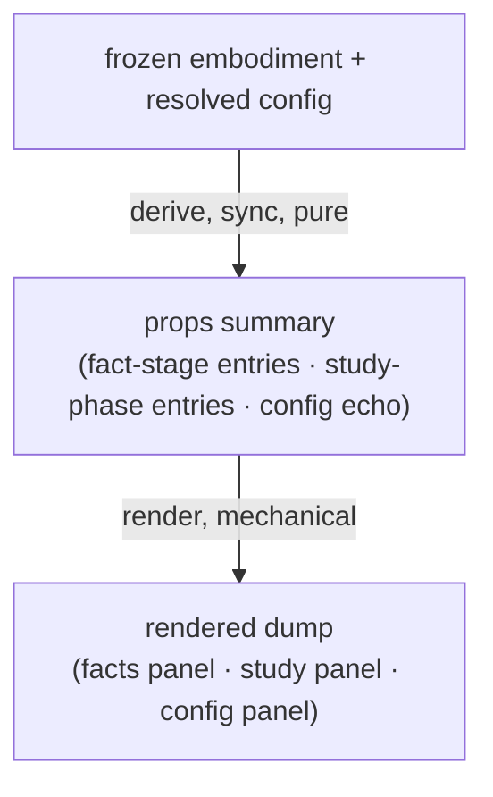

<!-- cspell:ignore entwined failable -->

# debug-props — Architecture & Decisions

Architecture for the meta-lens described in [README.md](./README.md). The region
sketch ([../DOCS.md](../DOCS.md)) owns the two-layer lens shape; this document
zooms into this lens.

## Architectural sketch

> Written Phase 0, before implementation. The Refactor step is held against this
> document.

**Inbound contract.** The lens is panel-excluded (no `phase`), so embody never
gates or attaches it; the orchestrator mounts it by explicit request with the
frozen embodiment and the resolved configuration. Its applicability is always
`true`: the summary is total by construction — every failable fact stage's entry
has an ok arm and a failed arm (`source` and `type` are given, never failed),
and every study-phase entry has an accessible arm and a barred arm — so there is
no embodiment it cannot dump.

## Execution phases

1. **Derive** (sync, pure) — the pure core maps the two props to the props
   summary. Each fact stage collapses to one entry: the ok arm describes the
   value compactly (a count, or the snippet type), the failed arm carries the
   cause message verbatim. Each lifecycle phase collapses to one entry:
   accessibility, attached-lens names, and — when barred — the barring cause's
   message. The configuration record is echoed as frozen data. Input:
   embodiment + resolved config. Output: the frozen props summary.

2. **Render** (mechanical) — the component renders the summary as three panels:
   the facts and study entries as `<dt>`/`<dd>` groups inside a `<dl>` each, the
   config echo as JSON inside `<pre>` (an `(empty)` placeholder when the record
   has no keys). Text only, never markup. The lens holds no working state —
   nothing to interact with, nothing to dispose. Input: the props summary.
   Output: the rendered dump.

## Data flow

## Structural constraints

- **Two-layer module shape.** The pure core (no React) owns every derivation,
  including all counting; the component maps summary entries to elements and
  derives nothing downstream consumers read.
- **Read-only view.** The lens never mutates the embodiment or the
  configuration; the config echo is a frozen clone, so summarizing never freezes
  a caller's object as a side effect. The freshly built summary is frozen in
  place.
- **The machine's voice.** Failure text is the stage cause's `message` verbatim
  — no rephrasing, no learner-wording. Compact by design: counts and messages,
  never object graphs; deep inspection of a node or scope is DevTools work on
  the mounted props.
- **Embody as types only.** Per the region purity rule, the lens imports
  embody's contract types and no embody runtime value; the lifecycle order is a
  local constant pinned with `satisfies` against the contract's
  `LifecyclePhaseOrder` tuple.
- **Exhaustive over the Facts.** The fact-stage entries derive from a per-stage
  mapping whose completeness over `FactStageName` is compile-checked: a stage
  added to the Facts contract must fail this module's compile, never silently
  vanish from the dump.
- **Selector contract.** `data-lens="debug-props"` + `data-debug-props` on the
  root; `data-debug-panel` on the three panels; `data-fact-stage` /
  `data-study-phase` on the entries. Selectors bind to attributes, never to
  label text.

## Decisions

- **Why applicability is always `true`.** A debug harness must mount against
  anything, including programs that fail at the first stage — that is precisely
  when a developer wants to see what a lens would receive. Totality lives in the
  summary's failed arms, not in the gate.
- **Why panel-excluded.** The lens teaches no lifecycle phase, so it declares
  none; it stays out of every study strip and is reached by explicit request
  only. This is the same posture the quarry original took, kept deliberately.
- **Why `causeMessage` is a string, not the `StageCause`.** The summary is a
  compact readable dump; the message already carries the parser's position text.
  Carrying the structured cause would duplicate embody's contract into this
  lens's view-model for no rendering gain — and the field name avoids shadowing
  embody's `cause` with a different shape.
- **Why the ast and entwined counts coexist.** The two counts arrive by
  independent routes — a walk of the syntax tree versus the entwined path index
  — under one node-membership rule: every node the entwined path grammar would
  address (an object carrying a string `type`, reached through a non-metadata
  property, directly or as an array element). Same intended set, independent
  routes: their agreement is an at-a-glance sanity check of the source⇄tree
  binding, and their divergence a loud embody defect — never an instrument
  artifact.
- **Why the scope count recurses.** The environment's `byPath` keys scopes by
  the path of the introducing node, and the global and module scopes are both
  introduced by the Program node — one key, two scopes. Counting the scope graph
  from its root is the honest count.
- **Why a local phase-order constant.** The region purity rule forbids importing
  embody's runtime order constant, and a presentation order should be
  compile-pinned, not re-derived from the record's key order at render. The
  `satisfies` pin against `LifecyclePhaseOrder` makes any upstream reorder a
  compile error here, not a silent drift.

## Out of scope

- **Mounting and the focus request** — the orchestrator's; this lens only
  declares no phase.
- **Roster wiring** — registering debug-props anywhere (built-in roster, sandbox
  pages) is composition-root work, not this module's.
- **A full embodiment inspector** — per-node, per-scope, per-token surfaces
  belong to future dedicated lenses; this lens stays a counts-and-flags HUD.
- **Recommendation** — a debug HUD proposes no next study step; the optional
  contract fields stay absent.
