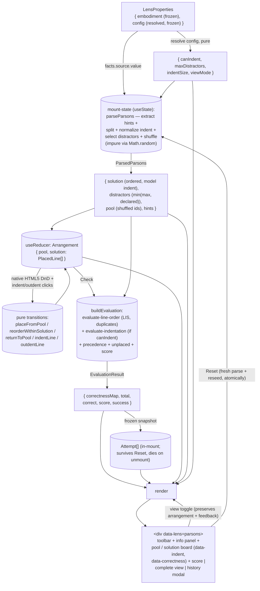

<!-- cspell:ignore distractor distractors outdent parsonizer lise lises desync -->

# parsons — Architecture & Decisions

The `parsons` lens is the learner's **assembly workbench**: a place to
reconstruct a program from its scrambled lines. [README.md](./README.md) owns
the public spec — the exercise, feedback, and DOM contracts; this document owns
the shape of the module and the decisions behind it.

## Modules

| File                                                                                                                                                            | Layer     | Purpose                                                                                                                                                                                            |
| --------------------------------------------------------------------------------------------------------------------------------------------------------------- | --------- | -------------------------------------------------------------------------------------------------------------------------------------------------------------------------------------------------- |
| `index.tsx`                                                                                                                                                     | component | The `Lens` object (default export) + `main`; owns arrangement, view, evaluation, and history state; native HTML5 DnD adapters; composes the core                                                   |
| `core.ts`                                                                                                                                                       | core      | The pure contract functions — `config`, `applicability`, `recommend`                                                                                                                               |
| `lib/parse-parsons.ts`                                                                                                                                          | core      | Full parse: hints → lines → distractor subset → shuffled pool (injectable RNG)                                                                                                                     |
| `lib/extract-hints.ts`                                                                                                                                          | core      | Block-comment hint extraction (source → source pre-pass, before line-splitting)                                                                                                                    |
| `lib/parse-lines.ts`                                                                                                                                            | core      | Split into solution + distractor lines; `// distractor` marker; blank / marker-only drops                                                                                                          |
| `lib/normalize-indents.ts`                                                                                                                                      | core      | Raw leading whitespace → relative nesting levels (`-1` = IndentationError sentinel)                                                                                                                |
| `lib/patience-sort.ts`                                                                                                                                          | core      | **Vendored** LIS building block — patience decks                                                                                                                                                   |
| `lib/find-lises.ts`                                                                                                                                             | core      | **Vendored** — enumerate all maximal-length increasing subsequences                                                                                                                                |
| `lib/best-lise.ts`                                                                                                                                              | core      | **Vendored** — pick the highest-consecutive-run LIS (first-max on ties)                                                                                                                            |
| `lib/best-lise-inverse-indices.ts`                                                                                                                              | core      | **Vendored** — the indices NOT in the best LIS (the lines to move); empty-input guard                                                                                                              |
| `lib/evaluate-line-order.ts`                                                                                                                                    | core      | Per-line order verdicts: duplicate-aware model matching + LIS; carries matched model indices out                                                                                                   |
| `lib/evaluate-indentation.ts`                                                                                                                                   | core      | Per-line indent verdicts for order-correct lines, against the matched model level                                                                                                                  |
| `lib/evaluate.ts`                                                                                                                                               | core      | Compose the evaluators under the precedence; `unplaced` marking; total/correct/score/success                                                                                                       |
| `lib/initial-arrangement.ts` + `lib/place-from-pool.ts`, `lib/reorder-within-solution.ts`, `lib/return-to-pool.ts`, `lib/indent-line.ts`, `lib/outdent-line.ts` | core      | Pure arrangement transitions over `{ pool, solution }`                                                                                                                                             |
| `types.ts`                                                                                                                                                      | shared    | `ParsonsLine`, `ParsedParsons`, `HintBlock`, `PlacedLine`, `Arrangement`, `LineCorrectness`, `CorrectnessMap`, `EvaluationResult`, `Attempt`, the evaluator interchange types, `ParsonsLensConfig` |
| `parsons.css`                                                                                                                                                   | styling   | Scoped to `[data-lens='parsons']`; board, controls, Wong feedback palette, legend, modal                                                                                                           |

Two-layer module per the region convention: only `index.tsx` imports React;
`core.ts` and everything under `lib/` are pure functions over plain values.
Tests target each subsystem in isolation (no jsdom) plus the component
end-to-end (jsdom + Testing Library).

## Execution phases

1. **Mount + resolve config** (sync, pure) — the orchestrator mounts `main` with
   the frozen embodiment and resolved config. The component reads the four known
   fields with their defaults; view mode seeds from config into local state.

2. **Parse the program** (sync, impure via `Math.random`, held as mount-state) —
   `parseParsons(facts.source.value, maxDistractors)` extracts hint blocks,
   splits solution/distractor lines, normalizes indent levels, selects the
   distractor subset, and shuffles the pool. Held in lazy-seeded `useState`, NOT
   `useMemo`: the parse is impure, and Reset must reseed the parse and the
   arrangement **together** (a fresh parse re-selects the distractor subset;
   independent re-derivation would desync the id lookup). Mount-stable otherwise
   — a source or config change remounts the lens.

3. **Arrange** (per learner drag / indent, sync, pure) — the arrangement
   (`{ pool, solution }`) is `useReducer` state transformed by the pure
   transitions. The DnD handlers are thin adapters: `onDragStart` records
   `${zone}:${id}` in `dataTransfer`; `onDragOver` calls `preventDefault`
   (load-bearing); `onDrop` computes the insert index (removal-shift-adjusted
   for downward reorders; same-position short-circuit) and dispatches one
   action. Every transition preserves the invariant that each line id lives in
   exactly one of `pool` / `solution`. Every arrangement edit clears the last
   evaluation.

4. **Evaluate** (per Check, sync, pure) — `buildEvaluation` matches each placed
   line's code to the next-unused model line (duplicates interchangeable; no
   match = distractor), grades order via the LIS pipeline, grades indent for
   order-correct lines only (when `canIndent`), resolves the precedence
   `distractor > wrong-order > wrong-indent > correct`, marks unplaced solution
   lines, and computes the aggregates. The same result feeds the live feedback
   AND the frozen history snapshot.

5. **Render** (sync) — the root
   `
` with the toolbar,
   info panel, board or complete view, score, and (when open) the history modal.
   Work-view indent renders as compact guide steps; `indentSize` is literal only
   in the complete view and the snapshot.

6. **Toggle / Reset / History** — the view toggle flips only `viewMode`
   (arrangement + feedback preserved); Reset re-parses and reseeds the
   arrangement atomically (history preserved); each Check appends a frozen
   `Attempt`; Escape or the close button dismisses the modal.

7. **Unmount** — per-mount state (arrangement, evaluation, view, history) is
   garbage-collected with the instance. The only listener (the modal's
   document-level Escape handler) is removed by its effect cleanup.

## Data flow

## Structural constraints

- **Two-layer module.** `core.ts` and `lib/` import no React; `index.tsx` is the
  only React file. Heavy derivation lives in the core; the component renders
  what the core derives.
- **Purity rule.** The lens imports no runtime value from embody or the
  orchestrator — the embodiment arrives via props; embody is a type-only import
  (via the kind contract).
- **Totality.** `applicability` is `true` for every program — the component
  assumes its gate held and never re-checks.
- **Read-only views.** The lens never mutates the embodiment or its config (both
  arrive frozen); the arrangement is lens-local reducer state.
- **Disposable practice.** No storage, no module-level cache, no cross-mount
  refs; everything dies on unmount.
- **Arrangement invariant.** Every line id is in exactly one of `pool` /
  `solution`; every transition preserves it.
- **Evaluators are `canIndent`-agnostic where possible.** The indent evaluator
  always grades; the composer decides whether to invoke it.
- **The snapshot never re-grades.** History renders the `EvaluationResult`
  captured at Check time, verbatim.
- **Display content renders safely.** Line code and hint text render as
  framework-escaped text; never `dangerouslySetInnerHTML`.
- **Config discipline.** `ParsonsLensConfig` fields are primitives only; the
  injectable RNG is a call-site parameter of `parseParsons`, never a config
  field.

## Decisions

- **Per-line independent grading (vs. the legacy sequential gate).** The
  ancestral JSParsons `LineBasedGrader` was first-error-only: indent was checked
  only when zero order errors remained, and no line read `correct` until the
  whole arrangement was error-free. This lens grades every placed line on its
  own (order via LIS; indent per order-correct line) — per-line formative
  feedback is the load-bearing pedagogical affordance that makes the exercise
  self-pacing. The legacy's visual vocabulary (correct / wrong-place /
  wrong-indent markers) is kept; only the gating is gone.
- **Anti-leak feedback.** Which lines are distractors IS the puzzle. A placed
  distractor renders identically to `wrong-order`; pool lines carry no feedback
  at all (flagging missing solution lines would identify the distractors by
  elimination); the legend lists only the three actionable states; a missing
  line costs score only.
- **Pure arrangement transitions (vs. inline drag handlers).** jsdom cannot
  exercise native drag-and-drop, so the entire arrangement logic lives in pure
  functions over `{ pool, solution }` — deterministic unit tests for every place
  / reorder / return / indent transition — leaving only the thin event wiring
  for the browser to prove.
- **LIS selection restored to the original algorithm.** The vendored LIS lineage
  runs js-parsons → parsonizer; the parsonizer copy replaced the original
  underscore `_.max(scores, s => s.score)` selection with a single-argument
  `scores.sort(...)` — not a valid comparator, silently defeating the "most
  consecutive runs" tie-break. `best-lise.ts` restores the `_.max` semantics
  (highest score wins, first-max on ties); the tests pin it. The same
  declined-defect posture caps the distractor selection at
  `min(maxDistractors, declared)` instead of reproducing the legacy
  `undefined`-push overflow, and guards the empty arrangement before the LIS
  call (the legacy patience sort built a phantom `[[undefined]]` deck).
- **Parse held as state, not memo.** `parseParsons` is impure (`Math.random`),
  and Reset must replace the parse and the arrangement in one update — a memo
  re-deriving independently would desync the distractor subset from the placed
  ids.
- **Buttons for indentation, not drag-distance.** Explicit indent / outdent
  controls are keyboard-reachable and precise; the drop adapter stays
  one-dimensional. The controls sit on the right so the code's left origin is
  fixed and equal depths align under the guide steps.
- **One view toggle.** Peeking at the solution is a binary action: a single
  labelled button with `aria-pressed` reads clearer than two co-equal buttons,
  and toggling deliberately preserves arrangement and feedback (self-check, not
  reset).

## Out of scope

- **Cross-mount persistence** of the arrangement, feedback, or history.
- **URL state** — orchestrator domain, not a per-lens surface.
- **Program mutation** — the lens is a read-only view; the single writer is the
  editor.
- **Code execution** — other lenses' work.
- **Seeded reproducible shuffles, live feedback, keyboard reordering, touch
  drag** — see README § Future direction.

## Navigation

- Public spec: [`README.md`](./README.md).
- Lens-local types: [`types.ts`](./types.ts).
- Region architecture: [`../DOCS.md`](../DOCS.md).
- Kind contract: [`../types.ts`](../types.ts).
