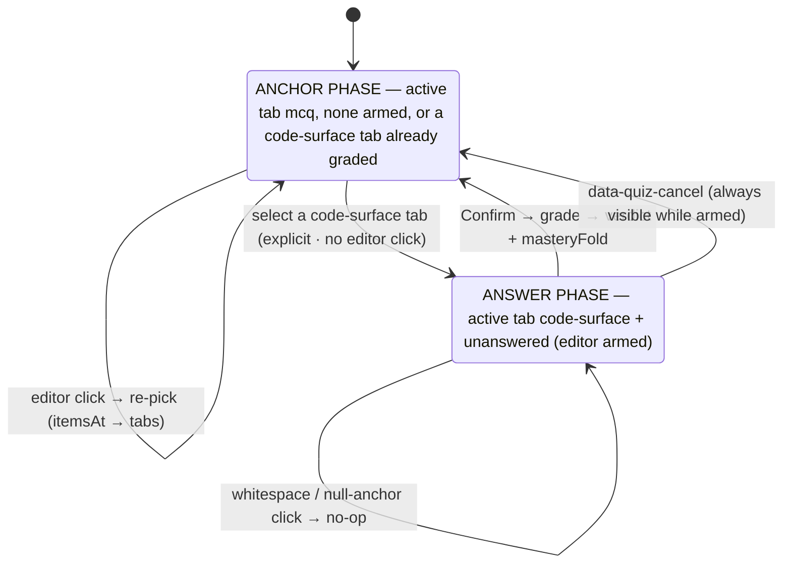
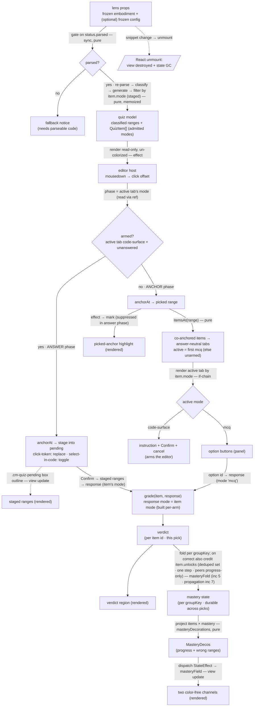

# quiz — Architecture & Decisions

## Why this module exists

The `quiz` lens is the learner's **closed-question workbench**: read a snippet
rendered read-only and un-colorized, click any syntax element, answer the
auto-gradable question that opens in a panel, and get immediate machine-graded
feedback in notional-machine vocabulary. It operationalizes the Block Model as a
clickable, gradable surface — the closed / gradable complement to the open /
Socratic register (`socratizing`, via the planned `ask` lens). See
[`./README.md`](./README.md) for the pedagogy, the public API, and the glossary.

It is a **consumer** of two pure peer modules and re-implements neither:

- [`lib/classifying`](../../lib/classifying/README.md) — `classifyTokens` turns
  the snippet into one `ClassifiedToken` per source token. The lens's clickable
  anchors **are** those token ranges.
- [`lib/quizzing`](../../lib/quizzing/README.md) — `generateQuiz` turns the
  snippet and its classified tokens into `QuizItem`s; `grade` turns a
  `LearnerResponse` into a `Verdict`.

**Slice A** ships the interaction loop end-to-end for **one** question form (V1
category-ID, `mcq`). The lens mechanic is form-agnostic; later slices add forms,
code-as-answer modes, mastery decorations, propagation, and config knobs without
re-shaping this contract. What Slice A defers is marked throughout.

## Modules

| File                  | Layer   | Purpose                                                                                                                                                                                                                                                                                           |
| --------------------- | ------- | ------------------------------------------------------------------------------------------------------------------------------------------------------------------------------------------------------------------------------------------------------------------------------------------------- |
| `index.tsx`           | wrapper | React `Component`; mounts the read-only un-colorized editor, captures clicks, owns per-mount UI state (picked anchor / active tab / per-item verdicts / pending selection / mastery); freezes + default-exports the `LensModule`                                                                  |
| `core.ts`             | core    | `LensModule` defaults — `config`, `applicableTo`, `recommend`, and the pure mastery fold `masteryFold` (inc 5)                                                                                                                                                                                    |
| `lib/build-quiz.ts`   | core    | Parses the snippet (Acorn), delegates classification to `lib/classifying`, calls `generateQuiz`, **filters the mixed-mode output by `item.mode`** (staged: mcq → +click-token → +select-in-code), returns `{ classified, items }` (or `null` on internal parse failure). The single re-parse site |
| `lib/anchors.ts`      | core    | The pure resolution layer: `anchorAt(offset, classified)` (token resolution → highlight), `itemsAt(items, range)` (item resolution → panel), and `defaultActiveTab(bundle)` (the first-`mcq` safe default tab, else `null`). CM-independent                                                       |
| `lib/grade-option.ts` | core    | `gradeOption(item, optionId)` — builds the `mcq` `LearnerResponse` from the clicked option id (verbatim) and delegates to `lib/quizzing`'s total `grade`. Pure: no React, no CodeMirror                                                                                                           |
| `lib/decorations.ts`  | core    | The pure mastery-decoration projector `masteryDecorations(items, mastery)` → the two color-free render channels (`MasteryDecos`); emits plain ranges (the wrapper owns the `Decoration` / `StateField` glue). Pure, no React (inc 5)                                                              |
| `lib/grade-ranges.ts` | core    | (inc 6) `gradeRanges(item, ranges)` — the unified code-surface grade boundary; builds the `click-token` / `select-in-code` `LearnerResponse` inside an `item.mode` if-chain and delegates to `grade`. Pure: no React, no CodeMirror                                                               |
| `lib/pending.ts`      | core    | (inc 6) `toggleRange(pending, range)` — the pure select-in-code toggle (exact `[start,end]` membership). `click-token`'s single-slot path needs no helper. Pure range math                                                                                                                        |
| `types.ts`            | shared  | `QuizLensConfig`, `GroupMastery`, `MasteryState`, `MasteryFold`, `MasteryDecos`, `ProgressBucket`, and (inc 6) `ActiveTab`, `VerdictsByItemId`, `PendingSelection`                                                                                                                                |

Default export of `index.tsx` is the frozen `LensModule` record. The core
subsystems under `lib/` are internal; only `index.tsx` (and, for the fold,
`core.ts`) import them. No `lib/` file imports React. Inc 6 widens `anchors.ts`
and `build-quiz.ts` from `McqQuizItem` to the `QuizItem` union (a re-type, not a
re-shape — `itemsAt` filters only on `anchorRange`). Tests target each subsystem
in isolation (vitest, no jsdom) plus the wrapper end-to-end (jsdom +
`@testing-library/react`); tests live under `tests/` (NOT `lib/tests/`).

## Architectural sketch

> Written Phase 0, before implementation. The Refactor step of each increment is
> held against this sketch. Domain terms only — no function names beyond the
> contract, no pseudocode (React hook names like `useState` / `useEffect` /
> `useMemo` are acceptable as structural-mechanism references).

### Execution phases

1. **Mount + gate** (sync, pure) — the orchestrator passes a frozen embodiment
   and an **optional** frozen lens config via props (`config?` per the peer
   `LensProps`). Slice A reads **no** config knob (the V1 form is
   parameterless), so the wrapper takes only `embodiment`; an absent config prop
   is therefore harmless, and the `core.config(props.config)` resolution
   (merging educator overrides — the `writeme` precedent) lands with the first
   knob (inc 8, the config-filtering increment). The wrapper computes the parse
   gate from `embodiment.status.parsed`. On `false` it renders the fallback
   panel and stops (it never calls `generateQuiz`, which throws on unparsed). On
   `true` it proceeds. The lens reads only `source.code` and `raw.*` (via
   `classifyTokens`) — never `analysis` / `creation` / `realm` (all null on real
   snippets under today's embody stubs).

2. **Build the quiz model** (sync, pure, memoized) — a `useMemo` keyed on
   `embodiment.source.code` runs the build pipeline: re-parse the source with
   Acorn (collecting the token stream), hand `{ code, tokens, ast }` to
   `classifyTokens`, call `generateQuiz(embodiment, classified)`, then **filter
   by `item.mode`** — the staged inc-6 filter (`mcq` → `+click-token` →
   `+select-in-code`; see § Why the staged item.mode filter). The predicate is a
   plain boolean, not a type-predicate, so the kept `items` stays the wide
   `QuizItem` union (the panel discriminates on `mode`, not the filter). Result:
   `{ classified, items }` on success, `null` on internal parse failure
   (defense-in-depth — the `status.parsed` gate should already have prevented
   the mount). `generateQuiz` reads `embodiment.raw.ast` behind its own
   accessor, so the lens passes the whole embodiment to it but derives
   `classified` from the fresh re-parse — no `raw.*` narrowing cast leaks into
   lens code (see § Why re-parse internally).

3. **Wire the read-only un-colorized editor** (per-mount, effect) — a mount
   effect instantiates a CodeMirror `EditorView` over `embodiment.source.code`
   with `EditorView.editable.of(false)` **and** `EditorState.readOnly.of(true)`,
   and a **minimal** extension set — deliberately **omitting** `javascript()`,
   `oneDark`, and `syntaxHighlighting(...)` so the source renders plain
   black-on-white (un-colorized): the lens's own decorations carry the only
   meaning. The effect also wires `EditorView.domEventHandlers({ mousedown })`
   which reads `view.posAtCoords({ x, y })` → a document offset, resolves it via
   `anchorAt(offset, classified)`, and reports the hit through a `useRef`-held
   callback (the ref lets the handler read the latest callback without
   remounting the view per render). A `StateField<DecorationSet>` fed by a
   `StateEffect<[start,end] | null>` (dispatched from React when the picked
   range changes) renders a single `Decoration.mark` highlighting the picked
   anchor. Cleanup destroys the view.

4. **Resolve the panel** (sync, pure) — when the picked range is non-null,
   `itemsAt(items, range)` resolves **all** co-anchored quiz items at that range
   (the array return is now load-bearing: a reference identifier co-anchors V1 +
   V7 `mcq` + V8 `click-token` + V10b/c — § Why dispatch on active-tab mode).
   The panel renders one **answer-neutral tab** per item (neutral bare-index
   labels; only the active tab's body renders) and selects a default active tab
   — the **first `mcq`** item (V1 co-anchors every token, so one exists; a
   no-`mcq` bundle stays unarmed). The active tab renders **by its own
   `item.mode`** through a total if-chain (`mcq` → option buttons; `click-token`
   / `select-in-code` → a code-answer surface), mirroring `grade`'s mode
   dispatch. The verdict is held **per item id** for the current pick
   (`VerdictsByItemId`), so switching tabs never shows one item's verdict under
   another's prompt.

5. **Answer & grade** (per learner answer, sync) — two phases, derived from the
   active tab's `mode` (held in a ref so the mount-time `mousedown` handler
   reads the latest without remounting — § Structural constraints / refs):
   - **Anchor phase** (active tab `mcq`, none armed, **or a code-surface tab
     already graded this pick**) — an editor click re-picks; an `mcq` answer
     comes from the panel: an option click builds
     `{ mode: 'mcq', selectedOptionIds: [id] }` and grades. The `!activeVerdict`
     term in `armed` is the disarm: a graded code-surface tab is back in anchor
     phase (re-pick to retry — README § Interaction contract step 6).
   - **Answer phase** (active tab code-surface, unanswered) — the editor is
     **armed**; an in-token click **stages** a range into a pending selection
     (`anchorAt` resolves it), and a **Confirm** grades the staged ranges. The
     two code-surface modes share one substrate: `click-token` keeps pending
     single-slot (replace), `select-in-code` a toggle-set (§ Why unify the
     code-surface substrate).

   Every arm builds the `LearnerResponse` **inside its own narrowed branch**,
   with that item's own `mode` + the learner's verbatim input — so the response
   mode always equals the item mode and `grade`'s mode-mismatch arm is
   unreachable (§ the per-arm construction note). The `feedback` is surfaced;
   the answer key is never echoed. A graded `Verdict` folds into per-`groupKey`
   `MasteryState` regardless of mode (`masteryFold`, inc 5);
   `masteryDecorations` projects it onto the two color-free channels via a
   `StateEffect` into `masteryField` — no remount, like the picked-anchor
   highlight in step 3. A verdict is **per-pick** (cleared on re-pick); mastery
   is the durable per-`groupKey` record.

6. **Render** (sync) — the wrapper emits the root `
` with
   either the read-only editor host + the picked-anchor panel + the verdict
   region, or (on `!status.parsed`) the `data-quiz-fallback` notice.

7. **Unmount** (React-driven) — the orchestrator unmounts on snippet change or
   lens exit. Two cleanups fire: (a) React GCs the per-mount state, (b) the
   CodeMirror view destroys via its effect cleanup. The lens MUST NOT leak past
   unmount.

### Phase state machine

The two interaction phases and **every** transition between them (the authority;
the data-flow diagram below shows data shapes, not the full phase machine).
Arming is reached by an **explicit tab selection**, not by an editor click;
every armed state has a visible exit (Confirm, cancel) — the no-stuck-armed
invariant.

### Data flow

Nodes are **data states** (the shape the lens holds at each step); edges are the
**operations** that transform one shape into the next (with their
sync/pure/effect character). Dotted edges are deferred work or lifecycle. This
diagram shows the data path; the **phase transitions** (tab-switch arming,
cancel, auto-return after a verdict) are the state machine above, not repeated
here — the one phase fork drawn below (`Phase{armed?}`) is the data branch, not
the whole transition set.

The diagram is per-mount. The orchestrator (upstream) supplies the props; the
recommender (sibling) calls `applicableTo` / `recommend`. `classified` feeds the
token-resolution edge (the binary search), not the editor itself; the highlight
is a view-state of the picked range alone (a single mark), not a feedback input
to the editor. The only dotted edge is lifecycle (unmount); the mastery flow
(fold → project → dispatch) is solid as of inc 5. **There is no cross-mount
persistence** — config is read from the prop on mount; the picked anchor, the
active tab, the pending selection, the per-item verdicts, and the mastery state
die with the component instance.

### Structural constraints

- **Two-layer module shape** — `core.ts`, `lib/build-quiz.ts`, `lib/anchors.ts`,
  `lib/grade-option.ts`, and (inc 6) `lib/grade-ranges.ts` + `lib/pending.ts` do
  NOT `import React`. `build-quiz.ts` imports `acorn`, `classifyTokens`, and
  `generateQuiz`; `anchors.ts` is pure TS over `ClassifiedToken[]` and
  `QuizItem[]` (widened from `McqQuizItem[]` — `itemsAt` filters only on
  `anchorRange`, so the change is a re-type, not a re-shape); `grade-option.ts`
  and `grade-ranges.ts` import `grade`; `pending.ts` is pure range math.
  `index.tsx` is the only file with React imports (and the only one importing
  `@codemirror/*`). Per the lenses peer's
  [§ Structural constraints](../DOCS.md#structural-constraints).
- **`embodiment` parameter name** in core signatures that take a `Snippet`.
- **`data-lens="quiz"` on the wrapper's root element** — load-bearing for
  sandbox-harness selectors. The `data-quiz-*` attributes (`-editor`, `-panel`,
  `-option`, `-verdict`, `-fallback`, and inc 6's `-tablist`, `-tab`,
  `-confirm`, `-cancel`, `-phase`) and the `.cm-quiz-*` decoration classes
  (`-anchor-hit`, `-progress-N`, `-wrong`, and inc 6's `-pending`) are sandbox
  selectors + CSS hooks; renaming any is a contract change. `data-quiz-tablist`
  nests inside `data-quiz-panel`; `data-quiz-phase="anchor|answer"` is on
  `data-quiz-editor`.
- **Read-only, un-colorized editor.** The editor is non-editable
  (`editable.of(false)` + `readOnly.of(true)`) and carries no language /
  highlight extension. The lens never writes to the orchestrator's snippet
  setter (single-writer invariant). `writeme` is the read-only precedent
  (`../writeme/index.tsx`); the un-colorized choice is the deliberate divergence
  (see § Why read-only un-colorized CodeMirror).
- **Memo outputs are read through refs in the mount effect, never as effect
  deps.** The quiz model (`classified` / `items`) and the React pick-callback
  are read inside the editor's mount effect via `useRef`, so a re-derive or a
  callback identity change does NOT re-run the mount effect (which would destroy
  and recreate the view, losing scroll + selection). The effect's dep array is
  keyed on the structural inputs only (the source). This mirrors the blanks /
  writeme remount-avoidance pattern; getting it wrong is the classic CM-lens
  scar. **Inc 6 extends this to three disciplines:** (1) the same read-only
  mirror ref also carries the **active item**, so the mount-time `mousedown`
  handler knows every render whether it is in anchor or answer phase (and which
  code item to grade); (2) `pendingSelection` is updated through a
  **functional** setter (`setPending(prev => toggleRange(prev, range))`) so the
  handler never closes over a stale value; (3) the graded fold stays a
  functional `setMastery`. The handler only reads refs + calls stable setters —
  it is never re-bound.
- **Form scoping by `item.mode` (staged).** `generateQuiz` runs the full
  generator registry; its output is a mixed-mode stream. `build-quiz.ts` keeps a
  single **boolean** predicate on `item.mode` (`mcq` in 6a, `+click-token` in
  6b, `+select-in-code` in 6c), so the kept array stays the wide `QuizItem`
  union — the panel discriminates on `mode`, not the filter. This one line
  widens per increment; the panel is never re-shaped (see § Why the staged
  item.mode filter).
- **The never-`malformed` guarantee is a response-construction invariant.** Each
  arm — the panel `mcq` path and the unified code-surface Confirm path — builds
  the `LearnerResponse` **inside its own narrowed branch**, with that item's own
  literal `mode` + the learner's verbatim input. So the response mode always
  equals the item mode and `grade`'s mode-mismatch arm is unreachable in normal
  play. A hoisted, mode-agnostic response would defeat it — the invariant lives
  where responses are built, not in renderer dispatch (see § the per-arm
  construction note).
- **Per-mode dispatch is an if-chain, never an object map or `switch`.** Both
  the per-tab renderer and the answer-phase editor-click handler dispatch on
  `item.mode` via a chain of guard clauses, each narrowing the union before it
  touches a mode-specific field — mirroring `grade.ts`'s dispatch. A
  `Record<mode, fn>` cannot narrow (every handler would receive the wide union),
  and `switch` is banned. **The two dispatch sites have different completeness
  profiles:** the **per-tab renderer** covers every admitted panel-reachable
  mode and reaches its `const _never: never` exhaustiveness assert only once all
  arms exist (6c) — until then it ends in an unreachable runtime fallback (the
  staged filter guarantees only admitted modes arrive). The **editor-staging
  handler** dispatches only the two code-surface modes (`click-token` replace vs
  `select-in-code` toggle) — `mcq` never reaches it (an `mcq` active tab is
  anchor phase, so the click re-picks), and a whitespace / null-anchor click is
  short-circuited to a no-op **before** the dispatch; its exhaustiveness lands
  when both code-surface modes do (6c).
- **Anchor vs. item resolution are distinct.** `anchorAt(offset, classified)`
  resolves the **token** (for the highlight + for staging a code-answer click);
  `itemsAt(items, range)` resolves the **panel item(s)** — now the load-bearing
  tab bundle, since co-anchoring is the norm. Both pure + CM-independent so they
  serve the span-render fallback unchanged.
- **Position semantics.** All ranges are zero-indexed half-open `[start, end)`
  into `embodiment.source.code` — classifying's convention, carried by
  quizzing's `anchorRange`. `anchorAt` honors `start <= offset < end` (a click
  exactly on `end` belongs to the next token or to whitespace). Tokens are
  non-overlapping (EOF + zero-length dropped inside `classifyTokens`), so the
  binary search is unambiguous.
- **`generateQuiz` throws on unparsed → only called behind the gate.** The lens
  calls `generateQuiz` only inside `build-quiz.ts`, which runs only when
  `status.parsed` (the gate / `showFallback` branch guarantees it). The internal
  re-parse returning `null` is the second guard. The two must agree; the
  `status.parsed` gate (not `buildQuiz === null`) is the canonical signal.
- **`recommend()`'s signature is locked** at
  `(embodiment) => ReadonlyArray<Recommendation>`. Slice A returns the
  module-level frozen empty array; the final increment maps `QuizItem.cells`
  (`BlockCell`) → `Recommendation.blockModelCell` (`BlockModelCell`) (see § Why
  the homonym maps only at recommend).
- **Mastery: pure fold + pure projection, thin CM seam.** `types.ts` pins
  `GroupMastery` / `MasteryState` / `MasteryFold` / `MasteryDecos`; the fold
  (`core.ts` `masteryFold`) and the projection (`lib/decorations.ts`
  `masteryDecorations`) are pure and unit-tested, while `index.tsx` owns the
  only `Decoration` / `StateField` glue (a `masteryField` fed by a
  `StateEffect`, exactly like the picked-anchor highlight). Both channels paint
  with `currentColor` (no hue) so a color-vision-deficient learner reads them on
  independent axes. **Earned propagation (inc 7) rides the same fold:** on a
  `correct` verdict `masteryFold` credits the deduped set
  `{ groupKey } ∪ item.unlocks` one step each — the item's own group clears
  `wrong`, propagated peers gain progress only (a peer's `wrong` clears solely by
  re-answering its own question; an incorrect gesture never propagates). No new
  stage and no `index.tsx` change — `masteryDecorations` already keys off
  `groupKey`, so a credited peer paints on every item carrying its group.
- **Pending selection is a fourth, orthogonal decoration axis.** The three inc-5
  channels are taken: anchor-hit (`background`), progress (underline density),
  wrong (overline) — all `currentColor`. The answer-phase staged selection
  (`.cm-quiz-pending`) is a **box outline** (`outline`, never
  `text-decoration`), so it never collides with the mastery channels on a token
  that is both mastered and currently staged. The transient anchor-hit
  `background` is **suppressed in answer phase**, so the picked token and the
  staged tokens read distinctly. (A `select-in-code` representative token can be
  anchor + target + mastered + staged at once — the four-axis separation is what
  keeps that legible.)
- **Verdict is per-item, per-pick; mastery is durable.** `VerdictsByItemId` keys
  a `Verdict` by `QuizItem.id` so co-anchored tabs never show one item's verdict
  under another's prompt; it is cleared on re-pick (a fresh attempt) and on
  source change, preserved across a tab switch. `MasteryState` (per `groupKey`)
  is the durable cross-pick record — it is what the decorations paint. The
  single Slice-A `verdict` state + its `resetVerdictOnRepick` effect are
  **replaced**: `activeVerdict` is derived (`verdictsByItemId[activeItem?.id]`),
  so re-pick / tab-switch surface the right verdict without a dedicated reset
  effect.
- **LensModule defaults return deep-frozen values.** `config()` returns a
  `cloneAndFreeze`-frozen `LensConfig`; `recommend()` returns a module-level
  frozen-empty-array constant (no per-call allocation); `applicableTo()` returns
  a boolean. Per the codebase's `freezeInPlace` / `cloneAndFreeze` convention.
- **LensModule surface stays synchronous.** `config()`, `applicableTo()`,
  `recommend()` are sync; build-quiz + grade are sync. Only the editor wiring is
  an effect.
- **Disposable practice.** No `localStorage`, no module-level cache, no refs
  across mounts for the picked anchor, active tab, per-item verdicts, pending
  selection, or mastery. Config arrives via the `config` prop each mount.
- **No consumer-side branching on `embodiment.source.code`.** The lens _renders_
  `source.code` (legitimate) but discriminates only on
  `embodiment.status.parsed`.
- **Display content is rendered safely.** The editor renders source via
  CodeMirror's own document model (never `dangerouslySetInnerHTML`); the panel
  renders `prompt` / option `text` / `feedback` as plain text inside React
  elements (framework-escaped).

### Out of scope (this lens)

- **`click-line` / `multi-mcq`.** `grade` handles both, but no generator emits
  them, so the lens never receives them. (Inc 6 _does_ capture the generated
  code-answer modes `click-token` + `select-in-code`.)
- **Config filtering** (inc 8). The `QuizFilter` toolbar is deferred; the
  upstream `filter` is a no-op today anyway.
- **Real `recommend()`** (final inc). Returns `[]`; the
  `BlockCell → BlockModelCell` mapping is future work.
- **Snippet mutation / editing.** Editor is read-only; the lens never calls the
  snippet setter.
- **Syntax coloring.** Un-colorized by design.
- **Multi-language.** JavaScript-only (the package is `study-lenses`); a
  multi-embodiment-type concern, not a lens concern.

## Why re-parse internally (vs. consuming `embodiment.raw.{tokens,ast}`)

`build-quiz.ts` re-parses the source with Acorn rather than consuming
`embodiment.raw.tokens` / `embodiment.raw.ast`. The embody contract types `raw`
as nullable `RawAcorn` (`raw.tokens: ReadonlyArray<unknown> | null`,
`raw.ast: AcornNode | null`), neither matching `classifyTokens`'s
`acorn.Token[]` / `acorn.Node` input — so consuming `raw.*` requires an
`as unknown as ClassifyInput` narrowing cast (exactly what the quizzing tests
write). Re-parsing keeps that cast out of lens code, returns `null` cleanly on
parse failure (defense-in-depth), and matches the `blanks` precedent
(`../blanks/lib/blankenate.ts`) so the lenses peer stays consistent. The cost is
one extra parse per snippet-change — microseconds at snippet sizes. Consuming
the upstream parse directly is on the Future-direction list; it is an
optimization, not a correctness requirement.

Note the asymmetry: the lens cannot avoid `raw.ast` entirely — `generateQuiz`
reads it internally and throws if null. But the lens does not have to **narrow**
it: it passes the whole `embodiment` to `generateQuiz` (which narrows behind its
own seam) and derives `classified` from the re-parse.

## Why read-only un-colorized CodeMirror + click-to-anchor

The user's design choice is a read-only, un-colorized CodeMirror surface: the
learner reads the code as plain text and the lens's own decorations (the picked
anchor, and — in Slice B — the mastery channels) carry the only color/meaning.
Syntax highlighting would compete with those signals. CodeMirror gives
consistent monospace layout, scrolling, and a robust `posAtCoords` offset lookup
for free.

`writeme` proves read-only CM works (`editable.of(false)` +
`readOnly.of(true)`), and that un-colorized is just "omit `syntaxHighlighting` /
`javascript()` / `oneDark`." The unproven piece is **click-to-anchor on a
read-only view** — `domEventHandlers({ mousedown })` + `view.posAtCoords` is the
standard CM6 API (`mousedown` matches the blanks/writeme `domEventHandlers`
precedent), but the campaign flags it as a risk. Inc 2 is therefore deliberately
tiny and is the **risk-retirement checkpoint**: if `posAtCoords` proves fragile
(null over content, off-by-one at boundaries), the lens falls back to **span
rendering** — one clickable `` per classified token in a `<pre>`, clicks
captured via React `onClick`. The pure `anchorAt` resolution is reused unchanged
across both capture surfaces — that is the design hedge.

## Why the staged item.mode filter (the consumed-contract scoping)

`generateQuiz(snippet, classified, filter?)` runs the **whole generator
registry** (`../../lib/quizzing/generators/registry.ts`) — currently nine forms
across three modes — so its output is a **mixed-mode stream**, not one form.
`build-quiz.ts` narrows it with a single **boolean** predicate on `item.mode`,
widened per increment: `mcq` (6a) → `+click-token` (6b) → `+select-in-code`
(6c).

Two decisions make this the right cut:

- **Filter on `mode`, not `form`.** `mode` is the discriminant the panel and
  `grade` both dispatch on. A `form` allowlist would have to enumerate the whole
  registry (nine forms and growing) and would silently drop any newly-registered
  form; a `mode` predicate admits a new form of an already-handled mode for free
  and excludes an unhandled mode by construction.
- **Boolean predicate, not a type-predicate.** Slice A used
  `(item): item is McqQuizItem => …`, narrowing the kept array to
  `McqQuizItem[]`. Inc 6 keeps it the wide `QuizItem` union (a plain
  `(item) => item.mode === 'mcq' || …`), because the panel must dispatch across
  modes — narrowing at the filter would only force a re-widen at the panel.

Slice A originally scoped on `form === 'V1'` for a different reason: V1 and V7
are both `mcq`, so a `mode` filter could not isolate V1 to keep the panel
single-item (the AR-1 BLOCKER that established the registry emits a mixed
stream, not a V1-only one). Inc 6 dissolves that constraint by **embracing**
co-anchoring — the panel renders the bundle as answer-neutral tabs and
dispatches each on its `mode`, so there is nothing left to isolate. The `mode`
filter is all that remains.

## Why dispatch on active-tab mode (not a panel-level mode)

Inc 6's hard question: a click in the read-only editor means different things by
state — pick an anchor, or _be_ the answer. Where does the lens decide? Three
models were on the table: a **panel-level mode** flag the click handler reads;
an explicit **interaction-mode state machine** (anchor / answering /
confirming); or **dispatch on the active item's own `mode`**, with no separate
flag.

The third wins because co-anchoring is **heterogeneous**: `itemsAt` returns a
bundle that can be `[mcq, mcq, click-token, select-in-code]` at one range (a
reference identifier carries V1 + V7 + V8 + V10b/c). A panel-level mode cannot
describe such a bundle — it would have to pick one, and the others would render
wrong. The active _item_ already carries the only discriminant that matters
(`mode`), and the lens already holds the active tab, so the phase is
**derived**: `armed = isCodeSurface(activeItem) && !activeVerdict`. A
panel-level flag or an interaction-mode enum would duplicate that derivation
into stored state that can disagree with the active tab — a class of bug the
derivation simply cannot have.

It also keeps the mechanic **form-agnostic**: every per-tab renderer and the
editor-click handler dispatch on `item.mode` through the same if-chain
`grade.ts` uses, so a new form slots in at its mode's arm with no new control
flow. The one rule "the active tab's `mode` is the phase" is what makes
heterogeneous tabs work without a `switch`, a flag, or a state machine.

The one thing the derivation does **not** own for free is the safety property
"the editor never arms without explicit intent" — `armed` is `true` whenever the
active tab is code-surface, so the _default_ active tab must be `mcq`. That is
pinned as the **mode-aware default** (first `mcq` item, else unarmed — § Panel),
not as "index 0," so the property is the lens's own invariant rather than a side
effect of `generateQuiz`'s emission order.

## Why unify the code-surface substrate (stage-then-confirm)

`click-token` (one target) and `select-in-code` (an exhaustive set) look like
two interactions, and the first design graded `click-token` **immediately** on
the answering click while `select-in-code` accumulated to a Confirm. Inc 6
unifies them: **both** stage clicked ranges into one `pendingSelection` and
grade on a **Confirm**, differing only in how a click stages (`click-token`
replaces — a single slot; `select-in-code` toggles — a set). The user's ruling:
unify the mechanism, then branch on item / event properties — best of both
worlds.

- **One substrate, one renderer family, one grade path.** The editor-click
  handler, the pending state, the Confirm control, and the `gradeRanges`
  boundary are written once and serve both modes; `click-token` is just the
  `n = 1` case. Two separate paths would duplicate the arm / stage / grade
  machinery.
- **Safety.** Immediate-grade turns a stray click into a graded — and `wrong`-
  flagging — answer on a surface where, a moment earlier, a click merely
  re-picked. Staging + an explicit Confirm makes submission deliberate and
  resolves the pick-vs-answer overloading in one move.
- **Immediacy is preserved as a thin policy, not lost.** Because the substrate
  is unified, "does a `click-token` answer auto-grade or wait for Confirm?" is a
  one-line handler policy (it can read event properties — a confirming
  double-click, a click on the already-staged token) on the same pending state,
  settled at the gate / in 6b without reshaping a type. The default leans safe
  (stage + a one-tap Confirm); the fast path stays available.

## The per-arm construction note (why never-`malformed` survives)

`grade` is total and dispatches on `item.mode`, returning `malformed` whenever
the **response** mode does not match the **item** mode (`grade.ts`
`modeMismatch`). The lens's "never `malformed` in normal play" guarantee
therefore rests on one thing: every response the lens builds carries the same
`mode` as the item it answers — a property of **where the response is built**,
not of which tab the panel rendered.

So the rule is normative: build the `LearnerResponse` **inside the narrowed
arm** for that mode — `{ mode: 'mcq', selectedOptionIds: [id] }` in the `mcq`
arm, `{ mode: item.mode, clickedRanges }` in the `click-token` arm (where
`item.mode` is already narrowed to `'click-token'`),
`{ mode: 'select-in-code', selectedRanges }` in the select arm. A hoisted,
mode-agnostic response built before the dispatch would type-check against the
wrong union member and could send a mismatched response — the one path to
`malformed` in normal play (and to wrongly flagging mastery). `gradeRanges`
(`lib/grade-ranges.ts`) enforces this by constructing the response inside its
own `item.mode` if-chain; `gradeOption` does the same for `mcq`. This is the
invariant an implementer and an AR-4 must honor, stated where the responses are
built.

## Why define mastery types in Phase 0 (the fold landed in inc 5)

Phase-0 DDD captures the full cohesive contract before code, so `types.ts` pins
the two-channel mastery encoding (`GroupMastery` / `MasteryState`) and the fold
signature (`MasteryFold`) up front — even though the fold itself was inc 5
(Slice B). Slice A honored that boundary tightly: no fold, no decorations, no
dead stub function (the type aliases sufficed; nothing in Slice A referenced
them). This is the scope-discipline split the campaign runs on — design expands
to the cohesive whole, implementation honors the increment boundary. The
progress **curve was ruled 0..1 accrual** at the Phase-0 human gate (2026-06-28,
over a consecutive-correct counter or a threshold-to-unlock); inc 5 realized it
as `MASTERY_STEP = 0.25` and added only the render-channel types (`MasteryDecos`
/ `ProgressBucket`), no re-type of the Phase-0 shapes.

## Why bucketed progress density (not continuous)

Channel 1 (progress) renders as underline **density**, not a continuous width.
With `MASTERY_STEP = 0.25` the fold can only ever produce four non-zero progress
values — `0.25 / 0.5 / 0.75 / 1` — so four density buckets (`ProgressBucket`,
`dotted → dashed → solid → thicker`) are a **lossless** encoding: every distinct
mastery level reads as a distinct underline, and `masteryDecorations` maps the
value to its bucket once (`lib/decorations.ts` `progressBucket`). A continuous
inline width carries no more information (there is no fifth reachable value)
while moving styling out of `quiz.css` into inline `style` strings the tests
would have to parse. If the step ever changes, the bucket boundaries move with
it; nothing else does. The point of two **separate** channels (an underline for
progress, an overline for `wrong`) is color-vision safety — both cues use
`currentColor`, so neither relies on hue and the two never collapse onto one
red/green axis.

## Why the BlockCell / BlockModelCell homonym maps only at recommend()

Two `*Cell` types, genuinely different:

- **`BlockCell`** (socratizing):
  `{ dimension: 'text-surface' | 'execution' | 'purpose'; level: 'atom' | 'block' | 'relation' | 'macro' }`.
  Carried verbatim on `QuizItem.cells` — the vocabulary the lens **displays**
  (V1 = `[{ dimension: 'text-surface', level: 'atom' }]`).
- **`BlockModelCell`** (the recommender):
  `{ level: 'surface' | 'execution' | 'function'; scope: 'atoms' | 'blocks' | 'relations' | 'macro'; nmComponents? }`.
  Carried on `Recommendation.blockModelCell`.

The axes are non-isomorphic (`dimension` ≠ `level`, `level` ≠ `scope`), so a
`BlockCell → BlockModelCell` mapping is required wherever the lens recommends.
The **only** place the lens produces a `Recommendation` is `recommend()`, the
final increment — so that is the only place the mapping is applied. Slice A's
`recommend()` returns `[]`; it carries `cells` through untouched. The glossary
fixes which-is-which and names the deferred mapping.

## Module ownership

The lens owns its own `README.md`, `DOCS.md`, `types.ts`, source (`core.ts`,
`lib/build-quiz.ts`, `lib/anchors.ts`, `index.tsx`), CSS (`quiz.css`), and
tests. Cross-cutting lens conventions (two-layer split, `data-lens` invariant,
`LensConfig` shape, no-source-code-branching, disposable practice) live in
[`../README.md`](../README.md) + [`../DOCS.md`](../DOCS.md); this lens inherits
them. It consumes — and never modifies — `lib/classifying` and `lib/quizzing`.

## Future direction

See [`./README.md` § Future direction](./README.md#future-direction). Key
directions in scope of this lens's evolution: code-as-answer capture (inc 6);
earned propagation (inc 7, landed); the config-knob toolbar → `QuizFilter` (inc 8); the
real `recommend()` with the `BlockCell → BlockModelCell` mapping (final inc);
consuming `embodiment.raw.*` directly to drop the double-parse; and the
span-render display fallback if read-only-CM click capture proves fragile at the
inc-2 checkpoint.
