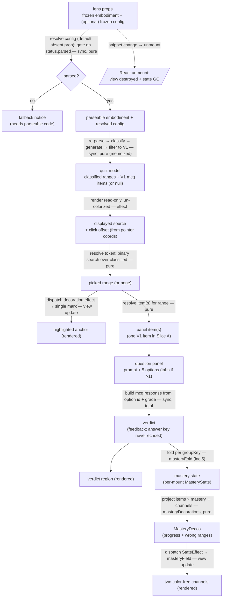

# quiz — Architecture & Decisions

## Why this module exists

The `quiz` lens is the learner's **closed-question workbench**: read a snippet
rendered read-only and un-colorized, click any syntax element, answer the
auto-gradable question that opens in a panel, and get immediate machine-graded
feedback in notional-machine vocabulary. It operationalizes the Block Model as a
clickable, gradable surface — the closed / gradable complement to the open /
Socratic register (`socratizing`, via the planned `ask` lens). See
[`./README.md`](./README.md) for the pedagogy, the public API, and the glossary.

It is a **consumer** of two pure peer modules and re-implements neither:

- [`lib/classifying`](../../lib/classifying/README.md) — `classifyTokens` turns
  the snippet into one `ClassifiedToken` per source token. The lens's clickable
  anchors **are** those token ranges.
- [`lib/quizzing`](../../lib/quizzing/README.md) — `generateQuiz` turns the
  snippet and its classified tokens into `QuizItem`s; `grade` turns a
  `LearnerResponse` into a `Verdict`.

**Slice A** ships the interaction loop end-to-end for **one** question form (V1
category-ID, `mcq`). The lens mechanic is form-agnostic; later slices add forms,
code-as-answer modes, mastery decorations, propagation, and config knobs without
re-shaping this contract. What Slice A defers is marked throughout.

## Modules

| File                  | Layer   | Purpose                                                                                                                                                                                                                                                |
| --------------------- | ------- | ------------------------------------------------------------------------------------------------------------------------------------------------------------------------------------------------------------------------------------------------------ |
| `index.tsx`           | wrapper | React `Component`; mounts the read-only un-colorized editor, captures clicks, owns per-mount UI state (picked anchor / selection / verdict); freezes + default-exports the `LensModule`                                                                |
| `core.ts`             | core    | `LensModule` defaults — `config`, `applicableTo`, `recommend`, and the pure mastery fold `masteryFold` (inc 5)                                                                                                                                         |
| `lib/build-quiz.ts`   | core    | Parses the snippet (Acorn), delegates classification to `lib/classifying`, calls `generateQuiz`, **filters the mixed-form output to `form === 'V1'`**, returns `{ classified, items }` (or `null` on internal parse failure). The single re-parse site |
| `lib/anchors.ts`      | core    | The pure resolution layer: `anchorAt(offset, classified)` (token resolution → highlight) and `itemsAt(items, range)` (item resolution → panel). CM-independent                                                                                         |
| `lib/grade-option.ts` | core    | `gradeOption(item, optionId)` — builds the `mcq` `LearnerResponse` from the clicked option id (verbatim) and delegates to `lib/quizzing`'s total `grade`. Pure: no React, no CodeMirror                                                                |
| `lib/decorations.ts`  | core    | The pure mastery-decoration projector `masteryDecorations(items, mastery)` → the two color-free render channels (`MasteryDecos`); emits plain ranges (the wrapper owns the `Decoration` / `StateField` glue). Pure, no React (inc 5)                   |
| `types.ts`            | shared  | `QuizLensConfig`, `GroupMastery`, `MasteryState`, `MasteryFold`, `MasteryDecos`, `ProgressBucket`                                                                                                                                                      |

Default export of `index.tsx` is the frozen `LensModule` record. The core
subsystems under `lib/` are internal; only `index.tsx` (and, for the fold,
`core.ts`) import them. No `lib/` file imports React. Tests target each
subsystem in isolation (vitest, no jsdom) plus the wrapper end-to-end (jsdom +
`@testing-library/react`); tests live under `tests/` (NOT `lib/tests/`).

## Architectural sketch

> Written Phase 0, before implementation. The Refactor step of each increment is
> held against this sketch. Domain terms only — no function names beyond the
> contract, no pseudocode (React hook names like `useState` / `useEffect` /
> `useMemo` are acceptable as structural-mechanism references).

### Execution phases

1. **Mount + gate** (sync, pure) — the orchestrator passes a frozen embodiment
   and an **optional** frozen lens config via props (`config?` per the peer
   `LensProps`). Slice A reads **no** config knob (the V1 form is
   parameterless), so the wrapper takes only `embodiment`; an absent config prop
   is therefore harmless, and the `core.config(props.config)` resolution
   (merging educator overrides — the `writeme` precedent) lands with the first
   knob (inc 8, the config-filtering increment). The wrapper computes the parse
   gate from `embodiment.status.parsed`. On `false` it renders the fallback
   panel and stops (it never calls `generateQuiz`, which throws on unparsed). On
   `true` it proceeds. The lens reads only `source.code` and `raw.*` (via
   `classifyTokens`) — never `analysis` / `creation` / `realm` (all null on real
   snippets under today's embody stubs).

2. **Build the quiz model** (sync, pure, memoized) — a `useMemo` keyed on
   `embodiment.source.code` runs the build pipeline: re-parse the source with
   Acorn (collecting the token stream), hand `{ code, tokens, ast }` to
   `classifyTokens`, call `generateQuiz(embodiment, classified)`, then **filter
   the returned array to `form === 'V1'`** (see § Why filter to form V1).
   Result: `{ classified, items }` on success, `null` on internal parse failure
   (defense-in-depth — the `status.parsed` gate should already have prevented
   the mount). `generateQuiz` reads `embodiment.raw.ast` behind its own
   accessor, so the lens passes the whole embodiment to it but derives
   `classified` from the fresh re-parse — no `raw.*` narrowing cast leaks into
   lens code (see § Why re-parse internally).

3. **Wire the read-only un-colorized editor** (per-mount, effect) — a mount
   effect instantiates a CodeMirror `EditorView` over `embodiment.source.code`
   with `EditorView.editable.of(false)` **and** `EditorState.readOnly.of(true)`,
   and a **minimal** extension set — deliberately **omitting** `javascript()`,
   `oneDark`, and `syntaxHighlighting(...)` so the source renders plain
   black-on-white (un-colorized): the lens's own decorations carry the only
   meaning. The effect also wires `EditorView.domEventHandlers({ mousedown })`
   which reads `view.posAtCoords({ x, y })` → a document offset, resolves it via
   `anchorAt(offset, classified)`, and reports the hit through a `useRef`-held
   callback (the ref lets the handler read the latest callback without
   remounting the view per render). A `StateField<DecorationSet>` fed by a
   `StateEffect<[start,end] | null>` (dispatched from React when the picked
   range changes) renders a single `Decoration.mark` highlighting the picked
   anchor. Cleanup destroys the view.

4. **Resolve the panel** (sync, pure) — when the picked range is non-null,
   `itemsAt(items, range)` resolves the quiz item(s) at that range. In Slice A
   the V1 filter leaves exactly one `McqQuizItem` per range, so the panel
   renders the single item's `prompt` + five options; the answer-neutral-tab
   path is wired but unexercised until later slices add co-anchored forms.

5. **Grade** (per learner answer, sync) — selecting an option builds a
   `LearnerResponse` (`{ mode: 'mcq', selectedOptionIds: [option.id] }`, built
   from `option.id` verbatim) and calls `grade(item, response)`. The `Verdict`'s
   `feedback` is surfaced; the answer key is never echoed (the lens reveals it
   from the item it holds, not from the `Verdict`). Picking a different anchor
   resets the verdict. The graded `Verdict` also folds into per-`groupKey`
   `MasteryState` (`core.ts` `masteryFold`, inc 5); the pure
   `masteryDecorations` (`lib/decorations.ts`) projects that state onto the two
   color-free channels, which a `StateEffect` dispatches into the editor's
   `masteryField` — no remount, exactly like the picked-anchor highlight in
   step 3.

6. **Render** (sync) — the wrapper emits the root `
` with
   either the read-only editor host + the picked-anchor panel + the verdict
   region, or (on `!status.parsed`) the `data-quiz-fallback` notice.

7. **Unmount** (React-driven) — the orchestrator unmounts on snippet change or
   lens exit. Two cleanups fire: (a) React GCs the per-mount state, (b) the
   CodeMirror view destroys via its effect cleanup. The lens MUST NOT leak past
   unmount.

### Data flow

Nodes are **data states** (the shape the lens holds at each step); edges are the
**operations** that transform one shape into the next (with their
sync/pure/effect character). Dotted edges are deferred work or lifecycle.

The diagram is per-mount. The orchestrator (upstream) supplies the props; the
recommender (sibling) calls `applicableTo` / `recommend`. `classified` feeds the
token-resolution edge (the binary search), not the editor itself; the highlight
is a view-state of the picked range alone (a single mark), not a feedback input
to the editor. The only dotted edge is lifecycle (unmount); the mastery flow
(fold → project → dispatch) is solid as of inc 5. **There is no cross-mount
persistence** — config is read from the prop on mount; the picked anchor, the
selection, the verdict, and the mastery state die with the component instance.

### Structural constraints

- **Two-layer module shape** — `core.ts`, `lib/build-quiz.ts`, `lib/anchors.ts`,
  and `lib/grade-option.ts` do NOT `import React`. `build-quiz.ts` imports
  `acorn`, `classifyTokens`, and `generateQuiz`; `anchors.ts` is pure TS over
  `ClassifiedToken[]` and `McqQuizItem[]`; `grade-option.ts` imports `grade`.
  `index.tsx` is the only file with React imports (and the only one importing
  `@codemirror/*`). Per the lenses peer's
  [§ Structural constraints](../DOCS.md#structural-constraints).
- **`embodiment` parameter name** in core signatures that take a `Snippet`.
- **`data-lens="quiz"` on the wrapper's root element** — load-bearing for
  sandbox-harness selectors. The `data-quiz-*` attributes (`-editor`, `-panel`,
  `-option`, `-verdict`, `-fallback`) are sandbox selectors + CSS hooks;
  renaming any is a contract change.
- **Read-only, un-colorized editor.** The editor is non-editable
  (`editable.of(false)` + `readOnly.of(true)`) and carries no language /
  highlight extension. The lens never writes to the orchestrator's snippet
  setter (single-writer invariant). `writeme` is the read-only precedent
  (`../writeme/index.tsx`); the un-colorized choice is the deliberate divergence
  (see § Why read-only un-colorized CodeMirror).
- **Memo outputs are read through refs in the mount effect, never as effect
  deps.** The quiz model (`classified` / `items`) and the React pick-callback
  are read inside the editor's mount effect via `useRef`, so a re-derive or a
  callback identity change does NOT re-run the mount effect (which would destroy
  and recreate the view, losing scroll + selection). The effect's dep array is
  keyed on the structural inputs only (the source). This mirrors the blanks /
  writeme remount-avoidance pattern; getting it wrong is the classic CM-lens
  scar.
- **Form scoping to V1.** `generateQuiz` runs the full generator registry; its
  output is a mixed-form stream (V1 `mcq` + V7 `mcq` + V8 `click-token` today).
  `build-quiz.ts` filters to `form === 'V1'` — the single Slice-A form. This is
  the one place the lens narrows the moving `generateQuiz` contract; later
  slices widen the filter rather than re-shaping the panel. It is also what
  makes the never-`malformed`-in-normal-play guarantee hold (see § Why filter to
  form V1).
- **Anchor vs. item resolution are distinct.** `anchorAt(offset, classified)`
  resolves the **token** (for the highlight); `itemsAt(items, range)` resolves
  the **panel item(s)**. Two functions because a range can carry several
  co-anchored forms — even though the V1 filter leaves one in Slice A. Both
  pure + CM-independent so they serve the span-render fallback unchanged.
- **Position semantics.** All ranges are zero-indexed half-open `[start, end)`
  into `embodiment.source.code` — classifying's convention, carried by
  quizzing's `anchorRange`. `anchorAt` honors `start <= offset < end` (a click
  exactly on `end` belongs to the next token or to whitespace). Tokens are
  non-overlapping (EOF + zero-length dropped inside `classifyTokens`), so the
  binary search is unambiguous.
- **`generateQuiz` throws on unparsed → only called behind the gate.** The lens
  calls `generateQuiz` only inside `build-quiz.ts`, which runs only when
  `status.parsed` (the gate / `showFallback` branch guarantees it). The internal
  re-parse returning `null` is the second guard. The two must agree; the
  `status.parsed` gate (not `buildQuiz === null`) is the canonical signal.
- **`recommend()`'s signature is locked** at
  `(embodiment) => ReadonlyArray<Recommendation>`. Slice A returns the
  module-level frozen empty array; the final increment maps `QuizItem.cells`
  (`BlockCell`) → `Recommendation.blockModelCell` (`BlockModelCell`) (see § Why
  the homonym maps only at recommend).
- **Mastery: pure fold + pure projection, thin CM seam.** `types.ts` pins
  `GroupMastery` / `MasteryState` / `MasteryFold` / `MasteryDecos`; the fold
  (`core.ts` `masteryFold`) and the projection (`lib/decorations.ts`
  `masteryDecorations`) are pure and unit-tested, while `index.tsx` owns the
  only `Decoration` / `StateField` glue (a `masteryField` fed by a
  `StateEffect`, exactly like the picked-anchor highlight). Both channels paint
  with `currentColor` (no hue) so a color-vision-deficient learner reads them on
  independent axes.
- **LensModule defaults return deep-frozen values.** `config()` returns a
  `cloneAndFreeze`-frozen `LensConfig`; `recommend()` returns a module-level
  frozen-empty-array constant (no per-call allocation); `applicableTo()` returns
  a boolean. Per the codebase's `freezeInPlace` / `cloneAndFreeze` convention.
- **LensModule surface stays synchronous.** `config()`, `applicableTo()`,
  `recommend()` are sync; build-quiz + grade are sync. Only the editor wiring is
  an effect.
- **Disposable practice.** No `localStorage`, no module-level cache, no refs
  across mounts for the picked anchor / selection / verdict. Config arrives via
  the `config` prop each mount.
- **No consumer-side branching on `embodiment.source.code`.** The lens _renders_
  `source.code` (legitimate) but discriminates only on
  `embodiment.status.parsed`.
- **Display content is rendered safely.** The editor renders source via
  CodeMirror's own document model (never `dangerouslySetInnerHTML`); the panel
  renders `prompt` / option `text` / `feedback` as plain text inside React
  elements (framework-escaped).

### Out of scope (Slice A)

- **Code-as-answer modes** (inc 6). V8 `click-token` items are in the
  `generateQuiz` stream but filtered out; `click-line` / `select-in-code` are
  later-form work.
- **`multi-mcq`** — not emitted upstream; Slice A is single-select.
- **Earned propagation** (inc 7). `unlocks` is carried but not acted on.
- **Config filtering** (inc 8). The `QuizFilter` toolbar is deferred; the
  upstream `filter` is a no-op today anyway.
- **Real `recommend()`** (final inc). Returns `[]`; the
  `BlockCell → BlockModelCell` mapping is future work.
- **Snippet mutation / editing.** Editor is read-only; the lens never calls the
  snippet setter.
- **Syntax coloring.** Un-colorized by design.
- **Multi-language.** JavaScript-only (the package is `study-lenses`); a
  multi-embodiment-type concern, not a lens concern.

## Why re-parse internally (vs. consuming `embodiment.raw.{tokens,ast}`)

`build-quiz.ts` re-parses the source with Acorn rather than consuming
`embodiment.raw.tokens` / `embodiment.raw.ast`. The embody contract types `raw`
as nullable `RawAcorn` (`raw.tokens: ReadonlyArray<unknown> | null`,
`raw.ast: AcornNode | null`), neither matching `classifyTokens`'s
`acorn.Token[]` / `acorn.Node` input — so consuming `raw.*` requires an
`as unknown as ClassifyInput` narrowing cast (exactly what the quizzing tests
write). Re-parsing keeps that cast out of lens code, returns `null` cleanly on
parse failure (defense-in-depth), and matches the `blanks` precedent
(`../blanks/lib/blankenate.ts`) so the lenses peer stays consistent. The cost is
one extra parse per snippet-change — microseconds at snippet sizes. Consuming
the upstream parse directly is on the Future-direction list; it is an
optimization, not a correctness requirement.

Note the asymmetry: the lens cannot avoid `raw.ast` entirely — `generateQuiz`
reads it internally and throws if null. But the lens does not have to **narrow**
it: it passes the whole `embodiment` to `generateQuiz` (which narrows behind its
own seam) and derives `classified` from the re-parse.

## Why read-only un-colorized CodeMirror + click-to-anchor

The user's design choice is a read-only, un-colorized CodeMirror surface: the
learner reads the code as plain text and the lens's own decorations (the picked
anchor, and — in Slice B — the mastery channels) carry the only color/meaning.
Syntax highlighting would compete with those signals. CodeMirror gives
consistent monospace layout, scrolling, and a robust `posAtCoords` offset lookup
for free.

`writeme` proves read-only CM works (`editable.of(false)` +
`readOnly.of(true)`), and that un-colorized is just "omit `syntaxHighlighting` /
`javascript()` / `oneDark`." The unproven piece is **click-to-anchor on a
read-only view** — `domEventHandlers({ mousedown })` + `view.posAtCoords` is the
standard CM6 API (`mousedown` matches the blanks/writeme `domEventHandlers`
precedent), but the campaign flags it as a risk. Inc 2 is therefore deliberately
tiny and is the **risk-retirement checkpoint**: if `posAtCoords` proves fragile
(null over content, off-by-one at boundaries), the lens falls back to **span
rendering** — one clickable `` per classified token in a `<pre>`, clicks
captured via React `onClick`. The pure `anchorAt` resolution is reused unchanged
across both capture surfaces — that is the design hedge.

## Why filter to form V1 (the consumed-contract scoping)

`generateQuiz(snippet, classified, filter?)` runs the **whole generator
registry** (`../../lib/quizzing/generators/registry.ts`), not V1 alone — today
`[V1 category-ID, V7 usage-kind, V8 declaration-site]`. On `let x = 5` it
returns V1 `mcq` items for every token **plus** a V7 `mcq` item on `x` ("how is
this variable used here?") **plus** a V8 `click-token` item. V1 and V7 are both
`mode: 'mcq'` and both `family: 'variables'`, so neither a `mode` filter nor the
upstream `QuizFilter` can isolate V1. The only sound Slice-A scoping is a
post-filter on `item.form === 'V1'`, applied in `build-quiz.ts`.

This is load-bearing, not cosmetic: without it (a) clicking an identifier would
surface V1 + V7 co-anchored (the panel would need tabs immediately, and could
render V7's prompt + options where the spec promises V1's); and (b) clicking a
declaration would hand a V8 `click-token` item to the `mcq` panel — a render
mismatch and the only path to a `malformed` grade. The V1 filter is exactly what
makes the "never `malformed` in normal play" guarantee hold and keeps the panel
single-item (no tabs) in Slice A. Later slices **widen** the filter (admit V7 →
inc 5/6, V8 → inc 6) rather than re-shaping the panel. _(This was the AR-1
BLOCKER: the contract consumes the registry's mixed-form stream, not a V1-only
stream.)_

## Why define mastery types in Phase 0 (the fold landed in inc 5)

Phase-0 DDD captures the full cohesive contract before code, so `types.ts` pins
the two-channel mastery encoding (`GroupMastery` / `MasteryState`) and the fold
signature (`MasteryFold`) up front — even though the fold itself was inc 5
(Slice B). Slice A honored that boundary tightly: no fold, no decorations, no
dead stub function (the type aliases sufficed; nothing in Slice A referenced
them). This is the scope-discipline split the campaign runs on — design expands
to the cohesive whole, implementation honors the increment boundary. The
progress **curve was ruled 0..1 accrual** at the Phase-0 human gate (2026-06-28,
over a consecutive-correct counter or a threshold-to-unlock); inc 5 realized it
as `MASTERY_STEP = 0.25` and added only the render-channel types (`MasteryDecos`
/ `ProgressBucket`), no re-type of the Phase-0 shapes.

## Why bucketed progress density (not continuous)

Channel 1 (progress) renders as underline **density**, not a continuous width.
With `MASTERY_STEP = 0.25` the fold can only ever produce four non-zero progress
values — `0.25 / 0.5 / 0.75 / 1` — so four density buckets (`ProgressBucket`,
`dotted → dashed → solid → thicker`) are a **lossless** encoding: every distinct
mastery level reads as a distinct underline, and `masteryDecorations` maps the
value to its bucket once (`lib/decorations.ts` `progressBucket`). A continuous
inline width carries no more information (there is no fifth reachable value)
while moving styling out of `quiz.css` into inline `style` strings the tests
would have to parse. If the step ever changes, the bucket boundaries move with
it; nothing else does. The point of two **separate** channels (an underline for
progress, an overline for `wrong`) is color-vision safety — both cues use
`currentColor`, so neither relies on hue and the two never collapse onto one
red/green axis.

## Why the BlockCell / BlockModelCell homonym maps only at recommend()

Two `*Cell` types, genuinely different:

- **`BlockCell`** (socratizing):
  `{ dimension: 'text-surface' | 'execution' | 'purpose'; level: 'atom' | 'block' | 'relation' | 'macro' }`.
  Carried verbatim on `QuizItem.cells` — the vocabulary the lens **displays**
  (V1 = `[{ dimension: 'text-surface', level: 'atom' }]`).
- **`BlockModelCell`** (the recommender):
  `{ level: 'surface' | 'execution' | 'function'; scope: 'atoms' | 'blocks' | 'relations' | 'macro'; nmComponents? }`.
  Carried on `Recommendation.blockModelCell`.

The axes are non-isomorphic (`dimension` ≠ `level`, `level` ≠ `scope`), so a
`BlockCell → BlockModelCell` mapping is required wherever the lens recommends.
The **only** place the lens produces a `Recommendation` is `recommend()`, the
final increment — so that is the only place the mapping is applied. Slice A's
`recommend()` returns `[]`; it carries `cells` through untouched. The glossary
fixes which-is-which and names the deferred mapping.

## Module ownership

The lens owns its own `README.md`, `DOCS.md`, `types.ts`, source (`core.ts`,
`lib/build-quiz.ts`, `lib/anchors.ts`, `index.tsx`), CSS (`quiz.css`), and
tests. Cross-cutting lens conventions (two-layer split, `data-lens` invariant,
`LensConfig` shape, no-source-code-branching, disposable practice) live in
[`../README.md`](../README.md) + [`../DOCS.md`](../DOCS.md); this lens inherits
them. It consumes — and never modifies — `lib/classifying` and `lib/quizzing`.

## Future direction

See [`./README.md` § Future direction](./README.md#future-direction). Key
directions in scope of this lens's evolution: code-as-answer capture (inc 6);
earned propagation (inc 7); the config-knob toolbar → `QuizFilter` (inc 8); the
real `recommend()` with the `BlockCell → BlockModelCell` mapping (final inc);
consuming `embodiment.raw.*` directly to drop the double-parse; and the
span-render display fallback if read-only-CM click capture proves fragile at the
inc-2 checkpoint.
