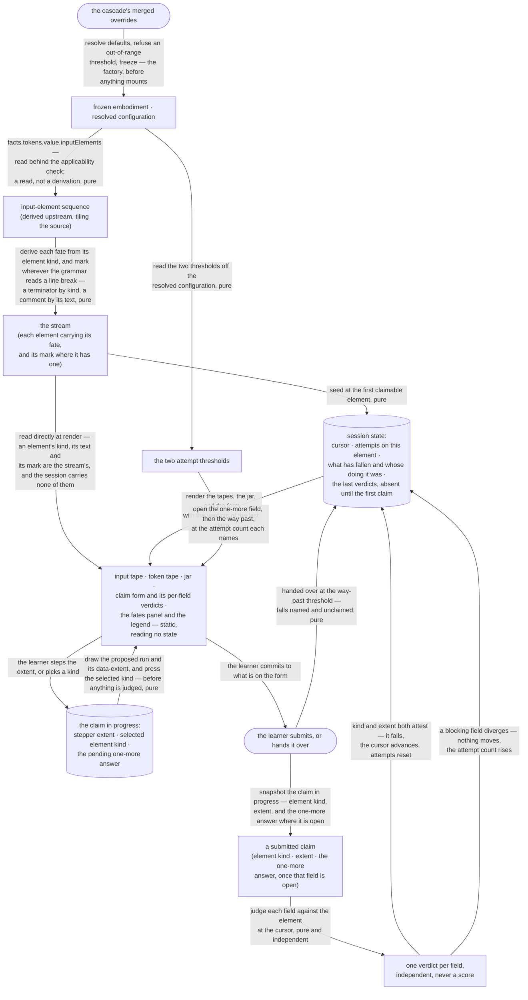

<!-- cspell:ignore spellme wireframes -->

# spellme — Architecture & Decisions

The drive-the-scanner exercise for the `tokens` phase. [README.md](./README.md)
carries the claim contract, the vocabulary and the rulings; this document
carries the shape a correct implementation must take.

## Modules

| File          | Layer        | Purpose                                                                                             |
| ------------- | ------------ | --------------------------------------------------------------------------------------------------- |
| `types.ts`    | shared       | the domain model and the configuration contract                                                     |
| `core.ts`     | pure         | most of the module: the factory, the gate, and the stream, positioning, judging and settling phases |
| `index.tsx`   | component    | the surface, and the frozen lens object that is the identity                                        |
| `spellme.css` | presentation | the arrangement, which this module owns rather than inherits                                        |
| `ux/`         | twin         | the user twin — journeys and wire-frames                                                            |

## Architectural sketch

> Written Phase 0, before implementation. The Refactor step is held against this
> document — not what the code does, but what shape it takes.

**Three entry points, not one sequence.** The phases below run for three
different callers at three different times, and numbering them together would
imply a single execution that does not exist. **The factory** resolves
configuration before anything mounts. **The gate** answers applicability when
the orchestrator asks whether to offer the lens at all. **The surface** is
everything from reading the stream to rendering, and it is the only one that
receives an embodiment.

**Inbound contract.** The surface receives a frozen embodiment and a resolved,
frozen configuration — the two properties every lens of this kind receives; the
factory receives the cascade's merged overrides, and the gate receives the
facts. **Outbound contract.** A rendered surface and nothing else: no callback
upward, no persisted state, no value returned to a consumer.

### Execution phases

1. **Resolve the settings** _(the factory; sync, pure, throws)_ — the two
   attempt thresholds, defaults applied, an absent key and a key present as
   absent treated alike, an out-of-range value refused at the boundary rather
   than coerced. **Input:** the cascade's merged overrides. **Output:** the
   resolved configuration the surface is later handed.

2. **Answer applicability** _(the gate; sync, pure, cheap)_ — whether the tokens
   stage produced a value **and** the published member is present on it. The
   second condition is not redundant (human ruling 2026-08-19): the sequence
   arrives on an optional member, absent when the embodiment's own derivation
   defected, so a successful tokens stage does not imply it exists.
   Applicability declines there and the lens is not offered. No syntax tree is
   consulted, so a program that lexes but does not parse is served; and testing
   one member's presence derives nothing, so the rule still holds — **a gate is
   budgeted to the facts it reads**, and this one reads two. **Input:** the
   facts. **Output:** whether this lens is offered at all.

3. **Read the stream** _(the surface; sync, pure, mount-stable, throws on a
   precondition applicability has already excluded)_ — behind the applicability
   check, read the input-element sequence published on the embodiment's tokens
   fact and give each element its fate and, where it has one, its mark. **This
   phase derives no element and calls nothing** — the scanning leaf owns the
   derivation and the embodiment publishes it. The fate is a function of the
   element kind alone; **the mark is not.** (human ruling 2026-08-20) It says
   the syntactic grammar reads a line break here — which a `LineTerminator` does
   by its kind, and a `Comment` only if its own text carries one. **Input:** the
   embodiment's facts, whose tokens fact carries the sequence at
   `facts.tokens.value.inputElements`. **Output:** the stream — every element
   carrying where it will end up.

4. **Position** _(sync, pure)_ — advance past every element that advances on its
   own, so the cursor rests on a claimable element or past the end. Runs at
   mount and again after every fall; it is the only writer of the cursor.
   **Input:** the stream and a cursor. **Output:** a cursor resting somewhere a
   claim can be made.

5. **Judge** _(sync, pure, per submission)_ — judge each field of a submitted
   claim **independently** against the element at the cursor. No field is
   inferred from another, and the one-more-character answer is judged by
   comparing the claimed extent **plus one character** against the element's own
   extent — never by consulting a table of punctuators, and never against the
   claimed extent itself, which is off by one. **Input:** a claim and the
   element at the cursor. **Output:** one verdict per field the claim carried.

6. **Fall or wait** _(sync, pure)_ — the element falls when kind and extent both
   attest, and the one-more verdict never blocks it. Any blocking field
   diverging moves nothing and raises the attempt count. Handing an element to
   the machine moves it named and unclaimed once attempts reach the way-past
   threshold. **Input:** the verdicts and the attempt count. **Output:** the
   next session state.

7. **Render** _(sync)_ — the input tape, the token tape, the jar, the claim form
   carrying whichever fields the attempt count has opened, the per-field
   verdicts in a live region, and the two **static** regions: the fates panel,
   collapsed, and the legend, open. Absence of a verdict attribute is the
   unclaimed state and is rendered as absence, never as a falsy value.

   **The two static regions read no state at all** — not the stream, not the
   session, not the configuration. They are vocabulary the surface teaches
   rather than anything it derives, which is why the data flow below draws no
   edge into either, and why their open-ness is structural: the legend is a
   `
` and therefore always open, the fates panel a `
` and
   therefore closed until asked. That contrast is itself the content decision —
   a learner cannot claim without the vocabulary, and can play without the
   destinations.

   **When the stream is exhausted** the cursor rests past the end: the claim
   form is absent, the tapes and the jar stay exactly as they are, and nothing
   replaces it. No summary, no score, no congratulation — the last fall is the
   ending, and the surface simply has nothing left to ask.

   **Input:** the stream, the session, the two resolved thresholds, and the
   claim in progress. **Output:** the rendered surface — nothing returns. ⚠ The
   stream is read **directly**, not through the session: an element's kind, its
   text and its mark are properties of the stream, and `SessionState` carries
   none of them. Every region that draws elements — the tapes and the jar alike
   — reads both, and the data flow shows that as two edges rather than one.

### Data flow

### Structural constraints

- **Two layers, and only one of them imports React.** The pure layer computes
  every phase above except the render; the component layer imports it, **owns
  the session state across renders**, and is the only file that knows React
  exists. The pure layer never holds state — it takes a session and returns its
  successor.
- **The claim in progress is component-local form state, and is not the same
  thing as a claim.** `Claim` is only ever the submitted snapshot the pure layer
  judges; the stepper value, the selected element kind and the pending radio
  live in the component and are typed there. The clear-on-step rule below is a
  render-layer invariant, and it owes a component test rather than a core one.
- (human ruling 2026-08-26) **The claim in progress is live before the claim
  is.** The extent stepper and the element-kind picker respond from the moment
  the surface exists, ahead of any judging: the stepper drives `data-extent` and
  the proposed run on the input tape, and the picker shows which kind is
  selected. Two things force it.
  [README.md § UI structure](./README.md#ui-structure) mandates a `data-extent`
  on the proposed span and the twin draws that run as visibly tracking the
  stepper, so a stepper wired to nothing is a control that plainly does nothing.
  And presentation here is decided against a running surface
  ([§ Decisions](#decisions)), which a dead control cannot support. **Submitting
  and judging are a separate seam and are not implied by this** — a surface can
  be honest about the boundary the learner is proposing without yet having an
  opinion about it.
- **The gate is the entire refusal channel.** A wrong claim advances nothing and
  costs nothing else: no score, no failure state, no lockout, no limit on
  attempts. The way past changes which exits exist, never what the gate does.
- **The one-more-character answer is judged and never blocks** (human ruling
  2026-08-14). It is the only judged field that is not a gate, and treating it
  as one would turn a thinking prompt into a second lock.
- **Thresholds are reached, not exceeded** (human ruling 2026-08-14), and both
  count per element and reset when the cursor advances. Zero is a legal,
  meaningful value for either.
- **The one-more question tracks the live stepper** (human ruling 2026-08-14).
  Moving the stepper re-asks it and clears the pending answer, because the
  question has changed. What is judged is the stepper's value **plus one**,
  never the stepper's value itself.
- **Verdicts never aggregate.** There is no score, no percentage and no session
  summary; combining them anywhere would contradict the gate.
- **This lens derives no element.** The fate is a function of the element kind
  and the mark is a function of the kind **and, for a comment, its text**;
  everything else about an element arrives on the published member. A second
  lens of this family reads that same member rather than re-deriving it or
  fetching it.
- **`readStream` re-checks and throws a `TypeError`; it never carries an
  absent-member arm.** Applicability guarantees the member is present, but that
  narrowing does not cross the function boundary and `!` is barred here, so both
  narrowing checks are re-made as a precondition and a failure throws. A branch
  that _handles_ absence as a state would be a dead branch no test can reach.
  (human ruling 2026-08-25) The class is `TypeError`, which is the scanning
  leaf's own for an absent input: an absent member is a wrong-**kind** case,
  where the out-of-range threshold `config` refuses with a `RangeError` is the
  right-kind-wrong-**value** one. Two refusals in one file, two classes, and the
  distinction is the ruling's.
- **The lens renders no snippet-type control and holds no copy of that state.**
  The reading depends on the goal symbol, and that toggle belongs to the
  orchestrator, which disposes this lens when it changes.
- (human ruling 2026-08-20) **Both marked fates are drawn, and the two carriers
  differ.** A set-aside comment carries `data-marked` on its jar entry; a
  consumed line break leaves `data-spellme-break` on the token tape. The second
  has no false-valued twin — its presence is the mark, because an unmarked
  consumed element leaves nothing, which is what _evaporates_ means. So `marked`
  is a property of every stream element in the model, and the surface renders it
  in two different shapes rather than one.
- **The jar is never emptied**, and trivia are never claimed.
- **Selectors bind to attributes, never to label text.** A verdict attribute is
  absent before the first submitted claim, and absence is the state.

### Out of scope

- **Deriving the element sequence, the vocabulary, or the tiling** — and
  **fetching** any of them. Upstream, but not all to the same place: the
  vocabulary and the tiling are the scanning leaf's, while publishing the
  sequence is the embodiment's. This lens reads the result, deriving nothing and
  fetching nothing.
- **Explaining a program that does not lex** — the error-interpreting lens,
  which belongs to the package rather than to this family.
- **Claiming the trivia**, the goal-symbol question, one-character sabotage, and
  the generative direction. Each further game is its own lens by ruling.
- **Scoring, persistence, cross-mount state, and progress reporting.**
- **Choosing which programs are worth driving.** Named as a future direction and
  not answered here.
- **Binding the two semantic roles to hues.** They resolve through CSS custom
  properties; the package-wide palette question is not this lens's to settle.
- **The fall's motion design, and its reduced-motion equivalent.** The twin
  calls the falling animation the reward the whole loop is built around and
  records that a non-motion confirmation is owed and undesigned. Both are
  settled at a sandbox checkpoint against a running surface, not on paper here —
  and if the fall ever animates, phase 6 to phase 7 is the boundary it sits on,
  which is the only place this module could acquire an asynchronous seam.

## Decisions

- **A data-state diagram, not a component/prop-flow one.** The presentation-
  component exception is available only to a module that owns no derivation, and
  this one derives fates, marks, verdicts and session state that its own render
  depends on. A React lens invites the prop-flow mode on sight; the qualifying
  test is ownership of derivation, and this module fails it.
- **The ten claimable kinds are spelled out rather than filtered from the
  fourteen.** Which kinds this exercise asks about is a pedagogical decision,
  and deriving it would let a widening upstream silently grow the picker.
- **The element kind is `elementKind` in the domain and `data-element-kind` on
  the surface, never bare `kind`.** The package glossary owns _kind_ for a kind
  of study utility, and the sibling classifying leaf publishes a different
  element taxonomy over the same tokens. Two collisions, one word, resolved
  before either had a consumer.
- **`extent` is a width, `span` is a pair.** The surface asks for the smaller
  thing; the conversion happens at the boundary rather than the two being
  treated as interchangeable.
- **The factory refuses an out-of-range threshold rather than clamping it.** It
  is a boundary, and a silently clamped configuration is an educator's setting
  that did not take effect and said nothing.
- **A `skipAfter` below `oneMoreAfter` is legal.** It makes the one-more field
  unreachable, which is a coherent thing for an educator to want; refusing it
  would encode a pedagogy the configuration has no business holding.
- (human ruling 2026-08-26) **Presentation is part of this lens's value, not
  decoration.** Presentation and behavior are one design surface here, not one
  applied over the other, so this module carries its own stylesheet rather than
  inheriting whatever the host page provides. The grounds are the twin: this is
  a `twin-doc: user` module whose wire-frames carry pedagogy **in the
  arrangement** — the jar beside the token tape at equal weight because comments
  are output with a different destination rather than lesser output, and
  consumed source dimmed in place rather than deleted because "a deleted
  character is gone and proves nothing". A correct DOM with no arrangement is
  not this lens working. What the stylesheet may **not** settle is unchanged:
  the two semantic roles' hues and the fall's motion design stay in
  [§ Out of scope](#out-of-scope), and the consumed line break's mark stays owed
  to a sandbox checkpoint by
  [ux/wireframes.md § What has no wireframe, deliberately](./ux/wireframes.md#what-has-no-wireframe-deliberately).
  None of the three becomes decidable just because a stylesheet exists.

## Navigation

- **Orientation, the claim contract and the vocabulary:**
  [README.md](./README.md).
- **The user twin:** [ux/user-journeys.md](./ux/user-journeys.md) and
  [ux/wireframes.md](./ux/wireframes.md).
- **The derivation's vocabulary and rules:**
  [../../lib/scanning/README.md](../../lib/scanning/README.md) — documentation,
  not an instruction to call it; the acquisition is in
  [README.md](./README.md)'s orientation.
- **Kind contract:** [../types.ts](../types.ts). **Region:**
  [../README.md](../README.md).
