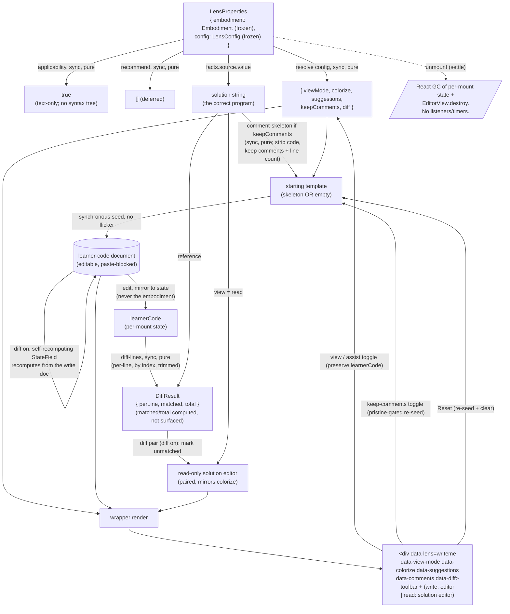

<!-- cspell:ignore reseed desync keymaps gameable misalign -->

# writeme — Architecture & Decisions

## Why this module exists

The `writeme` lens is the learner's **reproduction workbench**: a place to type
a program back from memory into a paste-blocked CodeMirror editor, with an
optional comment skeleton as scaffolding and a per-line diff **pair** as the
feedback — the write editor flags typed-but-wrong lines, and the read-only
solution editor marks the lines not yet reproduced. It is the furthest point on
the recognition → recall spectrum among the source-phase lenses: `parsons`
orders given lines, `blanks` fills given holes, `writeme` reproduces the whole
program.

## Modules

| File                                  | Layer   | Purpose                                                                                                             |
| ------------------------------------- | ------- | ------------------------------------------------------------------------------------------------------------------- |
| `index.tsx`                           | wrapper | React `main`; owns per-mount UI state; mounts CodeMirror + the diff decoration fields; composes the core            |
| `core.ts`                             | core    | Lens-contract defaults — `config`, `applicability`, `recommend`                                                     |
| `lib/no-paste-extension.ts`           | core    | CodeMirror extension blocking keyboard (`Mod-v`) + context-menu paste                                               |
| `lib/comment-skeleton.ts`             | core    | Solution → comment-only skeleton (executable code stripped; line count preserved)                                   |
| `lib/code-lines.ts`                   | core    | The shared gradable-code-line classifier; `comment-skeleton.ts` + `diff-lines.ts` agree on it (honesty invariant)   |
| `lib/diff-lines.ts`                   | core    | Per-line `LineStatus` verdicts + code-line tallies (`matched` / `total`); powers the diff visual + the honest tally |
| `lib/diff-decorations.ts`             | core    | Write half of the diff pair: `buildWriteDiffField`, the self-recomputing write-editor overlay                       |
| `lib/build-read-marker-field.ts`      | core    | Read half of the diff pair: `buildReadMarkerField`, the static read-editor markers                                  |
| `../lib/snippet-free-autocomplete.ts` | shared  | The `suggestions` toggle's autocomplete: JS keywords + in-buffer locals, no snippet templates                       |
| `types.ts`                            | shared  | `ViewMode`, `LineStatus`, `DiffResult`, `WritemeLensConfig`                                                         |

The default export of `index.tsx` is the frozen `Lens` object. The core
subsystems under `lib/` are internal; only `index.tsx` imports them. Tests
target each subsystem in isolation (vitest, no DOM) plus the wrapper end-to-end
(jsdom + `@testing-library/react`); tests live under `tests/`.

## Architectural sketch

### Execution phases

1. **Mount + resolve config** (sync, pure) — the orchestrator passes a frozen
   embodiment and the lens's resolved config via props. The wrapper reads the
   known config fields (view mode; the four scaffold toggles colorize /
   suggestions / keep-comments / diff) with documented defaults; other fields
   are preserved but ignored. Initial per-mount state: view mode and the four
   toggles seeded from config; the learner's code seeded from the starting
   template. The solution is `facts.source.value` — a given stage with no
   failure arm.

2. **Derive the starting template** (sync, pure) — when keep-comments is on, the
   wrapper computes the comment skeleton of the solution (executable code
   stripped; comments, blank lines, and line count preserved); when off, the
   template is the empty string. Computed synchronously so the editor's first
   paint already shows the template — no empty-then-filled flicker.

3. **Wire the write editor** (mount-once, imperative) — a mount effect
   instantiates the CodeMirror view seeded with the starting template (or the
   in-progress learner code, read from a ref so the seed reflects prior edits),
   configured editable, with the paste-block extension attached **always**
   (every editable state), an update listener that mirrors learner edits into
   local state, and a colorize / suggestions / diff compartment each holding its
   extension (or nothing). The editor mounts **once** (mount-effect deps `[]`);
   scaffold toggles live-reconfigure their compartment and the comments re-seed
   dispatches a document change — nothing remounts. Per-keystroke learner-code
   updates flow through the listener into state and cannot re-fire the mount
   effect (deps `[]`), so the view is never destroyed mid-typing.

4. **Diff the learner's code** (per edit, sync, pure) — a per-line diff compares
   the learner's code to the solution line-by-line, by index, compared trimmed:
   each solution line resolves to match / diff / empty / comment, and the code
   lines are tallied (matched, total). The result drives the diff-pair
   decorations (when diff is on); the matched / total tally is an honest
   byproduct of the same pass, computed but not currently surfaced.

5. **Render** (sync) — the wrapper emits the root
   `
`
   with the toolbar; in write view the CodeMirror editor (with the diff overlay
   when diff is on); in read view the **read-only solution editor** (paired with
   the write editor — mirrors colorize, shows the diff pair when on).

6. **Handle interaction** (per learner event) — the view toggle and the four
   Assist scaffold toggles update their state slice and **preserve learner
   code** (toggles via compartment reconfigure / doc-change dispatch, never a
   remount); the keep-comments toggle re-seeds the editor only while it is
   pristine (otherwise it updates the Reset template, leaving the editor
   untouched); Reset re-seeds to the current template.

7. **Unmount** (React-driven) — the orchestrator unmounts on settle or lens
   exit. Per-mount state is garbage-collected with the component instance; the
   CodeMirror views destroy via their effect cleanups. There are **no**
   listeners or timers to clean up.

### Data flow

The diagram is per-mount. The orchestrator (upstream) supplies `embodiment` and
`config`; `applicability` and `recommend` are consulted independently of any
mount. The render loop reads state + the solution + the diff; the toolbar
handlers feed state updates back. **There is no cross-mount persistence** —
learner code dies with the component instance.

### Structural constraints

- **Two-layer module shape** — `core.ts` + the files under `lib/` do NOT import
  React. Three lib files import `@codemirror/*` (a third-party library whose
  extension types are React-free): `no-paste-extension.ts`,
  `diff-decorations.ts`, and `build-read-marker-field.ts`; the other three
  (`comment-skeleton.ts`, `code-lines.ts`, `diff-lines.ts`) are pure TS over
  strings. `index.tsx` is the only file with React imports.
- **Purity rule holds.** Embody is a type-only import (`core.ts` narrows `Facts`
  / `Embodiment` as types); the embodiment arrives via props. The shared
  autocomplete (`../lib/`) is a leaf library — an ordinary import.
- **`data-lens="writeme"` on the wrapper's root.** Load-bearing for harness
  selectors and per-lens CSS.
- **`data-view-mode`, `data-colorize`, `data-suggestions`, `data-comments`,
  `data-diff`** on the root — harness selectors + CSS hooks; renaming any is a
  contract change. Values reflect committed state.
- **Applicability is total.** `applicability` returns `true` — writeme
  reproduces text and needs no syntax tree and no parse success; `facts.source`
  is a given stage that cannot fail, so there is no failure mode to gate on and
  no fallback panel in `main`.
- **`recommend`'s signature is locked** at
  `(embodiment) => ReadonlyArray<Recommendation>`. The current body returns the
  shared frozen empty array; a future analysis surface replaces the body in
  place.
- **Contract defaults return deep-frozen values.** `config()` returns a frozen
  `LensConfig`; `recommend()` returns a module-level frozen-empty-array
  constant; `applicability()` returns a primitive.
- **`SerializableValue` discipline.** `WritemeLensConfig` fields are primitives
  only (`viewMode`, `colorize`, `suggestions`, `keepComments`, `diff`). Domain
  values (`DiffResult`, `LineStatus`) are runtime structures, never stored in
  `LensConfig`.
- **Per-line diff is by index, trimmed.** Learner line `i` vs solution line `i`,
  compared trimmed. The comment skeleton preserves the solution's line count, so
  index alignment holds while the learner fills lines in place. Code lines (text
  with comments stripped is non-empty) are graded; comment lines are excluded
  from the tally total. An empty (unattempted) code line is left NEUTRAL in the
  diff visual — only `diff` (typed-but-wrong) lines are highlighted.
- **Honest tally.** The diff pass computes `matched / total` over code lines —
  an honest reproduced-line tally with no "complete" / "done" claim;
  `total === 0` (no code lines) is vacuously complete (no `NaN`).
  `code-lines.ts` and `diff-lines.ts` MUST agree on which lines are graded so
  the diff and the tally stay honest. The tally is **computed but NOT currently
  surfaced** — a clean extension point; the diff pair is the feedback. See
  [Why the honest line-count is the feedback](#why-the-honest-line-count-is-the-feedback).
- **Diff decorations are line decorations.** The diff visual is a
  `Decoration.line` per `diff`-status line, anchored zero-width at the line
  start (CodeMirror rejects a non-empty line-decoration range). A per-character
  model would need a length-matched template, which the comment skeleton is not
  — see [Why per-line (not per-char) diff](#why-per-line-not-per-char-diff).
  Whether the highlight visually renders is a browser-gate assertion (jsdom
  cannot exercise CodeMirror layout).
- **Paste blocked whenever the editor is editable** (regardless of the `diff`
  toggle). writeme has no anchors, so a paste would smuggle in the whole
  solution. See [Why paste is always blocked](#why-paste-is-always-blocked).
- **First-paint invariant.** The starting template is computed synchronously
  during the render that mounts the editor; the editor's initial document is the
  template, never an empty editor followed by a re-seed.
- **Toggle semantics.** The view toggle and the four Assist scaffold toggles
  update only their state slice; `learnerCode` is untouched — each toggle is a
  compartment reconfigure or a doc-change dispatch over one free-form document,
  never a remount. The keep-comments toggle re-seeds only while the editor is
  pristine; Reset re-seeds and clears feedback. Tested at the wrapper level.
- **Mount-once + compartments.** The CodeMirror editor mounts exactly once
  (mount-effect deps `[]`). The four scaffold toggles never remount it: colorize
  / suggestions / diff each live-reconfigure a CodeMirror `Compartment` via
  `view.dispatch({ effects: compartment.reconfigure(...) })`, and the comments
  toggle and Reset dispatch a document change. The constant base (line numbers,
  history, selection, the JavaScript language, the `oneDark` theme, editable,
  the update-listener, the paste-block) never reconfigures. This makes the
  preserve-learner-code invariant structural rather than disciplinary — no value
  can re-fire the mount effect. `learnerCode` is mirrored into a ref and read at
  mount time so it seeds the initial document only; it MUST NOT appear in the
  mount-effect deps (a per-keystroke remount would destroy the view mid-typing).
- **The pristine predicate is pure**:
  `learnerCode === '' || learnerCode === templateFor(keepComments-before-toggle)`,
  evaluated against the flag value BEFORE the toggle flips (evaluating it after
  the flip would mis-read a skeleton-showing editor as non-pristine and produce
  a dead checkbox). See
  [Why keep-comments re-seeds only while pristine](#why-keep-comments-re-seeds-only-while-pristine).
- **The editor writes to local state only.** The `updateListener` mirrors
  learner edits into local `learnerCode`; the embodiment is read-only and
  deep-frozen.
- **Disposable practice.** No `localStorage`, no module-level cache, no refs
  across mounts, no URL state.
- **Display content rendered safely.** Both CodeMirror editors render via their
  own document model (the write editor the learner text, the read editor the
  solution); never `dangerouslySetInnerHTML`.

### Out of scope

- **Cross-mount persistence** of learner code. Per-mount React state only;
  nothing survives unmount.
- **URL state.** None; persistence of study settings is orchestrator-domain.
- **Program mutation / editing.** The lens is a read-only view; learner code is
  lens-local.
- **Code execution / run / trace.** Other lenses' jobs.
- **A surfaced line count.** The `matched / total` tally is computed but not
  shown in the UI — the diff pair is the live signal. A numeric "X / N code
  lines" readout was considered and cut (the diff pair makes a separate score
  redundant); surfacing the already-computed tally is a clean extension point.
- **Order-insensitive line alignment.** The diff is by line index; whole-line
  insertions/deletions shift alignment (a visible drift signal). LCS-based
  alignment is deferred.
- **Character-level intra-line diff.** Whole non-matching lines are highlighted;
  char-level highlighting within a line is deferred (and needs order-insensitive
  alignment first).
- **A hints affordance.** Considered and cut — writeme is the recall lens, and
  Read is the escape hatch (expertise reversal). Not deferred; dropped.
- **Multi-language support.** JavaScript-only (the package is `study-lenses`);
  language is an `embody/` concern.

## Why scaffold toggles use compartments

The four scaffold toggles (colorize / suggestions / comments / diff) each swap
an editor extension on or off. The naive implementation — list the toggle states
in the mount-effect deps and rebuild the `EditorView` on every change —
multiplies the remount surface, and on each toggle it discards the learner's
cursor, scroll, and undo history (the document survives only because it is
re-seeded from a ref). Caching one pre-built editor per toggle combination is
worse: four independent toggles are sixteen combinations, and every switch would
have to hand-copy the document, cursor, and history into the target instance or
they desync.

CodeMirror's `Compartment` is the purpose-built tool. The editor mounts **once**
(mount-effect deps `[]`); each toggle is a
`view.dispatch({ effects: compartment.reconfigure(ext) })` that swaps just the
one affected extension live. The document, cursor, selection, scroll, and undo
history are preserved automatically — nothing to cache, nothing to sync. Because
deps are `[]`, no reactive value can re-fire the mount effect, so a
per-keystroke remount is not merely avoided but structurally impossible.

Layout: a constant base (line numbers, history, selection, default / history /
completion keymaps, the `oneDark` theme, the JavaScript language, editable, the
update-listener, the paste-block) plus three compartments — colorize (the
`oneDark` highlight style or nothing), suggestions (the snippet-free
autocomplete extension or nothing), and diff (the `Decoration.line` field or
nothing). The comments toggle and Reset are document-change dispatches, not
compartment reconfigures.

## Why default the editor to diff

The `diff` toggle defaults ON (feedback on), not off. A feedback-off default is
a feedback-free box. Defaulting `diff` on makes the honest-feedback mechanism
visible on first paint: the learner sees the lens working, and the diff guides
their reconstruction. Turning `diff` off remains one click away for learners who
want a pure-recall challenge — the dial exists, but its default points at honest
feedback.

## Why Read is the paired solution editor

The read view shows the solution in a **read-only editor configured to match the
write editor** — a pair — not the learner's code beside it. The learner's typed
code is never shown in Read; only the solution (mirroring `colorize`, and, when
`diff` is on, the solution lines the learner has not yet matched — progress
markers, not the learner's code). Write and Read stay **mutually exclusive while
typing**: the learner never types with the solution in view. The loop is **read
→ remember → type**: study the solution in Read (the diff-pair markers focus
what is still missing), return to Write, and reproduce it from memory.

A side-by-side "your code | solution" comparison was rejected — a comparison
surface lets the learner _transcribe_ rather than _recall_. A plain `<pre>` was
also rejected, because **colorize and the diff pair need a real CodeMirror
surface** to mirror the write editor's highlighting and carry line decorations —
a `<pre>` cannot. The read editor is read-only (`EditorState.readOnly` +
`EditorView.editable.of(false)`), carries no update-listener, and never writes
`learnerCode`, so it stays a study surface, not a second editing surface.

## Why the honest line-count is the feedback

A progress score that averages keyword-presence counts with a length ratio and
declares the exercise "complete" at a threshold is **gameable**: a learner can
type the right keywords at roughly the right line count and reach "complete"
without writing working — or even sensible — code. Shipping a feedback signal
that rewards the appearance of work over the substance of it is a weak-pedagogy
failure this lens refuses.

writeme instead ships a measurement, not a verdict: the **per-line diff pair**.
The write editor flags the learner's typed-but-wrong lines; the read-only
solution editor marks the solution lines not yet reproduced. This is honest
because it shows the literal thing the exercise asks for (reproduce the code)
line by line, it cannot be gamed by keyword-stuffing (a line either matches or
it doesn't), and it makes no mastery claim — every line matched means "you
reproduced every line," not "you have mastered this." A numeric
`X / N code lines` score was considered and **cut**: the live diff pair already
shows reproduction progress, so a separate number would be redundant. The same
pass still computes an honest `matched / total` tally (comment lines excluded
from `total` — the comment skeleton seeds them, so counting them would start the
score non-zero before the learner types) as a cheap byproduct; it is **not
currently surfaced** but remains a clean extension point.

## Why per-line (not per-char) diff

A per-character positional diff works only when the learner's document is
**length-matched** to the original, so character offset `i` in the learner's
document corresponds to offset `i` in the original. writeme's starting template
is the comment skeleton, which is **not** character-length-matched to the
solution (executable code is stripped to empty or to a comment) — so a
positional character diff would misalign the moment the learner starts typing.

The comment skeleton **does** preserve line count (every solution line maps to
one template line). So writeme diffs by **line index**: learner line `i` vs
solution line `i`, compared trimmed. This holds while the learner fills lines in
place. If the learner inserts or deletes whole lines, the index alignment shifts
and downstream lines flag as differing — surfaced as a drift signal, not a
crash. Order-insensitive (LCS-based) alignment is a future direction; index
alignment is the version that the skeleton's line-count invariant makes correct
for the common case.

## Why keep-comments re-seeds only while pristine

The keep-comments toggle selects the starting template (comment skeleton vs
blank slate). The question is what it does mid-exercise. Two failure modes bound
the design: a dead control (a toggle that visibly does nothing once typing
began) is confusing; an unconditional live re-seed silently discards in-progress
work on a single checkbox click (destructive, and the lowest-friction control to
trigger by accident). writeme takes the middle path: **re-seed only while the
editor is pristine** (empty, or still equal to the current template — the
learner has not yet diverged). Concretely, pristine is the pure predicate
`learnerCode === '' || learnerCode === templateFor(keepComments-before-toggle)`
— "current template" is the template for the flag's value BEFORE it flips, so an
editor still showing the skeleton reads as pristine when the learner unchecks
Keep Comments (and re-seeds to empty); evaluating it against the post-flip value
would mis-read it as non-pristine and produce a dead checkbox. A learner who
typed then cleared back to empty is also pristine (the `=== ''` clause), so a
toggle then re-seeds onto the empty canvas — intended. Before the learner types,
the toggle applies immediately (the common case — "I want a blank slate / I want
the comments"). Once they have typed divergent code, the toggle updates the
Reset template but leaves the editor untouched, and the toolbar surfaces "Reset
to apply." The learner's work is never silently discarded; only the explicit
Reset clears the editor.

## Why toggling a scaffold preserves learner code

Every scaffold toggle — colorize, suggestions, comments, diff — leaves the
learner's typed code, cursor, and history intact, because none of them remounts
the editor. The editor mounts once (mount-effect deps `[]`); colorize /
suggestions / diff each live-reconfigure a CodeMirror `Compartment` and the
comments toggle / Reset dispatch a document change, so the document survives the
toggle automatically (see
[Why scaffold toggles use compartments](#why-scaffold-toggles-use-compartments)).
writeme can do this because it has no per-mode document invariants to honor: all
toggles edit the **same free-form document**, and diff only adds a read-only
decoration overlay — it imposes no structure on the text.

## Why paste is always blocked

writeme has no anchors: the editor is a free-form document and the whole
exercise is to reproduce the solution from memory. Permitting paste in any
editable state would let the learner paste the solution and defeat the exercise
entirely. So writeme blocks paste **regardless of the `diff` toggle** — keyboard
(`Mod-V`) and DOM paste events (context menu, drag-drop) alike.

## Module ownership

The lens owns its own `README.md`, `DOCS.md`, `types.ts`, source (`core.ts`, the
`lib/` subsystems, `index.tsx`, `writeme.css`), and tests. The shared
snippet-free autocomplete lives in `../lib/` (cross-lens, lens-agnostic).
Cross-cutting lens conventions (two-layer split, read-only views, totality at
mount, flat serializable config) live in [`../README.md`](../README.md) +
[`../DOCS.md`](../DOCS.md); this lens inherits them.
