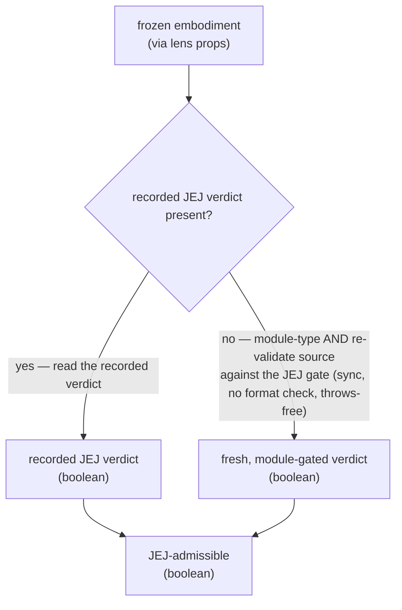

# lib/admitting — Architecture & Decisions

## Why this module exists

A lens whose analysis assumes the JEJ scope model (`quiz`) must render only for
JEJ-compliant code, but it cannot decide compliance itself: a lens may not
import `embody/lib/validating/validate.js` (lens purity), and today it cannot
read the verdict off the embodiment (`status.validated` / `validation` are
stubbed for real snippets). `lib/admitting/` is the peer-independent seam that
answers _is this snippet JEJ-admissible?_ as a boolean — importable by a lens,
re-pointable to the public `status.validated` surface once embody populates it.
See [`./README.md`](./README.md) for the glossary, public API, and the boundary
rationale.

## Architectural sketch

> Written Phase 0, before implementation. The Refactor step is held against this
> document — not what the code does, but what shape it takes.

### Execution phases

1. **Receive** (sync) — the accessor is invoked with a frozen `Snippet`
   embodiment (received by the lens via props; the lens forwards it). No lens,
   React, or CodeMirror types cross this boundary.

2. **Decide admission** (sync) — one decision, two mutually-exclusive arms;
   exactly one runs:
   - **Verdict present** — if the embodiment already carries a validation
     verdict (the validate stage ran), the snippet is admissible iff that
     recorded JEJ verdict is true. This is the arm canned scenario snippets
     take, and the arm **module** snippets will take once embody wires validate
     into real composition. Reading the recorded shape (not the source string)
     respects embody's "branch on `status` / `validation`, never on
     `source.code` content" contract.
   - **No verdict — bridge by re-validation** (throws-free) — if the embodiment
     carries no verdict (real composition today stubs it absent), the snippet is
     admissible iff it is **module-type** AND a fresh JEJ validation of its
     source string passes. The `type === 'module'` guard makes this arm shadow
     `status.validated` exactly — `status.validated` (and `validation`) are
     structurally `false`/`null` under `script` type (see § The re-point). The
     gate parses and checks the JEJ subset with **no format check**; a parse
     failure is a fail, not an exception. This arm reads `source.code` only to
     feed the validator whole — never as a content discriminator.

3. **Return** (sync) — a plain `boolean`. No allocation, no freeze.

### Data flow



### Structural constraints

- **No embodiment construction.** The seam imports the validation gate and the
  `Snippet` **type** (type-only), never `embody()` or anything under
  `embody/lib/evaluating/`. It reads an embodiment; it never builds one.
- **Pure, synchronous, throws-free.** No I/O, no async, no side effects. Returns
  a primitive; relies on the validation gate's never-throws-for-string contract
  rather than guarding the boundary.
- **Verdict-first, re-validation-second.** The recorded verdict is preferred;
  the source string is re-validated **only** when no verdict is recorded. For a
  **real-composition** snippet — where `source.code` _is_ the validated source —
  the recorded verdict and a fresh `validate(source.code)` agree by construction
  (same gate, same source). For **canned scenario fixtures** the two diverge by
  design: the sentinel `source.code` would misvalidate (`embody('OK')` records
  `isJeJ: true`, yet `validate('OK').ok` is `false` — a bare undeclared global),
  which is exactly why the recorded verdict is read first.
- **Module-type shadow.** The seam computes exactly what `status.validated` will
  carry once embody wires validation in: the re-validation arm is guarded by
  `type === 'module'`, because `status.validated` (and `validation`) are
  structurally `false`/`null` under `script` type. So a JEJ-valid `script`
  snippet is **not** admitted — matching the pedagogy (quiz teaches the JEJ
  notional machine, absent without a language level) and keeping the re-point
  (below) behavior-preserving.
- **Meaningful only for parsed embodiments.** Callers gate on `status.parsed`
  first (the Tier-2 gate); the seam does not re-check it. For an unparsed
  scenario whose sentinel `source.code` differs from real code, the
  re-validation arm would validate the sentinel — harmless, because the caller's
  `status.parsed` short-circuit fires before the seam is reached.
- **`source.code` feeds the validator, it is never a discriminator.** The
  re-validation branch passes the whole source string to the gate; it does not
  compare `source.code` to any literal. This keeps the seam clear of embody's
  scenario-sentinel anti-pattern.
- **Admission excludes formatting.** The gate used is the sync validator
  (parse + JEJ subset), not the async format-aware check. A
  valid-but-unformatted JEJ snippet is admitted.

### The re-point (Class-B)

Today the "no recorded verdict" arm is the one real code takes, because embody's
real-composition path stubs `validation` absent. When embody wires the validate
stage into real composition, `validation` becomes present for real **module**
snippets, the re-validation arm becomes dead code, and the seam collapses to
reading a single total field:

```ts
return embodiment.status.validated;
```

`status.validated` is the faithful re-point target — **not** `validation.isJeJ`,
which is `null` under `script` type. It is `true` iff the snippet is a parsed,
JEJ-admitted module and structurally `false` otherwise (including every `script`
snippet), which is exactly what both arms compute today (the verdict arm reads
`validation.isJeJ`, which equals `status.validated` whenever `validation` is
present; the re-validation arm's `type === 'module'` guard makes it match under
`script`). **Deleting the re-validation arm and reading `status.validated` is
the entire re-point** — the accessor name, its `(Snippet) => boolean` signature,
and every caller are untouched. This is why the parameter is the whole
`Snippet`, not a `code: string`.

## Out of scope

- **Wiring validate into embody's real composition.** Populating
  `status.validated` / `validation` for real snippets (which triggers this
  seam's re-point) is embody / language-level work, not this module's.
- **What a lens does when non-admissible.** Rendering a fallback, hiding a tab,
  degrading gracefully — that is the consuming lens's concern. This module only
  produces the boolean.
- **Non-JEJ language levels.** The gate always validates against Just Enough
  JavaScript; per-exercise subsets are not configurable here.
- **Diagnostics / explanations.** Why a snippet is inadmissible (which
  construct, where) is [`../linting/`](../linting/)'s job; this module answers
  only yes/no.

## Decisions

- **Validation-aware body, not `validate(source.code).ok` alone.** Reading the
  recorded verdict when present keeps the seam correct for canned scenario
  snippets (whose sentinel `source.code` would misvalidate) and honors embody's
  "branch on shape, not `source.code` content" contract. In production the two
  branches are identical (real code has no recorded verdict today, so it
  re-validates) — the verdict-first branch costs nothing and buys correctness
  for fixtures plus a zero-churn re-point.
- **`Snippet` parameter, not `code: string`.** The re-point target
  (`status.validated` / `validation.isJeJ`) lives on the `Snippet`, so the
  accessor must receive the whole embodiment. A `code: string` signature (as
  `lint-jej` / `complete-jej` take) could never re-point without a caller
  change.
- **`validate`, not `is-jej`.** `validate` is the sync parse + JEJ-subset gate
  with no format check; `is-jej` additionally awaits a Prettier format check,
  which would hide the lens for valid-but-unformatted code. Admission ≠
  formatting.
- **No `types.ts`.** The module introduces no new vocabulary — it returns
  `boolean` and imports `Snippet` type-only.
