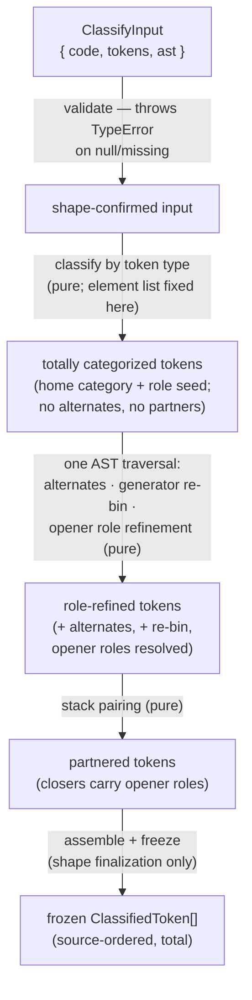

# lib/classifying — Architecture & Decisions

## Why this module exists

The blanks lens needs token classification to decide what is blankable; the quiz
lens's question generator (`lib/quizzing`) needs the same classification as
quiz-anchor ground truth. The legacy implementation
([`../../lenses/blanks/lib/blankenate.ts`](../../lenses/blanks/lib/blankenate.ts))
entangles classification with blank selection — probability rolls during the
walk, config-dependent skipping, AST-node mutation — so it cannot be shared.
This module is the pure, exhaustive, selection-free classification both
consumers draw from. See [`./README.md`](./README.md) for the taxonomy, the
public API, and the bounded context ("classifying describes; consumers select").

## Architectural sketch

> Written Phase 0, before implementation. The Refactor step is held against this
> document — not what the code does, but what shape it takes.

### Execution phases

`classify-tokens.ts` is the single public export; phases 2–4 are hoisted in-file
helpers (newspaper anatomy: export first, helpers below).

1. **Validate inputs** (sync, throws) — `code` must be a string, `tokens` a
   non-null array, `ast` a non-null node. Throws `TypeError` otherwise; this is
   the module's only throw site (boundary validation only — see README § Public
   API for why this diverges from `../completing/`'s never-throw posture).

2. **Token-stream classification** (pure) — one pass over `tokens`. Skip `eof`
   and zero-length tokens; the element list is FIXED at the end of this pass.
   Assign each token its **home category** from the classification table (README
   § The taxonomy) and its **token-derivable role seed**: literal kinds from the
   token type; `statement-end` for `;`; `member-access` for `.` / `?.`;
   `template-delimiter` for backticks; `template-expression` for `${`;
   everything else seeds `'other'` (or `null` for identifier/keyword primaries).
   `text` comes from `code.slice(start, end)` — source-slice authority.
   **Totality of both category and role holds from the end of this phase; every
   later phase only refines.**

3. **AST refinement** (pure, one AST traversal) — the AST is traversed exactly
   once; a sorted token-position index, precomputed from the token array (array
   prep, not a second traversal), bridges nodes to tokens. Three refinements,
   opener/contextual tokens only (closer roles are phase 4's job):
   - **Alternates**: a keyword token covered by an `Identifier` node gains
     `identifier`; by a `Literal` node gains `literal`; in a `UnaryExpression`
     or `BinaryExpression` operator position gains `operator` (`typeof`, `void`,
     `delete`, `in`, `instanceof`). Keyword stays primary (the rule the blanks
     dedupe locks pin).
   - **Generator `*` re-bin**: function/method/property generator stars move
     `operator` → `delimiter` with role `generator` — the single sanctioned
     home-category change.
   - **Role refinement**: from the owning node's kind and the token's position
     in it — `=` in a `VariableDeclarator` → `declarator-init` vs in an
     `AssignmentExpression` → `assignment`; operator roles from the owning
     expression node; opener parens and braces per the claim list (see
     Structural constraints § Grouping by elimination); literal-role seeds stand
     unless a node refines them.

4. **Pairing** (pure) — a stack walk over the paired-delimiter tokens (`(`/`)`,
   `[`/`]`, `{`/`}`, backticks, `${`/`}`): assign each pair mutual `partner`
   indices; **closers inherit their opener's role** (phase 3 deliberately leaves
   closers seeded `'other'`). Backtick open/close share one token type — the
   stack disambiguates: a backtick closes iff the stack top is a backtick,
   otherwise it opens (sound because templates nest only through `${…}`). This
   same pass is what disambiguates `}` closers (block vs `${` partner) — Acorn
   gives them all one `braceR` token type.

5. **Assemble + freeze** (pure, shape finalization ONLY) — emit the
   source-ordered `readonly ClassifiedToken[]`, deep-frozen via
   `deepFreezeInPlace` (`@utils/deep-freeze-in-place.js` — objects this module
   just built). This phase never adds, drops, or reorders elements — `partner`
   indices assigned in phase 4 must stay valid.

### Data flow

### Structural constraints

- **Token-stream-first.** Categories and role seeds come from token types; the
  AST contributes only alternates, opener-role refinement, and the generator
  re-bin. This is a deliberate inversion of the legacy design (AST-walk-located
  operators with `betweenText.indexOf` string arithmetic) — it eliminates that
  fragility class entirely and makes totality provable from the classification
  table instead of asserted.
- **Totality from phase 2 — categories AND roles.** Every non-empty token has a
  home category and a role seed before the AST is consulted; a parse-anomalous
  AST can leave roles at their seeds but can never drop a token.
- **Grouping by elimination is sound only if the claim list is exhaustive.**
  `grouping` is assigned to parens no other owner claims, so every other paren
  owner MUST claim its tokens: call/`new` argument lists, control heads (`if` /
  `while` / `for` / `switch` and the `do…while` tail), `catch (e)`, and
  function/arrow/method parameter lists. Owned-but-unclaimed parens degrade to
  `'other'`, never to a wrong confident role.
- **Pure on frozen inputs.** No mutation of `tokens`, `ast`, or any node — the
  legacy walk's synthetic `node.operator = '='` writes are explicitly banned;
  the module must run unchanged on deep-frozen embodiment data.
- **One AST traversal.** Phase 3 consults the precomputed token index; it never
  re-walks the tree. JEJ's page-size invariant bounds the cost; no caching.
- **Keyword-over-AST primary.** All span collisions are keyword-vs-AST
  (`Identifier`/`Literal` coverage; `UnaryExpression`/`BinaryExpression`
  operator positions); keyword stays primary, matching the blanks dedupe locks.
- **Pairing never reaches outside delimiters.** The stack walk sees only
  paired-delimiter tokens; mismatched pairs (impossible in a parsed snippet)
  would leave `partner: null`, never throw.
- **Phase 5 is shape finalization only.** Length and order are fixed by phase 2;
  `partner` indices depend on it.

### Out of scope

- **Selection.** Probability rolls, content-type filtering, blank generation —
  `lenses/blanks`.
- **Question generation, grading, grouping.** `lib/quizzing`.
- **Scope analysis / identifier usage** (read vs assign, binding resolution) —
  scope-aware consumer work.
- **Comments.** Not tokens; live on `Snippet.raw.comments`.
- **Configuration.** The classifier has none; it is a deterministic function of
  the parse.
- **Input coherence.** The three input values must come from one parse of one
  source; the classifier validates shape, not provenance — mismatched inputs are
  a caller bug.

## Decisions

- **Token-stream-first classification** (recorded per AR-1 concern 7). The
  legacy located operators by walking expression nodes and searching the source
  between child spans; operator tokens already carry exact spans in the token
  stream. Classifying by token type and consulting the AST only for refinement
  is strictly simpler, removes the string-arithmetic fragility, and gives exotic
  tokens (namespace-import `*`, `yield*` delegation) a provable home. Known,
  documented behavior delta vs. legacy: those previously-skipped stars are now
  classified (README § Totality).
- **Role seeds live in phase 2** (per AR-2 counter-proposal A). Half the role
  union is token-derivable; seeding it with the home category makes phase 3
  strictly AST refinement and extends the totality invariant to roles.
- **Category set with keyword-primary** (per the campaign plan's MF-4 decision).
  Carrying primary + alternates — including the `BinaryExpression`
  keyword-operators `in`/`instanceof` (per AR-2 concern
  1. — lets blanks filter any-match, preserving its partial-config behavior
     exactly, while quizzing reads the full set for overlap-aware questions.
- **Role refines the primary category** (per AR-2 concern 2). One role slot per
  token; keyword-primary tokens never carry a literal role, which is why
  `LiteralRole` has no `boolean`/`null` members.
- **`ClassifyInput` in acorn terms** (per AR-1 concern 3). The classifier walks
  acorn shapes, so the contract says so; `Snippet.raw`'s loose `unknown[]` types
  narrow at the caller's boundary in one cast. Tests build inputs with a bare
  `acorn.parse`.
- **Throws on invalid input** (per AR-1 concern 4) — divergence from
  `../completing/` documented in README § Public API: classifying sits behind a
  parse gate, not inside an editor render loop.
- **Roles trimmed to live-consumer needs** (per AR-1 concern 6). The unions in
  `types.ts` cover blanks (none needed), the quiz catalog's first clusters, and
  the pairing disambiguation; finer roles (`switch-body`, ternary positions,
  separator splits) land with the catalog clusters that need them. Widening the
  union is a cross-consumer contract event.
- **One public file, in-file helpers.** The five phases live in
  `classify-tokens.ts` as hoisted helpers until a second call site or
  readability forces extraction (house extraction rule). The phase names above
  are the refactor target, not a file map.
