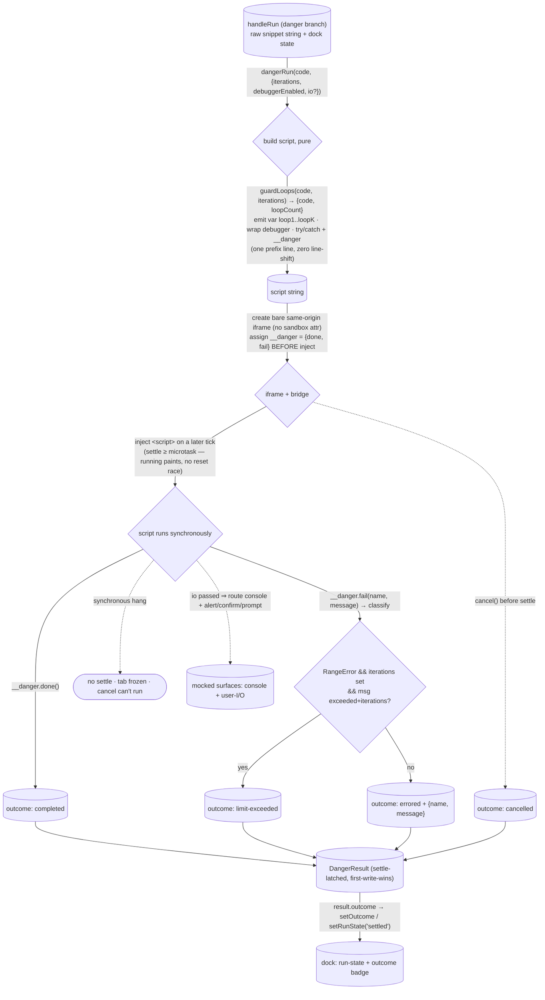

# danger-runner — Architecture & Decisions

Vocabulary: [README.md § Ubiquitous language](./README.md). The honest limits of
on-thread execution: [README.md § Edge cases](./README.md). The security cost of
the same-origin/no-sandbox posture: [README.md § Security posture](./README.md).
The dependency-direction exemplar this module follows (own your contract;
consumers re-map): [`../local-llm/DOCS.md`](../local-llm/DOCS.md).

## Architectural Sketch

> Written Phase 0, before implementation. The Refactor step is held against this
> document — not what the code does, but what shape it takes.

The module answers one question — _how did the learner's raw code end when run
in a real browser window?_ — behind one verb, `dangerRun(code, options)`. It is
a **stand-alone procedure, not an embody engine**: it takes the raw editor
`string` and bypasses parse → validate → create → the Web-Worker sandbox,
because danger mode exists precisely to bypass that machinery (making it an
engine would force it to honour the `EvaluateHandle` contract whose purpose it
discards).

The sketch's point is a single seam: a **pure script-assembly core** (loop-guard
rewrite, counter-global emission, `debugger;` wrap, and the `try/catch` +
`__danger` bridge, all assembled line-preservingly into one script `string`) on
one side, and an **impure iframe lifecycle** (create a permissive same-origin
iframe, wire the bridge, inject the script, latch the settle, tear down) on the
other. Everything on the pure side is data-in/data-out and Node-testable; the
impure side is browser-only (a real `window`, real native dialogs, real
`debugger;`, synchronous `<script>` settlement) and has no faithful jsdom
analogue.

## Execution phases

1. **Build the script** (sync, pure) — input: the raw `code`, `iterations?`,
   `debuggerEnabled?`; output: one script `string`. Run
   [`guardLoops`][guardloops]`(code, iterations)` → `{ code, loopCount }` for
   the iterations limit (skipped when `iterations` is unset). Assemble, on a
   **single prefix segment with no newline before the user code** (mirroring
   embody's `"use strict"`-line technique, so user line _N_ stays script line
   _N_): `"use strict";` + `var loop1 = 0, …, loop{loopCount} = 0;` + `try {` +
   (if `debuggerEnabled`) `debugger;` + the guarded user code + (if
   `debuggerEnabled`) `debugger;` +
   `window.__danger.done(); } catch (e) { window.__danger.fail(e && e.name, e && e.message); }`.
   Error identity is read **inside** the iframe realm (`e.name` / `e.message`)
   and handed out as primitives — never the live `Error` (cross-realm
   `instanceof` is unsound).
2. **Create the iframe + wire the bridge** (impure) — create a bare same-origin
   `<iframe>` with **no `sandbox` attribute** (`about:blank`), append it to the
   document (it must be _connected_ for native dialogs and `debugger;` to work;
   it may be visually hidden), and assign
   `contentWindow.__danger = { done, fail }` **before** the script is injected
   (a strict ordering invariant — the script settles the moment it runs).
   `done()`/`fail(name, message)` settle `result` through the classifier, behind
   a **settled latch** (first-write-wins).
3. **Inject + settle** (impure) — inject the `<script>` into the iframe's
   `contentDocument` **on a later tick** (microtask/task), so `result` settles
   no earlier than a microtask. The script runs to completion synchronously
   during `appendChild`, so `done`/`fail` fires before the append returns (the
   script's _synchronous_ run settles the outcome; any async continuation the
   snippet schedules fires post-settle and is outcome-invisible — README § Edge
   cases) — but the deferral means the orchestrator's `running` state paints
   first (a synchronous settle would coalesce `running` and `settled` into one
   React batch, so the running state would never paint). The **classifier**
   (`classifyDangerError`) maps a caught throw: a `RangeError` whose message
   `includes('exceeded')` && `includes('iterations')`, **and only when
   `iterations` was set**, → `limit-exceeded` (the public literal; embody's
   internal `iteration-limit` is remapped upstream, not copied); every other
   throw → `errored` with `{ name, message }`.
4. **Teardown** — remove the iframe on settle or on `cancel()`. `cancel()`
   before settle removes the iframe and settles `cancelled`; after settle it is
   a no-op on the outcome (the latch). During a **synchronous hang** neither the
   settle nor `cancel()` can run — the tab freezes (the irreducible danger).

**Mocked vs native** is the _presence_ of `io`, not a flag: `io` PASSED ⇒ the
runner routes the iframe's `alert`/`confirm`/`prompt`/`console` through the
callbacks (to an on-screen surface — e.g. a device without devtools); `io`
ABSENT ⇒ nothing captured (real console, real devtools, real native dialogs), so
`debugger;` stepping shows the learner's own code with no mock frames. `io` is
shaped to match embody's `IoMocks`, so the orchestrator's one `buildIoMocks()`
feeds both backends.

## Data flow

The synchronous-hang exit is not a `DangerOutcome` — it is a non-settling,
tab-freezing state, drawn dotted because it is the danger the gate exists for.
The three dotted edges are distinct off-happy-path routes — a pre-settle
`cancel`, the mocked-`io` side-effect, and the non-settling freeze — not one
category.

## Structural constraints

- **Main-thread + same-origin + no-SAB is the root fact.** It is what enables
  the synchronous readback (`contentWindow.__danger` assigned directly, no
  `postMessage`), the direct `io` mock routing, real natively-blocking dialogs,
  and real `debugger;` stepping — and it is equally the source of the
  async-settle discipline, the mocked-dialog constraint, and the freeze risk
  below. `local-llm`'s `CROSS_ORIGIN_ISOLATED = false` confirms no COOP/COEP/SAB
  is needed.
- **The iframe must be connected to the document.** A detached iframe will not
  run native dialogs / `debugger;` reliably; it is appended (possibly visually
  hidden) and removed on teardown.
- **`result` settles no earlier than a microtask; `io` never fires synchronously
  in the `dangerRun(...)` call.** The script injection is deferred a tick.
  Without this, a trivial snippet settles synchronously → React coalesces
  `running` and `settled` (the running state never paints) and a synchronous
  `io` mirror races the orchestrator's `EMPTY_CHANNELS` reset. The Worker path
  never hit this (it always crossed `postMessage`).
- **The `loop1..loopK` counter globals are the runner's to emit.** `guardLoops`
  references them but does not declare them (embody's Worker setup does). K
  comes from the guard's returned `loopCount`, never hardcoded. Miss them and
  every loopy snippet throws `ReferenceError` and mis-reports as `errored`.
- **Line preservation is the assembly's job.** The prefix (`"use strict"`,
  counter globals, `try {`, and the leading `debugger;` when enabled) sits on
  one segment with no newline before the user code, so stepping and any future
  `error.line` correspond to the learner's editor exactly (zero shift, not +1).
- **The classifier is a message-match predicate, emitting the public literal.**
  `classifyDangerError(name, message, iterations)`:
  `name === 'RangeError' && iterations !== undefined && message.includes('exceeded') && message.includes('iterations')`
  → `{ outcome: 'limit-exceeded' }`; else
  `{ outcome: 'errored', error: { name, message } }`. No sentinel disambiguates
  the guard's `RangeError` from a learner's identical one (a sentinel would need
  a `guardLoops` edit — forbidden); embody itself message-matches, so this
  module inherits that accepted false-positive.
- **The settle-latch is first-write-wins across all four outcomes.** Whichever
  of `done` / `fail` / `cancel` reaches it first wins; the rest are no-ops. A
  post-settle async throw cannot change a latched outcome (it surfaces
  natively).
- **`io` presence is the mode.** `io` absent ⇒ native (real console + real
  native dialogs, clean stepping). `io` passed ⇒ the runner routes
  `alert`/`confirm`/`prompt`/`console` through the callbacks; console mirroring
  is fire-and-forget and also forwards to native.
- **The seconds limit is out of scope (a dock/UI concern).** The engine takes
  only the loop-guard `iterations` cap. The locked orchestrate README names a
  future per-iteration in-guard elapsed check for danger's seconds, but that is
  an embody-owner-gated change; a wall-clock `setTimeout` would be ineffective
  anyway (it cannot fire during a synchronous hang).
- **Imports: nothing from `orchestrate/`; `guardLoops` read-only from
  `embody/`.** `DangerOutcome` is hand-owned; its subset-assignability to
  `EndReportOutcome` is checked at the orchestrator's `setOutcome` call site,
  not by a backwards import.

### Internal pure helpers (the pure side of the seam)

The pure side factors into three data-in/data-out helpers, their exact
signatures pinned in Phase 1: a **debugger-wrap transform** (a no-op when
disabled; otherwise `debugger;` above and below, line-preservingly); a **script
assembler** (the `"use strict"` + counter globals + `try/catch` + `__danger`
bridge, its counter count taken from the guard's `loopCount`, never hardcoded);
and the **outcome classifier** (the message-match predicate above).

## Deferred increment plan (Phase 1+ — gated on the human DDD gate; do not start)

1. **iframe core** — create/connect the iframe, inject the raw `<script>`, map
   natural completion → `completed` and a thrown/syntax error → `errored`,
   teardown, and the async-settle discipline. Standalone, browser-testable.
   Carries two triangulating cases — `completed` on a natural return and
   `errored` on a top-level throw — so the `try/catch` bridge cannot be faked to
   a constant.
2. **iteration guard** — import `guardLoops`, emit the `loop1..loopK` globals,
   and the `limit-exceeded` classify (the message-match predicate). Small — the
   guard already exists.
3. **cancel/teardown** — `cancel()` + the settled latch.
4. **debugger wrap** — `wrapWithDebugger`, wired line-preservingly into the
   build.
5. **`io` mocks** — route the iframe's `alert`/`confirm`/`prompt`/`console`
   through the `io` callbacks when passed (native when absent).
6. **`handleRun` danger branch + dock-prop threading** — the ONLY
   `orchestrate/`-touching increment: the `sandboxMode === 'danger'` branch, the
   `handleReference` widening, the `{ outcome }` up-adapt, and passing
   `buildIoMocks()` as `io` when mocked. Deferred and coordinated (index.tsx is
   shared).

## Verification (deferred — named here, not built in Phase 0)

- **Pure helpers** — Node unit tests for `wrapWithDebugger`, `buildDangerScript`
  (assert user line numbers are unshifted), and `classifyDangerError` (the
  predicate and the accepted false-positive).
- **The iframe runner** — a `*.browser.test.ts` (precedent: `local-llm`'s
  sandbox and the `intercept/tests/*.browser.test.ts` suites), one case per
  transport-distinct settlement: `completed`, `errored`, `limit-exceeded`,
  `cancelled`. A `vite.sandbox.config.ts` (with `CROSS_ORIGIN_ISOLATED = false`)
  hosts an eyeball-test harness for the freeze/dialog/`debugger;` behaviours
  that cannot be asserted (a frozen tab would freeze the runner).
- **Docs** — `markdownlint-cli2` (the repo gate; line-length left to Prettier)
  and `prettier --check`.

## Out of scope

- **HTML hosting templates** — danger evaluates pure JS as a `<script>`; hosting
  a full HTML document is backlogged, not this surface.
- **The Worker path** — `sandboxMode === 'worker'` is embody's intercept engine,
  unchanged and not this module's.
- **Rendering** — the dock's run-state/outcome badge and the on-screen
  console/dialog surfaces are the orchestrator's / output-panels' to render; the
  runner reports an outcome and (mocked mode) emits io lines through the `io`
  callbacks.
- **The seconds limit** — a dock/UI concern, not the engine's; this utility
  takes no `seconds` option. Any future enforcement (the locked orchestrate
  README names a per-iteration in-guard elapsed check) is an orchestrate/embody
  matter.
- **Cross-origin isolation** — a `postMessage`-readback redesign that would
  trade the synchronous settle for a little more isolation is an explicit,
  separate decision, not this module's posture.
- **Deciding mocked-vs-native** — the heuristic (touch / no-devtools, or an
  explicit dock control) that resolves into whether the orchestrator passes `io`
  is the orchestrator's; the runner only sees `io` presence.
- **The embody/dock docs reconciliation** — naming this module in
  `intercept/README.md` and `dock/DOCS.md` is a separate, owner-gated change;
  this module only records the divergence (README.md § Supersedes note).

## Related

- [`./README.md`](./README.md) — what this module is (the one verb, the
  ubiquitous language, the security posture, owns vs. excludes).
- [`./types.ts`](./types.ts) — the contract in TypeScript (the options, the
  result, the mini-handle, the `io` mocks matching embody's `IoMocks`).
- [`../../orchestrate/README.md`](../../orchestrate/README.md) §§ Danger mode /
  Run limits / Execution backends behind one contract — the locked product
  intent this implements behind.
- [`../../orchestrate/dock/DOCS.md`](../../orchestrate/dock/DOCS.md) — the
  reserved "deferred danger-iframe backend" slot this fills (the dock owns no
  backend).
- [`guardLoops`](../../embody/lib/evaluating/shared/guard-loops/guard-loops.ts)
  — the pure loop-guard rewrite imported read-only; and
  [`intercept.ts`](../../embody/lib/evaluating/intercept/intercept.ts) —
  embody's own RangeError→`limit-exceeded` message-match this classifier
  mirrors.
- [`../local-llm/DOCS.md`](../local-llm/DOCS.md) and
  [`../engine/DOCS.md`](../engine/DOCS.md) — the stand-alone `lib/` exemplars
  (own your contract; browser-only transport fidelity).
