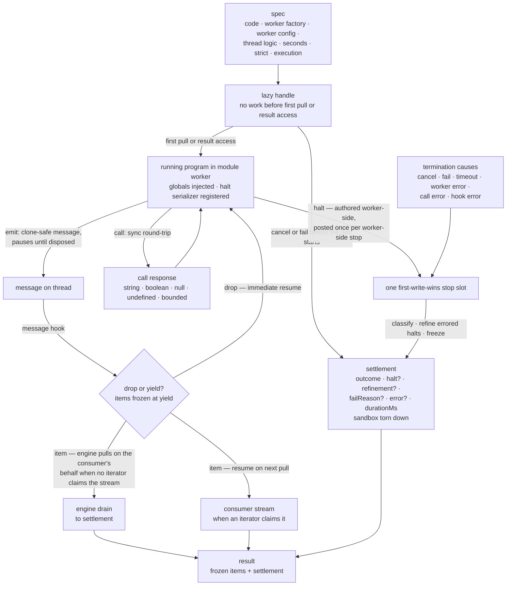

# engine — Architecture & Decisions

Vocabulary: [README.md § Glossary](./README.md). The outcome table and what each
settlement carries: [README.md § How a run ends](./README.md). The downstream
vocabulary — the evaluator kind's settlement each evaluator maps onto:
[evaluators/types.ts](../../evaluators/types.ts) § Settlement.

## Architectural Sketch

> Written Phase 0, before implementation. The Refactor step is held against this
> document — not what the code does, but what shape it takes.

### Execution phases

1. **Lazy handle** (sync) — the factory runs nothing: it assembles a handle
   whose first pull (or result access) starts the run. A cancel or fail before
   the run starts (first pull or result access) settles immediately; no worker
   is ever spawned. Result access starts the run like a first pull; from the
   first item that becomes ready with no consumer iterator in existence, the
   engine drains on the consumer's behalf (phase 3) — `result` always settles.

2. **Sandbox start** (async, first pull or result access) — a module worker is
   spawned via the spec's worker factory (which loads the consumer's thin worker
   entry); readiness is confirmed by handshake; shared memory and the worker
   config are delivered at setup; the consumer's worker logic returns its
   globals (validated as identifiers, loudly, on either path) and optional halt
   serializer; the code is delivered and run via one of two paths selected by
   the spec's `execution` preference — the `'function'` path wraps it in
   `new Function` (globals as parameters, strict per the `strict` preference);
   the `'module'` path runs it as an ES module (globals installed on globalThis,
   always strict — the `strict` preference is inert). A code-level `SyntaxError`
   (an unparseable or uncompilable program) is caught at construction or module
   instantiation on either path and surfaced as a worker-authored throw halt,
   settling `errored` — never a worker-error (which is reserved for environment,
   factory, and setup failures). Environment failures — shared memory
   unavailable, a throwing worker factory — are worker-error terminations with
   the condition in the engine error, never throws; consumer setup failures
   (invalid global keys, a throwing setup, clone-unsafe worker config) settle
   the same way; and an engine-internal defect (a contract-violating value that
   reaches runtime, e.g. a factory returning a non-`Worker`) settles loudly the
   same way, the defect named in the engine error — the engine never hangs and
   never throws.

3. **Streaming** (async, per message) — the running program emits messages one
   at a time under the pause protocol; each is handed to the message hook and
   either dropped (immediate resume) or yielded (frozen at yield; the worker
   resumes on the next pull — the consumer's, or the engine's own when draining
   an unclaimed stream). Synchronous round-trips block the worker until the call
   hook's awaited response is written back over shared memory. Worker-post order
   is preserved — emissions and call requests are serviced FIFO as posted, and a
   call round-trip completes before the worker proceeds (consumer dialog
   patterns — call, then emit carrying the returned value — rely on this). The
   time budget counts only while the worker is unblocked.

4. **Stop** (first writer wins; async on the in-flight-call path) — either the
   worker stops on its own — synchronously at the function path's natural end,
   or asynchronously when the module path's module-evaluation promise fulfills
   (work scheduled beyond the natural end, a pending timer, never runs); a
   rejecting module evaluation reaches the halt author as a throw, exactly like
   a function-path throw; the bootstrap posts exactly one halt either way,
   authored by the consumer's halt serializer or the engine default — or the
   thread stops the run (cancel, fail with payload, timeout, worker crash, call
   error, hook error). The halt and the termination causes claim the same
   first-write-wins slot: exactly one stop settles a run; anything later —
   including after settlement — is a no-op. When a call is in flight, stop
   processing awaits it (discarding the response) before teardown — the one
   async leg of stopping.

5. **Settlement** (sync) — the outcome is classified from structured stop data;
   the refinement hook runs on errored halts; the settlement (outcome, carried
   data, consumed-budget duration) and the items array are frozen; the sandbox
   is torn down — on every path.

### Data flow

### Structural constraints

- **Pause-protocol ordering** (correctness, not style): both flags are armed
  before the message is posted; the event-ready flag is cleared before the pause
  is released; the pause is released before the timer is re-armed; the timer
  handler deducts elapsed budget before consulting the event-ready flag, and
  reschedules only with positive remaining budget. A paused program with a
  pending message is rescheduled rather than timed out while remaining budget is
  positive; an exhausted budget times out even while paused.
- **Stops block** — the termination machine's non-negotiables:
  - Exactly one stop wins: the halt claims the same first-write-wins slot as the
    termination causes; later stop requests — including any after settlement —
    are no-ops.
  - Teardown-without-resume: a stopping run never releases the pause; the worker
    is terminated while still paused.
  - In-flight call servicing is uninterruptible: the engine awaits the call
    hook, DISCARDS the response (no shared-memory write-back), then tears down.
  - A stop wakes any pending pump wait — the wake is unconditional (a sentinel),
    never conditional on queue state.
- **Timer semantics**: the budget arms when the code begins running — spawn,
  handshake, and setup are never charged. The yield charge attaches per yield
  (item pulled — by the consumer, or by the engine when draining), never per
  drop — a dropping high-frequency consumer must not time itself out; drops cost
  only worker-active time. The budget pauses while a yielded item awaits the
  pull and while the call hook runs.
- **The natural end ends the run — on both paths.** Work scheduled beyond it (a
  pending timer) never runs; the module path's asynchronous natural end changes
  when the stop fires, never whether trailing work runs.
- **Freeze at yield; freeze at settlement.** The engine freezes its OWN
  structures — each yielded item, the items array, the settlement object — and
  never deep-freezes consumer payload interiors (halt, refinement, failReason);
  downstream owners deep-freeze their own data (e.g. an evaluator's own deep
  pass).
- **Classification reads structured data only.** Stop kinds, causes, and the
  engine error's cause are discriminated values; the engine never interprets
  consumer payloads — domain knowledge in the engine is the anti-goal.
- **Consumer hooks fail loudly, structurally.** A throwing thread hook is an
  engine-made hook-error termination (a refinement-time throw keeps the halt,
  drops the refinement); a throwing halt serializer is a worker crash; consumer
  setup failures settle as worker-error. The engine surfaces failures as
  settlements, never thrown exceptions.
- **Result always settles — the engine drains an unclaimed stream** (sole
  exception: the abandoned claimed stream, below). The drain engages at the
  engine's first on-behalf pull (an item ready with no consumer iterator in
  existence), never at result access itself. An iterator created before any
  engine pull owns the stream (full backpressure); one created after the
  engine's first pull is the unsupported concurrent case (one stream, silently
  split). The one suspension is an abandoned claimed stream: an iterator created
  and then walked away from — whether or not it ever pulled — holds the run;
  break or cancel is the exit.
- **Worker-post order is preserved.** Emissions and call requests are serviced
  FIFO as posted.
- **Environment failures are settlements, never throws** — shared memory
  unavailable and a throwing worker factory settle as errored with the condition
  in the engine error. Serving the cross-origin isolation headers (COOP/COEP) is
  the host page's responsibility.
- **The engine spawns only what the factory returns.** Worker construction is
  consumer-owned; the engine asserts nothing about the worker at runtime
  (module-vs-classic, adjacency, bundler). A _throwing_ worker factory is a
  worker-error settlement; a factory returning a non-`Worker` is a consumer-side
  type error (it lands on the internal-defect path if it reaches runtime). The
  adjacency and `{ type: 'module' }` requirements are consumer obligations,
  doc-enforced (§ Why this design → Module workers), never type-enforced — a
  branded wrapper to enforce them would be the forbidden re-splitting helper.
- **The sandbox is torn down on every path.**

### Out of scope

- Instrumentation and every non-time limit (iteration counts, step budgets,
  domain rules) — the evaluators own them; the engine transports their halt
  payloads and refinements opaquely.
- Payload vocabularies: NM events, categories, whitelists — consumer logic on
  either side of the boundary.
- Gates and refusal — downstream concerns (the evaluators region's: embody's
  evaluation-phase gate and an evaluator's refusal-as-data both fire before the
  engine is ever invoked).
- Deep-freezing consumer payloads — downstream owners freeze their own data
  (e.g. an evaluator's own deep pass).
- Replay by re-iterating a settled handle — the result's items array is the
  cache; each evaluate call is a fresh run.
- Inferring the execution path from the code — the engine never sniffs for
  `import`/`export`; path selection is consumer-owned (the consuming lens maps
  the snippet type onto the axis).
- COOP/COEP hosting headers; caching; per-run indexes; derived analytics;
  rendering and pedagogy.

## Why this design

### Module workers, thin per-consumer entries

Module workers make the worker-side protocol a single typed, directly-testable
module — the blob-URL alternative forces the protocol to be inlined as
duplicated worker-script strings, which is exactly the drift this engine exists
to end. Each consumer ships a thin worker entry (a few lines wiring the engine's
bootstrap to that consumer's worker logic) rather than receiving modules
dynamically: bundlers stay static, and heavy instrumentation that registers
itself at module load ships only into the runs that use it. Dynamic module
delivery is rejected — it has no pedagogical case and real bundler risk. (The
rejection covers consumer LOGIC modules; the learner's program arriving as an ES
module on the `'module'` execution path is the execution axis at work, not
dynamic logic delivery.)

The spec carries a **worker factory** (`() => Worker`), not a worker URL,
because the consumer — not the engine — must own the `new Worker(new URL(...))`
expression. webpack 5's static worker detection only emits a real worker chunk
when `new Worker(new URL('./entry.ts', import.meta.url), { type: 'module' })` is
ONE syntactically adjacent expression in the consumer's module; the older
URL-in-the-spec form split that across modules (the consumer built the URL, the
engine's `transport.ts` did the `new Worker`) and webpack emitted the entry as a
raw `.ts` asset that crashes at load. Vite resolves the split — which is why
this hid behind green browser tests until a real `npm run build` exposed it. The
factory keeps the URL a static literal, so "bundlers stay static" still holds.

Two consequences are deliberate. **(1) The duplicated adjacent
`new Worker(new URL(...), { type: 'module' })` across consumers is
load-bearing.** A centralizing helper (`moduleWorker(url)`) would move the
`new Worker` into the helper's module — re-splitting it from the consumer's
`new URL` and re-breaking webpack. Do NOT DRY it up. **(2) The engine no longer
guarantees `{ type: 'module' }`** — a consumer that omits it gets a classic
worker whose ESM imports fail. Neither constraint is type-enforceable
(`() => Worker` can't encode the options, and a branded wrapper to enforce them
is exactly the forbidden helper), so the guard is documentation by necessity —
see the `workerFactory` JSDoc and README § Public API.

### Fully opaque items

The engine's only payload constraint is structured-clone safety. Event
vocabularies, whitelists, and category filtering are consumer logic — the engine
is tested once, generically, and the anti-goal is any engine code that
interprets a payload. What an evaluator emits as an event is, here, an opaque
item.

### Time is the engine's only limit

Time cannot be enforced from inside the evaluated program; every other limit can
— injected loop guards, advice counters. So the engine owns the budget and the
termination machine, and every other limit lives in instrumentation, classified
worker-side (inside the halt serializer) and refined thread-side (the refinement
hook). The budget measures the learner's program, not the learner: it pauses
during yield-waits (think time on a step) and call servicing (styled dialogs),
and a flat per-yield charge keeps render-bound loops finite in wall-clock terms.
The five generic outcomes stay generic for the same reason — limit-exceeded is a
downstream interpretation of an errored halt plus a refinement, not an engine
concept.

### Worker-side halt authoring

The halt payload is authored in the worker, by the consumer's halt serializer,
on every worker-side stop — natural end included. Attribution that exists only
worker-side (a node path stamped on an error as it propagates) and the
classification of non-Error throws survive the clone boundary because the
payload is built where they live. Limit classification happens in the same
place: only the worker logic knows its own limit-throw shape, so the engine
never has a limit kind, the thread never matches message strings, and an
unguarded learner RangeError can never be misclassified as an instrumentation
limit. Natural ends pass through the same author, which is how worker-only run
metrics (iteration counts) reach completed settlements.

### A fake transport with honestly-scoped conformance

Consumer logic is pure given the engine's two-sided API, so consumer logic tests
bottom-up in Node against the engine-shipped fake transport. The fake
structured-clones every payload — clone-safety violations surface in cheap unit
tests, not in a browser. Two conformance tiers keep the fake honest about what
it can and cannot prove: the agnostic suite runs against the real transport AND
the fake (logic, drop-vs-yield, settlement classification), while the transport
suite is real-only (Atomics blocking, pause ordering, payload ceiling, timer
behavior). A green fake is evidence for logic, never for transport fidelity.

### Lazy pull, draining result

Handle construction does no work: the worker spawns on the first pull or result
access. Cancel-or-fail before the run starts settles without ever spawning;
breaking out of a `for await` routes through the termination machine exactly
like cancel; and a `result` awaited without an iterator drains engine-side to
settlement — so no consumer ergonomic can leak a worker or hang a promise.
Laziness governs when the run starts; the drain governs who pulls after — two
orthogonal axes, both engine-owned. The drain lives in the engine, not in a
wrapper above it, because a settling `result` is critical behavior: any consumer
of the standalone module needs it, evaluator or not.
