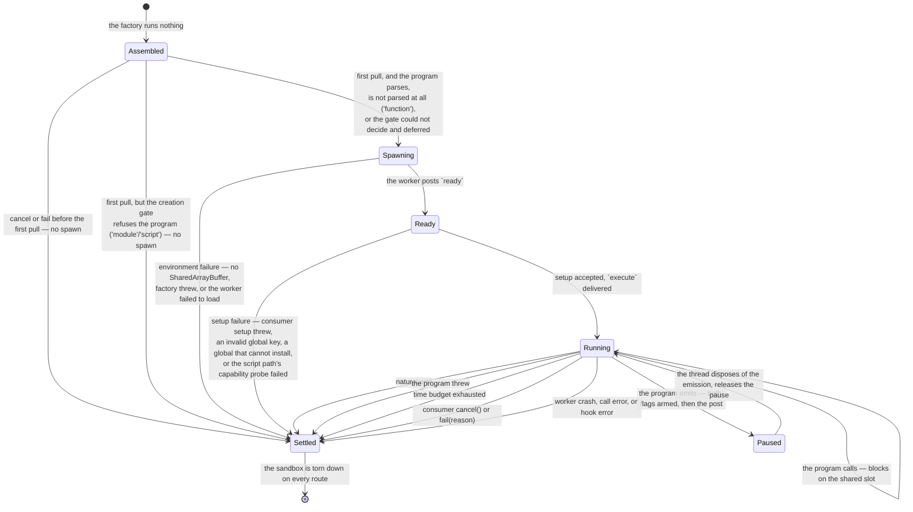

# The engine machine

The notional machine of the evaluation engine — the operational model to predict
against when reasoning about how a program actually runs here.
[README.md](./README.md) says what the engine is and states its public contract;
[DOCS.md](./DOCS.md) constrains its structure; this document models how the
machine runs, so that "what will this program do to this engine, and what will
the engine say about it?" is answerable in advance.

This models **the engine on its own terms**, as though nothing were built on top
of it. Layers above are free to simplify or black-box any of it for their own
readers; that is their business, not this document's.

**Pedagogy is not decided here.** This document describes what the machine does;
lenses choose what to teach. The contract is accuracy — § Predictions is written
to be falsifiable.

## The machine at a glance

The engine is a **two-realm machine**. A run is one program, executed once, in a
disposable sandbox torn down on every exit path. The thread side holds the run;
the worker side holds the program. They share exactly two channels: a
`postMessage` queue carrying emissions and call requests in FIFO order, and one
fixed 8192-byte `SharedArrayBuffer` carrying call responses and the
pause/event-ready flags.

Nothing runs at construction. The factory assembles a handle; the sandbox is
spawned on the first pull, and a cancel or failure before that settles without
spawning anything at all. On the two paths the machine parses — `'module'` and
`'script'` — the parse also happens before the spawn, so a program the parser
REFUSES settles without a sandbox ever existing.

## States and transitions

The machine settles **exactly once** — the thread takes the first event that
ends the run and discards the rest. Every route into `Settled` tears the worker
down, including the ones that never reached `Running`.

## The two realms

The worker boundary is a **realm** boundary: each side has its own global
object, and they are not the same object.

This is the most consequential fact about the machine, because **the program
runs in the worker realm and shares its global object with the engine's own
worker-side code.** The thread realm is unreachable from the program, so the
same expression is safe on one side of the boundary and exposed on the other.

What reaches the engine is narrower than it first looks, and worth stating
precisely because it is easy to get backwards:

| the program writes                          | reaches the engine's globals?                                                                                                                                            |
| ------------------------------------------- | ------------------------------------------------------------------------------------------------------------------------------------------------------------------------ |
| `var URL = 1` on the `'module'` path        | **no** — module-scoped                                                                                                                                                   |
| `var URL = 1` on the `'function'` path      | **no** — a local of the wrapper                                                                                                                                          |
| `var URL = 1` on the `'script'` path        | **yes** — a script's top-level `var` becomes a property of the global object, strict or not                                                                              |
| `let URL = 1` on the `'script'` path        | **yes, for name resolution** — it joins the realm's global lexical environment, which the engine's own modules resolve free names through; `globalThis.URL` is untouched |
| `globalThis.URL = 1`, or a bare `URL = 1`   | **yes**, on every path, strict or not — `URL` is already a global property, and strictness governs assignment only to _undeclared_ names                                 |
| `zzz = 1` — an undeclared name              | **yes**, wherever the code is sloppy — which now means `'script'` BY DEFAULT, as well as `'function'` with `strict: false`. Strict code throws `ReferenceError` instead  |
| `Atomics.store = …` — mutating an intrinsic | **yes**                                                                                                                                                                  |

So on `'module'` and `'function'` an ordinary top-level declaration is harmless:
reaching the engine there takes an explicit write to the global object, or a
mutation of a shared intrinsic. **On `'script'` that changes, twice over.** A
declaration a learner would write in any ordinary file lands in the engine's own
resolution path; and because nothing is prepended, `'script'` is the only path
where an _undeclared_ name reaches the engine without the consumer having chosen
sloppy mode. That is why the latch below is a precondition of this path rather
than a hardening of it.

Rows are measured or reasoned, and the difference is worth keeping. Exactly one
was run against a browser: `var` on the `'script'` path, which is the row the
whole latch rule answers. Every other row follows from the language's own rules
— the two `var` rows above it trivially, the `let` row from the order in which a
realm resolves a free name, the undeclared-name row from what an unresolvable
assignment does in sloppy code.

### What the machine does about it

**Every ambient global the engine resolves in the worker realm is latched** —
captured at module load, before any program can run, and read from that capture
afterwards. The thread realm is left live.

The rule is mechanical on purpose. A narrower rule — latch only what can run
after the program starts — is smaller and correct today, but it must be
re-derived every time the worker side changes, and what it guards is silent: an
unlatched read does not crash. It costs the engine its **ability to post a
halt**, so the run burns its time budget and the program's author is told an
instantly-finishing program was too slow. A wrong answer about the program is a
worse failure than a crash, and a rule that cannot be got wrong by omission is
worth the extra bindings.

The `'script'` path is the strongest case for that mechanical form. On the other
two paths the exposure needs a learner to write to the global object on purpose;
on `'script'` it needs only an ordinary declaration. A per-site reachability
argument would have had to be re-derived the moment a third path arrived — this
one did not.

Latching fixes the **binding**, not the object. It survives a rebound global,
and capturing a callable rather than its namespace also survives a mutated
namespace — but an engine and a program sharing a realm share the intrinsics,
and no capture defends against that. The `instanceof Error` checks in halt
authoring stay open to a redefined `Error[Symbol.hasInstance]`; that residual is
named, not covered.

Two boundaries on the guarantee:

- **Consumer worker logic latches its own.** `setup`, `serializeHalt` and the
  injected globals all run worker-side, and `serializeHalt` runs on every stop —
  after the program. The engine latches the engine's resolutions.
- **The threat model is accidental shadowing, not an attacker.** A program owns
  its realm; it can re-enter the message handler and confuse its own run in ways
  no capture prevents. What the rule guarantees is that ordinary shadowing never
  becomes a wrong answer about the program.

## The three execution paths

The machine runs a program one of three ways. The path is the consumer's to
choose and is never sniffed from the code:

- **`'module'`** is genuine. The injected globals install on `globalThis`, the
  code runs as a real ES module via a blob-URL dynamic import, and the natural
  end is asynchronous.
- **`'script'`** is genuine. The injected globals install on `globalThis`, the
  code runs as a real Script Record via `importScripts` on a blob URL, and the
  natural end is synchronous. Top-level `var` reaches the global object,
  top-level `this` IS `globalThis`, there is no `arguments` binding, a hashbang
  runs, and a top-level `return` or `new.target` is the syntax error the
  language says it is. Nothing is prepended, so the program is sloppy unless its
  own first line says otherwise. **It runs only in a classic worker**, because
  only a classic worker can call `importScripts` — so today it runs under
  webpack and not under Vite dev or the vitest browser project, both of which
  produce module workers. A mismatch is caught by a capability probe at setup
  and settles the run rather than failing inside the program.
- **`'function'`** is a **simulation**. The code becomes a function body with
  the injected globals as parameters. Top-level `var` and function declarations
  become locals; a top-level `return` is legal where a real script would be a
  syntax error; and a `"use strict"` line is prepended unless the consumer
  disables it. The natural end is synchronous.

The machine states the gap rather than hiding it: a script-goal program posed on
`'function'` gets function-body semantics, not script semantics — and `'script'`
is the path that closes it. `'function'` remains the default, so the gap is now
something a consumer opts out of rather than something it is given.

### The creation gate

Two of the three paths are parsed before anything is spawned. `'module'` and
`'script'` go through the machine's **creation gate** — acorn, on the thread, on
the module goal and the script goal respectively — so a program the parser
REFUSES never reaches a sandbox: no worker is constructed, and the stop is
authored on the thread carrying `phase: 'creation'`. `'function'` is not parsed;
the `new Function` construction is its own gate, and its failures are already
`'creation'`.

A gate that cannot decide **defers**. Where the parser fails without reaching a
verdict — acorn exhausting its own call stack — the machine abstains and runs
the program anyway, because a gate's failure mode is refusing something that
would have worked. Such a program usually fails in the worker instead, in the
host's own parser and inside the budget, which is a better answer than the
machine's.

The gate runs **synchronously, on whichever thread called `evaluate`**, and is
not charged to the time budget — the budget arms when the code begins running,
and on a refused program it never does, so such a settlement reports
`durationMs: 0`. The machine's "it never hangs on its own account" promise
covers the run; the parse sits just outside it, on measurement rather than on
principle (~0.34ms for 500 lines, against a ~22.8ms mean spawn).

The gate reads the program. It does not read it to decide **how** to run it —
that stays the consumer's choice — only to decide whether the program the
consumer posed can parse on the goal it was posed as. And the grammar it applies
is acorn's, which is a hair narrower than any one host's: a construct acorn
rejects is out of bounds on this machine even where a particular browser would
have run it.

## What the machine never does

- **It never throws at its caller.** Environment failures, consumer setup
  failures and halt-serializer failures are all settlements.
- **It never hangs on its own account.** The one sanctioned suspension is the
  consumer's: claim the stream and walk away, and the run is held like any
  abandoned generator holding a resource — `break` or `cancel()` is the exit.
- **It never reuses a worker.** One worker is one run's disposable instance
  state.
- **It never infers the execution path from the code.** It reads the code, at
  the creation gate, only to answer whether it parses on the path it was already
  given. Choosing the path stays the consumer's.
- **It never rewrites the learner's source, with exactly one exception**: the
  `"use strict";` prefix the `'function'` path adds when the consumer asks for
  it. That is the complete set. The `'module'` and `'script'` paths deliver the
  program's bytes unchanged.
- **It never truncates a call response.** An over-ceiling payload throws a
  `RangeError` naming the ceiling and the actual size, leaving the buffer
  untouched.
- **It never posts more than one halt.**

## Predictions worth making

Each row is a prediction the model above should let you make before running
anything, and each is checkable.

| the program does                                   | the machine answers                                                                                                                                                                                                      |
| -------------------------------------------------- | ------------------------------------------------------------------------------------------------------------------------------------------------------------------------------------------------------------------------ |
| `var x = 1`, `'module'` or `'function'`            | `globalThis.x` is untouched — module-scoped on one, wrapper-local on the other                                                                                                                                           |
| `var x = 1`, `'script'`                            | `globalThis.x === 1` — a real script's top-level `var` is a global property, and strictness does not change that                                                                                                         |
| top-level `this`, `'script'`                       | it IS `globalThis`, where the `'function'` path under the default `strict: true` gives `undefined`                                                                                                                       |
| top-level `arguments`, `'script'`                  | a `ReferenceError` — there is no binding, where `'function'` hands back the wrapper's own, carrying the engine's injected globals                                                                                        |
| `#!/usr/bin/env node` on line 1, `'script'`        | runs — a hashbang is part of the script grammar. On `'function'` it is a `SyntaxError`                                                                                                                                   |
| `globalThis.postMessage = null`, `'module'`        | the halt still posts — the engine latched it. Unlatched, this settles `timed-out` for a program that finished                                                                                                            |
| `return 1` at top level, `'function'`              | runs — it is a function body                                                                                                                                                                                             |
| `return 1` at top level, `'module'` or `'script'`  | the creation gate refuses it before anything spawns: `errored`, phase `'creation'`, and the worker factory is never invoked                                                                                              |
| a program the gate REFUSES, `'module'`/`'script'`  | the same — no sandbox is constructed, and the stop payload is the engine's own, not the consumer's `serializeHalt`'s. `haltOrigin` reads `'engine'`; on every other stop that carries a halt it reads `'worker'`         |
| 60,000 nested parens, `'script'`                   | the gate ABSTAINS — acorn exhausts its own call stack and decides nothing, so the program runs and the worker's own parser reports the error, inside the budget, with `haltOrigin: 'worker'`                             |
| throws on line 3, `'module'` or `'script'`         | phase `'evaluation'` — it parsed at the gate, so the failure is genuinely at run time                                                                                                                                    |
| `import './nope.js'`, `'module'`                   | phase `'evaluation'` — an unresolvable specifier parses fine and fails at link, and the single-stage import gives no link/run boundary. One of the three things the gate cannot report                                   |
| `let NaN = 1;`, `'script'`                         | it PASSES the gate, then fails as the script is instantiated, so it reports phase `'evaluation'`. No static parser sees this — it depends on the live global object — and the divergence is a label, never a refusal     |
| an infinite loop                                   | the time budget fires and the worker is terminated mid-instruction; the budget counts only while the worker is unblocked                                                                                                 |
| emits in a tight loop                              | each emission pauses the program until the thread disposes of it, and each **yield** deducts the yield charge — drops are not charged, and a consumer that yields at every step waives the fee with `yieldCharge: false` |
| redefines a consumer-injected global, `'module'`   | it wins — they install `configurable: true` and the engine does not defend them                                                                                                                                          |
| redefines a consumer-injected global, `'function'` | it shadows a parameter; `configurable` does not apply, and nothing outside the wrapper changed                                                                                                                           |
| `var emit = 1` over an injected global, `'script'` | it OVERWRITES the global property — the consumer's own closure over that value still works, but the program has lost the name                                                                                            |
| `let emit = 1` over an injected global, `'script'` | it SHADOWS in the global lexical environment: the bare name no longer reaches the injected global, while `globalThis.emit` still does. Legal only because the globals install `configurable: true`                       |

## Navigation

- [README.md](./README.md) — what the engine is, its public API and glossary
- [DOCS.md](./DOCS.md) — the architectural sketch and structural constraints
- [worker/README.md](./worker/README.md) — the realms, file by file, and the
  latch rule
- [worker/DOCS.md](./worker/DOCS.md) — the wire protocol and its ordering rules
