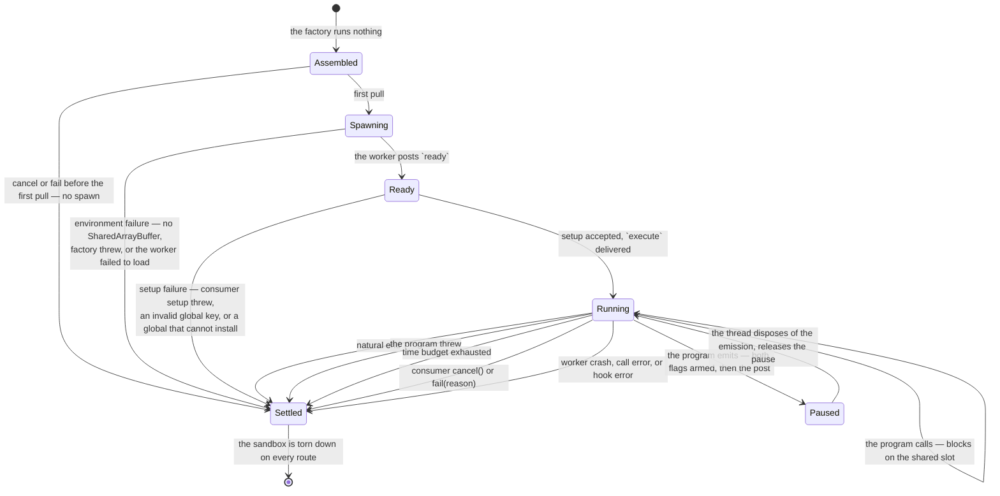

# The engine machine

The notional machine of the evaluation engine — the operational model to predict
against when reasoning about how a program actually runs here.
[README.md](./README.md) says what the engine is and states its public contract;
[DOCS.md](./DOCS.md) constrains its structure; this document models how the
machine runs, so that "what will this program do to this engine, and what will
the engine say about it?" is answerable in advance.

This models **the engine on its own terms**, as though nothing were built on top
of it. Layers above are free to simplify or black-box any of it for their own
readers; that is their business, not this document's.

**Pedagogy is not decided here.** This document describes what the machine does;
lenses choose what to teach. The contract is accuracy — § Predictions is written
to be falsifiable.

## The machine at a glance

The engine is a **two-realm machine**. A run is one program, executed once, in a
disposable sandbox torn down on every exit path. The thread side holds the run;
the worker side holds the program. They share exactly two channels: a
`postMessage` queue carrying emissions and call requests in FIFO order, and one
fixed 8192-byte `SharedArrayBuffer` carrying call responses and the
pause/event-ready flags.

Nothing runs at construction. The factory assembles a handle; the sandbox is
spawned on the first pull, and a cancel or failure before that settles without
spawning anything at all.

## States and transitions

The machine settles **exactly once** — the thread takes the first event that
ends the run and discards the rest. Every route into `Settled` tears the worker
down, including the ones that never reached `Running`.

## The two realms

The worker boundary is a **realm** boundary: each side has its own global
object, and they are not the same object.

This is the most consequential fact about the machine, because **the program
runs in the worker realm and shares its global object with the engine's own
worker-side code.** The thread realm is unreachable from the program, so the
same expression is safe on one side of the boundary and exposed on the other.

What reaches the engine is narrower than it first looks, and worth stating
precisely because it is easy to get backwards:

| the program writes                          | reaches the engine's globals?                                                                                                            |
| ------------------------------------------- | ---------------------------------------------------------------------------------------------------------------------------------------- |
| `var URL = 1` on the `'module'` path        | **no** — module-scoped                                                                                                                   |
| `var URL = 1` on the `'function'` path      | **no** — a local of the wrapper                                                                                                          |
| `globalThis.URL = 1`, or a bare `URL = 1`   | **yes**, on both paths, strict or not — `URL` is already a global property, and strictness governs assignment only to _undeclared_ names |
| `zzz = 1` — an undeclared name              | only in sloppy code, which means the `'function'` path with `strict: false`; strict mode throws `ReferenceError`                         |
| `Atomics.store = …` — mutating an intrinsic | **yes**                                                                                                                                  |

So an ordinary top-level declaration is harmless on both shipped paths. It takes
an explicit write to the global object, or a mutation of a shared intrinsic.

### What the machine does about it

**Every ambient global the engine resolves in the worker realm is latched** —
captured at module load, before any program can run, and read from that capture
afterwards. The thread realm is left live.

The rule is mechanical on purpose. A narrower rule — latch only what can run
after the program starts — is smaller and correct today, but it must be
re-derived every time the worker side changes, and what it guards is silent: an
unlatched read does not crash. It costs the engine its **ability to post a
halt**, so the run burns its time budget and the program's author is told an
instantly-finishing program was too slow. A wrong answer about the program is a
worse failure than a crash, and a rule that cannot be got wrong by omission is
worth the extra bindings.

Latching fixes the **binding**, not the object. It survives a rebound global,
and capturing a callable rather than its namespace also survives a mutated
namespace — but an engine and a program sharing a realm share the intrinsics,
and no capture defends against that. The `instanceof Error` checks in halt
authoring stay open to a redefined `Error[Symbol.hasInstance]`; that residual is
named, not covered.

Two boundaries on the guarantee:

- **Consumer worker logic latches its own.** `setup`, `serializeHalt` and the
  injected globals all run worker-side, and `serializeHalt` runs on every stop —
  after the program. The engine latches the engine's resolutions.
- **The threat model is accidental shadowing, not an attacker.** A program owns
  its realm; it can re-enter the message handler and confuse its own run in ways
  no capture prevents. What the rule guarantees is that ordinary shadowing never
  becomes a wrong answer about the program.

## The two execution paths

The machine runs a program one of two ways. The path is the consumer's to choose
and is never sniffed from the code:

- **`'module'`** is genuine. The injected globals install on `globalThis`, the
  code runs as a real ES module via a blob-URL dynamic import, and the natural
  end is asynchronous.
- **`'function'`** is a **simulation**. The code becomes a function body with
  the injected globals as parameters. Top-level `var` and function declarations
  become locals; a top-level `return` is legal where a real script would be a
  syntax error; and a `"use strict"` line is prepended unless the consumer
  disables it. The natural end is synchronous.

The machine states the gap rather than hiding it: a script-goal program posed on
`'function'` gets function-body semantics, not script semantics. No third path
is ratified.

## What the machine never does

- **It never throws at its caller.** Environment failures, consumer setup
  failures and halt-serializer failures are all settlements.
- **It never hangs on its own account.** The one sanctioned suspension is the
  consumer's: claim the stream and walk away, and the run is held like any
  abandoned generator holding a resource — `break` or `cancel()` is the exit.
- **It never reuses a worker.** One worker is one run's disposable instance
  state.
- **It never infers the execution path from the code.**
- **It never truncates a call response.** An over-ceiling payload throws a
  `RangeError` naming the ceiling and the actual size, leaving the buffer
  untouched.
- **It never posts more than one halt.**

## Predictions worth making

Each row is a prediction the model above should let you make before running
anything, and each is checkable.

| the program does                                   | the machine answers                                                                                                                                                                                                      |
| -------------------------------------------------- | ------------------------------------------------------------------------------------------------------------------------------------------------------------------------------------------------------------------------ |
| `var x = 1`, either path                           | `globalThis.x` is untouched — module-scoped on `'module'`, wrapper-local on `'function'`                                                                                                                                 |
| `globalThis.postMessage = null`, `'module'`        | the halt still posts — the engine latched it. Unlatched, this settles `timed-out` for a program that finished                                                                                                            |
| `return 1` at top level, `'function'`              | runs — it is a function body                                                                                                                                                                                             |
| `return 1` at top level, `'module'`                | rejects at import; the halt carries phase `'evaluation'`                                                                                                                                                                 |
| throws on line 3, `'module'`                       | phase `'evaluation'` — the single-stage import gives no parse/link/run boundary                                                                                                                                          |
| an infinite loop                                   | the time budget fires and the worker is terminated mid-instruction; the budget counts only while the worker is unblocked                                                                                                 |
| emits in a tight loop                              | each emission pauses the program until the thread disposes of it, and each **yield** deducts the yield charge — drops are not charged, and a consumer that yields at every step waives the fee with `yieldCharge: false` |
| redefines a consumer-injected global, `'module'`   | it wins — they install `configurable: true` and the engine does not defend them                                                                                                                                          |
| redefines a consumer-injected global, `'function'` | it shadows a parameter; `configurable` does not apply, and nothing outside the wrapper changed                                                                                                                           |

## Navigation

- [README.md](./README.md) — what the engine is, its public API and glossary
- [DOCS.md](./DOCS.md) — the architectural sketch and structural constraints
- [worker/README.md](./worker/README.md) — the realms, file by file, and the
  latch rule
- [worker/DOCS.md](./worker/DOCS.md) — the wire protocol and its ordering rules
