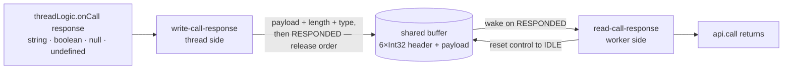

# engine/worker — Architecture & Decisions

Vocabulary: [../README.md § Glossary](../README.md). The engine-level
constraints this layer serves (pause ordering, the Stops block):
[../DOCS.md § Structural constraints](../DOCS.md).

## The wire

Emits and call requests ride `postMessage` (FIFO, order-preserving); only the
**call response** rides the shared buffer — a fixed 8192-byte SharedArrayBuffer:
a six-slot Int32 control header, then an 8168-byte UTF-8 payload area. The
layout facts (total size, six-slot header, payload at byte 24) are ported from
the old intercept engine's protocol; the payload ceiling and its bounds check
are new — the old engines wrote the payload area unbounded.

## Data flow



## Constraints (correctness, not style)

- **Release ordering**: every data write (payload bytes, byte length, type code,
  value flag) lands before the control slot flips to RESPONDED. The worker wakes
  on the signal and must observe a complete response.
- **Bounds check before any store**: an over-ceiling response throws a
  RangeError naming the ceiling and the actual size and leaves the buffer
  untouched — no partial writes, no silent truncation. Measurement is in ENCODED
  bytes, never characters.
- **Read resets the channel**: decoding stores IDLE back to the control slot so
  the next round-trip starts clean — the channel is reusable within a run.
- **Untouched means zero**: a freshly created buffer is all zeros; the
  protocol's signal values are chosen so zero is the idle/default state of every
  slot.
- **Capture the callable, not the namespace**: a namespace capture is defeated
  by a mutated intrinsic, a callable capture is not. Where a callable needs its
  receiver it is captured together with the object that carries it — the
  `addEventListener` on the worker global is the site where that applies.
- **The worker-realm import graph is static and acyclic**: that absence of
  cycles is what makes every capture bound before the execute turn. A cycle, or
  a worker-realm module reached only by dynamic import, is out of contract. The
  learner's program is not part of this graph on any path — it arrives as a blob
  the engine imports or `importScripts`es at execute time, which is exactly why
  the captures must already be bound by then.
- **Latches are module-private**: no capture crosses a module boundary, so none
  appears in [../types.ts](../types.ts) or [types.ts](./types.ts).

## Latching

Every ambient global a worker-realm module reads is bound once, at module scope,
in the file that reads it; every later read goes through that binding. The rule
itself, the realm model it rests on, its threat model, the per-module capture
sets and the residuals it does not close all live in
[README.md § Realms](./README.md#realms). What this section owes is the
structure a correct implementation must take: when captures are bound, what
makes a module verifiably compliant, and how far that verification reaches.

### Capture order

The rule buys nothing unless every capture is already bound when the program's
first instruction runs. Two independent facts guarantee that, and neither one
alone is load-bearing:

- **A module graph evaluates before its importer's body runs.** The worker entry
  cannot begin until every module it imports has fully evaluated, so every
  capture is bound before the entry's first statement. This is why captures may
  sit below main with the other module constants: evaluation order fixes them,
  not their position in the file.
- **A program only ever runs from a later message turn.** The entry registers
  the message handler and posts the ready signal; a program reaches the realm
  only on an execute message, which is a separate task. Nothing a program does
  interleaves with module evaluation.

```mermaid
sequenceDiagram
    participant G as the worker module graph
    participant E as the engine's worker side
    participant P as the program
    G->>G: evaluate each worker-realm module — every global it reads is captured
    G->>E: the entry hands the consumer's worker logic to the engine
    E-->>E: the message handler is registered; ready is posted
    Note over G,E: every capture is bound before the execute turn below
    E->>P: the execute turn starts the program
    P-->>P: rebinds worker-realm globals — accidental shadowing
    loop while the program runs, and again after it ends
        P->>E: emits, calls, ends, or throws
        E->>E: reads only its captures — never the rebound globals
    end
```

The loop is the point. Engine reads are interleaved with the program, not queued
behind it. An emission pauses and posts mid-run. The module path's blob revoke
and halt post land on a LATER turn, after evaluation settles; the script path's
land on the SAME turn, because `importScripts` is synchronous and returns into
the engine's own frame. Both orderings are covered by the same rule, which is
the point of stating it as a rule: every one of those reads happens in a realm
the program has already had the chance to edit, whether or not a turn boundary
separates them.

### What counts as compliant

Compliance has two halves, and they are verified by different instruments. A
reader who conflates them will believe the audit checks more than it does.

**Placement — mechanized, and exhaustive.** A worker-realm module places its
captures correctly when it makes **no value reference to an ambient name from
inside a function body**. Every ambient name it uses resolves at module scope;
every function reads a module-scope binding. The predicate is mechanical rather
than an argument about which reads a program could reach: it discharges an
already-compliant module with no special case, and it catches a future edit that
reaches for a fresh global inside a function on the day that edit lands.

One name is exempt and only one. `undefined` is read free but cannot be rebound
— its global property is non-writable and non-configurable — so reading it live
is never a defect. Every other ambient name read here is a writable global
property, `globalThis` included.

**Granularity — what each capture is _of_.** Placement says nothing about this.
A namespace capture and a callable capture are indistinguishable to any
predicate over identifier references, because both mention the same name at
module scope. Granularity is therefore checked separately, by asserting the
_shape_ of each capture's initializer: a name whose later use is a call is
captured through a member expression, never as the bare namespace object.

**How far verification reaches.** Only a minority of the captured set is
reachable by a program after it starts, so the behavioral tier can discriminate
a correct capture from a broken one for those names alone. Every other captured
name is resolved strictly before the program runs, and for those the structural
checks above are the _only_ instrument — which is why granularity is mechanized
rather than left to review.

### Standing with the module-load convention

The repo convention is that
[nothing executes at module load](../../../../../AGENTS.principal.md#critical-conventions).
A capture takes the same exemption this directory's codec singletons already
take, and for a comparable reason: it is a read whose correctness _is_ its
timing — taken later it is not the same value, and taking it here is what makes
every later read answerable. Those singletons state their reason in place and
are the shape to follow. A global whose only read already sits at module scope
is already compliant and takes no second binding.

## Why a typed module, not an inlined script

The old engines duplicated the worker-side read logic inside generated
worker-script strings because Blob-URL workers cannot import modules. Module
workers make this layer a single typed, directly-testable module — ending that
duplication is part of why the engine exists
([../DOCS.md § Why this design](../DOCS.md)).
