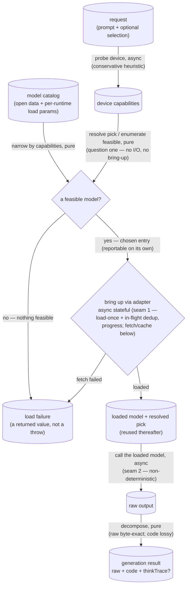

# local-llm — Architecture & Decisions

Vocabulary: [README.md § Ubiquitous language](./README.md). The refusal map and
the local-only invariant: [README.md § Edge cases](./README.md). The
dependency-direction exemplar this module follows (own your contract; consumers
re-map): [`../engine/DOCS.md`](../engine/DOCS.md).

## Architectural Sketch

> Written Phase 0, before implementation. The Refactor step is held against this
> document — not what the code does, but what shape it takes.

The module answers two questions — _what can this device run?_ and _given a
model, run it_ — split by one internal seam: a **pure selection core** (capability
match, feasibility, selection, decomposition) and an **impure lifecycle** (a
stateful loader and a non-deterministic model call). The pure core answers
question one on its own — it reports the feasible set, or the single chosen entry,
with no I/O and no bring-up — so the loader is the one verb that crosses the seams.
The sketch's point is to keep those two impure points on the far side of a seam so
the rest is data-in, data-out, and the host's injected backends are the only thing
that touches a network or a GPU.

## Execution phases

1. **Capability probe** (async, device-boundary read) — input: the device;
   output: a device-capabilities profile. A **conservative heuristic** — WebGPU
   presence and its adapter's buffer limits, a coarse memory bucket, storage
   headroom, WASM features — never an exact resource readout (the browser does not
   expose total VRAM). Injectable, so the pure phases below test without a real
   device.

2. **Feasibility & selection** (sync, pure) — input: device capabilities + the
   catalog + an optional preference; output: a chosen catalog entry, or
   nothing-feasible. Narrows the catalog to what the device can bring up on a
   _registered_ runtime, then picks: an explicit named model if feasible, else the
   **cost-aware default** rung (which weighs the one-time download, not the largest
   that fits). An explicit named preference is first checked for **catalog
   membership** — absent ⇒ a precondition throw (a programmer error), _before_ any
   feasibility reasoning; present-but-infeasible ⇒ the nothing-feasible value, kept
   distinct. This pure result is **reportable on its own** — the feasible set or
   the chosen entry — answering question one without a bring-up; the loader
   consumes the same selection. No I/O, no model.

3. **Model bring-up** (async, stateful — seam 1, load-once) — input: a chosen
   entry + the registered adapters; output: a loaded model, or a load failure.
   Drives fetch-once / load-once-reuse through the entry's runtime adapter,
   browser-first; concurrent bring-ups of one model share a single in-flight load;
   the one-time fetch reports progress; a failed fetch is a returned failure, not a
   throw. The fetch/cache/run mechanics sit below this seam — the backend's.

4. **Generation & decomposition** (async — seam 2, the model call; then sync,
   pure) — input: a prompt + a loaded model; output: a decomposed generation
   result. The model call is the only non-reproducible point (the same prompt may
   differ). Decomposition then separates the reply into byte-exact raw, an
   extracted code part (a lossy parse — a fence-miss falls back to the raw), and an
   optional reasoning trace — separation only, never validation.

## Data flow

The two load-failure causes — nothing-feasible (selection-time, pure) and
fetch-failed (load-time, impure) — converge on one returned failure state. An
unknown model name is not on the diagram: it is a precondition throw, not a data
state (see constraints).

## Structural constraints

- **The two seams are the only impure points** (load-bearing): the stateful loader
  (chosen entry → loaded model, load-once + in-flight dedup) and the
  non-deterministic model call (loaded model → raw output). Capability matching,
  feasibility, selection, and decomposition are pure given the injected probe and
  adapters. Decomposition never reaches the model.
- **The generator never judges.** No validation, conformance, or gating runs here;
  `raw` is byte-exact and `code` is a best-effort lossy parse. Any cleaning of
  `raw` would be a defect.
- **Failure is a value, not a throw.** Both load-failure causes converge on one
  returned failure; the lone throw is a precondition, evaluated _before_
  feasibility — an unknown model name (absent from the catalog) is a programmer
  error, fail-loud, kept distinct from a named-but-infeasible model (which is the
  nothing-feasible value).
- **No-WebGPU is not an automatic refusal.** A registered CPU/WASM runtime with a
  feasible tiny model still loads; only an empty feasible set across _all_
  registered runtimes refuses.
- **Selection is cost-aware by construction.** The default pick weighs the one-time
  download and never auto-selects the largest feasible model; the resolved pick is
  always reported, so the heuristic is never a black box.
- **The catalog is data.** The open set grows by editing data, never by changing a
  type; selection prefers browser runtimes, with desktop ones explicit opt-ins
  that break the no-install property.
- **Sampling defaults live in the adapter, per model.** There is no per-call
  sampling override across the seam.
- **Offline-capability is best-effort.** A fetched-once model runs offline from
  cache, but eviction can force a refetch that fails offline (a load failure) — the
  cache is mitigated (durable storage, persisted), not guaranteed.

## Out of scope

- **Validation, conformance, gating, repair** — the consumer's (aithor's
  admission, conformance, and repair loop). This module imports no validator and
  reads no output.
- **Selecting which generation-result part to use** — `code` vs `raw` is a
  use-case choice (curated vs. raw-drift), the consumer's, not the runtime's.
- **Prompt construction** — the consumer hands in a finished prompt.
- **The inference mechanism** — how a backend fetches, caches, and executes a model
  sits below the bring-up seam; this module names _which_ model and drives _when_,
  not _how_. The runtime is injected.
- **Constructing the runtime and supplying the adapter map** — the host builds the
  runtime once with the backends it ships (and may override the catalog, the
  capability probe, and the browser-first preference order); this module registers
  no global and ships no adapter. An entry whose runtimes are all unregistered is
  simply not loadable.
- **The catalog's contents** — the concrete model list is data the host/module
  supplies; this sketch covers the catalog's shape and use, not its entries.
- **JeJ, the language level, pedagogy** — the runtime is JeJ-agnostic; once text
  exists it is an ordinary string the consumer interprets.

## Related

- [`./README.md`](./README.md) — what this module is (the two questions, the
  ubiquitous language, owns vs. excludes).
- [`./types.ts`](./types.ts) — the contract in TypeScript (the catalog, the
  per-runtime load union, the loaded model and generation result, the load
  failure).
- [`../engine/DOCS.md`](../engine/DOCS.md) — the sibling stateful `lib/` resource
  and the dependency-direction template (own your contract; consumers re-map).
- [`../../embody/language-levels/just-enough-javascript/aithor/DOCS.md`](../../embody/language-levels/just-enough-javascript/aithor/DOCS.md)
  — the primary consumer; aithor injects this as its model runtime and re-maps the
  load failure into its own `no-model-available` refusal.
- [`../README.md`](../README.md) — the package-level shared `lib/` (what belongs
  here; peer-independence).
