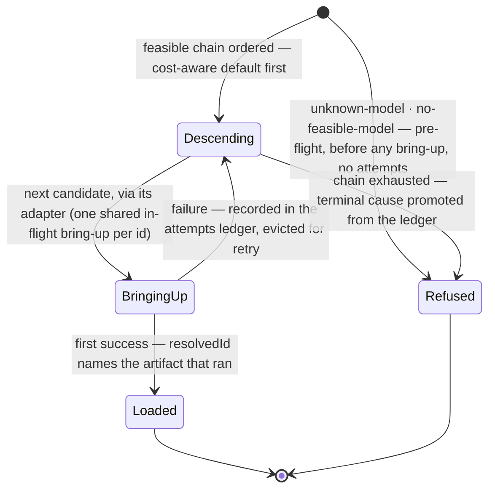
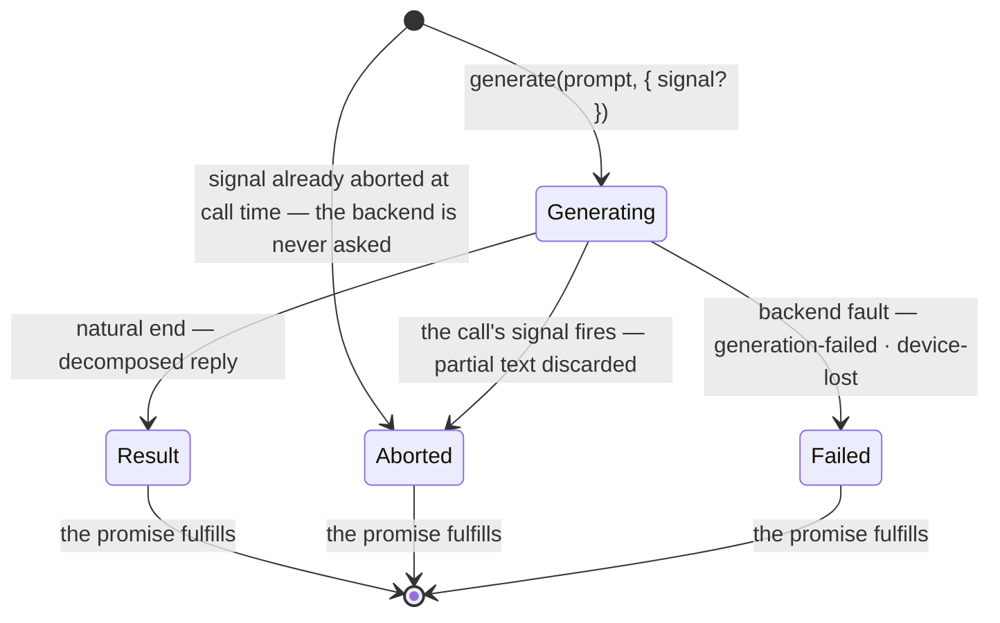

# The local-llm machine

local-llm's notional machine — the operational model a consumer or contributor
predicts against when holding this runtime. The module's two verbs are two
different machines, and this document opens both: `load` is a **descent
machine** over feasible candidates, `generate` is a **single-shot ask machine**
per call. What stays closed here is the backend's own machinery (how WebLLM or
any registered runtime fetches, caches, and executes weights — the inference
mechanism is out of scope by contract) and everything consumer-side (admission,
repair, rendering, the cause→guidance copy).

Everything stated here is committed contract ([README.md](./README.md);
[types.ts](./types.ts)) restated as behavior; nothing narrows or extends it.
Pedagogy is not decided here.

## The machine at a glance

One constructed runtime holds one catalog, one capability probe, one adapter
map, and one load-once cache. `load` probes, narrows the catalog to what this
device can bring up, and walks the feasible candidates in cost-aware descent
until one loads or the chain is exhausted — settling once, always with a value:
a loaded model, or a typed refusal. `generate` sends one finished prompt to one
loaded model and settles once with one outcome: the decomposed result, or a
typed generation failure. Neither verb streams; neither verb rejects for a
domain reason.

## One load's life

- **Pre-flight refusals never attempt.** An unknown name and an empty feasible
  set are known before any bring-up; both return with no attempts ledger, and
  the unknown name is its own cause — a typo is never described as a device
  limit.
- **The descent is silent and honest.** The learner never opts in; progress
  reports one calm narrative; the winning candidate is named in `resolvedId`.
- **A load cannot be cancelled.** The verb takes no signal, and the backend
  offers no abort lever for a weight fetch — walking away does not free the
  download.
- **The probe's rejection is outside the diagram.** A broken capability probe is
  an infrastructure fault: it propagates as a rejection from `load` and `canRun`
  alike, and is never dressed as a refusal.

## What the cache remembers

- One in-flight-or-settled bring-up **per catalog id** — concurrent loads of the
  same resolution converge on one fetch, one memory bring-up.
- A **failed** bring-up is evicted, so a retry re-attempts; a **successful** one
  is kept — a loaded model lives for the session and later loads reuse it.
- The cache holds the bring-up, not bookkeeping about callers: nothing counts
  who holds the model, and nothing unloads it.

## One generation's life

- **One call, one outcome.** There is no generation-time descent, no attempts
  ledger, no retry — a repair loop is the consumer's. The promise fulfills on
  every path above; domain failure is a value.
- **Abort is a value, and it taints nothing.** The `aborted` failure settles the
  aborted call; whatever partial text existed is discarded, not returned. A
  signal already aborted at call time settles the same way, with the backend
  never asked; a signal fired **after** the call settled changes nothing at all.
  At **any** timing, **the loaded model stays usable — the next `generate`
  proceeds normally**. The machine guarantees this precisely because no backend
  is trusted to give it for free.
- **One generation at a time per loaded model.** Concurrent `generate` calls on
  one model are outside the contract — and under the contract, a cancel always
  names the only generation there is.
- **Sampling belongs to the machine.** Per-model defaults ride the adapter;
  there is no per-call override, so two callers cannot disagree about how the
  model is run.

## Settlement honesty

- `load` speaks **success** (the model plus the honest `resolvedId` /
  `resolvedRuntime`), two **pre-flight** refusals (`unknown-model`,
  `no-feasible-model` — no attempts), and four **post-flight** terminal causes
  (`all-candidates-exhausted`, `fetch-failed`, `storage-quota`, `cache-evicted`)
  that always carry a non-empty per-candidate attempts ledger. The ledger is
  diagnostic; consumers read the terminal cause.
- `generate` speaks the **result** (byte-exact `raw`, lossy `code`, optional
  `thinkTrace`) and three failures (`aborted`, `device-lost`,
  `generation-failed`). `ok` is true exactly on the result.
- Every cause on both verbs is **delivery-agnostic** — a device or availability
  limit, never a product name or a "download the app" string; turning a cause
  into guidance is the consumer's.
- After a `device-lost` failure the loaded model may be gone with the device —
  only `aborted` carries the usable-after guarantee.

## What the machine never does

- Never reaches a server — when the device can run nothing, it refuses; the
  refusal is the floor, not a fallback.
- Never rejects for a domain reason — rejections are reserved for infrastructure
  faults (a broken probe, a backend defect).
- Never throws at a typo — an unknown model name is a returned refusal with its
  own cause.
- Never streams outward — the settled outcome is the whole answer.
- Never frees a download on cancel — cancellation is a generation-time
  affordance only.
- Never lets one call's abort poison the next — at any abort timing.
- Never re-descends at generation time, and never recovers a lost device.
- Never mutates `raw`, never judges `code`, never validates anything.
- Never tries a candidate heavier than the cost-aware default — the descent only
  steps down; heavier is an explicit opt-in.
- Never asks the learner to approve a fallback — the descent is silent, and
  honesty lives in `resolvedId`.

## Predictions worth making

A holder of this model should be able to answer, before running:

- What `load({ model: 'a-typo' })` settles as (the `unknown-model` refusal — a
  value with no attempts; it does not throw, and no consumer pre-check is
  needed).
- Whether cancelling anything frees a half-downloaded model (no — no lever
  exists; never promise a learner otherwise).
- What `generate` resolves to when its signal fires mid-generation (the
  `aborted` failure — partial text is discarded, not returned).
- What `generate` does when its signal was already aborted before the call (it
  settles `aborted` straight away — the backend is never asked).
- What calling `abort()` after the answer arrived does (nothing — the settled
  outcome stands, and the next `generate` on the same model still works).
- Whether two concurrent `load()`s of the same selection fetch twice (no — one
  shared in-flight bring-up per id; both settle with the same winner).
- Whether a post-flight refusal can carry an empty attempts ledger (no —
  non-empty by type; only pre-flight causes carry none).
- What a mid-generation GPU drop settles as (the `device-lost` failure — named
  honestly, not recovered; the model may be unusable afterwards).
- Whether `generate` twice at once on one model is defined (no — outside the
  contract; one generation at a time).
- Whether `try/catch` is needed around `await generate(...)` for a refused
  generation (no — domain failure fulfills as a value; a rejection there is an
  infrastructure fault, not a refusal).
- Where a model's `<think>` reasoning went (separated onto `thinkTrace` when the
  model emitted one — never merged into `code`, never cleaned).

## Navigation

- [README.md](./README.md) — the contract this machine restates (ubiquitous
  language, the refusal map, design commitments).
- [DOCS.md](./DOCS.md) — the architecture: phases, seams, the data flow.
- [types.ts](./types.ts) — the contract in TypeScript.
- [`../README.md`](../README.md) — the shared `lib/` this module inhabits.
