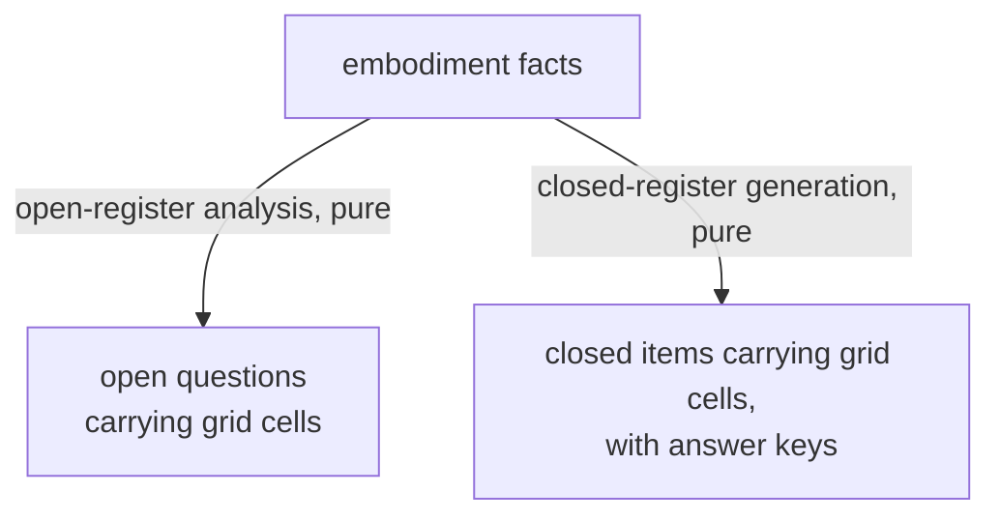

<!-- cspell:ignore socratizing quizzing socratize Schulte unbuilt -->
<!-- cspell:ignore reenrichment linearization -->

# lib/questioning — Architecture & Decisions

Region-level architecture for the questioning parent. This document constrains
only the parent at its own abstraction — the shared truth and the laws every
engine under it obeys; each engine's own DOCS zooms into that engine.

## Why a shared parent, not a shared orchestrator

The two engines are each complete and each bounded: the closed register's
charter is static decidability (every item is machine-gradable) and it excludes
open Socratic questions; the open register is reflective and has no answer key.
Merging their internals would break both charters. The deprecated architecture
reconciled them in a composition lib above both — the question-orchestrator —
which was retired (locked decision 3 of the question-register campaign,
maintainer-ratified 2026-07-22).

What the retirement kept is the **shared truth**: one `BlockCell` grid
vocabulary, one anchor coordinate system, the one-grid curriculum commitment,
and the carried instruments below. What stays retired is the **mechanism**: the
source registry, the composition entry point, cross-register co-anchoring,
anchor normalization, and the composition pipeline — retired at the parent
level; what survives as concepts is designated to a future child questioner (§
Carried collateral). The parent is a documentation-and-types home for the former
and none of the latter — it composes nothing and runs nothing (human ruling
2026-08-11, locked decision 5 of the question-register campaign).

## Architectural sketch

> Written prospectively in Phase 0. Structure, not implementation.

### Shared engine shape

Every engine under this parent is a pure, synchronous transformation from
embodiment facts to frozen, grid-tagged items. An engine that cannot serve a
snippet refuses as data or gates loudly rather than returning a half-analyzed
result; emitting zero items on a snippet that fits no form is normal operation,
not refusal. Ground truth is static: no engine evaluates the snippet. This
sketch constrains neither engine's internals — each engine's own DOCS carries
its sketch.

### Data flow

The absence of a joining node is the constraint: no state in this region merges
the two streams — that merge was the retired orchestrator. Nothing downstream of
either stream exists in this region: the open questions meet a human's judgment,
which produces no data here, and verdict-and-mastery data exists only inside the
closed register. The parent's own files appear nowhere in the diagram because
they transform nothing; at this abstraction the engines are the transformations.

### Structural constraints

- The parent is types and documentation only. `types.ts` has zero imports and
  zero runtime exports; adding a runtime export is a design event.
- The import law, per counterpart: the parent's types — type-only; the other
  engine — never; sibling lib-tier leaves — allowed, runtime included; embody —
  the embodiment envelope, its structural fact-types, and its refusal cause,
  type-only. These boundaries are hand-tracked conventions — no lint rule
  enforces them.
- No data state downstream of either item stream exists in this region; verdict
  data exists only inside the closed register.
- The region ships no tests of its own: its four type aliases have no runtime
  surface, the engines' own suites typecheck every grid literal they emit
  against these aliases, and the typecheck gate covers the rest.
- Grid and taxonomy vocabulary changes are cross-engine contract events.

### Out of scope

- Composition, co-anchoring, anchor normalization — retired mechanism.
- Coverage reporting, difficulty laddering, and the field-name unification
  (`block`/`cells` → one view) — carried, unbuilt (below).
- The recommender mapping onto the 3D space — a future recommender layer.
- Rendering (lenses), human judgment (outside the software), grading internals
  (the closed engine's own).

## The 3D Block Model space (recommender extension)

The space's treatment lives with the package's pedagogy theory:
[PEDAGOGY.md § The 3D Block Model space (recommender extension)](../../PEDAGOGY.md#the-3d-block-model-space-recommender-extension).

## Carried collateral (unbuilt)

Three concepts from the retired question-orchestrator are carried forward as
future work, none discarded (human ruling 2026-08-05/06; durable home promoted
here from the open engine's DOCS, human ruling 2026-08-11, superseding the
2026-08-10 placement): the spans-and-gaps **coverage reporter** over the 12-cell
grid (no such instrument exists anywhere forward — the cells make coverage
auditable, nothing yet reports it; its recorded rationale is that coverage is
meaningful only over both registers' items together); the **Block-Model
difficulty ladder** (concrete-to-abstract item ordering — nothing forward orders
questions by difficulty; the open engine sorts by source offset); and the
**two-registers-on-one-grid goal** shared by both registers. A fourth, smaller
carry: the unification of the two carrying field names (`block` open, `cells`
closed) into one view lived in the retired composition layer and is likewise
unbuilt. The landing site is designated: a higher-order questioner inside this
region — a child that itself implements `Questioner` while consuming other
questioners (locked decision 7, human rulings 2026-08-11/12; directory name
parked until its Phase-0 session; the carried defaults remain ratify-or-adjust
at its design review). The quarry `lib/question-orchestrator/` tests remain the
pinned truth until it is built; the transitional record rides the campaign spec
(`.planning-handoffs/socratize-quiz-reenrichment/SPEC.md` § Orchestrator
collateral) until it retires.

## Decisions

- **Four-type hoist, including `Level`** (human ruling 2026-08-11, overruling
  the design review's three-type recommendation): the parent owns
  `BlockDimension`, `BlockLevel`, `BlockCell`, and the five-level `Level`
  linearization. `Level`'s `userExperience` gloss was rewritten without the open
  engine's framework vocabulary, which stays engine-local.
- **No open/closed register type is minted.** No forward code discriminates on
  the register; minting a discriminant with no consumer would be the first step
  of reviving the orchestrator.
- **No re-export shim.** When the open engine's `types.ts` starts importing the
  parent's grid types, it does not re-export them; future consumers import the
  parent directly — one import path per truth.
- **Homonym rulings live in the README glossary** (level ×3, block ×3, register
  ×3, `BlockCell` vs `BlockModelCell`, the 3D space) — one resolution for both
  engines.
