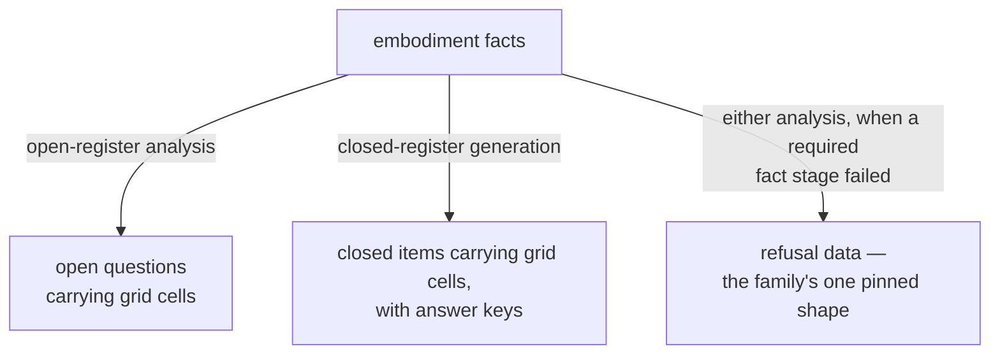

<!-- cspell:ignore socratizing quizzing socratize Schulte unbuilt -->
<!-- cspell:ignore reenrichment linearization Gateable gradability -->

# lib/questioning — Architecture & Decisions

Region-level architecture for the questioning parent. This document constrains
only the parent at its own abstraction — the kind's contract and the laws every
questioner under it obeys; each child's own DOCS zooms into that child.

## Why a shared parent, not a shared orchestrator

The two engines are each complete and each bounded: the closed register's
charter is machine-gradability (a machine grades every item; today's engine
derives every key statically) and it excludes open Socratic questions; the open
register is reflective and has no answer key. Merging their internals would
break both charters. The deprecated architecture reconciled them in a
composition lib above both — the question-orchestrator — which was retired
(locked decision 3 of the question-register campaign, maintainer-ratified
2026-07-22).

What the retirement kept is the **shared truth**: one `BlockCell` grid
vocabulary, one anchor coordinate system, the one-grid curriculum commitment,
and the carried instruments below. What stays retired is the **mechanism**: the
source registry, the composition entry point, cross-register co-anchoring,
anchor normalization, and the composition pipeline — retired at the parent
level; what survives as concepts is designated to a future child questioner (§
Carried collateral). The parent is a documentation-and-types home for the former
and none of the latter — it composes nothing and runs nothing (human ruling
2026-08-11, locked decision 5 of the question-register campaign). What the
parent gained since (human rulings 2026-08-11/12, executed 2026-08-18) is the
kind's own definition: the family framing and the `Questioner` envelope, so the
directory admits children by contract rather than by roster.

## Architectural sketch

> Written prospectively in Phase 0. Structure, not implementation.

### Shared questioner shape

Every questioner under this parent turns an embodiment into frozen, grid-tagged
items behind the kind's envelope: a name, a boolean serve-check over the facts,
and one ask entry that either produces items or refuses as data in the family's
pinned refusal shape. The serve-check is an options-list answer, not a total
pre-check — serve-true followed by a refusal at ask is a legal pairing. A
questioner that cannot serve a snippet refuses as data rather than returning a
half-analyzed result; emitting zero items on a snippet that fits no form is
normal operation, not refusal. Ground truth — the static text or the program's
actual execution — is the questioner's own choice (README § Static and dynamic
ground truth): the kind constrains the envelope and the assessment boundary,
never the means. The read-bound is a law of the kind: a questioner reads the
embodiment's facts and never its lifecycle payload. This sketch constrains no
child's internals — each child's own DOCS carries its sketch.

A leaf questioner fronts an engine; a higher-order questioner consumes other
questioners behind the same envelope. Composition therefore lives only inside a
child of the family, never in the parent and never in a leaf.

### Data flow

The absence of a joining node is the constraint: no state in this region's
parent merges the two streams — that merge was the retired orchestrator. The
refusal node is deliberately shared: whichever register refuses, the data takes
the family's one pinned refusal shape, which is why the two transformations meet
there and nowhere else. The designated higher-order questioner, when built,
joins item streams INSIDE a child of the family, behind the same envelope; the
parent's own abstraction stays these two register transformations, and the
parent still merges nothing. Nothing downstream of either stream exists in this
region: the open questions meet a human's judgment, which produces no data here,
and verdict-and-mastery data exists only inside the closed register. The
parent's own files appear nowhere in the diagram because they transform nothing;
at this abstraction the register transformations are the region.

### Structural constraints

- The parent is types and documentation only. `types.ts` has zero runtime
  exports and exactly one import — embody's structural types, type-only, carried
  by the `Questioner` envelope — so it still compiles away entirely. Adding a
  runtime export is a design event.
- The import law, per counterpart: the parent's types — type-only; another leaf
  questioner — never (consuming questioners is exclusively a higher-order
  questioner's role); sibling lib-tier leaves — allowed, runtime included;
  embody — the embodiment envelope, its structural fact-types, and its refusal
  cause, type-only. These boundaries are hand-tracked conventions — no lint rule
  enforces them.
- The read-bound: no questioner reads `embodiment.study`. Greppable
  (`grep -rn '\.study'` over a child stays empty outside tests), hand-tracked
  like the import law. The day a questioner needs the lifecycle payload, the
  kind stops being a lib-tier citizen and the honest move is relocating it
  beside the package's other utility kinds — recorded here so that day is
  recognized, not discovered.
- No data state downstream of either item stream exists in this region; verdict
  data exists only inside the closed register.
- The region ships one test file of its own: `tests/` carries the kind's
  type-contract assertions (roster assignability, bare-roster drive-ability,
  refusal narrowing) — compile-time pins with trivial runtime bodies. The grid
  aliases still have no runtime surface, and the engines' own suites typecheck
  every grid literal they emit against them.
- Grid and taxonomy vocabulary changes are cross-questioner contract events.

### The closed register's conformance (on paper, owed to Stage 3)

The quarry closed engine's entry takes two data inputs — the snippet and its
pre-computed classified tokens — and today the quiz lens composes them. Under
the envelope, ask takes the embodiment alone, so the classification call moves
inside the questioner (a sibling lib-tier leaf, runtime import — legal under the
import law). Two consequences the Stage-3 design review ratifies: the
composition seam relocates from the lens into the questioner, and a consumer
that also needs classified tokens classifies twice unless the port keeps the
engine's two-input entry INSIDE the wrap and exposes only the envelope. The
port's oracle is unaffected either way — the wrap adds an entry, it does not
change one.

### Out of scope

- Composition, co-anchoring, anchor normalization — retired mechanism.
- Coverage reporting, difficulty laddering, and the field-name unification
  (`block`/`cells` → one view) — carried, unbuilt (below).
- A declared-coverage field on the envelope — deliberately absent (§ Decisions);
  cells ride the items.
- The recommender mapping onto the 3D space — a future recommender layer.
- Rendering (lenses), human judgment (outside the software), grading internals
  (the closed engine's own).

## The 3D Block Model space (recommender extension)

The space's treatment lives with the package's pedagogy theory:
[PEDAGOGY.md § The 3D Block Model space (recommender extension)](../../PEDAGOGY.md#the-3d-block-model-space-recommender-extension).

## Carried collateral (unbuilt)

Three concepts from the retired question-orchestrator are carried forward as
future work, none discarded (human ruling 2026-08-05/06; durable home promoted
here from the open engine's DOCS, human ruling 2026-08-11, superseding the
2026-08-10 placement): the spans-and-gaps **coverage reporter** over the 12-cell
grid (no such instrument exists anywhere forward — the cells make coverage
auditable, nothing yet reports it; its recorded rationale is that coverage is
meaningful only over both registers' items together); the **Block-Model
difficulty ladder** (concrete-to-abstract item ordering — nothing forward orders
questions by difficulty; the open engine sorts by source offset); and the
**two-registers-on-one-grid goal** shared by both registers. A fourth, smaller
carry: the unification of the two carrying field names (`block` open, `cells`
closed) into one view lived in the retired composition layer and is likewise
unbuilt. The landing site is designated: a higher-order questioner inside this
region — a child that itself implements `Questioner` while consuming other
questioners (locked decision 7, human rulings 2026-08-11/12; directory name
parked until its Phase-0 session; the carried defaults remain ratify-or-adjust
at its design review). The word "coverage" stays reserved for this reporter: the
envelope deliberately mints no declared-coverage field, and if a consumer ever
needs a questioner's declared cell union, the recorded path is deriving it
engine-locally (each form declares its cells; the child folds a union) rather
than hand-maintaining a parent-level array. The quarry
`lib/question-orchestrator/` tests remain the pinned truth until it is built;
the transitional record rides the campaign spec
(`.planning-handoffs/socratize-quiz-reenrichment/SPEC.md` § Orchestrator
collateral) until it retires.

## Decisions

- **Four-type hoist, including `Level`** (human ruling 2026-08-11, overruling
  the design review's three-type recommendation): the parent owns
  `BlockDimension`, `BlockLevel`, `BlockCell`, and the five-level `Level`
  linearization. `Level`'s `userExperience` gloss was rewritten without the open
  engine's framework vocabulary, which stays engine-local.
- **The `Questioner` envelope joins the parent** (human rulings 2026-08-11/12
  designated it; executed with the design review's rulings 2026-08-18): the
  parent's types now define the kind, not only the grid.
- **The gate predicate is named `serves`, not `applicability`** (human ruling
  2026-08-18, amending the campaign spec's locked decision 6 field name on the
  design review's measured finding): with `applicability`, a questioner is
  structurally assignable into embody's `Gateable` roster and silently redefines
  the package's study-utility envelope term; the distinct name closes both.
- **`serves` reads `Facts`; `ask` reads `Embodiment`** (design review re-ruling
  2026-08-18, after measurement): `Embodiment.study` is required, so a
  facts-only ask would leave a wrap unable to call the open engine's entry; the
  split mirrors the lens kind (gate over facts, main over the embodiment). Its
  condition is the read-bound law (§ Structural constraints).
- **The envelope's facts parameter is typed by a type-only embody import**
  (human ruling 2026-08-18, superseding the zero-imports phrasing): the
  fully-generic alternative (`Questioner<TItem, TFacts>`) measurably cannot type
  a heterogeneous roster the designated higher-order questioner can both hold
  and drive. The invariant that survives is zero RUNTIME exports — the parent
  still compiles away.
- **Only the refusal arm is pinned** (design review ruling 2026-08-18):
  `QuestionerRefusal` matches the open engine's landed refusal arm exactly; each
  implementor keeps its own success shape (`TAnswer`). Pinning the whole union
  would force field renames and buy consumers nothing — concrete item types are
  reached through each questioner's own import, never through the bare roster.
  Extended by one field (human ruling 2026-08-18, on the sketch review's
  measured finding that a bare roster's answers collapse to un-narrowable
  `unknown`): `TAnswer` defaults to the ok-true shape, so a bare roster narrows
  refusals by the discriminant alone — a child's success shape carries
  `ok: true` to ride a bare roster, and the landed open engine already does.
- **Config is a generic with a `never` default** (design review ruling
  2026-08-18): a parent-minted flat serializable record would fail the open
  engine's two-level config immediately; "declarative and serializable" binds as
  a documented law of the kind instead, and there is no learner-model parameter
  (human ruling 2026-08-11).
- **No declared-coverage field** (design review ruling 2026-08-18, under the
  authority the session mandate delegated): its only named consumer is the
  carried coverage reporter, unbuilt; a hand-declared array's overstatement is
  the one drift no containment test can catch; and the name is reserved (§
  Carried collateral, which also records the engine-local derivation path).
- **The machine twin's source-order and analyzer-degradation laws are
  open-register laws** (human ruling 2026-08-18): the closed register's ordering
  and failure posture are settled at its own port stage against its own oracle —
  the verbatim-port ruling (locked decision 4) stays unamended.
- **The README's gloss tables trimmed to value lists** (human ruling
  2026-08-18): the per-value glosses were byte-identical in three places; theory
  keeps them in PEDAGOGY.md and the working JSDoc keeps them on the types. The
  `## The BLOCK model` and `## Leveling` headings stay — inbound citations
  resolve by heading.
- **The campaign spec's § Terms sentence "the landed parent glossary's 'engine'
  entries survive under this reading" is superseded in detail** (recorded
  2026-08-18): the pre-merge review of the parent stage flagged the entry's
  closed-roster phrasing, and this rewrite re-glossed it (engine = the machinery
  a leaf questioner fronts). The spec file itself is transitional and is not
  edited.
- **The kind is permissive about ground truth and determinism** (human ruling
  2026-08-18, at the Phase-0 gate): questioners may run the code — open or
  closed questions about runtime facts (the QLC family's variable-trace MCQs are
  the reference case) — and dynamic questions are REQUIRED for full
  execution-dimension coverage; questioner developers are not tied to the
  package's evaluators (a tested case-in-point with tracers, not a boundary);
  generation need not be deterministic (nondeterministic programs; deliberate
  randomization of wording or order). This overruled the
  never-runs/static-only/deterministic laws an earlier draft of these docs
  codified, and supersedes in detail the campaign spec's decision-9 headline
  "pure and stateless" — its content (assessment as data; no learner state)
  stands; blanket generation-purity does not. Grading determinism was NOT
  loosened. The dynamic questioner's open seams (the sync-typed ask;
  runtime-facts shape; tier placement if it consumes the evaluators region) are
  recorded in README § Static and dynamic ground truth.
- **No open/closed register type is minted.** No forward code discriminates on
  the register; minting a discriminant with no consumer would be the first step
  of reviving the orchestrator.
- **No re-export shim.** When the open engine's `types.ts` starts importing the
  parent's grid types, it does not re-export them; future consumers import the
  parent directly — one import path per truth.
- **Homonym rulings live in the README glossary** (level ×3, block ×3, register
  ×3, `BlockCell` vs `BlockModelCell`, the 3D space) — one resolution for both
  engines.
