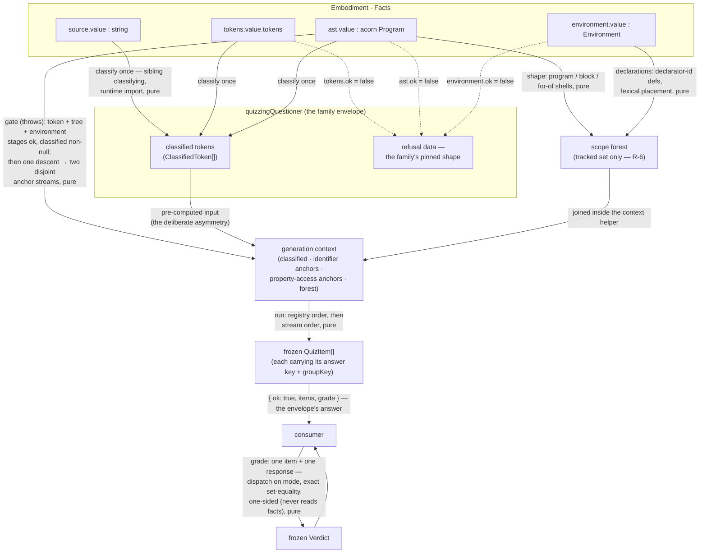

<!-- cspell:ignore quizzing socratizing mcq unshadowed reassignability -->
<!-- cspell:ignore distractors gradable unbuilt unpromised chokepoint injectivity precomputes -->

# lib/questioning/quizzing — Architecture & Decisions

## Why this module exists

A learning environment needs auto-gradable questions grounded in the
Block Model and the notional machine: a learner clicks a syntax element
and answers a closed, checkable question about it. That
content-and-grading logic is pure, exhaustively testable, and
consumer-independent — so it lives as a lib-tier leaf under the
questioning family, the closed register beside socratizing's open one
(the registers, the charter, and the shared grid are the parent's:
[`../README.md § The two registers`](../README.md#the-two-registers)).
See [`./README.md`](./README.md) for the glossary, the bounded context,
and this engine's static-decidability mode.

## Architectural sketch

> Written at Phase 0 of the port. The Refactor step is held against this
> document — not what the code does, but what shape it takes.

The module has two engine entry points — `generateQuiz` (content) and
`grade` (judgment) — joined only through the `QuizItem`: generation
precomputes each item's machine-derived ground truth, and grading reads
only the item and the response. The parsed facts enter `generateQuiz`
and are never seen by `grade`; this **one-sided seam** is the
load-bearing structural choice. The family's `quizzingQuestioner`
envelope stands in front of the content entry: it narrows the facts,
composes the classifying sibling, and refuses as data where the engine
would throw.

### Execution phases — `generateQuiz`

Newspaper anatomy: the public export first, the phase helpers hoisted
below.

1. **Gate** (sync, throws). The inputs must be coherent: the token,
   tree, and environment stages all ok, and a non-null `classified`
   array. A failed stage throws — the engine is called behind its
   caller's gate, and a valid `classified` already implies a successful
   parse, so a defected input here is a caller bug to surface (the
   environment arm is a port widening: the prior architecture's scope
   walk could not fail on parsed input, while the environment stage can
   — as a loudly-reported embody defect; no oracle pin exercises the
   arm, and gating it keeps the entry total over its widened input
   surface — AR-2 resolution, 2026-08-18). The gate is the only throw
   reachable through the entry; the context and forest helpers mirror
   the precondition defensively (oracle-pinned), unreachable behind it.
   The envelope's serves/refusal arms sit in front of all three stages
   (§ Data flow).
2. **Scope forest** (pure). Build the three-kind forest the
   binding-aware generators resolve occurrences through — shape from
   `facts.ast`, declarations from `facts.environment`, tracked set only
   (§ Where scope comes from). Realized inside the context phase's
   helper: the projection lives in its own file with its own pinned
   entry, and the context helper calls it — the phases are conceptual
   stations, not five top-level siblings.
3. **Generation context** (pure). Assemble the single read-only bundle
   every generator receives — the chokepoint that owns "what a generator
   sees": the pre-computed `classified` stream, the two anchor streams,
   and the forest. A **single** AST descent produces the two disjoint
   anchor streams — descend once and collect, never re-walk.
4. **Run the anchor-typed generators** (pure). A registry of generators,
   each declaring the anchor type it binds to; the run phase — not the
   generator body — owns iteration, selecting the matching stream
   (classified tokens / identifier anchors / the program singleton).
   Emission is **selective**: forms emit only where they apply.
   Ordering is the registry's: registry order, then stream order.
5. **Assemble + freeze** (pure, shape finalization only). Emit the
   deeply frozen `readonly QuizItem[]`. This phase
   adds, drops, and reorders nothing. The declared `filter` parameter is
   accepted and not consumed (README § Configuration) — no filter phase
   exists yet; when filtering is built it lands between run and freeze,
   post-generation, so propagation identities are computed over the
   complete set.

### Grading — `grade`

A pure comparator. It reads only `(item, response)` — never the facts —
and dispatches on `item.mode`: a panel-mode item compares option ids; a
code-surface item (`click-token` / `click-line`) compares clicked
ranges; an exhaustive `select-in-code` item compares the selected set.
The match is **binary** — exact set-equality of the answer key, no
partial credit. A response whose mode does not match the item's, or an
option id outside the item's own pool, grades to `malformed` (a
caller/UI bug, distinct from a wrong answer). A code-surface item has no
range validation arm: `grade` never sees the source, so a nonsense range
is simply `incorrect`. `grade` is **total and never throws** — it runs
in a consumer's interaction loop on every click.

### Where scope comes from

Five facts, one place (Stage-3 AR-1, human rulings 2026-08-18 where
dated):

1. **Shape from the AST.** The forest's scopes are walked from
   `facts.ast.value`: the Program (the single `'program'` root — the
   environment's global/module double root never enters), every
   BlockStatement (a function body's braces are an ordinary `'block'`),
   and every ForOfStatement (`'for-of'`) — EXCEPT a ForOfStatement's own
   `.body` block, which folds into the for-of scope (the prior
   architecture inlined it). The walk is a structural micro-traversal in
   the sanctioned pure-acorn class; no scope *semantics* ride it.
2. **Declarations from the environment.** Definitions are harvested from
   every `facts.environment` scope (recursing `childScopes`; the
   flat-by-path index would collapse the Program-node collision) and
   filtered to the **tracked set** by declarator-id identity: a
   definition is kept iff its declarator's `id` IS its name node and its
   `kind` is `var`/`let`/`const` — one predicate covering plain
   declarators and the for-of left while excluding every destructuring
   pattern binding. Kept definitions register at their **lexical**
   position (the deepest shell containing the id's offset), sorted by
   offset so same-scope redeclaration is last-wins; `kind` copies the
   runtime value verbatim (the `var` laundering); the registered node is
   the **id Identifier**, whose span is the binding identity.
3. **The boundary is pedagogy** (ruling R-6, human, 2026-08-05).
   Function names, parameters, class names, imports, catch params,
   pattern bindings: the environment resolves them; the forest answers
   null and the occurrence falls back to its group-of-one — preserving
   the prior architecture's mastery grouping verbatim. Do not "improve"
   the resolution; the fallback IS the contract.
4. **`lib/scoping` is deliberately not reused** (Q13, resolved at this
   stage's AR-1): the shared adapter is a flat declaration view keeping
   only `let`/`const`; this engine needs the tree INCLUDING `var`. The
   two projections cross-reference rather than share code.
5. **Three edges are declared, none pinned**: `var` registers lexically
   (`{ var x = 1; } x;` → the outer read falls to occ — the prior
   forest's behavior, kept); same-scope redeclaration identity is the
   LAST declarator; the for-of body-block fold is structural only (no
   resolution pin distinguishes it). If a future change wants any of
   these otherwise, it is a ruling, not a drift.

### Data flow

Three facts the diagram makes load-bearing: `classified` enters the
engine pre-computed — by the envelope for roster consumers, or by a
direct consumer that classifies once and shares the stream (the input
asymmetry); the grading transformation reads only the item and the
response (the one-sided seam); and the refusal node lives inside the
**envelope** while the throw posture belongs to the **engine** — the
dotted stage-failure edges never reach the engine because
`serves`/`ask` narrow all three stages first, and the engine's own gate
covers the same three for direct consumers (the seam split).

## Structural constraints

- **Two engine entries, joined only by the `QuizItem`.** No shared
  mutable state, no second channel.
- **The envelope composes; the engine computes.** `ask` is exactly:
  narrow → classify → `generateQuiz` → ok-wrap (the items plus the
  carried engine grade). Analysis logic in the
  wrapper needs a ruling (the adapter-only pin in its test cluster).
  `ask`'s config is NOT forwarded into the engine's `filter` until a
  consumed field exists — the forwarding is part of the filter-build
  design event (AR-2 resolution, 2026-08-18).
- **Input asymmetry is deliberate.** The engine takes parsed facts plus
  pre-computed `classified`; it never calls `classifyTokens`.
- **One AST descent; two disjoint streams.** Property names ride the
  property stream only; object-literal keys ride neither; no
  binding-aware generator can feed the resolver a non-reference
  occurrence, by construction.
- **Generation is selective, grading is total.**
- **One-sided seam.** Items carry plain frozen data — never a callback,
  a thunk, or a facts reference.
- **Reads through the accessor seam.** Every facts read goes through a
  narrow, domain-named helper (the forest accessor, the context reads);
  no inline `facts.*` dereference in a generator or in `grade`.
- **Pure on frozen inputs; deterministic; frozen output.** Same
  `(facts, classified, filter)` → byte-same output.
- **The registry is the ordering authority.** Registry order, then
  stream order; deliberately not source order.
- **Group-key axes are pairwise non-prefixing.** Six axes (README
  § Glossary); the oracle asserts non-prefixing against the live sibling
  serializers.
- **Text authority rides the context.** Learner-facing text reaches
  items only through the generation context — today
  `ClassifiedToken.text` (classifying's slice of the source) and the
  binding/anchor names. A future form needing raw source text takes it
  through the context, sliced from `facts.source.value`, never rebuilt
  from acorn's processed values — and that widening is a context-type
  event (AR-2 resolution, 2026-08-18: the prior "source-slice
  authority" wording named a read path no generator has).

## Out of scope

- **Token classification** — `lib/classifying`; consumed, never
  re-derived.
- **Rendering, mastery state, propagation firing, click capture** — a
  consuming lens's (the campaign's Stage 5); this engine emits
  `groupKey` / `unlocks` / target ranges as data.
- **The open register** — `../socratizing/`.
- **Filtering** — `QuizFilter` is declared, not consumed; building it is
  a recorded future design event (README § Configuration).
- **The realm forms** — V3 provenance, V5 value-category, the `realm:`
  key axis, and the curated realm table were dropped with the removed
  embody realm phase (locked decision 4, 2026-07-22; port-time
  completeness sweep in [`./LOSS-LEDGER.md`](./LOSS-LEDGER.md)).
- **Runtime evaluation** — static decidability is this engine's mode;
  dynamic ground truth belongs to a future dynamic questioner (parent
  README § Static and dynamic ground truth).
- **A JEJ admission gate** — parsed-not-validated by charter; language-
  level gating is a consumer concern (campaign Q4, Stage-5 material).
- **Input coherence** (caller responsibility): the engine validates
  shape (throws on null/unparsed), not provenance — a mismatched
  `facts`/`classified` pair is a caller bug, the same posture as
  classifying.

## Decisions

Dated where ruled; carried entries keep the prior architecture's
rationale.

- **One-sided seam: `grade` never reads the facts** (carried).
  Precomputed ground truth on the item keeps grading a pure comparator a
  consumer runs on every click.
- **The engine throws; the envelope refuses; `grade` is total**
  (carried + Stage-3 AR-1). The throw is the engine's oracle-pinned
  posture behind a parse gate; the family's refusal-as-data lives in
  `quizzingQuestioner` (`serves` mirrors ask's narrows — the tight
  serve/refuse alignment); an uninterpretable response is a `malformed`
  verdict, not an exception.
- **Discriminated unions over optional bags** (carried) for `QuizItem`
  (on `mode`), `LearnerResponse` (on `mode`), `Verdict` (on `status`).
- **`Verdict` reports judgment + feedback, never the answer key**
  (carried). The consumer reveals the key from the item it holds; the
  `malformed` arm keeps a UI bug from being scored.
- **Registry order, then stream order — the registry is the ordering
  authority** (Stage-3 AR-1, 2026-08-18). The prior JSDoc's
  "source-ordered" claim was false and is corrected at the port; the
  token → node → program tier grouping is an oracle-pinned observation
  of today's registry, not an independent guarantee.
- **`QuizFilter.range` is a zero-indexed half-open offset span** (human
  ruling 2026-08-18, Stage-3 AR-1) — flipped from the prior
  architecture's 1-based inclusive lines to the family's offset-native
  anchor law, matching the socratizing precedent; a lines→offsets
  conversion is a consumer concern. The filter itself stays declared,
  not consumed (the no-op is oracle-pinned); its build is a recorded
  future design event.
- **The minted forest types are named for the glossary** (human ruling
  2026-08-18, Stage-3 AR-1): `ScopeForest` / `ForestScope` /
  `TrackedDeclaration` — never the prior `ScopeAnalysis` / `ScopeInfo` /
  `DeclarationInfo`, which carry two live embody homonyms plus a tracer
  third and a recorded `lib/scoping` ruling against `DeclarationInfo`.
  The prior architecture's counting fields (`initNode`, `readCount`,
  `writeCount`, `scopeDepth`) and flat `allDeclarations` view are
  dropped — zero consumers, measured at port time.
- **The scope shim is quizzing-local** (Q13, ratified at Stage-3 AR-1):
  `resolving/` owns the projection; `lib/scoping` is not reused
  (§ Where scope comes from).
- **`QuizzingConfig` is a forward-declared object with opaque fields**
  (human ruling 2026-08-18): the family sees config-is-an-object; each
  questioner owns its fields as implementation. No field is consumed
  yet; typed fields land when filtering is built. `QuizzingAnswer` and
  `QuizzingConfig` live in `types.ts` beside the engine contract
  (Stage-3 AR-1: the type-location convention outranks the
  stays-local-alias precedent, which covered an unexported alias only).
- **Both entries public** (Stage-3 AR-1, ratifying the parent DOCS
  conformance section): the two-input engine entry stays public for
  classified-sharing consumers (they classify once); the questioner is
  the family's roster surface. The wrap adds an entry; it does not
  change one.
- **`anchorPath`, when a form first constructs it, carries the
  greenfield `NodePath`** (Stage-3 AR-1): path-to-node, not
  node-to-path — greenfield paths withdraw the legacy injectivity claim
  (a node the grammar shares between slots can be met twice), so
  consumers key by path. Declared on the base type, constructed by no
  built form.
- **`element-type:` is an inline key in V6b, not a `keying/` file**
  (carried — re-homed from the dropped realm-group-key header, where the
  convention was recorded): which serializers live in `keying/` versus
  inline is a recorded convention, not an accident. The `usage:occ:`
  fallback is likewise inline in V7.
- **Filter semantics mirror `MicroDecisionConfig`'s semantics, not its
  shape** (carried): flat `Partial<Record<…, boolean>>` groups; omitted
  group = no filter; AND across groups, OR within; `count` caps last.
- **`Family` is quizzing's own vocabulary** (carried): not classifying's
  `Category`, not socratizing's `Feature`; the correspondence is partial
  and unpromised.
- **Enumerate the closed string vocabularies fully; build modes as their
  generators land** (carried; amended 2026-08-18): `AnswerMode` (five
  today) and `Family` (seven) are enumerated up front and additive-open —
  a new member is a cross-consumer contract event, not a redesign; the
  earlier "end-state" word overstated closure. `multi-mcq` is
  enumerated-not-built; `click-line` is graded-not-generated (both under
  one vacancy: offset→line reads).
- **No extension doorway in the item model** (human ruling 2026-08-18,
  declining the design-review counter-proposal after clarification):
  answer-mode openness lives at two levels that already exist — a new
  quizzing-internal mode is an ADDITIVE built member (a cross-consumer
  contract event landing its item variant, response arm, and grade arm
  together), and a question kind that does not need this engine arrives
  as a NEW QUESTIONER with its own item shape and grader (the family's
  TAnswer openness plus the async-widened ask). A typed extension
  variant would have pre-paid the additive event's shape at the cost of
  admitting keyless items into the gradable register and colliding with
  the parent charter's "open mode" prohibition — measured at the design
  review.
- **The answer carries the grading surface** (human ruling 2026-08-18):
  `QuizzingAnswer.grade` IS the engine's `grade` (identity-pinned at the
  envelope unit); the field's type (`QuizzingGrader`) is async-capable —
  the admitted case is a deferred-but-deterministic verdict; grading
  determinism stays law. Consequences stated where they bind: the answer
  envelope is not structured-cloneable (README § Public API; a
  worker-crossing consumer imports the engine grade on its own side),
  and a same-tick consumer (the reference lens grades inside synchronous
  handlers) uses the engine export directly rather than awaiting the
  carried field.
- **Code-surface modes: one variant per assessment gesture, capture
  mechanics folded within** (carried): `click-token`/`click-line` share
  `CodeSurfaceQuizItem`; the exhaustive `select-in-code` is its own
  deliberate structural twin — "subset counts" grading was retracted;
  exhaustive set-equality IS the spec.
- **Formative feedback is the consumer's to compute** (carried): the
  item supplies the complete target set; the `Verdict` stays binary and
  one-sided.
- **`unlocks` entries are `groupKey` strings in the peers' namespace**
  (carried): only sameness forms carry the field; V10c is deliberately
  self-excluded; occ-fallback keys and free globals are never unlocked.
- **The var-laundering guards are per-binding** (carried): `var` reaches
  the generators (parsed-not-validated); V6/V6b guard per-binding; V2
  guards on the next meaningful token; V1 deliberately does not guard.
- **Item ids are the form plus its group identity** (carried, restated
  at AR-2 against the oracle): anchor-identity ids `form@<start>-<end>`
  where the form has no group beyond its anchor (V1/V2/V4/V7/V8), and
  group-identity ids where it does — `form/binding:<name>@<decl-span>`
  (V6/V6b/V10a), the same with `:<usageKind>` appended (V10b), and
  `form/use-type:<kind>` (V10c, whose cross-variable group has no
  binding). Group-identity ids are independent of which occurrence is
  representative.
- **V6/V6b fire once per binding, on the declared occurrence** (carried):
  for the `let`/`const` fragment the declared occurrence is always the
  binding's source-first occurrence (TDZ forbids use-before-declaration),
  so firing on `declared` is the simplest one-per-binding rule and the
  anchor is always the declaration span.
- **One generator per `form`, registered by anchor type** (carried): the
  three-way anchor axis extends socratizing's two-way split because
  classifying's output is token-indexed; the registry, not the
  generator, owns iteration.

## Navigation

- [`./README.md`](./README.md) — orientation, glossary, catalog, public
  API.
- [`./LOSS-LEDGER.md`](./LOSS-LEDGER.md) — the port's transport ledger.
- [`../DOCS.md`](../DOCS.md) — the family architecture (the envelope,
  the two register transformations, carried collateral).
- [`../socratizing/DOCS.md`](../socratizing/DOCS.md) — the open
  register's architecture (the sibling this module's shape mirrors).
