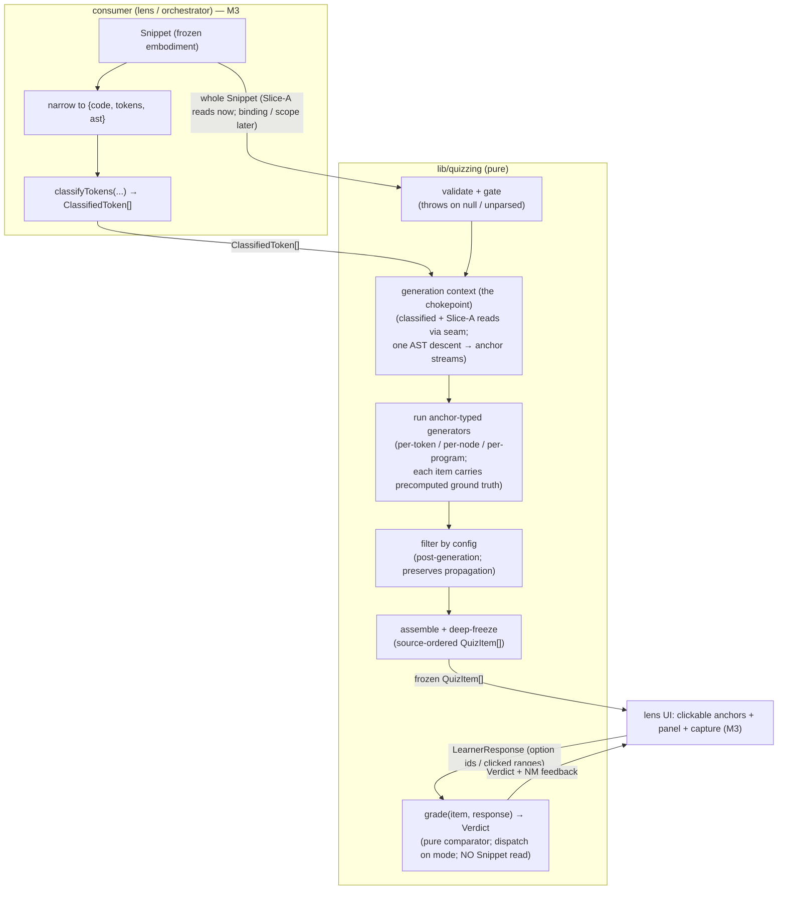

# lib/quizzing — Architecture & Decisions

## Why this module exists

The quiz lens needs auto-gradable questions grounded in the Block Model and the
JEJ notional machine: a learner clicks a syntax element and answers a closed,
checkable question about it. That content-and-grading logic is pure,
exhaustively testable, and conceptually peer-independent — so it lives in the
JEJ-peer `lib/` tier, the same extraction rationale as
[`../classifying/`](../classifying/README.md). Quizzing is the **closed,
gradable** register; socratizing is the **open, Socratic** one — two registers
of the same Block Model, deliberately sharing socratizing's `BlockCell`
vocabulary. See [`./README.md`](./README.md) for the glossary, the bounded
context, and the static-decidability boundary.

## Architectural sketch

> Written Phase 0, before implementation. The Refactor step is held against this
> document — not what the code does, but what shape it takes.

The module has two public entry points: `generateQuiz` (content) and `grade`
(judgment). They are connected only through the `QuizItem` — `generateQuiz`
precomputes each item's machine-derived ground truth, and `grade` reads only the
item and the response. The Snippet enters `generateQuiz` and is never seen by
`grade`; this **one-sided seam** is the load-bearing structural choice.

### Execution phases — `generate-quiz.ts`

Newspaper anatomy: the public export first, the phase helpers hoisted below. The
pipeline mirrors socratizing's `analyzeMicroDecisions` (walk → run → filter →
freeze), generalized so a generator can anchor to a token, a node, or the
program.

1. **Validate + gate** (sync, throws). The inputs must be coherent: a snippet, a
   non-null `classified` array, and a parsed AST (read `status.parsed` /
   `raw.ast` through the accessor seam). Null or unparsed input throws —
   `generateQuiz` is called behind the consumer's parse gate, and a valid
   `classified` already implies a successful parse, so a missing AST here is a
   caller bug to surface (the same posture as the sibling `classifyTokens`).
   This is the module's only throw site.

2. **Establish the generation context** (pure). Assemble the single read-only
   bundle every generator receives — the chokepoint that owns "what a generator
   sees": the pre-computed `classified` token stream, the Slice-A reads
   (`source.code`, `raw.ast`) taken through the accessor seam, and the per-node
   anchor streams. This phase may dereference `raw.ast` because Phase 1 already
   established it is present. A **single** AST descent produces the per-node
   anchor streams the node-anchored generators consume — descend once and
   collect, never re-walk (the same traversal discipline classifying applies,
   though here the descent yields per-node anchor streams rather than role
   claims). Later forms' binding and scope views join this bundle through the
   seam; the V1 path needs none of them.

3. **Run the anchor-typed generators** (pure, the walk). A registry of
   generators, each declaring the **anchor type** it binds to. The run phase
   treats all three uniformly as streams the context supplies — per-token = the
   `classified` stream (the category-ID form), per-node = an AST-descent anchor
   stream (usage-kind, declaration-site, block questions), per-program = a
   singleton stream of the whole program (the macro questions) — so the run
   phase, not the generator body, owns iteration, and per-program needs no
   special branch: a generator declares which stream it binds to and the run
   phase never inspects anchor type beyond stream selection. Each generator
   emits zero or more `QuizItem`s, each carrying its precomputed ground truth
   (the answer key) and its `groupKey`. Generation is **selective**, not total:
   quizzing produces questions where forms apply, unlike classifying, which
   classifies every token.

4. **Filter by config** (pure, post-generation). Apply the `QuizFilter` to the
   full emitted set — mirroring socratizing's `filterQuestions` — so propagation
   identities (`groupKey`, `unlocks`) are computed over the complete set before
   any item is dropped. Filtering at walk time would deny the propagation logic
   the full set it needs. The `range` group filters on the line span of each
   item's `anchorRange` (char offsets converted to lines via `Source.offsets`,
   taken through the seam).

5. **Assemble + freeze** (pure, shape finalization only). Emit the
   source-ordered `readonly QuizItem[]`, deep-frozen via `deepFreezeInPlace`
   (`@utils/deep-freeze-in-place.js` — objects this module just built), matching
   the classifying sibling. This phase adds, drops, and reorders nothing.

### Grading — `grade.ts`

A pure comparator. It reads only `(item, response)` — never the Snippet — and
dispatches on `item.mode`: a panel-mode item compares the response's option ids
against the item's answer key; a code-surface item (when those modes land)
compares clicked ranges against the item's target ranges. The match is
**binary** — correct only on an exact match of the answer key, no partial
credit. An uninterpretable response grades to `malformed` (a caller / UI bug,
distinct from a wrong answer). In V1 both item and response are `mcq`, so the
only reachable `malformed` trigger is an unknown or extra option id; the
mode-mismatch trigger is type-unreachable until a second mode lands (both
discriminants are the literal `'mcq'` today) — the arm is retained so the
discriminant-narrowing contract stays stable as modes widen. `grade` is **total
and never throws**: it runs in the lens's interaction loop on every click.

### The accessor-helper seam

Every `Snippet` read goes through a narrow helper **named for the domain
question it answers** — never an inline field access in a generator or in
`grade`. Three surface classes:

| Class                                             | Examples                                                                             | Today                                    | Seam treatment                                                                                               |
| ------------------------------------------------- | ------------------------------------------------------------------------------------ | ---------------------------------------- | ------------------------------------------------------------------------------------------------------------ |
| **A — Slice-A allowed**                           | `source.code`, `source.offsets`, `raw.tokens`, `raw.ast`, `status.parsed`            | populated, stable                        | thin accessor, **permanent**                                                                                 |
| **B — scope shim (input migrates)**               | scope kinds, block-scope forest (via `embody/lib/scope/build-scope` + a static walk) | derivable from Class A                   | accessor body shims from Class A; **deletable** when `CreationEntwined.scopeTree` lands                      |
| **B — occurrence→binding (resolution permanent)** | the binding a token occurrence resolves to under shadowing                           | computed in-module over the scope forest | accessor is **permanent**; only its input (the scope forest) migrates B→C — the resolution stays in quizzing |
| **C — embody-stubbed**                            | `CreationEntwined`, `ScopeEntwined.scopeTree`, `byOffset`                            | `{}` / null / unbuilt                    | the accessor's eventual body, once embody ships the surface                                                  |

The V1 path reads **only Class A**, so it ships with **no shim**. What migrates
B→C is an accessor's **input surface**, not always the accessor: for the scope
shim, the body is fully replaced when `CreationEntwined.scopeTree` lands
(editing **one accessor body** — every caller untouched); for
occurrence→binding, only the scope-forest input migrates while the shadowing
resolution layered on top stays permanently in quizzing (no embody surface
exposes occurrence→binding). Accessors are named for the domain question (e.g.
"the binding this occurrence resolves to"), not for the embody field, so the
name survives the input's B→C swap. The seam introduces **no** generic
field-getter (over-abstraction) and tolerates **no** inline `snippet.raw.*` read
in a generator (a leak). `byOffset` stays out even as a shim: click→token
resolution binary-searches `ClassifiedToken` ranges, and per-node anchoring
takes node identity from the single AST descent (Phase 2), not an offset index —
so neither needs `byOffset` (both are Class-A answers).

## Data flow

Two facts the diagram makes load-bearing: `classified` enters the generators
pre-computed by the consumer (the deliberate input asymmetry — quizzing never
calls `classifyTokens`), and `grade` reads only the item and the response, never
the Snippet (the one-sided seam).

## Structural constraints

- **Two entry points, joined only by the `QuizItem`.** `generateQuiz`
  precomputes ground truth onto each item; `grade` consumes it. No shared
  mutable state, no second channel between them.
- **Input asymmetry is deliberate.** `generateQuiz` takes the whole `Snippet`
  plus the pre-computed `classified`; it never calls `classifyTokens`. The whole
  Snippet is taken so the accessor seam can grow into binding / scope reads; the
  V1 path reads only Slice-A surfaces.
- **One AST descent.** The per-node anchor streams are collected in a single
  traversal during context establishment; generators consume those streams
  rather than each re-walking the AST.
- **Generation is selective, grading is total.** Generators emit only where
  their form applies (quizzing is not total over tokens, unlike classifying).
  `grade`, by contrast, is total over the answer-mode space and never throws.
- **Post-generation filtering preserves propagation.** `groupKey` and `unlocks`
  are computed over the full emitted set before the filter runs; the filter
  never feeds back into generation.
- **One-sided seam.** `grade` never reads the `Snippet`. Each `QuizItem` carries
  only plain frozen data (option ids, ranges, strings) — never a callback, a
  thunk, or a Snippet reference — so the seam cannot leak into grading and
  freeze / determinism hold.
- **Pure on frozen inputs.** No mutation of `snippet`, `classified`, `code`, or
  any AST node; the module runs unchanged on deep-frozen embodiment data. No
  `embody()`, no `Snippet` construction.
- **Deterministic.** Same `(snippet, classified, filter)` → same output. No
  randomness, no sampling; the only configuration is the `filter`.
- **Frozen output.** The returned array and every `QuizItem` are deep-frozen;
  every `Verdict` is frozen.
- **`byOffset` is never consulted.** Anchor → token resolution uses
  `ClassifiedToken` ranges (Class A), not the unbuilt `byOffset` (Class C).
- **Source-slice authority.** Any prompt or option text derived from the source
  comes from `code.slice(...)`, never from Acorn's processed `.value`.

## Out of scope

- **Token classification** (category / role / partner / totality) —
  `lib/classifying`. Quizzing consumes `ClassifiedToken[]`; it never re-derives
  it.
- **The lens** — rendering, mastery state, click capture, the propagation
  mechanic, decorations, and `recommend()` — `lenses/quiz` (M3). Quizzing emits
  `groupKey` / `unlocks` / target ranges as data; the lens decides presentation
  and folds verdicts into mastery.
- **The open / Socratic register** — open-ended questions, the **purpose**
  Block-Model row, and the voice / clarity / trap categories —
  `orchestrate/lib/socratizing`.
- **Parsing, scope entwinement, realm tables (end state)** — `embody`. Quizzing
  reads what embody produces (Class A) and shims what it has not yet built
  (Class B); it does not own the parse or the entwined graph (Class C).
- **The recommender mapping** — `BlockCell → BlockModelCell` — the M3 lens's
  `recommend()`.
- **Runtime evaluation.** All ground truth is statically decidable; quizzing
  never executes the snippet.
- **Configuration beyond `filter`.** No probability, no sampling, no memory of
  past answers — a pure function of `(snippet, classified, filter)`.
- **Input gating + coherence (caller responsibility).** The caller must invoke
  `generateQuiz` behind `status.parsed` and pass a `classified` derived from the
  same parse of the same snippet. Quizzing validates shape (throws on null /
  unparsed), not provenance — mismatched `snippet` / `classified` is a caller
  bug, the same posture classifying documents for its three inputs.

## Decisions

- **One-sided seam: `grade` never reads the Snippet** (precomputed ground truth
  on the item). Keeps grading a pure, deterministic comparator the lens runs on
  every click without re-parsing, and confines the entire Class-B/C shim surface
  to `generateQuiz`.
- **`generateQuiz` throws; `grade` is total** (AR-1 OPEN #3 / #2).
  `generateQuiz` sits behind the consumer's `status.parsed` gate and receives a
  `classified` that implies a successful parse, so null / unparsed input is a
  caller bug to surface (mirroring `classifyTokens`). `grade` runs in the
  interaction loop, so an uninterpretable response is a `malformed` verdict, not
  an exception.
- **Discriminated unions over optional bags** for `QuizItem` (on `mode`),
  `LearnerResponse` (on `mode`), and `Verdict` (on `status`). `grade` narrows
  item and response on one discriminant; the compiler proves the answer-key
  fields are present and catches a mode mismatch. Diverges from the campaign
  sketch's optional-field bag.
- **`Verdict` reports judgment + feedback, not the answer key.** The lens
  reveals the correct answer from the item it already holds; echoing it on the
  `Verdict` would duplicate the answer key and introduce a mode-specific field.
  The `malformed` arm keeps a UI bug from being scored as a wrong answer.
- **Filter mirrors `MicroDecisionConfig` semantics, not its shape** (AR-1 #4). A
  flatter `Partial<Record<…, boolean>>` suffices because every `Family` /
  `Category` value is a single lowercase token, so no kebab→camel key map is
  needed. `range` is 1-based inclusive lines (offsets→lines via
  `Source.offsets`), matching the peer.
- **`Family` is quizzing's own vocabulary** (AR-1 #1), not `Category` (wrong
  axis — per-token) and not socratizing's `Feature` (a related but
  non-isomorphic axis; `keywords` / `delimiters` have no `Feature`, `reading`
  has no family). The partial correspondence is built where the M3 recommender
  needs it, not promised as a total map.
- **Enumerate the closed string vocabularies fully; ship only V1 behavior**
  (AR-1 OPEN #1). `AnswerMode` (five) and `Family` (seven) are spec-named
  end-state vocabularies, so they are enumerated now; only the `mcq` variant of
  `QuizItem` / `LearnerResponse`, its `grade` arm, and its one generator are
  built. New modes widen the union additively — a cross-consumer contract event
  with the lens.
- **Keep `unlocks` and `anchorPath`; defer the filter `forms` / `cells` knobs**
  (AR-1 OPEN #4). `unlocks` and `anchorPath` are end-state base-type fields
  whose later addition would break the locked base; the filter knobs are
  additive (a new optional group is backward-compatible), so they land with the
  clusters that need them.
- **`groupKey` is keyed on the form's classification axis** (AR-1 #8), not on
  what the lens displays: the category-ID form keys on `Category`
  (`category:<category>`), role-aware forms on category-and-role. The key is
  deterministic from `(snippet, classified, filter)` — never a function of a
  lens display choice quizzing never receives.
- **V1 `id` scheme is `form@start-end`** (e.g. `V1@12-13`), derivable from the
  form and the anchor alone; binding-flavored ids (`form/binding:x@decl`) are a
  later-form scheme that lands with occurrence→binding resolution.
- **One generator per `form`, registered by anchor type.** The three-way anchor
  axis (token / node / program) deliberately extends socratizing's two-way point
  / program split, because classifying's output is token-indexed (per-token
  anchors are not AST nodes). The registry, not the generator, owns iteration.
