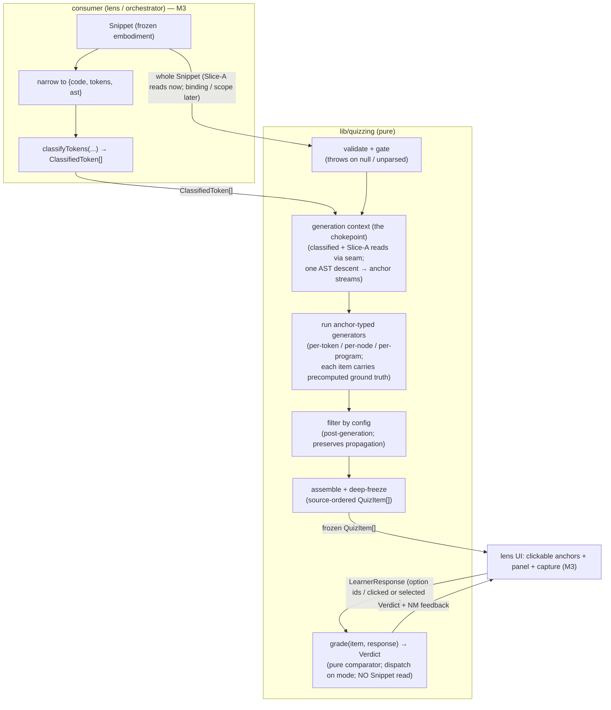

# lib/quizzing — Architecture & Decisions

## Why this module exists

The quiz lens needs auto-gradable questions grounded in the Block Model and the
JEJ notional machine: a learner clicks a syntax element and answers a closed,
checkable question about it. That content-and-grading logic is pure,
exhaustively testable, and conceptually peer-independent — so it lives in the
JEJ-peer `lib/` tier, the same extraction rationale as
[`../classifying/`](../classifying/README.md). Quizzing is the **closed,
gradable** register; socratizing is the **open, Socratic** one — two registers
of the same Block Model, deliberately sharing socratizing's `BlockCell`
vocabulary. See [`./README.md`](./README.md) for the glossary, the bounded
context, and the static-decidability boundary.

## Architectural sketch

> Written Phase 0, before implementation. The Refactor step is held against this
> document — not what the code does, but what shape it takes.

The module has two public entry points: `generateQuiz` (content) and `grade`
(judgment). They are connected only through the `QuizItem` — `generateQuiz`
precomputes each item's machine-derived ground truth, and `grade` reads only the
item and the response. The Snippet enters `generateQuiz` and is never seen by
`grade`; this **one-sided seam** is the load-bearing structural choice.

### Execution phases — `generate-quiz.ts`

Newspaper anatomy: the public export first, the phase helpers hoisted below. The
pipeline mirrors socratizing's `analyzeMicroDecisions` (walk → run → filter →
freeze), generalized so a generator can anchor to a token, a node, or the
program.

1. **Validate + gate** (sync, throws). The inputs must be coherent: a snippet, a
   non-null `classified` array, and a parsed AST (read `status.parsed` /
   `raw.ast` through the accessor seam). Null or unparsed input throws —
   `generateQuiz` is called behind the consumer's parse gate, and a valid
   `classified` already implies a successful parse, so a missing AST here is a
   caller bug to surface (the same posture as the sibling `classifyTokens`).
   This is the module's only throw site.

2. **Establish the generation context** (pure). Assemble the single read-only
   bundle every generator receives — the chokepoint that owns "what a generator
   sees": the pre-computed `classified` token stream, the Slice-A reads
   (`source.code`, `raw.ast`) taken through the accessor seam, and the two
   anchor streams. This phase may dereference `raw.ast` because Phase 1 already
   established it is present. A **single** AST descent produces the two anchor
   streams the generators consume — descend once and collect, never re-walk (the
   same traversal discipline classifying applies, though here the descent yields
   anchor streams rather than role claims). Later forms' binding and scope views
   join this bundle through the seam; the V1 path needs none of them.

3. **Run the anchor-typed generators** (pure, the walk). A registry of
   generators, each declaring the **anchor type** it binds to. The run phase
   treats all three uniformly as streams the context supplies — per-token = the
   `classified` stream (the category-ID form), per-node = an AST-descent anchor
   stream (usage-kind, declaration-site, block questions), per-program = a
   singleton stream of the whole program (the macro questions) — so the run
   phase, not the generator body, owns iteration, and per-program needs no
   special branch: a generator declares which stream it binds to and the run
   phase never inspects anchor type beyond stream selection. Each generator
   emits zero or more `QuizItem`s, each carrying its precomputed ground truth
   (the answer key) and its `groupKey`. Generation is **selective**, not total:
   quizzing produces questions where forms apply, unlike classifying, which
   classifies every token.

4. **Filter by config** (pure, post-generation). Apply the `QuizFilter` to the
   full emitted set — mirroring socratizing's `filterQuestions` — so propagation
   identities (`groupKey`, `unlocks`) are computed over the complete set before
   any item is dropped. Filtering at walk time would deny the propagation logic
   the full set it needs. The `range` group filters on the line span of each
   item's `anchorRange` (char offsets converted to lines via `Source.offsets`,
   taken through the seam).

5. **Assemble + freeze** (pure, shape finalization only). Emit the
   source-ordered `readonly QuizItem[]`, deep-frozen via `deepFreezeInPlace`
   (`@utils/deep-freeze-in-place.js` — objects this module just built), matching
   the classifying sibling. This phase adds, drops, and reorders nothing.

### Grading — `grade.ts`

A pure comparator. It reads only `(item, response)` — never the Snippet — and
dispatches on `item.mode`: a panel-mode item compares the response's option ids
against the item's answer key; a code-surface item (`click-token` /
`click-line`) compares the response's clicked ranges against the item's target
ranges; an exhaustive `select-in-code` item compares the response's selected
ranges against the item's complete target set. The match is **binary** — correct
only on an exact match of the answer key (set equality, whether of option ids or
ranges), no partial credit. A response whose `mode` does not match the item's
grades to `malformed` (a caller / UI bug, distinct from a wrong answer), as does
an `mcq` response carrying an unknown or extra option id. A code-surface item
has no analogous validation: `grade` never sees the Snippet, so it cannot check
a clicked range against the source — a non-matching range is simply `incorrect`.
The mode-mismatch trigger, type-unreachable while only `mcq` existed, is now
live across the full answer-mode space — panel ↔ code-surface, and click ↔
select within the range modes. `grade` is **total and never throws**: it runs in
the lens's interaction loop on every click.

### The accessor-helper seam

Every `Snippet` read goes through a narrow helper **named for the domain
question it answers** — never an inline field access in a generator or in
`grade`. Three surface classes:

| Class                                             | Examples                                                                             | Today                                    | Seam treatment                                                                                               |
| ------------------------------------------------- | ------------------------------------------------------------------------------------ | ---------------------------------------- | ------------------------------------------------------------------------------------------------------------ |
| **A — Slice-A allowed**                           | `source.code`, `source.offsets`, `raw.tokens`, `raw.ast`, `status.parsed`            | populated, stable                        | thin accessor, **permanent**                                                                                 |
| **B — scope shim (input migrates)**               | scope kinds, block-scope forest (via `embody/lib/scope/build-scope` + a static walk) | derivable from Class A                   | accessor body shims from Class A; **deletable** when `CreationEntwined.scopeTree` lands                      |
| **B — occurrence→binding (resolution permanent)** | the binding a token occurrence resolves to under shadowing                           | computed in-module over the scope forest | accessor is **permanent**; only its input (the scope forest) migrates B→C — the resolution stays in quizzing |
| **C — embody-stubbed**                            | `CreationEntwined`, `ScopeEntwined.scopeTree`, `byOffset`                            | `{}` / null / unbuilt                    | the accessor's eventual body, once embody ships the surface                                                  |

The V1 path reads **only Class A**, so it ships with **no shim**. What migrates
B→C is an accessor's **input surface**, not always the accessor: for the scope
shim, the body is fully replaced when `CreationEntwined.scopeTree` lands
(editing **one accessor body** — every caller untouched); for
occurrence→binding, only the scope-forest input migrates while the shadowing
resolution layered on top stays permanently in quizzing (no embody surface
exposes occurrence→binding). Accessors are named for the domain question (e.g.
"the binding this occurrence resolves to"), not for the embody field, so the
name survives the input's B→C swap. The seam introduces **no** generic
field-getter (over-abstraction) and tolerates **no** inline `snippet.raw.*` read
in a generator (a leak). `byOffset` stays out even as a shim: click→token
resolution binary-searches `ClassifiedToken` ranges, and per-node anchoring
takes node identity from the single AST descent (Phase 2), not an offset index —
so neither needs `byOffset` (both are Class-A answers).

## Data flow

Two facts the diagram makes load-bearing: `classified` enters the generators
pre-computed by the consumer (the deliberate input asymmetry — quizzing never
calls `classifyTokens`), and `grade` reads only the item and the response, never
the Snippet (the one-sided seam).

## Structural constraints

- **Two entry points, joined only by the `QuizItem`.** `generateQuiz`
  precomputes ground truth onto each item; `grade` consumes it. No shared
  mutable state, no second channel between them.
- **Input asymmetry is deliberate.** `generateQuiz` takes the whole `Snippet`
  plus the pre-computed `classified`; it never calls `classifyTokens`. The whole
  Snippet is taken so the accessor seam can grow into binding / scope reads; the
  V1 path reads only Slice-A surfaces.
- **One AST descent.** The two anchor streams (`identifierAnchors` for the
  per-node generators, `propertyAccessAnchors` for the program-anchored V4) are
  collected in a single traversal during context establishment; generators
  consume those streams rather than each re-walking the AST.
- **Generation is selective, grading is total.** Generators emit only where
  their form applies (quizzing is not total over tokens, unlike classifying).
  `grade`, by contrast, is total over the answer-mode space and never throws.
- **Post-generation filtering preserves propagation.** `groupKey` and `unlocks`
  are computed over the full emitted set before the filter runs; the filter
  never feeds back into generation.
- **One-sided seam.** `grade` never reads the `Snippet`. Each `QuizItem` carries
  only plain frozen data (option ids, ranges, strings) — never a callback, a
  thunk, or a Snippet reference — so the seam cannot leak into grading and
  freeze / determinism hold.
- **Pure on frozen inputs.** No mutation of `snippet`, `classified`, `code`, or
  any AST node; the module runs unchanged on deep-frozen embodiment data. No
  `embody()`, no `Snippet` construction.
- **Deterministic.** Same `(snippet, classified, filter)` → same output. No
  randomness, no sampling; the only configuration is the `filter`.
- **Frozen output.** The returned array and every `QuizItem` are deep-frozen;
  every `Verdict` is frozen.
- **`byOffset` is never consulted.** Anchor → token resolution uses
  `ClassifiedToken` ranges (Class A), not the unbuilt `byOffset` (Class C).
- **Source-slice authority.** Any prompt or option text derived from the source
  comes from `code.slice(...)`, never from Acorn's processed `.value`.

## Out of scope

- **Token classification** (category / role / partner / totality) —
  `lib/classifying`. Quizzing consumes `ClassifiedToken[]`; it never re-derives
  it.
- **The lens** — rendering, mastery state, click capture, the propagation
  mechanic, decorations, and `recommend()` — `lenses/quiz` (M3). Quizzing emits
  `groupKey` / `unlocks` / target ranges as data; the lens decides presentation
  and folds verdicts into mastery.
- **The open / Socratic register** — open-ended questions, the **purpose**
  Block-Model row, and the voice / clarity / trap categories —
  `orchestrate/lib/socratizing`.
- **Parsing, scope entwinement, realm tables (end state)** — `embody`. Quizzing
  reads what embody produces (Class A) and shims what it has not yet built
  (Class B); it does not own the parse or the entwined graph (Class C).
- **The recommender mapping** — `BlockCell → BlockModelCell` — the M3 lens's
  `recommend()`.
- **Runtime evaluation.** All ground truth is statically decidable; quizzing
  never executes the snippet.
- **Configuration beyond `filter`.** No probability, no sampling, no memory of
  past answers — a pure function of `(snippet, classified, filter)`.
- **Input gating + coherence (caller responsibility).** The caller must invoke
  `generateQuiz` behind `status.parsed` and pass a `classified` derived from the
  same parse of the same snippet. Quizzing validates shape (throws on null /
  unparsed), not provenance — mismatched `snippet` / `classified` is a caller
  bug, the same posture classifying documents for its three inputs.

## Decisions

- **One-sided seam: `grade` never reads the Snippet** (precomputed ground truth
  on the item). Keeps grading a pure, deterministic comparator the lens runs on
  every click without re-parsing, and confines the entire Class-B/C shim surface
  to `generateQuiz`.
- **`generateQuiz` throws; `grade` is total** (AR-1 OPEN #3 / #2).
  `generateQuiz` sits behind the consumer's `status.parsed` gate and receives a
  `classified` that implies a successful parse, so null / unparsed input is a
  caller bug to surface (mirroring `classifyTokens`). `grade` runs in the
  interaction loop, so an uninterpretable response is a `malformed` verdict, not
  an exception.
- **Discriminated unions over optional bags** for `QuizItem` (on `mode`),
  `LearnerResponse` (on `mode`), and `Verdict` (on `status`). `grade` narrows
  item and response on one discriminant; the compiler proves the answer-key
  fields are present and catches a mode mismatch. Diverges from the campaign
  sketch's optional-field bag.
- **`Verdict` reports judgment + feedback, not the answer key.** The lens
  reveals the correct answer from the item it already holds; echoing it on the
  `Verdict` would duplicate the answer key and introduce a mode-specific field.
  The `malformed` arm keeps a UI bug from being scored as a wrong answer.
- **Filter mirrors `MicroDecisionConfig` semantics, not its shape** (AR-1 #4). A
  flatter `Partial<Record<…, boolean>>` suffices because every `Family` /
  `Category` value is a single lowercase token, so no kebab→camel key map is
  needed. `range` is 1-based inclusive lines (offsets→lines via
  `Source.offsets`), matching the peer.
- **`Family` is quizzing's own vocabulary** (AR-1 #1), not `Category` (wrong
  axis — per-token) and not socratizing's `Feature` (a related but
  non-isomorphic axis; `keywords` / `delimiters` have no `Feature`, `reading`
  has no family). The partial correspondence is built where the M3 recommender
  needs it, not promised as a total map.
- **Enumerate the closed string vocabularies fully; build modes as their
  generators land** (AR-1 OPEN #1). `AnswerMode` (five) and `Family` (seven) are
  spec-named end-state vocabularies, enumerated up front. The `mcq` variant, the
  code-surface `click-token` / `click-line` variant, and the
  exhaustive-selection `select-in-code` variant of `QuizItem` /
  `LearnerResponse` and their `grade` arms are built; `multi-mcq` is the only
  mode that remains enumerated-not-built. Each mode widens the union additively
  — a cross-consumer contract event with the lens.
- **Code-surface modes: two variants under one rule — one variant per assessment
  gesture, capture mechanics folded within.** `click-token` and `click-line` are
  the same gesture (a single click, one span) differing only in capture
  granularity, so quizzing folds them into a single `CodeSurfaceQuizItem` with a
  two-mode discriminant — not two near-duplicate types. `select-in-code` is a
  _different_ gesture (multi-select-and-confirm, N targets, exhaustiveness the
  graded skill), so it is a **separate** variant (`SelectInCodeQuizItem`) — the
  exhaustive-selection genre (the sameness forms V10a/b/c and later
  block-selection forms: "click every occurrence", "select the declarations of
  all variables used"). The _same_ rule that collapsed click-token / click-line
  splits this off. The earlier note that it would be a "subset, not exact"
  variant is **retracted**: the catalog phrases every such form as a _complete_
  target set ("click EVERY occurrence"), and a complete set graded **binary**
  (no partial credit) _is_ exact set-equality — "subset" grading would be the
  forbidden partial credit. Today `SelectInCodeQuizItem` is a structural twin of
  `CodeSurfaceQuizItem` (only `targetRanges`); the duplication is **deliberate**
  — the variants are kept separate because the exhaustive genre is expected to
  diverge, not collapsed into a shared supertype the Refactor step should
  reintroduce. Grading is the **same** exact set-equality: both range arms reuse
  the file-local `rangeKey` + `isSameSet` helpers (extracted to a shared
  `gradeRangeSet` so `no-identical-functions` does not fire), and the
  per-variant arms differ only in which response field they read
  (`clickedRanges` vs. `selectedRanges`) and their `response.mode !== item.mode`
  guard. Grading stays one-sided, so there is no range analogue to mcq's
  unknown-option-id `malformed`: quizzing never sees the Snippet and cannot
  validate a range against it — the only `malformed` trigger is a mode mismatch,
  now live across the full answer-mode space (panel ↔ code-surface, and click ↔
  select within the range modes). The **`targetRanges` non-empty invariant is
  documented, not yet type-enforced**, on both range variants alike; tightening
  it to a non-empty tuple is a deferred cross-variant hardening, not
  select-in-code-specific debt. **`click-line` and `select-in-code` are graded
  but not yet generated** — `click-line` needs offset→line conversion
  (`Source.offsets`), and `select-in-code`'s generators are the V10a/b/c
  sameness forms (a later increment); the built declaration-site form (V8) emits
  `click-token`.
- **Formative feedback is the lens's to compute; quizzing only supplies the
  data.** For an exhaustive `select-in-code` answer, "you found these, you
  missed these, you wrongly included these" is richer than a binary verdict —
  and the lens _can_ render it with no new quizzing surface: it holds the item
  (so it holds `targetRanges`) and the learner's `selectedRanges`, so it can
  derive the missed and wrongly-included ranges itself. Quizzing therefore
  supplies only the complete target set and the conceptual `feedback` (a plain
  `string`); `SelectInCodeQuizItem` carries **no** missed/extra data and no
  feedback shape beyond the inherited `feedback`, and the `Verdict` stays
  **binary and one-sided** — it never echoes the answer key, so the positional
  formative feedback is computed lens-side, never serialized onto the item or
  the `Verdict` (preserving the one-sided seam). Mastery is binary —
  exhaustiveness is the skill, so only the complete set is `correct` — while the
  formative presentation lives where the snippet and the learner's selection
  already are.
- **Keep `unlocks` and `anchorPath`; defer the filter `forms` / `cells` knobs**
  (AR-1 OPEN #4). `unlocks` and `anchorPath` are end-state base-type fields
  whose later addition would break the locked base; the filter knobs are
  additive (a new optional group is backward-compatible), so they land with the
  clusters that need them. An `unlocks` entry **is a `groupKey` string** in the
  same namespace `QuizItem.groupKey` uses (whatever axis the peer's form keys on
  — see the `groupKey` decision below; not a new id space). A sameness form (inc
  6's V10a/b/c) lists one entry per distinct group it earns and names whatever
  key its propagation peers carry, so the reference survives the `usage:`-axis
  re-key (V10b's binding × use-type grain) without a contract change. The lens
  resolves it to the group it bulk-credits; quizzing guarantees the reference is
  well-formed, not that the group keeps members surviving the caller's `filter`
  (that is the lens's to handle). It is lens-consumed, never read by `grade`,
  and needs no type-shape or grade change — a data contract shipped unconsumed,
  the same posture as `groupKey` (emitted as data, never read by `grade`). Both
  `unlocks` and `groupKey` stay plain `string` (not a branded `GroupKey`) until
  a producer and consumer exist to enforce against — an OPEN for the inc-6
  generator increment. `anchorPath` is **optional**: token-anchored forms (the
  category-ID form) carry only `anchorRange` (a token is not an AST node), while
  node-anchored forms also carry the path. `anchorRange` is the universal
  anchor; `anchorPath` is the AST-identity refinement where one exists.
- **`groupKey` is keyed on the form's classification axis** (AR-1 #8), not on
  what the lens displays, and is namespaced by axis: classification forms (the
  category-ID form and role-aware forms) key on `category:<category>`, refined
  to `category:<category>:<role>` where the token carries a role; binding-aware
  forms key on binding identity (`binding:<start>-<end>`, the declaration-site
  span); the usage-kind form keys on binding × use-type
  (`usage:<decl-start>-<decl-end>:<usageKind>`) — the V10b re-key, so every
  occurrence of one binding used the same way shares a group — with a
  per-occurrence group-of-one fallback (`usage:occ:<start>-<end>`) for any
  occurrence with no resolvable binding (a free global, or any name the scope
  forest does not track — the same boundary V8 resolves behind, so parameters
  and the like do not group under V7/V10b). The cross-variable sameness form
  V10c keys on the use-type alone (`usage-kind:<usageKind>`), a fourth,
  binding-agnostic axis. The two-chains form V4 keys on `chain:<role>:<name>`
  (role ∈ `scope-chain` | `prototype-chain`), the sixth namespaced axis and a
  binding-agnostic one parallel to `usage-kind:`: which chain a name is found
  through is a syntactic-position fact independent of which binding wins under
  shadowing, so every occurrence of a name in a chain role shares one group (all
  `.length` accesses share `chain:prototype-chain:length`). On the
  classification axis `identifier` / `keyword` (which classifying makes
  role-less) stay on the bare two-segment form, while operator / literal /
  delimiter gain the `:<role>` refinement; the `category:`, `binding:`, `usage:`
  (binding × use-type), `usage-kind:` (cross-variable), and `chain:`
  (two-chains) serializers live in `keying/`, while two `groupKey`s stay inlined
  in their generators rather than serialized in `keying/`: V7's
  `usage:occ:<start>-<end>` group-of-one fallback (for an occurrence with no
  resolvable binding) and V6b's fixed `element-type:const-update` (the
  const-update twin's single-value element-type group — deliberately off the
  `category:keyword` axis, which holds the text-surface keyword-recognition
  forms V1/V2, because V6b is an execution-dimension runtime-error fact). The
  category-ID form's propagation grain is thus intentionally finer than its
  category answer key — a consumer wanting category-level grouping can
  prefix-match on `category:<category>`. The key is deterministic from
  `(snippet, classified, filter)` — never a function of a lens display choice
  quizzing never receives.
- **V1 `id` scheme is `form@start-end`** (e.g. `V1@12-13`), derivable from the
  form and the anchor alone; binding-flavored ids (`form/binding:x@decl`) are a
  later-form scheme that lands with occurrence→binding resolution.
- **The variables-family atom forms (inc 7a): V2 / V6 / V6b + the `Binding.kind`
  widening.** V2 (keyword-vocab) is the **first curated generator** — its option
  text and feedback are a compile-time constant table rather than computed
  strings (README § Glossary "Curated bank vs generated"), yet its correct
  answer stays machine-determined (the `let` / `const` token text decides the
  card). V6b (const-update twin) is the second curated form (fixed `TypeError`
  answer + three authored misconception distractors). V6 (kind-semantics) and
  V6b read reassignability off the internal `Binding`, which gained
  `kind: 'let' | 'const'` (projected from `DeclarationInfo.kind`). `kind` is
  non-identity convenience data and **never folds into a group key**
  (`bindingGroupKey` keys on `declarationRange` only). V6 / V6b fire once per
  binding on the declaration occurrence (`usageKind === 'declared'`) — for JeJ's
  `let`/`const` fragment the declared occurrence is always the binding's
  source-first occurrence (TDZ forbids use-before-declaration), so firing on
  `declared` is the simplest one-per-binding rule and the anchor is always the
  declaration span. V6 keys on the binding identity (`binding:<decl>`, a
  V10a-unlockable peer); V6b keys on the inline `element-type:const-update`
  group (above). All three reuse the binding-flavored / `form@start-end` id
  schemes; none touches the public `types.ts` / `grade.ts` (every form is `mcq`,
  an already-built variant). **Input precondition (post-audit hardening).**
  `generateQuiz` gates on `status.parsed`, not `status.validated` (real
  validation is an unwired embody stub today), so non-JeJ but parseable snippets
  reach the generators — the forms guard defensively rather than assume JeJ
  input. V6 skips a laundered `var` binding (a `kind` outside `let`/`const`); V2
  fires only when its `let`/`const` keyword token is immediately followed by the
  declared identifier — JeJ's simple `let x` / `for (let i …)` form — so it
  never over-fires a vocab card on a contextual keyword used as a property or
  object-literal key (`obj.let`, `{ const: 1 }` — both emitted as keyword tokens
  by embody's (acorn-based) context-free tokenizer), and it likewise declines a
  non-JeJ destructuring declaration (`let { x }`, `const [a]` — next token `{` /
  `[`), the same silence the binding-aware forms already give patterns. This is
  a deliberate **V1/V2 divergence**: V1 (category-ID) correctly answers
  `keyword` for such a token — "what category is this?" is honest even for a
  contextual keyword — while V2's "what does this keyword _do_?" is meaningful
  only for a real declaration, so only V2 guards.
- **One generator per `form`, registered by anchor type.** The three-way anchor
  axis (token / node / program) deliberately extends socratizing's two-way point
  / program split, because classifying's output is token-indexed (per-token
  anchors are not AST nodes). The registry, not the generator, owns iteration.
