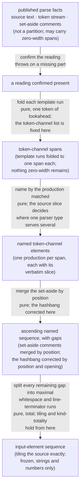

<!-- cspell:ignore lookaheads spellme tokenizer gapless -->

# lib/scanning — Architecture & Decisions

## Why this module exists

A token stream is not a partition of a source. The parser skips whitespace,
splits one template literal across several tokens, sets comments aside on a
different channel, and can emit tokens of zero width. Anything that must account
for **every character** — a surface that draws the source, an exercise that
walks it, a colorizer that paints it — has to rebuild the missing partition, and
the two rules that rebuild it are small, easy to get subtly wrong, and silent
when wrong. A mis-folded template or a mis-read right brace produces a plausible
sequence with the wrong boundaries, and anything built on it teaches a falsehood
confidently.

Deriving that partition once, proving its tiling invariant once, and publishing
it in the specification's own vocabulary is the whole argument. See
[README.md](./README.md) for the vocabulary and its grounds.

## Architectural sketch

> Written Phase 0, before implementation. The Refactor step is held against this
> document — not what the code does, but what shape it takes.

**Inbound contract.** A source text, the parser's token array, and the parser's
comment array — the three published facts of a successful tokens stage, handed
in by value. **Outbound contract.** One frozen sequence of named, spanned
elements tiling the source exactly.

### Execution phases

1. **Confirm the reading** _(sync, throws)_ — reject a missing or absent source,
   token array or comment array at the boundary. This is the module's only throw
   site: it is called behind a successful-tokens gate, so an absence here is a
   caller's bug to surface rather than a runtime state to absorb. **Input:** a
   caller-supplied reading, possibly incomplete. **Output:** a reading confirmed
   present.

2. **Fold the template runs** _(pure, one token of lookahead)_ — a backtick, or
   a right brace whose immediate successor is a template chunk, opens a run that
   its own closer ends; the run becomes one element carrying every token it
   spans. Nesting needs no stack, because each run closes before any inner run
   opens. **The element list for the token channel is fixed at the end of this
   phase, and nothing of zero width survives it** — the parser's empty chunks
   are absorbed into the runs that contain them. **Input:** the token stream.
   **Output:** one span per token-channel element, each carrying the positions
   of the tokens it wraps.

3. **Name the token-channel elements** _(pure, span and slice only)_ — assign
   the production the lexical grammar matched, and attach each element's
   verbatim source slice. A folded run takes its name from its opener. A single
   token takes its name from its token type, **refined by the source slice
   wherever one parser type serves several productions** — the parser gives one
   type to every compound assignment, so the division-assignment form is
   separated from its type-mates by the characters its span already points at.
   The largest rule here is a many-to-one collapse: every reserved word's own
   type names the identifier production. The four trivia kinds are **not**
   assigned here; they arrive in the two phases below, which is why this phase
   is named for the channel rather than for all of them. **Input:** unnamed
   spans. **Output:** named token-channel elements, each carrying its slice.

4. **Interleave the set-aside** _(pure)_ — merge the comments the tokenizer set
   aside into source order, correcting the hashbang by **position and opening
   characters together**, since a line comment at the start of a program is
   otherwise indistinguishable from one by position alone. Nothing else about
   the comment channel is corrected. **Input:** named token-channel elements.
   **Output:** an ascending named sequence, still with gaps.

5. **Fill the gaps, and freeze** _(pure, total)_ — split every remaining gap
   into maximal whitespace runs and maximal line-terminator runs, never merging
   the two kinds. Splitting and naming are **one act** here, because which kind
   a run is decides where it ends, and each run takes its verbatim slice as it
   is cut — as the merged comments took theirs in phase 4, so that every
   published element carries its slice by the time this phase ends. **Tiling is
   established here and nowhere else, and kind-totality closes with it.** Then
   freeze: nothing is added, dropped or reordered afterwards, the token
   positions assigned in phase 2 stay valid, and the freeze reaches nothing this
   module did not build because everything published is a string or a number.
   **Input:** a named sequence with gaps. **Output:** the frozen, tiling
   sequence.

### Data flow

### Structural constraints

- **Tiling holds for any coherent reading, and it is not a fidelity claim.**
  Given a source and tokens from one reading of it (see § Out of scope), the
  published sequence is ascending, non-overlapping, non-empty, and joins to
  cover the whole source. Where the parser mis-reads — its known
  slash-after-await case — the sequence is **wrong and still tiles**. A consumer
  may rely on the invariant always; it may never read the invariant as evidence
  that the reading is the specification's. The distinction decides what a test
  can assert universally.
- **The source slice is authoritative.** An element's text is always the slice
  its span points at, never the parser's processed value, and the naming rule
  consults that slice wherever a parser type is ambiguous.
- **Nothing re-tokenizes, and no counterfactual scan happens either.** Every
  rule reads published tokens, published comments, and the source text. A rule
  needing a second lex belongs in a different module.
- **Both lookaheads read exactly one token, and both admit both template-chunk
  types.** A chunk carrying an escape legal only under a tag is typed
  differently by the parser; admitting only the ordinary type mis-names the
  brace before it and then searches past the end of the array for a closer.
- **The freeze reaches only what this module built.** Nothing published holds a
  reference into the parser's own structures, which is what makes the freeze
  promise keepable.
- **Run collapsing is the one deliberate departure**, is stated at the field it
  governs, and is reversible by a consumer.
- **Fail loudly at the boundary for an absent part, never inside.** An absent
  source, token array or comment array throws at the boundary, and all three are
  checked the same way. A **present but wrong-typed** part is not covered: that
  is a coherence failure, and it sits out of scope beside provenance below. A
  program the parser refused never reaches this module, because the caller's
  gate closes first.

  This bullet read "Fail loudly at the boundary, never inside" unqualified until
  an AR-5 measured it false — the guard type-checked `code` while
  presence-checking the two arrays, so one field was treated unlike its
  siblings. Asked whether the code should widen to meet the sentence or the
  sentence should narrow to meet the design, the ruling was **narrow**, and the
  type-check came out. (human ruling 2026-08-18) The oldest artifact agrees: the
  phase-1 description above, written at Phase 0 before any implementation, has
  always said _missing or absent_ — so the type-check was the drift, not the
  contract.

### Out of scope

- **Input coherence.** The source text, the token array and the comment array
  must come from one reading of one source. This module validates presence, not
  provenance; a token ending past the end of the source is a caller bug, and it
  is the one thing that could break the tiling claim above. **A part of the
  wrong type is the same class of failure** (human ruling 2026-08-18, the same
  one recorded under § Structural constraints) — a number where a token array
  belongs is not an absence, and the boundary does not catch it. It surfaces
  from wherever the part is first used, which is the one place this module's
  fail-at-the-boundary rule deliberately does not reach. Where it surfaces
  depends on the part [measured 2026-08-19, the committed module bundled with
  `esbuild --external:acorn` and called directly]: `tokens: 42` throws from the
  fold, `tokens.keys is not a function`; an array of the wrong _contents_ gets
  further, to the naming rule, and throws reading `.keyword` on a token type
  that is not there. **Nothing is published in either case** — an earlier
  revision of this bullet claimed the wrong-contents case "hands every element
  the whole source before anything throws", which is false: the whole-source
  slice is computed for the first element and dies in the same iteration, so no
  caller ever sees it.
- **The caller's gate and projection.** Gating on a successful tokens stage, and
  projecting the three values off an embodiment's facts, are the caller's
  one-line boundary and are named in the README rather than done here.
- **Selection, filtering, ranking, or presentation.** The module describes; a
  consumer chooses.
- **Destinations.** Where an element goes, what it means to a learner, whether
  it is claimable — all consumer vocabulary. This module reports what the
  scanner produced and says nothing about what becomes of it.
- **The goal symbol as a published field.** It is recoverable from the kind, and
  publishing a derived value invites it to drift from what derives it.
- **Semantic categories.** What an element _does_ in the notional machine is the
  sibling classifying leaf's question over the same tokens, deliberately
  answered differently.
- **Matching the sibling leaf's boundary.** This module presence-checks all
  three of its parts; `lib/classifying` additionally type-checks its `code`
  [read:
  [`../classifying/DOCS.md` § Execution phases](../classifying/DOCS.md#execution-phases)].
  Both match their own Phase-0 sketch and both were ruled on the same day (human
  ruling 2026-08-18); they do not match each other, and the deferred fold of the
  two leaves into embody is where that should be settled rather than here. This
  bullet exists because the only record of the parity was a code comment that
  came out with the type-check, leaving a reader of this module nothing to find.
- **The parser's own defects.** They are recorded upstream and worked around
  here where a workaround exists; this module neither detects nor repairs the
  ones that leave no trace.
- **Deciding which programs are fit to put in front of a consumer.**

## Decisions

- **The sketch names no file, function or variable.** The house rule bars
  identifiers from a sketch, and two peers on this tier break it. This one does
  not, and the phases above are a **refactor target rather than a file map** —
  the module is one public export with hoisted in-file helpers, so a file map
  would be a list of one.
- **One public file, in-file helpers.** The fold, the naming and the gap split
  each have exactly one call site, and this package extracts to a new file only
  at two or more. An earlier draft promised a nested library directory; no leaf
  on this tier nests a directory of that name — the two that do nest hold a
  sub-module and a worker, not a helper bag — and where this tier's leaves have
  grown past one file they have grown flat siblings. The split would also have
  obliged three more test files, since each exported function owes one, where
  in-file helpers are covered through the public export.
- **Indices, not token references.** Publishing the parser's token objects would
  make the freeze promise impossible to keep, because a deep freeze walks into a
  token's type and that object is a process-global the parser shares across
  every parse. Indices are also the only join key available to a consumer
  composing two derivations over one token stream (human ruling 2026-08-14). The
  citation and its grounds are in README.md § Public API; the field carrying it
  is documented in types.ts.
- **Trivia are elements, not gaps.** Publishing whitespace and comments as
  first-class elements is what makes tiling total, and totality is the property
  that lets a consumer walk the array and know it has seen every character once.
  The alternative — publishing token-channel elements and leaving consumers to
  fill gaps — recreates in every consumer the arithmetic this module exists to
  do once.
- **Whitespace runs collapse; the two trivia kinds never merge.** A surface
  drawing one element per space is unusable, and a run is the unit a surface
  wants. Keeping whitespace and line terminators distinct preserves the only
  distinction a consumer downstream actually asks about.
- **The module throws rather than returning a refusal.** It sits behind a
  successful-tokens gate, not inside a render loop, so an absent input is a
  caller bug. This differs from modules that model refusal as data, and the
  difference is the gate.

## Navigation

- **Orientation and vocabulary:** [README.md](./README.md).
- **Parent tier:** [../README.md](../README.md).
- **The sibling answering a different question over the same tokens:**
  [../classifying/README.md](../classifying/README.md).
