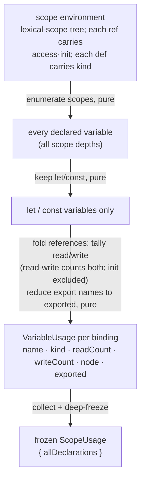

# lib/scoping — Architecture & Decisions

## Why this module exists

Two engines — `lib/socratizing` now, `lib/quizzing` next — ask the same
declaration-level questions: "is this `let` ever reassigned?", "how many times
is `count` read?". Both need the same flat, per-declaration read/write tally.
The scope graph that answers them is computed once by embody (via eslint-scope);
recomputing it inside each engine would duplicate a subtle analysis (reference
resolution, read/write classification, shadowing) and risk two engines
disagreeing about the same program. This leaf factors the flatten into one
domain-blind projection both engines consume, so there is a single scope truth
and neither engine carries scope-graph machinery. See
[`./README.md`](./README.md) for the fold rule and the bounded context ("scoping
projects; consumers judge").

## Architectural sketch

> Written Phase 0, before implementation. The Refactor step is held against this
> document — not what the code does, but what shape it takes.

### Execution phases

`derive-scope-usage.ts` is the single public export; the phases below are one
pure pass over the environment, hoisted in-file as helpers if readability asks.

1. **Enumerate** (pure) — visit every scope in the environment (the root scope
   and all nested scopes, at every depth) and collect its variables. Input: the
   scope environment. Output: every declared variable, regardless of depth.

2. **Select** (pure) — keep only variables whose declaration kind is `let` or
   `const`; drop `var`, function, parameter, class, and import bindings. Input:
   all variables. Output: the declarations this leaf reports.

3. **Fold** (pure) — for each kept variable, read `name` / `kind` / `node` from
   its declaration (`node` = the declared identifier), tally `readCount` /
   `writeCount` from its references using embody's per-reference access
   classification — counting read-write references toward both, and **excluding
   the initializer write** — and reduce its export names to `exported`, the
   question this leaf's consumers ask of the module boundary. Input: a
   `let`/`const` variable, its references, and its export names. Output: one
   `VariableUsage`.

4. **Assemble + freeze** (pure) — gather the `VariableUsage`s into
   `{ allDeclarations }` and deep-freeze. Input: the folded usages. Output: a
   frozen `ScopeUsage`.

### Data flow

### Structural constraints

- **Pure on frozen inputs.** No mutation of the environment or any AST node;
  runs unchanged on deep-frozen facts. The declared-identifier `node` is carried
  by reference, never rewritten.
- **Reads the classification, never recomputes it.** Read/write status and
  declaration kind come from embody's one scope pass; this leaf never re-walks
  the AST. No `getChildNodes`, no second scope analysis.
- **The initializer is never a write.** A `let n = 0` never reassigned must
  report `writeCount: 0` — the prefer-`const` signal the consumers hang on.
  Excluding the initializer reference is load-bearing, not cosmetic.
- **`node` is the declared identifier.** It must be embody's
  `ScopeDefinition.name` (the identifier), not `ScopeDefinition.node` (the
  declarator) — consumers match it by identity (`===`), so the wrong node
  silently breaks every `unused-variable` match.
- **Node identity is preserved.** The environment and `facts.ast` hold the same
  AST node references, so `VariableUsage.node === <the AST identifier>`. A
  committed test must assert this — the identity match is an assumption, not a
  guarantee, until tested.

### Out of scope

- **The scope tree / nesting depth** — the output is a flat list; consumers that
  need nesting read the environment directly.
- **Judgment** — whether a `let` should be `const`, whether an unused variable
  is a bug: the consuming engine's pedagogy, never this leaf's.
- **`var` / function / parameter / class / import bindings** — not reported.
- **Computing scope** — embody owns the one scope pass; this leaf only projects
  it.
- **Fact narrowing** — this leaf takes the unwrapped `Environment`; confirming
  `facts.environment.ok` and passing `.value` is the caller's one-line boundary.

## Decisions

- **Scope source: `facts.environment`, not a vendored AST walk (maintainer
  lock).** The legacy `embody/lib/scope/build-scope.ts` produces an equivalent
  flat view from the AST alone, and porting it would re-green the ported tests
  by construction and need no embody change. It was deliberately rejected: the
  environment is eslint-scope's complete, ECMAScript-compliant, navigable scope
  truth (hoisting, TDZ, closures, strict/module), computed once and shared by
  every scope consumer; a bespoke JeJ-subset walk is neither complete nor
  shared. The cost the lock accepts is a cross-region dependency (below) and a
  leaf that consumes an embody type (the charter widening in `../README.md`).

- **Depends on an enriched `ScopeReference` (sequenced ahead of
  implementation).** Read/write tallies require embody to project eslint-scope's
  access classification onto its contract: `ScopeReference.access`
  (`'read'`/`'write'`/`'readwrite'` — one token, no hyphen) and
  `ScopeReference.init` (was this the declaration's own initializer). embody
  today drops both at projection, so this leaf's counts are **unbuildable until
  that enrichment lands** — it is a hard prerequisite, delivered by a separate
  embody session, not part of this leaf. These field names are the authoritative
  contract this leaf consumes.

- **The fold rule follows eslint-scope, and diverges from legacy
  `build-scope`.** eslint-scope is the oracle. Three intended divergences from
  the legacy walk the ported tests were first written against: a member-target
  (`obj.x = 5`) counts `obj` as a **read** (build-scope counted it a write);
  destructuring bindings are **included** (build-scope registered only
  plain-identifier declarations); `let`/`const` nested in function / catch /
  class scopes are **included** (build-scope modelled only program / block /
  for-of). The JeJ corpus rarely exercises the last two; the ported count-tests
  re-baseline to eslint-scope values where a test encoded the old behaviour.

- **Narrow output; renamed to avoid a homonym.** `ScopeUsage` carries only
  `allDeclarations` (no scope tree) and `VariableUsage` only the fields the
  scope-reading analyzers touch — the legacy `root`/`initNode`/`scopeDepth` are
  dropped. The types are named for what they project (usage), not
  `ScopeAnalysis`/`DeclarationInfo`, because two live `DeclarationInfo`s already
  exist: the counting declaration-site shape in `embody/lib/scope/types.ts`
  (whose `ScopeInfo`/`ScopeAnalysis` the trace and validating leaves import) and
  the count-free one on embody's public contract (`embody/types.ts`). This leaf
  supersedes the legacy walk without replacing it in place, so the vocabularies
  have to coexist — and naming for the projection survives a fourth homonym in a
  way naming for a differentiator would not.
