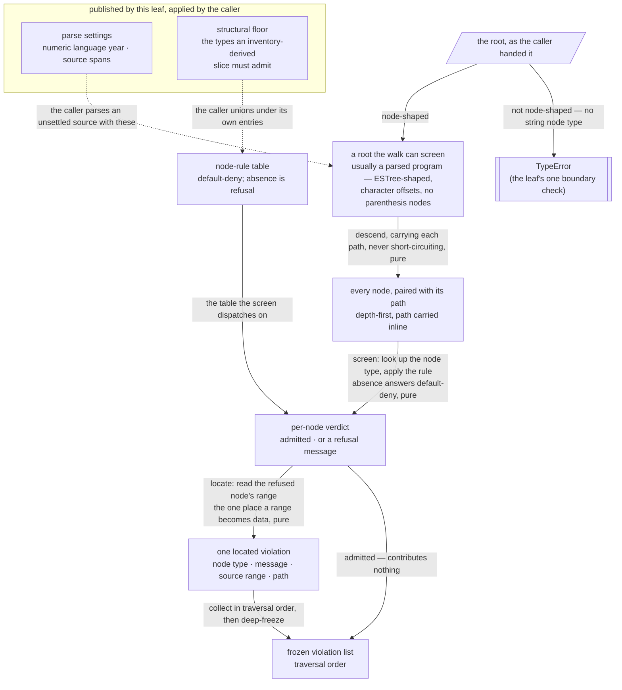

# lib/screening — Architecture & Decisions

## Why this module exists

Two independent consumers ask the same question of a program — "where does this
leave the curated slice?" — and both need the same default-deny walk, the same
path vocabulary, and the same violation shape. One is a language level, whose
`validate` hands its own policy table to the walk. The other screens programs
that have no lifecycle at all: a program a model just produced, or one being
inventoried to derive a table from.

Left inside the level, the machinery would be reached into across a boundary
that was never meant to carry it, or copied and allowed to drift. The package
already carries one such drift — an independently-evolved copy of this walk
lives in the pre-greenfield tree with a third node-rule state and violations
that carry a severity, and it cannot be substituted for this one.

Factoring it into one domain-blind leaf keeps a single screening truth. And
because the walk's totality is **parse-relative** — a node type reachable under
the caller's settings and absent from the table is a false rejection, not a true
violation — the settings that soundness is relative to belong in the same place,
so the pairing cannot drift apart. See [`./README.md`](./README.md) for the
default-deny rule and the homonyms these names collide with elsewhere.

## Architectural sketch

> Written Phase 0, before implementation. The Refactor step is held against this
> document — not what the code does, but what shape it takes.

### Execution phases

The walk is the module's principal export: one pure pass over a parsed tree. Two
of the phases below are published in their own right, because callers composing
their own screening need them — the path-tagged child traversal and the
violation factory. The rest are the walk's internals, hoisted in-file as helpers
if readability asks. One guarantee per phase, each auditable alone.

1. **Descend** (sync, pure) — visit every node of the tree depth-first, joining
   each node's own path with the segment that reaches each child, so a node's
   identity is carried as the walk goes rather than built into a separate map.
   The descent never short-circuits: a refused node's children are still
   visited, which is what makes the collection complete rather than first-hit.
   Input: a parsed program and the root path. Output: every node in the tree,
   each paired with its path. **Guarantees coverage.**

2. **Screen** (sync, pure) — for one node, look up its node type in the
   allowlist's node-rule table and apply what is found. Absence answers with the
   default-deny message, the one message this leaf authors — that is the whole
   of default-deny. Outright admission answers yes. A constraint check answers
   legality only, in its own words. The wording itself lives in the walk, named
   here only by category so a reword cannot strand this sketch. Input: a node
   and the table. Output: a verdict — admitted, or a refusal message.
   **Guarantees default-deny.**

3. **Locate** (sync, pure) — turn a refusal message into a violation by reading
   the refused node's source range and pairing it with the node's path and node
   type. This is the **one** place in the module a range becomes data, which is
   why a constraint check is forbidden to carry a position of its own. Input: a
   refusal message, its node, and its path. Output: one deeply frozen violation.
   **Guarantees a single range read.**

4. **Collect** (sync, pure) — gather the violations in traversal order and
   freeze the result. Input: the located violations. Output: a frozen list.
   **Guarantees order and freezing.**

Two exports are **published data rather than phases**: the parse settings a
caller parses an unsettled source with, and the structural floor a caller unions
under its own entries in a table it derived by inventorying an existing program.
Neither is consumed by the walk; both exist so that what the walk's soundness
depends on is nameable.

### Data flow

The dotted edges are the caller's work, not the module's: the leaf publishes
those two data artifacts and never applies them itself.

### Structural constraints

- **Never parses.** The module takes a parsed tree and publishes settings. A
  parser call here would make it the second parse configuration it exists to
  prevent, and would give it an error vocabulary it has no business owning.
- **Pure on frozen inputs.** No mutation of the tree or any node; runs unchanged
  on deep-frozen facts. Returned violations are deeply frozen, and a caller's
  location object is copied before freezing rather than frozen in place.
- **Complete, never first-hit.** A refused parent's children are still screened.
  Nothing at runtime can detect a first-hit walk — it under-reports silently,
  and a violation count quietly stops meaning what consumers read it as — so
  this is carried by a pinned test over a nested refusal, never by a guard.
- **One place a range becomes data.** Only the locate phase turns a node's
  offsets into a violation, and the check type makes it impossible for a rule to
  return a position of its own — so legality and position are separated by the
  contract, not merely by convention.
- **Paths are carried inline, never mapped.** A node's identity is built during
  the descent. A separate path map would be a second traversal that could
  disagree with the first.
- **A path never shifts.** A hole in a node array contributes no child but does
  not renumber its later siblings, and non-node properties never contribute a
  segment. Paths are a published identity consumers persist and compare, so an
  index that moves is a broken contract rather than a cosmetic difference —
  pinned by a test over a sparse array and an omitted clause.
- **Checks its root; trusts everything else.** `collectViolations` refuses a
  root that is not node-shaped — a non-null object carrying a string `type` —
  with a `TypeError`. The root is the one value that arrives from outside, and a
  domain-blind leaf cannot assume a caller parsed anything; below it the descent
  yields only values that already passed the same test. Node-shaped rather than
  program-shaped, so the walk is not made to refuse a root it can perfectly well
  answer for. **This is the only check the leaf performs**: the table is taken
  as given, and the other two published exports trust their arguments entirely.
  Depth is the caller's too — the descent recurses, so a pathologically nested
  tree exhausts the stack rather than degrading.
- **No async boundary.** Every phase is synchronous. The module has no I/O, no
  scheduling, and no randomness.
- **Default-deny has no allow-all encoding.** An empty table denies everything,
  including the program envelope. A caller wanting no screening calls nothing.
- **Traversal order is deterministic but is not source order.** A node precedes
  its children and array-valued children follow their source positions, but
  sibling properties follow the parser's own property order, which diverges for
  some node shapes. The module publishes the order it actually delivers; a
  consumer needing strict source order sorts by offset.
- **Domain-blind, and structurally so.** The module imports no package region,
  not even for types; its only foreign vocabulary is the parser's. (Repo-wide
  freezing utilities are not a package region.) Nothing about levels, lifecycle
  phases, enforcement postures, or lenses appears in the code or the prose.

### Out of scope

- **Parsing, and the parse goal** — the settings are published; the call is the
  caller's.
- **Policy** — which node types belong to a slice, and which globals it admits:
  a curation's, never this module's.
- **Judgment** — whether a violation blocks anything, how it is shown, what it
  is worth: the consumer's ruling, which is why there is no severity here.
- **Vocabulary checking** — resolving identifiers against the allowlist's
  admitted global names needs a scope analysis this module neither performs nor
  consumes.
- **Union semantics for a derived table** — whether a floor union may relax a
  caller's own constraint check is the caller's question; the floor is published
  as data so this module does not answer it.
- **A node-shaped root's completeness beyond its type** — the root check reads
  `type` and nothing else, so a root carrying no `start`/`end` is screened and,
  if refused, yields a violation whose location is empty. Reading further would
  be the defensive narrowing the constraint above declines; a caller handing the
  walk a hand-built node owns its shape.
- **Line/column conversion** — the consumer holds the source and counts; this
  module has no source text.
- **Any second walk** — the package's other tree traversals serve other
  subjects; this leaf owns none of them.

## Decisions

- **The root check admits any node, not only a program (human ruling
  2026-08-05).** The alternative was to hold the guard to the export's declared
  `root: Program`. Node-shaped won because the walk can screen any node, so a
  program-shaped check would refuse roots it is able to answer for — a caller
  inventorying a subtree is the case it would have cost. The consequence is
  deliberate and worth stating: the guard is **wider than the signature**, so a
  bare statement handed in as a root is screened rather than refused, and the
  declared parameter type documents the expected caller rather than the enforced
  floor.

- **The paired parse ships as settings, not a parse verb (maintainer ruling).**
  The alternative was a parse function owning an acorn call. The settings-only
  shape adds no parse call site anywhere, which is what keeps it consistent with
  the package's standing constraint that nothing parses the same **settled**
  source twice: a settled source's facts are derived once upstream and carried,
  and only an _unsettled_ source — a fresh candidate, a program being
  inventoried — is parsed here at all, by the caller. The level-side statement
  that a caller _owes_ a parse configuration fixed to the node-type universe the
  allowlist was authored against is discharged by this, not contradicted: the
  configuration now has a name. The honest limit: a published constant is a
  convention, not an enforcement. Nothing compels a caller to use it, and no
  type expresses the precondition.

- **The parse goal stays with the caller.** The ratified design reference put
  the module goal inside the paired parse. It is excluded here deliberately: the
  goal is the one setting that legitimately varies per source, publishing it
  would create a fourth structural mirror of the script/module vocabulary, and
  fixing it would make the module wrong for every caller with the other goal.
  The cost is that the goal remains an unpinned half of the soundness pairing,
  stated in the README rather than enforced.

- **The structural floor names five node types, and no declaration among them
  (maintainer ruling).** The five are the program envelope, the two statement
  wrappers, the identifier, and the literal — `Program`, `ExpressionStatement`,
  `BlockStatement`, `Identifier`, `Literal`. The floor's operative test is
  reachability-completion of an inventory: which types must be admitted so a
  program holding an existing program's grammar is not refused for a surface
  choice the original happened not to make. A binding site fails that test — it
  is unreachable except under a declaration statement, so admitting it alone
  suppresses one violation and grants no expressive power, while admitting both
  would let a variation introduce a binding the held program never had.
  Declarations therefore come from the inventory itself. This amends the
  ratified wording, which named a declaration category.

  The empty statement is excluded on the same test: a bare `;` is never
  load-bearing, so admitting it grants no expressive power the floor exists to
  protect. The accepted cost is real — a generator emits one incidentally
  (`for (;;);`, a stray semicolon after a block), and such a program is refused.
  The floor covers expressive necessity, not incidental output.

- **The violation vocabulary is declared here and the levels region re-exports
  it.** `Violation` and `SourceRange` belong to the module that produces
  violations. The region re-exports `Violation` so every level-side consumer
  keeps its import unchanged, and `SourceRange` alongside it because it is
  `Violation.location`'s type — a level naming that field would otherwise reach
  past the region boundary for it. The clauses of their documentation that are
  statements about levels live at the re-export site, where the levels domain is
  speakable.

- **The child-and-segment pairing is declared in `types.ts`, not file-locally.**
  It was local where the traversal was vendored, on the reasoning that it was
  machinery vocabulary rather than a level model. Inside this module that
  reasoning inverts: it _is_ the module's own model, and it is the element type
  of a published export, so it belongs in the domain model with the rest.

- **The language year is duplicated and pinned by a test.** The leaf charter
  permits consuming a package region's structural types type-only and never its
  runtime values, so the numeral is declared here rather than imported. A test
  asserts equality with the region's: the shipped module graph stays free of the
  edge, and the duplication is visible exactly where it can raise an alarm. A
  type-level pin was considered and rejected — it would stretch the charter's
  widening, which is scoped to structural fact-types, in a different direction.

- **The traversal order is published as delivered, not strengthened.** The walk
  follows the parser's property enumeration order, which diverges from source
  order for at least one node shape reachable under a live curation — a template
  literal enumerates its interpolated expressions before its text chunks. The
  weaker true guarantee is published rather than the walk changed to sort its
  children: sorting would be a behavior change, and a consumer needing strict
  source order can sort by offset itself.
