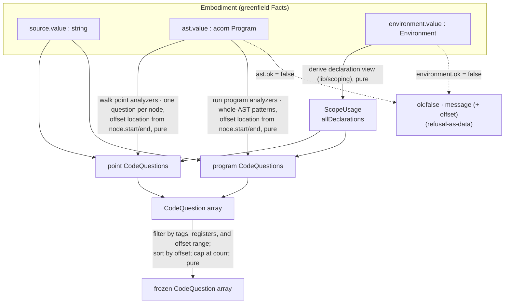

# lib/socratizing — Architecture & Decisions

## Why this module exists

Traditional linting says what is wrong and how to fix it; this engine asks a
question instead. Learning gain is highest at low-information levels (the
Feedback Ladder, EDM 2024), and a question — unlike a hint — cannot be clicked
through for the answer (hint-abuse resistance). Reframing "let vs const" from
right/wrong to "you made a choice here, did you notice?" is the curriculum's
stance: comprehension before production, where most content is programs learners
study, not programs they write. This leaf is the pure question source; a
consuming lens handles escalation, fading, and any grading. See
[`./README.md`](./README.md) for the catalog, registers, and framework tags.

## Pedagogical grounding

> Restored from the pre-migration architecture docs — the research and design
> intent behind the analyzer categories and the voice profile. The engine's
> shape changed (offset-native, realm-free, facts-based); this rationale did
> not.

- **Why questions, not corrections — the mechanism.** Learning gain is highest
  at low-information levels of the **Feedback Ladder** (EDM 2024), and a
  question, unlike a hint, cannot be clicked through for the answer (hint-abuse
  resistance). The deeper mechanism is **Reasoning Trajectories** (Al-Hossami
  2025): a Socratic question induces _cognitive dissonance_ — a contradiction
  between what the learner assumes and what the code actually does — which is
  the lever for belief updating. And **expertise reversal** (Kalyuga et al.
  2003): scaffolding becomes actively _harmful_ for advancing learners, so each
  question's stable `id` lets a learning environment track engaged categories
  and suppress the ones a learner has already mastered.

- **The category spectrum (why six categories, grouped three ways).** The
  categories run from pure style to almost-certainly-wrong, in three pairs:
  **voice** and **easter-egg** are about _expression_ (finding your voice,
  exploring the language); **clarity** and **consistency** are about
  _communication_ (readable, coherent code); **caution** and **trap** are about
  _correctness_ (patterns that are likely mistakes). Easter-eggs get their own
  category rather than folding into voice because they involve undocumented
  features — though most (labels, `void`, the comma operator) are fundamentally
  voice choices. `eval` is the exception: creative voice or dangerous mistake
  depending on intent.

- **The voice profile — five dimensions, and the research behind them.** The
  program-level `voice-profile` analyzer characterizes a program's overall
  "personality" along five dimensions: **Verbose ↔ Terse** (naming, line
  length), **Modern ↔ Traditional** (idiom adoption — template literals, `??`,
  `?.`), **Linear ↔ Structured** (control-flow depth), **Consistent ↔ Eclectic**
  (variation across choices), **Expressive ↔ Mechanical** (communication
  intent). Research basis: **Caliskan-Islam et al. (2015)** — even solving the
  same problem, programmers' code is stylistically distinguishable via AST
  features, naming, and control-flow preferences; **Stegeman et al.
  (2014/2016)** — a code quality rubric (decomposition, expression, naming,
  layout, flow, idiom) that maps directly to voice; **Buse & Weimer (2010)** —
  naming, expression structure, and organization predict readability, and those
  are the features measured.

- **JeJ adaptation.** The catalog deliberately omits question classes JeJ never
  produces — function-declaration/parameter/arrow questions, `switch`/`case`,
  `do…while`, `for…in`, and array/object-literal questions — because the
  language level does not admit those constructs.

## Architectural sketch

> Written Phase 0, before implementation. The Refactor step is held against this
> document — not what the code does, but what shape it takes.

### Execution phases

`analyze-micro-decisions.ts` is the single public export; the analyzer files and
helpers below are its implementation.

1. **Read the facts** (sync) — take the source string, narrow the AST stage and
   the scope-environment stage, and build the declaration view (`lib/scoping`'s
   `deriveScopeUsage`) up front. If **either** required stage failed, return a
   refusal carrying that stage's message (and the parser's source offset when it
   reports one). Input: an embodiment. Output: the source, the AST, and the
   declaration view — or a typed refusal.

2. **Walk the point analyzers** (pure) — one depth-first pass over the AST
   (child nodes from a pure-acorn walker); at each node every point analyzer
   runs, returning at most one question. Input: the AST, the declaration view,
   and source. Output: the point questions.

3. **Run the program analyzers** (pure) — each fires once on the whole AST for
   whole-program patterns (mixed declaration style, the voice profile). Input:
   the AST, the declaration view, and source. Output: the program questions,
   merged with the point questions into one flat list.

4. **Filter** (pure) — post-generation, apply the config: AND across groups, OR
   within a group; prune registers within a question (dropping a question whose
   registers are all pruned); keep questions whose offset `location` overlaps
   the range (half-open `[start, end)`); sort by ascending start offset,
   tie-broken by ascending end offset; cap at `count`. Input: all questions and
   the config. Output: the selected questions.

   > **Omitted vs all-false.** Omitting a config group means "no filter —
   > include all"; a group with every toggle set `false` means "nothing passes
   > this group" and yields an empty result. They are not the same: an all-false
   > group is a valid way to request zero questions. Single-value fields
   > (`kind`, `features`, `categories`) pass when the question's value is
   > enabled; multi-value fields (`levels`, `audiences`) pass on any
   > intersection with the enabled set.

5. **Freeze** (pure) — deep-freeze the result envelope. Input: selected
   questions (+ any analyzer errors). Output: a frozen `MicroDecisionResult`.

### Data flow

### Structural constraints

- **Reads facts, never parses.** Source, AST, and scope come from the
  embodiment; the engine never re-parses or re-derives scope.
- **Two required stages, one refusal arm.** Both `facts.ast` and
  `facts.environment` must succeed (scope is built up front because filtering is
  post-generation). If either failed, the result is `ok: false` with that
  stage's cause — the environment-defect branch is rare (a valid AST almost
  always scopes) but typed, not swallowed.
- **Error isolation.** Every analyzer runs inside a try/catch; a thrower is
  skipped and recorded in `analyzerErrors` (present only on the `ok: true`
  branch). No `console.warn`, no crash — one bad analyzer never sinks the run.
- **Post-generation filtering.** All analyzers see the full AST and scope before
  any filter applies — a walk-time filter would deny `let-vs-const` the
  whole-scope context it needs to know a `let` is never reassigned.
- **Offset-native locations.** A question's `location` is `[start, end)`
  character offsets from `node.start`/`node.end`; there is no line/column
  anchoring, and `location` inlines its shape (no range-type name).
- **Pure on frozen inputs.** Analyzers walk raw acorn nodes and write no
  synthetic fields; the whole engine runs on deep-frozen facts and returns a
  frozen result.

### Out of scope

- **Validation** — the caller confirms the facts; this engine assumes a parsed
  JeJ program.
- **Grading / mastery / verdicts** — a consuming lens's job; this engine only
  asks.
- **Formatting and execution** — static analysis only.
- **Fix suggestions** — it asks questions, never names the change.
- **State** — pure function; the environment manages fading and escalation.

## Decisions

- **Questions, not corrections.** The test for every prompt: does it make the
  reader think, or hand them the answer? "Could you combine these with `&&`?"
  fails (it names the fix); "How many paths can this structure produce?" passes.
  A micro-decision also implies a _choice was made_ — many are between equally
  valid alternatives — reframing code from right/wrong to intentional/unnoticed.

- **Two kinds share one `CodeQuestion` type.** `micro-decision` and
  `comprehension` serve different skill stages but are one frozen type: same
  Socratic contract, same BLOCK/PBSI/audience metadata, same factory and freeze,
  and one filtering path (`kind` is just another config dimension). A lens can
  interleave both in one panel by source order.

- **The offset flip (the Stage-2 change).** The prior architecture anchored
  `location` to a line/column range and threaded `source` into
  `extractLocation`. Greenfield parses with offsets but not `.loc`, so
  `location` is now `node.start`/`node.end` offsets, `extractLocation` needs
  only the node, and `MicroDecisionConfig.range` is an offset span (a half-open
  `[start, end)`, not 1-based inclusive lines) — a documented contract shift
  with no live consumer yet.

- **Scope via `lib/scoping`.** The five scope-reading analyzers consume
  `ScopeUsage.allDeclarations` from `deriveScopeUsage(facts.environment.value)`
  instead of the old vendored `buildScope(ast)`. One scope truth, computed once
  by embody; the engine carries no scope machinery. (Depends on the scoping
  leaf's enriched-`ScopeReference` prerequisite — see `../scoping/DOCS.md`.)

- **`parse-source.ts` is gone.** The entry reads `facts.ast`/`facts.source`
  rather than parsing, so the standalone Acorn parse helper (and its self-test,
  and the `Parse*` result types) are dropped — a latent double-parse removed.

- **The `string-construction` id fires twice.** One registered `voice` analyzer
  emits the same question `id` from a `TemplateLiteral` branch and a `+`
  `BinaryExpression` branch. A consumer that tracks reveal/mastery state must
  key on the per-mount item index, not the question `id` — the id is
  constant-per-analyzer, not per-occurrence.
