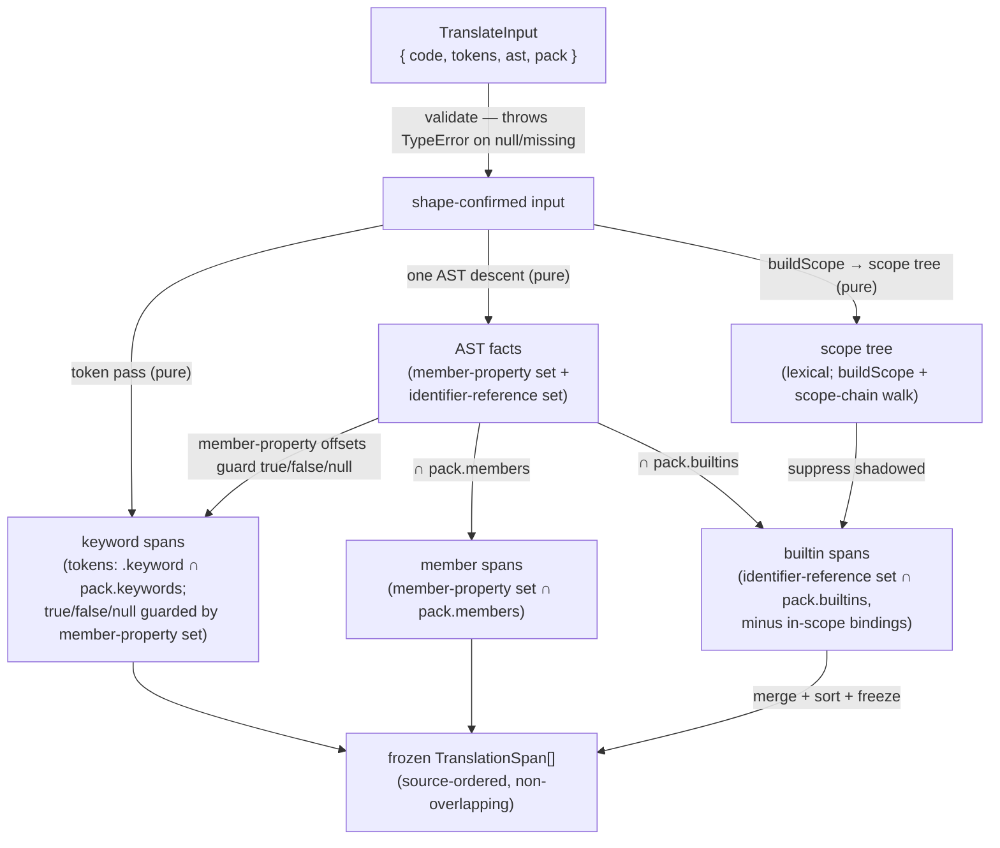
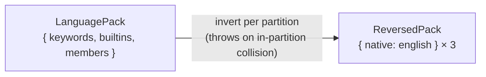

# lib/translating — Architecture & Decisions

## Why this module exists

JEJ's audience-reach minimalism makes English keywords a barrier for learners
who do not speak English first. Legesher's insight is that the barrier is
removable without forking the language: store canonical English, render the
native language, translate losslessly. This module is that translation core,
re-implemented natively in TypeScript for the JEJ surface and sitting beside the
acorn token stream the embodiment already produces — so the buffer, AST, runner,
and every position-anchored lens keep working on canonical English while a
consumer paints native glyphs. See [`./README.md`](./README.md) for the
taxonomy, the public API, and the bounded context ("translating produces spans;
consumers paint").

## Architectural sketch

> Written Phase 0, before implementation. The Refactor step is held against this
> document — not what the code does, but what shape it takes.

### Public surface

Four exports, each its own file (newspaper anatomy: export first, helpers
below):

- `translate-tokens.ts` — **forward**:
  `(TranslateInput) → readonly TranslationSpan[]`.
- `reverse-pack.ts` — **reverse**: `({ pack }) → ReversedPack` (per-partition,
  collision-checked).
- `load-pack.ts` — `({ language }) → LanguagePack | null` (static-import switch;
  no barrel).
- `languages.ts` — `LANGUAGE_METADATA` constant registry
  (`Record<LanguageCode, LanguageMetadata>`).

Plus `packs/{es,fr,de,ar}.ts` — const files, each a `LanguagePack` (`en` is
identity; no pack).

### Execution phases — `translateTokens` (the forward path)

1. **Validate inputs** (sync, throws) — `code` a string, `tokens` a non-null
   array, `ast` a non-null node, `pack` a non-null pack. Throws `TypeError`
   otherwise; the module's only forward throw site (boundary only — it sits
   behind a `status.parsed` gate, like `../classifying/`).

2. **Collect AST facts** (pure, one descent — the sibling's
   `collectAstRefinements` shape) — a single traversal collects two claim-sets:
   the **member-property set** (name + `[start, end)` of every non-computed
   `MemberExpression.property`) and the **identifier-reference set** (name +
   range of every `Identifier` that is neither a declaration id nor a member
   property). Both are facts the emit phase filters by pack membership.

3. **Resolve scope** (pure) — build the scope tree with `buildScope(ast)`; phase
   4 suppresses a `builtins` candidate iff the identifier resolves to an
   in-scope binding at its position (scope-chain walk from its innermost scope
   upward), reusing `check-undeclared-globals.ts`'s `findChildScope` +
   `isNameDeclared` (lexical resolution — § Decisions D3).

4. **Emit spans** (pure) — three disjoint triggers over the phase-2/3 facts:
   - **keyword** — a token contributes a `keyword` span iff its text is a
     `pack.keywords` key AND it carries acorn `.keyword` (all 16 JEJ keywords
     are reserved-word keyword tokens — none is a `name` token) AND — for the
     value-literals `true`/`false`/`null`, byte-identical whether a literal or a
     property name — its offset is not in the phase-2 member-property set.
     Keywords are not AST nodes, so their source is the token stream,
     cross-referenced to phase 2 for that guard.
   - **member** — a `member` span for every phase-2 member-property whose name
     is a `pack.members` key. Total and safe because JEJ admits no user-defined
     properties.
   - **builtin** — a `builtin` span for every phase-2 identifier-reference whose
     name is a `pack.builtins` key AND does not resolve to an in-scope binding
     (phase 3).

5. **Merge + freeze** (pure, shape finalization) — concatenate the three span
   lists, sort ascending by `range[0]`, deep-freeze via
   `@utils/deep-freeze-in-place.js`. Non-overlap is a consequence of the keyword
   phase's property guard (§ Structural constraints), so ordering is total.

### Execution phases — `reversePack`

Invert each partition independently: for `keywords`, `builtins`, `members`,
build `{ native: english }`, throwing on an in-partition collision (two English
keys → one native value → lossy). Returns a frozen `ReversedPack`.
Cross-partition homonyms do not collide (§ Decisions D2).

### Data flow

### Structural constraints

- **Range anchoring, never text matching.** Every span comes from a token/node
  `[start, end)`; the module never regex-replaces `\bword\b` (Legesher's toy
  path corrupts strings and comments). `english === code.slice(range)` is
  invariant.
- **Pack membership is necessary but not sufficient.** Each partition carries a
  role guard (keyword: token identity + closed-surface; member:
  `MemberExpression.property`; builtin: scope-resolved global reference). A user
  token that merely shares a name is never translated.
- **Categories are pack-partition, not classifying-semantic.** The trigger keys
  on which pack map a token's text is in — NOT on `../classifying/`'s `keyword`
  category (which excludes `typeof`/`in`/`null`/`true`/`false`, all of which ARE
  translated).
- **Pure on frozen inputs.** No mutation of `code`/`tokens`/`ast`; the module
  runs unchanged on deep-frozen embodiment data. Deterministic — no randomness,
  no config.
- **Non-overlapping spans (earned by the property guard).** The only tokens
  eligible for two partitions are the value-literals `true`/`false`/`null` used
  as property names; the keyword phase's property guard removes them from the
  keyword partition, and they are absent from `pack.members`, so they emit no
  span at all. Every other token is keyword-typed XOR a
  `MemberExpression.property` XOR a `name`-typed `Identifier` reference —
  structurally disjoint. Non-overlap is a consequence of the guard, not an
  independent fact; merge-by-start is total.
- **Closed registry.** `LanguageCode` is a closed union;
  `Record<LanguageCode, LanguageMetadata>` is exhaustive. Pack availability (not
  registry membership) gates a language — `load-pack` returns `null` for a
  registered-but-unpacked language.

### Out of scope

- **Painting.** Decoration overlays, Prism/parsons render helpers, RTL CSS —
  consumers (`orchestrate/`, `lenses/`), later milestones.
- **Native authoring round-trip.** Source maps, a native tokenizer,
  `unicode_guard` — Milestone 4.
- **The dropdown + its JEJ-validation gate.** Orchestrator concern; this module
  only supplies registry metadata.
- **Scope analysis beyond binding resolution.** Read/write usage counts, type
  inference, and control-flow reachability are out of scope; the builtin guard
  needs only lexical binding resolution (§ Decisions D3).
- **Pack content authoring quality.** Native word choice is a linguistic concern
  refined with the Legesher lead; this module guarantees only structure (drift +
  round-trip), not fidelity.

## Decisions

Recorded per AR-1 (verdict CONSIDER — response to each concern documented here,
per DEV.md).

- **D1 — Surface anchors, not `collect-jej-surface.ts`** (AR-1 C1).
  `collect-jej-surface.ts` exports only a collector function, not reusable
  constants. The drift-guard anchors on the three real constant modules exactly
  as `../documenting/`'s test does: `KEYWORDS`
  (`completing/completing-keywords.ts`), `CURATED_MEMBERS`
  (`completing/curated-members.ts`), and `allowedGlobals`
  (`embody/lib/validating/just-enough-js.ts`) minus `SUPPRESSED_GLOBALS`
  (`completing/suppressed-globals.ts`) minus `KEYWORDS`. Promoting the surface
  to a single shared export (AR-1 counter-proposal A) is a cross-module change
  deferred as a post-M1 follow-up.

- **D2 — Reverse is per-partition** (AR-1 C2). `reversePack` returns
  `ReversedPack` (`{ keywords, builtins, members }`), each
  `{ native: english }`, collision-checked within a partition, mirroring
  `token_mapper.reverse()`. A flat map would wrongly reject a legal
  cross-partition homonym; forward translation is already category-aware, so
  per-partition reverse composes with it and gives M4's native tokenizer
  category-scoped lookup for free.

- **D3 — Builtin shadow = lexical scope resolution** (AR-1 C3; human ruling at
  the Phase-0 gate — lexical over coarse). A `builtins` span is suppressed iff
  the identifier resolves to an in-scope binding at its position, via a
  scope-chain walk reusing `check-undeclared-globals.ts`'s `findChildScope` +
  `isNameDeclared` over `buildScope(ast)`'s scope tree — the same machinery that
  module uses to decide allowed-global-vs-user-binding. Chosen over coarse
  flat-name suppression (which under-translates a genuine global sharing a name
  with an unrelated block-local) and over no-scope (which mistranslates a real
  shadow). Errs toward not-translating a true shadow. The `lib/` peer rule
  permits the `embody/lib/scope/` + `embody/lib/validating/` imports; the
  siblings already take them.

- **D4 — Keyword guard is `.keyword` totality + a property guard** (AR-1 C4,
  sharpened per AR-2 C1). All 16 JEJ keyword keys — including
  `in`/`typeof`/`new`/`null`/`true`/`false` — tokenize as reserved-word keyword
  tokens (acorn `type.keyword` set); NONE is a contextual keyword emitted as a
  `name` token, so there is no `name`-lookup branch (it would be dead-or-buggy
  code). The guard is `.keyword` ∩ `pack.keywords`, plus a property-name guard
  on the value-literals `true`/`false`/`null` (byte-identical as literal or
  property). Widening the surface with a contextual keyword (e.g. `of`) is a
  guard-review event — that is when a `name` branch would first be needed.

- **D5 — `LanguageCode` is a closed union** (AR-1 C5), ported closed from
  Legesher (no `| string`), so `Record<LanguageCode, LanguageMetadata>` stays
  exhaustive. M1 ships a closed subset (`en`/`es`/`fr`/`de`/`ar` — LTR + one
  RTL); porting the full 51-entry registry is a later mechanical expansion,
  still closed.

- **D6 — Input contract `{ code, tokens, ast, pack }`** (AR-1 C7; deliberate
  divergence from the plan's `{ classified, pack }`). `ClassifiedToken` exposes
  no AST-node link and no scope, and its `keyword` category excludes exactly the
  reserved-word operators/literals JEJ translates — so member identification and
  builtin shadow resolution are impossible from `ClassifiedToken[]`. Re-walking
  `tokens + ast` (mirroring `ClassifyInput`) is necessary, not duplicative:
  translating and classifying answer different questions over the same raw
  inputs; they share the input shape, not the output.

- **D7 — Round-trip guard is test-time only.** Forward translation needs no
  runtime round-trip guarantee — it emits spans anchored to English ranges and
  never produces English-corrupting output. The round-trip (reverse ∘ forward
  === identity) is a pack-authoring property, enforced by a test over
  `sandbox-programs/*.js`; `reversePack`'s in-partition collision throw is the
  runtime guarantee that matters.

- **D8 — Single AST descent; the phase dependency is explicit** (AR-2 CP-A,
  resolving Concerns 3–5). Member-property and identifier-reference facts are
  collected in one AST traversal (matching `classify-tokens.ts`'s single
  `collectAstRefinements` descent). The keyword phase cross-references the
  member-property set for its `true`/`false`/`null` guard (Concern 4), so the
  data-flow diagram carries the `facts → keyword` edge (Concern 5); the merge's
  non-overlap is proven from that guard (Concern 3). Phase-2 output is named
  honestly as claim-sets, and phase 3 as a projection of `DeclarationInfo[]` to
  names, not "the token stream is the only source" (AR-2 Concerns 1–2).
  `LanguagePack.language` is a self-identification tag (drift-test failure
  messages + `load-pack` sanity), read by no forward phase (AR-2 Concern 6).
  Splitting `translate-tokens` TDD into keyword / member / builtin trigger
  sub-increments is carried to AR-3 (AR-2 Concern 7).
