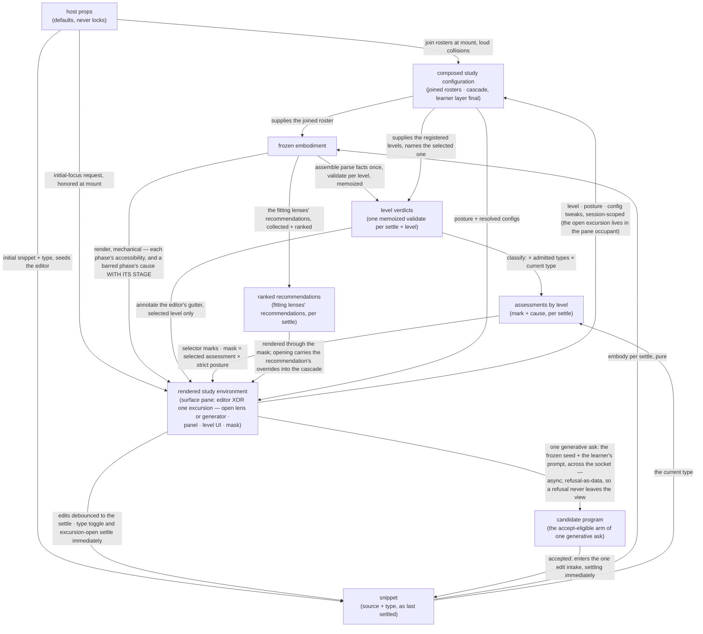
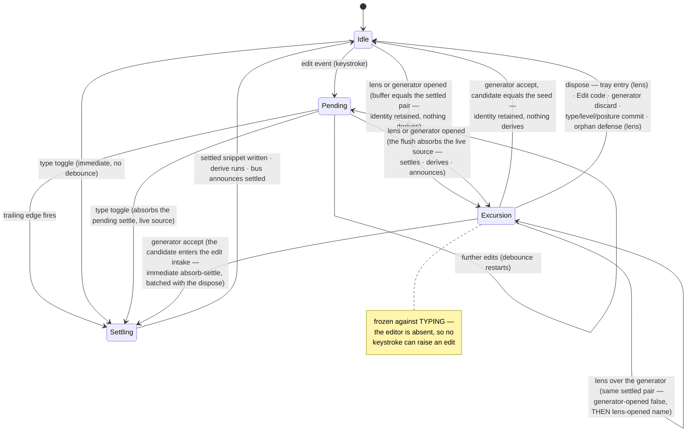

<!-- cspell:ignore renderable affordances behaviour unrepresentable keyspace failable -->

# orchestrate — Architecture & Decisions

Region-level architecture for the orchestrator described in
[README.md](./README.md). The package sketch ([../DOCS.md](../DOCS.md)) owns the
package-level shape — this region is its keeper: the four package phases happen
here or are driven from here. This document constrains the region at its root
abstraction; each rendered surface and derivation library zooms in below.

## Architectural sketch

> Written Phase 0, before implementation. The Refactor step is held against this
> document — not what the code does, but what shape it takes.

## Execution phases

1. **Compose** — two cadences. At mount, sync and loud: the default lens roster
   joins the host's injected lenses, the built-in levels join the injected ones
   — append-only, collisions fail loudly. Continuously: the configuration
   cascade re-resolves per lens name over the layers this region sees — the
   configs prop, then a recommendation's opening overrides when the open lens
   arrived that way, then the learner's tweaks, always final. Input: the host
   props + session choices. Output: the composed study configuration.

2. **Derive** (sync, pure, per settle) — the settled snippet is embodied with
   the joined roster; the parse facts a level consumes are assembled once from
   the embodiment's stage values; one memoized validate runs per registered
   level; the fit marks derive from those verdicts, the levels' admitted snippet
   types, and the current type (the verdict itself encodes the parse status);
   the fitting lenses' recommendations are collected and ranked. All of it in
   pure functions — level logic never lives inside a React component. Input: the
   settled snippet + the composed study configuration. Output: the study
   derivation — the frozen embodiment, the level verdicts, the assessments, and
   the ranked recommendations.

3. **Render** (mechanical) — the five-phase panel renders the embodiment; the
   level UI renders the verdicts and marks; the mask derives here, from the
   selected level's assessment — its mark with its cause — crossed with the
   strict posture, classifying surfaces into the three classes; an initial-focus
   request mounts here, through its honor path; the study derivation's ranked
   recommendations render here, through the mask. Input: the study derivation +
   composed study configuration. Output: the rendered study environment.

4. **Interact** (async at the edges) — each control re-enters its own phase.
   Input: the rendered environment + learner intent. Output: a new settle or a
   re-render.
   - **Editing** — source edits re-enter Derive at the next settle. Editor mode
     only: the editor is absent during any excursion.
   - **Opening an excursion** — a lens or the generator flushes any pending
     settle and replaces the editor; the lens mounts over the frozen embodiment
     and its resolved config, the generator over the same frozen pair as its
     seed.
   - **Closing one** — the open lens's tray entry, the Edit code button, the
     orphan defense, or the generator's own accept and discard remount the
     editor, seeded from the live source.
   - **Accepting a candidate** — re-enters Derive immediately through the edit
     intake, batched with the dispose that ends its excursion.
   - **Committing derivation context** — the snippet-type toggle, level
     selection, and the posture toggle each dispose the open excursion first,
     then re-enter their own phase: the type toggle re-enters Derive
     immediately; level, posture, and configuration tweaks re-enter through the
     composed study configuration with no re-parse.

## Data flow

## Structural constraints

- **Zero fit or accessibility derivation.** Both are embody's; this region
  renders what the embodiment carries and recovers its own renderable lenses by
  filtering its own roster against the attached refs — no casts.
- **Pure derivation libraries, thin components.** The fit marks, the mask
  classification, the config resolution, and the parse-facts assembly live in
  pure functions; components render their outputs.
- **One memoized validate per settle and per level** — the selector, the gutter,
  and the mask share it; nothing validates twice.
- **One edit intake.** The source changes only through the top component's edit
  intake: the editor raises it per keystroke, and an accepted generated program
  reaches the same seam — raised as intent, committed by the owner. No surface
  writes. Every derived state re-derives per settle.
- **Append-only composition, loud collisions.** Built-ins are never replaced or
  shadowed; failure happens at mount, at the author's desk.
- **Class-2 nodes never mask**, and no posture withdraws any of them (human
  ruling 2026-08-17). The routes, the roster and its size are stated once, in
  [README.md](./README.md) § Enforcement, and are not restated here — a sketch
  that re-enumerates a contract acquires a second home that drifts. What this
  sketch constrains is structural: **the two members that are not controls** —
  the announcer and the nameplate — must render **outside both maskable
  containers**, which only the composition root can guarantee, so their
  placement is a fact about the component tree rather than about styling.
- **The undetermined carve-out wins.** While the code does not parse, the mask
  names no violation and the parse phases' supports stay uncovered — regardless
  of type admission.
- **Recommendations are vetted at collection.** A recommendation whose target
  lens does not resolve on the mount roster is dropped at collection, before
  ranking — gracefully, with a loud report at the author's desk. Every open path
  is therefore vetted before the pane: the rail's trays offer only attached
  lenses, the honor path runs applicability at mount, and a surviving
  recommendation names a roster lens the reachability judgment can classify.
- **One reachability judgment, two projections.** The pane's render gate and the
  orphan defense project a single classification of the open lens over the
  CURRENT derivation — phase-declared: attached to an accessible phase;
  panel-excluded: its applicability holds over the current facts. A divergence
  would mean a blank-pane deadlock or a one-frame totality violation; one
  judgment makes both impossible.
- **Display copy lives here.** Every learner-facing string this region keys or
  derives is its presentation concern — the phase labels and short labels, the
  fit marks, the nameplate's two forms, the tray and proposals headings, the
  empty-station reason with its count line, the barred phase's cause line, the
  standing's drawn word, and the blocked sentence with its ordered three ways
  out. `display-labels.ts` is their one home. The data names are the other
  regions'.

## The top component — state and the settle loop

The region-root zoom-in. The four execution phases above are the abstraction;
this section pins where their state lives and how a settle happens. (The region
README's tree names the files these shapes live in.)

### State residency

The top component is the single owner of everything session-scoped; every other
holder is ephemeral or derived.

| State                                                                                                                                                                                                                       | Holder                                                                                                                                              |
| --------------------------------------------------------------------------------------------------------------------------------------------------------------------------------------------------------------------------- | --------------------------------------------------------------------------------------------------------------------------------------------------- |
| Session choices (level key, posture, type, config tweaks — the open-lens choice lives in the pane occupant)                                                                                                                 | the top component                                                                                                                                   |
| The pane occupant (`PaneOccupant`: the editor arm with its remount seed, the lens arm with the open lens's name, its open-time settled pair and the opened overrides, or the generator arm with its open-time settled pair) | the top component — one discriminated slot; the union makes "a lens without its snapshot" and "overrides outliving the open choice" unrepresentable |
| The live source (the buffer as last edited — survives editor unmounts)                                                                                                                                                      | the settle hook's ref, owned by the top component's hook instance; the hook exposes a live-source read and an immediate flush                       |
| The settled snippet (`SettledSnippet`)                                                                                                                                                                                      | the top component, written only by the settle loop                                                                                                  |
| The study derivation (`StudyDerivation`)                                                                                                                                                                                    | the top component, recomputed per settle                                                                                                            |
| The validate memo                                                                                                                                                                                                           | inside the per-instance memoized validate the top component holds                                                                                   |
| Joined rosters, the bus instance, the generator socket                                                                                                                                                                      | the top component, created once at mount — the socket's mount-stability is what the generator's abort-and-retire mechanics key on                   |
| Open/closed flags (level list, guide reveal)                                                                                                                                                                                | each surface, ephemeral                                                                                                                             |
| The generation job (idle → loading → generating → preview \| refused)                                                                                                                                                       | the generator view, ephemeral per mount — never a session choice; dispose-as-unmount is the cancellation                                            |

### The settle loop

One settle hook owns the edit-to-settle mechanics: edit events arrive per
keystroke; the region's shared trailing-edge debounce holds them; its trailing
edge writes the settled snippet. The type toggle absorbs any pending settle and
re-derives immediately — a toggle is a settle of its own, never debounced, and
its settle carries the editor's **live** source: pending keystrokes are settled
early, never discarded. The debounce's cancellation runs in the always-returned
effect cleanup (idle-safe — the cleanup is returned whether or not a settle is
pending). Staleness is keyed by the settled snippet identity: derived state
belongs to exactly one settled source-and-type pair, and a re-derive replaces it
wholesale.

During an excursion the loop is FROZEN AGAINST TYPING: the editor is unmounted,
so no keystroke can raise an edit event. Opening an excursion is itself an
absorb-settle — the hook's immediate flush cancels any pending debounce, then
RETAINS the settled identity when the live buffer field-equals the settled pair
(which also absorbs an edit-undone-to-identical window: no re-derivation, no
re-announce — the round-trip guarantee), else settles the live source
immediately. The retained-identity discriminant is content equality, not
pending-ness — the debounce exposes no pending-query. A type toggle during an
excursion disposes it first; its immediate settle then runs in editor mode.

One edit DOES fire from inside an excursion: an accepted candidate. It takes the
same immediate absorb-settle as a type toggle, and it is batched with the
dispose that ends the excursion — one commit, not two. The batching is
load-bearing rather than tidy: the coherence invariants require the settled pair
to field-equal the generator arm's open-time pair, so a settle that committed in
a different frame from the return home would render one frame of a generator arm
against a moved settle and throw. Within that batch the order is fixed too: the
candidate reaches the edit intake BEFORE the dispose, because the dispose seeds
the remounting editor from the live source — reversed, the editor would remount
on the pre-accept buffer and the accepted program would be lost. Accepting a
candidate field-equal to the seed retains the settled identity and announces
nothing, exactly as the round-trip guarantee says.

### Per settle

One pure derive composition runs per settle: the embodiment factory over the
settled source and type with the joined lens roster, then the validating
library's assembly and memoized validates, then the marking library's
assessments, then the recommendation walk — the fitting lenses' recommendations
collected by the composition and ranked by the recommending library — into one
frozen `StudyDerivation`. The top component calls the composition with the
settled snippet, the joined levels, the joined lens roster, and the per-instance
memoized validate it holds; nothing else derives. The memo's remaining work —
`StudyDerivation` already holds each settle's verdicts — is idempotence:
StrictMode's double invoke and any same-identity re-entry return the held
verdicts without consulting a level twice.

### The render projection

- The five phases' display labels live in one record keyed by phase name, zipped
  against embody's runtime order constant at the point of use; never a
  positional list. Each phase carries TWO authored strings — the full label and
  the short label the rail draws — so the record's value is a pair, never a
  string plus a truncation rule.
- A **station** is what renders one phase on the rail, and carries four things:
  the phase (the key everything zips against, never drawn), the label and short
  label, the standing (`openable` · `bare` · `waiting`), and its tray where it
  has one. Whether the openable and bare cases are one shape or two is the first
  question `types.ts` answers.
- **The caption — the one thing beneath the rail — holds exactly one occupant at
  a time, and its precedence is total**: the cause line wherever a barring edge
  is drawn, else the count line, else nothing. Four rules govern that one
  caption and they are one contract, not four — an implementer who reads some of
  them ships the rest as defects.

  **The two arms are not the same shape** (human ruling 2026-08-19). The count
  line is one line; the **cause line is a block** — the framed message, and
  beneath it the unreached count. The caption's occupancy is exactly one; its
  HEIGHT is not fixed, and every drawing in the twin already renders it that
  way.
  1. **The count is derived per settle, never written** — the number of phases
     that are both accessible and EMPTY of fitting lenses. Not a property of the
     roster: a phase whose only lens fails applicability on this program is
     empty too, and a **barred** phase is excluded entirely, because it carries
     a cause instead.
  2. **Singular at one.**
  3. **Absent at zero** — it does not render.
  4. **It yields the caption entirely wherever a barring edge is drawn**, where
     the cause line renders instead. **Entirely means gone, not relocated** —
     the unreached count the cause arm carries beneath its message is a
     DIFFERENT string over a DIFFERENT predicate (what WAITS, versus what is
     accessible and empty). Two counts, never both, and neither ever stands in
     for the other. And **an open tray never takes the caption**: a tray opens
     BETWEEN the rail and the caption, pushing it down along with the pane,
     because a tray describes one station while the caption describes the rail
     as a whole.

  **The cause line's framing is keyed by the STAGE that failed, never by the
  phase that is barred** — structural, not copy, and therefore owed here rather
  than only in the glossary. Three framings: `tokens` → _the spelling broke
  here_, `ast` → _the grammar broke here_, `entwined` → _the machinery broke
  here, not your code_. **The key is not derivable from the geometry**, because
  an `ast` failure and an `entwined` failure bar exactly the same phases [read:
  `../embody/derive-accessibility.ts` — `environment` and `evaluation` both read
  `facts.entwined.ok`]. Nor from the phase-order constant, which has no member
  named `entwined` at all. So the render path needs `cause.stage`, and a
  projection that carries only the message cannot produce the right sentence.

  **And the projection must therefore carry it.** Today it does not: the panel
  receives `cause` flattened to its message alone, and the boundary states that
  discard as an invariant. Widening it is a 0.3 obligation, recorded rather than
  discovered — see the campaign's 0.3 entry conditions.

  **This makes `display-labels.ts` key against TWO embody vocabularies**, not
  one: the lifecycle phase names it already uses for the labels, and the
  failable STAGE names the framings key against. Those sets are not the same —
  `entwined` is a stage and not a phase — and a file that keys against two
  vocabularies should say so where its home is settled.

  The strings themselves are `display-labels.ts`'s (§ What lives here); what is
  structural — and therefore belongs here rather than only in the glossary — is
  that the caption is ONE slot fed by TWO producers with a total order between
  them, so the render path resolves the precedence before it has anything to
  draw. That is the shape `types.ts` gives a union rather than two optional
  fields — **and the union is over the two arms' SHAPES, not over two strings**:
  the count arm is a line, the cause arm is a pair. `string | string` is
  satisfiable by an implementation that concatenates the cause into one row,
  which is the defect this distinction exists to make unrepresentable.

- The panel receives its ordered phase list built from that constant plus the
  labels, and renders it as **the rail** ABOVE the surface pane and BENEATH the
  control row, which sits at the top of the band (the Edit code button —
  leading, while an excursion is open — OR the Generate code button, which takes
  its place in editor mode and is never present beside it; then the type toggle
  and the level surfaces; sibling order within the row is presentation, not
  contract) — controls and lifecycle in one band, the surface pane beneath: the
  editor when no excursion is open, the open lens or the generator in its place.
  **One station per phase, one barring edge, one cause drawn once; a station's
  fitting lenses are disclosed in its tray rather than listed on the line.** The
  nameplate renders between the band and the pane, naming the occupant.
  Recommendations render below the pane in every mode. The rail renders no
  headings; the guide's `h4` topic titles are the instrument's only headings,
  and the guide renders last in DOM order.

- ONE VISUAL PANE, TWO DOM SLOTS — the mask-membership rule: the editor renders
  OUTSIDE both maskable regions (class 1, never masked while mounted); the
  mounted lens and the generator view both render INSIDE the maskable content
  region (class 3). The pane is the learner-facing abstraction over both;
  building it as one shared slot would break one of the two class assignments.
- The Generate code button's geometry is deliberate and easily "simplified"
  away: it renders in the control row, OUTSIDE both maskable containers, and
  still carries class 3 — inert and dimmed at its OWN element while the mask is
  up, like the strip's selects. A surface's class is a fact about what the
  surface is, never about which container it happens to render in; the button
  opens a class-3 study surface, so it takes that class with it. It renders in
  editor mode only, and as a button rather than a select, so the rail's
  every-tray-entry assertions keep their meaning.
- The rail's trays track the committed open lens; the open lens's own tray entry
  is its close affordance — the close commits at the top component and announces
  `lens-opened: null` (the bus arm shipped reserved, now real). The class-2 Edit
  code button is the GUARANTEED way home: the rail is class 3 and inert under a
  mask.
- Coherence invariants at EVERY excursion-arm render, loud in dev AND prod: the
  settled pair must field-equal the occupant's `openedAt` (source and type) —
  the generator arm included, since its anchor does the same job as the lens
  arm's. The roster check stays lens-only: it asks whether the open lens
  resolves, and a generator names none. The embodiment-matches-snapshot
  guarantee follows transitively — the derivation memo is keyed on settled
  identity, and the derive composition is pure in (settled, mount-frozen
  session).
- The orphan render-gate: the invariants check settle-coherence, NOT
  applicability. When the reachability judgment rejects the open lens over the
  CURRENT derivation — a flush-at-open can do this, since the offer was made
  against pre-flush facts — the pane renders nothing that frame; the orphan
  defense (the same judgment's other projection) then disposes and announces.
  With collection-vetted recommendations, a lens's `main` never mounts against
  an embodiment its applicability rejected — unreachable by construction, which
  is what lets the invariants throw loud in prod.
- The mask projects the masking library's state — the selected level's
  assessment crossed with the posture; the blocked overlay is part of the top
  component's render (in-file until a second call site exists). Every mask input
  is frozen during an excursion (the dispose rule), so mask state is fixed per
  mount; a mount can begin masked two ways — the honored focus, or a
  flush-at-open that settles out-of-level code the rail or the Generate code
  button offered against the pre-flush facts.
- The honor resolution runs once at mount, mapping fallback → the editor arm and
  honored → the lens arm (`openedAt` = the initial settled pair); the lazy
  initializer stays side-effect-free — no dispatch ever fires from it. The study
  derivation's ranked recommendations render through the mask, in both modes.

## Decisions

- **Why the pane swaps (editor XOR one excursion).** Inherited from the retired
  reference architecture's two-mode machine, on the maintainer's ruling: in
  editor mode the learner is AUTHORING; in lens mode they are EXERCISING a
  disposable practice surface over a fixed program. Disposability is structural,
  not policed — the editor is absent, and every derivation-context commit (type,
  level, posture) disposes the excursion first — so a mounted lens's embodiment
  cannot change, by construction. The cost is deliberate: the learner cannot
  type WHILE a lens reacts; switching is an explicit pedagogical commitment.
- **Why the generator is a pane occupant, not a pop-up.** It is the same kind of
  thing a lens is — a surface over the program exactly as it stood at the open,
  disposable, returning home — so it inherits exclusivity, the return
  affordance, and the frozen derivation context for free rather than growing a
  parallel mechanism beside them. The pedagogy is the same argument from the
  other side: human authoring stays the center of study precisely because
  generation is an EXCURSION from the home base, never a second surface sharing
  the pane with it.
- **What the generator arm carries, and what it does not.** One field: the
  settled pair it opened over, doing both jobs the lens arm's does — the seed
  the view remixes and the coherence anchor the render invariants compare
  against. No name, no config, no honored-focus arm. The flush-at-open is what
  makes the anchor equal the live buffer, which is why remix-first needs no
  separate seed channel.
- **Why the generation job never rides the occupant.** The occupant is frozen
  for the excursion; a stage that changes several times per ask cannot live
  there. Held in the view, the job also gets its cancellation for free: every
  path that closes the excursion unmounts the view, and the unmount cleanup
  aborts and retires the in-flight ask. "A commit cancels the job" is therefore
  structural — nothing polices it, and no dispose path can forget it.
- **Why dispose generalizes rather than special-casing the generator.** The
  dispose path is one function reached by every close, so it reads the occupant
  it is about to replace and announces per arm. It early-returns only in editor
  mode; anything else is an excursion and closes. Leaving it lens-shaped would
  make every dispose during a generator excursion a silent no-op — an accept
  that settles but never returns home, and derivation-context commits landing
  under a mounted generator. The same reading applies where one surface opens
  over another: opening a lens over the generator announces the generator's
  close before the lens's open, because the two facts ride two events.
- **No public-surface change.** The generator adds no host prop and no reserved
  configuration key: the socket is composition-root-internal, held in
  mount-frozen session state, and the view receives it as a prop for its own
  suite. A host-facing knob would have to be designed before anyone has used the
  thing, and the keyspace collision is avoided entirely by not opening one.
- **Why the result vocabulary is transcribed rather than imported.** The
  generative core lives in another tree. A transcription costs one file and
  keeps this region's compile independent of that tree; an import would bind the
  build to code this region does not own. The request type is not a
  transcription at all — it is the consumer's own shape, narrower than the
  core's config by construction and this region's to define.
- **The event mapping (taxonomy kept).** `lens-opened{name}` covers the
  reference's mode-changed(editor→lens) + lens-switched; `lens-opened{null}`
  covers mode-changed(lens→editor); a lens→lens switch is one
  `lens-opened{next}` with no null between; a same-name re-open is one
  `lens-opened{name}` re-announcing the re-committed choice (its overrides
  re-resolved in place — the embodiment never moves). On dispose paths the close
  dispatch precedes the change event (`lens-opened{null}` before `type-toggled`
  / the level or posture announce); a flush-at-open's `settled` announce follows
  `lens-opened{name}` post-commit. The orphan sequence `lens-opened{name}` →
  `settled` → `lens-opened{null}` is LEGAL — subscribers must tolerate an open
  immediately followed by its close, with the explaining settle between. A
  derivation-context commit with no lens open has nothing to dispose and
  announces no `lens-opened{null}` — dispose with nothing open is silent. The
  generator's own arm never reuses this event: `lens-opened`'s payload NAMES a
  lens, so a boolean `generator-opened` carries the generator's open and close
  instead. Its orderings mirror the lens's — open then the absorbed settle;
  `{open: false}` before the change event on a derivation-context commit;
  `{open: false}` then `lens-opened{name}` when a lens opens over it; on accept,
  `{open: false}` and then the accepted program's `settled`, or no settle at all
  when the program field-equals the seed.
- **Bus and effect contract rules.** Listeners must never call `flushSync` — the
  one-commit batching argument for the pane flip depends on it. The effect
  registration order — the settled announce BEFORE the orphan defense — is a
  pinned invariant: the orphan bus sequence depends entirely on hook call order.
  The settle hook's live-source read and immediate flush are fresh function
  identities per render and must never key an effect or memo.
- **Why the composition root is here.** One place joins, so one place can be
  loud: collisions surface at mount, at the author's desk, never as silent
  shadowing discovered by a learner.
- **Why memoization is here.** Three consumers — selector, gutter, mask —
  project one verdict; owning the memoization beside the consumers keeps one
  validate per settle and per level, and one place that assembles the parse
  facts.
- **Why the mask derives at render.** Mask state follows the settled fit mark,
  so it never flaps mid-keystroke; deriving it any earlier would couple
  enforcement to typing. The mask re-derives nothing: the marking library
  classified once, and the mask projects the selected level's classification.
- **Why components stay thin.** Every level-aware derivation is a pure function
  that tests without a DOM; the React layer renders results and routes intent,
  nothing more.

## Out of scope

- **Fit and accessibility** — embody's derivation, rendered here untouched.
- **Lens and evaluator internals** — a mounted lens owns its view; evaluators
  are its own imports; this region never touches an evaluator.
- **The generator view's internals and its generation job** — the view's own
  ([`./generator/DOCS.md`](./generator/DOCS.md)); this region owns only where it
  sits in the pane, when it disposes, and what its accept lands through.
- **The model runtime and the generative core behind the socket** — another
  tree's; this region reaches them through one seam and knows nothing further.
- **Level content** — validators, docs, support data, and models belong to their
  levels; this region consults and projects.
- **Level-UI rendering and bus wiring** — how the selector and toggles render
  their intent affordances and how bus subscriptions are wired belongs to the
  level-ui and event-bus internals, documented there. Session choices themselves
  have one owner, the top component — no surface holds one.
- **The embedding site's composition** — whatever layers produce the configs
  value upstream are the host's build, invisible here.
- **Learner identity, progress, grading** — the embedding LMS's.
