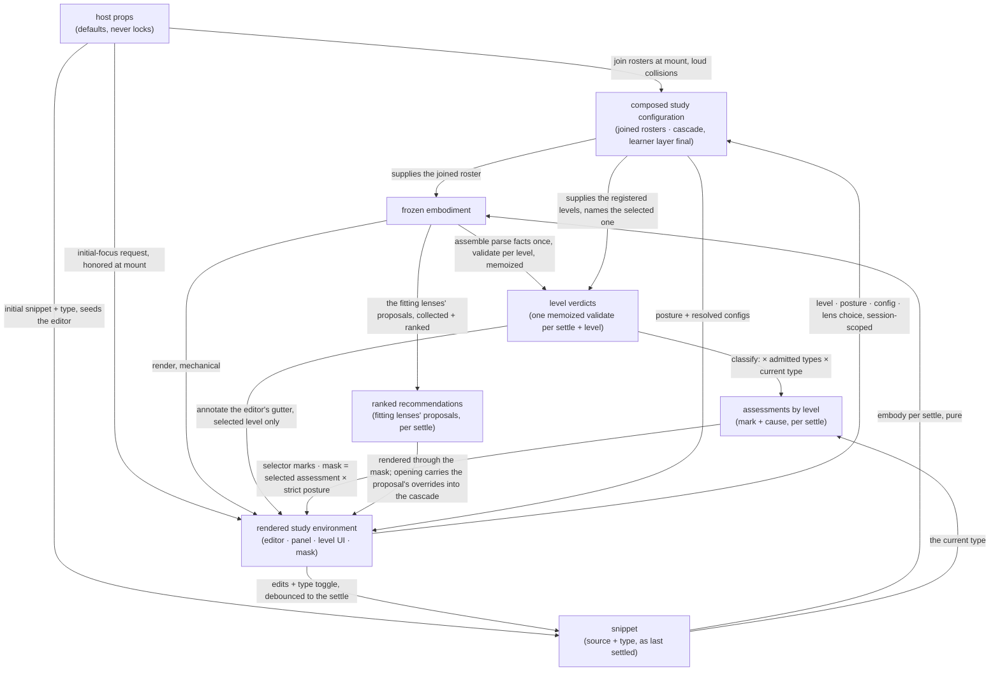
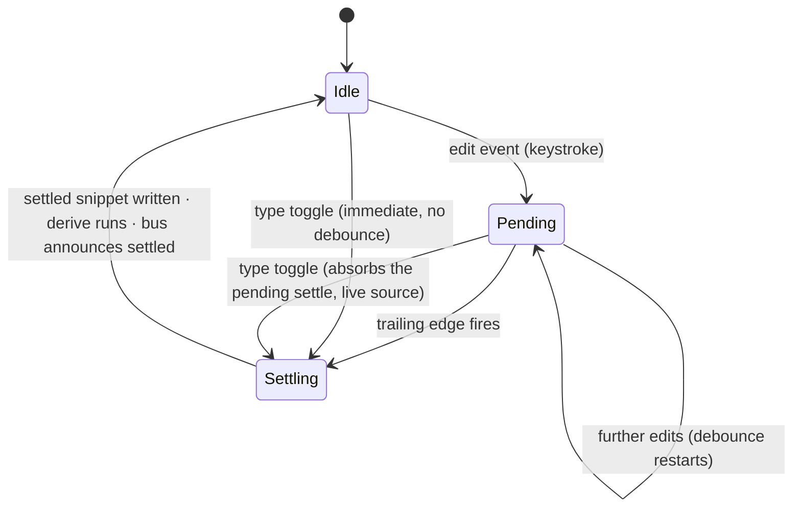

<!-- cspell:ignore renderable affordances -->

# orchestrate — Architecture & Decisions

Region-level architecture for the orchestrator described in
[README.md](./README.md). The package sketch ([../DOCS.md](../DOCS.md)) owns the
package-level shape — this region is its keeper: the four package phases happen
here or are driven from here. This document constrains the region at its root
abstraction; each rendered surface and derivation library zooms in below.

## Architectural sketch

> Written Phase 0, before implementation. The Refactor step is held against this
> document — not what the code does, but what shape it takes.

## Execution phases

1. **Compose** — two cadences. At mount, sync and loud: the default lens roster
   joins the host's injected lenses, the built-in levels join the injected ones
   — append-only, collisions fail loudly. Continuously: the configuration
   cascade re-resolves per lens name over the layers this region sees — the
   configs prop, then a recommendation's opening overrides when the open lens
   arrived that way, then the learner's tweaks, always final. Input: the host
   props + session choices. Output: the composed study configuration.

2. **Derive** (sync, pure, per settle) — the settled snippet is embodied with
   the joined roster; the parse facts a level consumes are assembled once from
   the embodiment's stage values; one memoized validate runs per registered
   level; the fit marks derive from those verdicts, the levels' admitted snippet
   types, and the current type (the verdict itself encodes the parse status);
   the fitting lenses' proposals are collected and ranked. All of it in pure
   functions — level logic never lives inside a React component. Input: the
   settled snippet + the composed study configuration. Output: the study
   derivation — the frozen embodiment, the level verdicts, the assessments, and
   the ranked recommendations.

3. **Render** (mechanical) — the five-phase panel renders the embodiment; the
   level UI renders the verdicts and marks; the mask derives here, from the
   selected level's assessment — its mark with its cause — crossed with the
   strict posture, classifying surfaces into the three classes; an initial-focus
   request mounts here, through its honor path; the study derivation's ranked
   recommendations render here, through the mask. Input: the study derivation +
   composed study configuration. Output: the rendered study environment.

4. **Interact** (async at the edges) — each control re-enters its own phase:
   source edits re-enter Derive at the next settle; the snippet-type toggle
   re-enters Derive immediately; level selection, posture, and configuration
   tweaks re-enter through the composed study configuration with no re-parse;
   opening a lens mounts it with the frozen embodiment and its resolved config.
   Input: the rendered environment + learner intent. Output: a new settle or a
   re-render.

## Data flow

## Structural constraints

- **Zero fit or accessibility derivation.** Both are embody's; this region
  renders what the embodiment carries and recovers its own renderable lenses by
  filtering its own roster against the attached refs — no casts.
- **Pure derivation libraries, thin components.** The fit marks, the mask
  classification, the config resolution, and the parse-facts assembly live in
  pure functions; components render their outputs.
- **One memoized validate per settle and per level** — the selector, the gutter,
  and the mask share it; nothing validates twice.
- **The single writer.** Only the editor mutates the source; every derived state
  re-derives per settle.
- **Append-only composition, loud collisions.** Built-ins are never replaced or
  shadowed; failure happens at mount, at the author's desk.
- **Class-2 controls never mask.** Any control whose availability restores what
  the learner needs stays alive under every posture: conformance for the
  selector and both toggles, orientation for the guide.
- **The undetermined carve-out wins.** While the code does not parse, the mask
  names no violation and the parse phases' supports stay uncovered — regardless
  of type admission.
- **Display labels live here.** The five phases' learner-facing labels and the
  none-state's display string are this region's presentation concern; the data
  names are the other regions'.

## The top component — state and the settle loop

The region-root zoom-in. The four execution phases above are the abstraction;
this section pins where their state lives and how a settle happens. (The region
README's tree names the files these shapes live in.)

### State residency

The top component is the single owner of everything session-scoped; every other
holder is ephemeral or derived.

| State                                                                  | Holder                                                                                      |
| ---------------------------------------------------------------------- | ------------------------------------------------------------------------------------------- |
| Session choices (level key, posture, type, open lens, config tweaks)   | the top component                                                                           |
| The opened layer's overrides (a recommendation-opened lens's proposal) | the top component — set at a recommendation-opened mount, cleared with the open-lens choice |
| The settled snippet (`SettledSnippet`)                                 | the top component, written only by the settle loop                                          |
| The study derivation (`StudyDerivation`)                               | the top component, recomputed per settle                                                    |
| The validate memo                                                      | inside the per-instance memoized validate the top component holds                           |
| Joined rosters, the bus instance                                       | the top component, created once at mount                                                    |
| Open/closed flags (level list, guide reveal)                           | each surface, ephemeral                                                                     |

### The settle loop

One settle hook owns the edit-to-settle mechanics: edit events arrive per
keystroke; the region's shared trailing-edge debounce holds them; its trailing
edge writes the settled snippet. The type toggle absorbs any pending settle and
re-derives immediately — a toggle is a settle of its own, never debounced, and
its settle carries the editor's **live** source: pending keystrokes are settled
early, never discarded. The debounce's cancellation runs in the always-returned
effect cleanup (idle-safe — the cleanup is returned whether or not a settle is
pending). Staleness is keyed by the settled snippet identity: derived state
belongs to exactly one settled source-and-type pair, and a re-derive replaces it
wholesale.

### Per settle

One pure derive composition runs per settle: the embodiment factory over the
settled source and type with the joined lens roster, then the validating
library's assembly and memoized validates, then the marking library's
assessments, then the recommendation walk — the fitting lenses' proposals
collected by the composition and ranked by the recommending library — into one
frozen `StudyDerivation`. The top component calls the composition with the
settled snippet, the joined levels, the joined lens roster, and the per-instance
memoized validate it holds; nothing else derives. The memo's remaining work —
`StudyDerivation` already holds each settle's verdicts — is idempotence:
StrictMode's double invoke and any same-identity re-entry return the held
verdicts without consulting a level twice.

### The render projection

- The five phases' display labels live in one record keyed by phase name, zipped
  against embody's runtime order constant at the point of use; never a
  positional list.
- The panel receives its ordered phase list built from that constant plus the
  labels, and renders it as the horizontal lifecycle strip ABOVE the editor,
  beside the control row (the type toggle and the level surfaces) — controls and
  lifecycle in one band, the buffer beneath, the opened lens and recommendations
  below it. The strip renders no headings; the guide's `h4` topic titles are the
  instrument's only headings, and the guide renders last in DOM order.
- The strip's selects track the committed open lens; the none entry over the
  open lens is the close affordance — the close commits at the top component and
  announces `lens-opened: null` (the bus arm shipped reserved, now real).
- The mask projects the masking library's state — the selected level's
  assessment crossed with the posture; the blocked overlay is part of the top
  component's render (in-file until a second call site exists).
- The honor resolution runs once at mount; the study derivation's ranked
  recommendations render through the mask.

## Decisions

- **Why the composition root is here.** One place joins, so one place can be
  loud: collisions surface at mount, at the author's desk, never as silent
  shadowing discovered by a learner.
- **Why memoization is here.** Three consumers — selector, gutter, mask —
  project one verdict; owning the memoization beside the consumers keeps one
  validate per settle and per level, and one place that assembles the parse
  facts.
- **Why the mask derives at render.** Mask state follows the settled fit mark,
  so it never flaps mid-keystroke; deriving it any earlier would couple
  enforcement to typing. The mask re-derives nothing: the marking library
  classified once, and the mask projects the selected level's classification.
- **Why components stay thin.** Every level-aware derivation is a pure function
  that tests without a DOM; the React layer renders results and routes intent,
  nothing more.

## Out of scope

- **Fit and accessibility** — embody's derivation, rendered here untouched.
- **Lens and evaluator internals** — a mounted lens owns its view; evaluators
  are its own imports; this region never touches an evaluator.
- **Level content** — validators, docs, support data, and models belong to their
  levels; this region consults and projects.
- **Level-UI rendering and bus wiring** — how the selector and toggles render
  their intent affordances and how bus subscriptions are wired belongs to the
  level-ui and event-bus internals, documented there. Session choices themselves
  have one owner, the top component — no surface holds one.
- **The embedding site's composition** — whatever layers produce the configs
  value upstream are the host's build, invisible here.
- **Learner identity, progress, grading** — the embedding LMS's.
