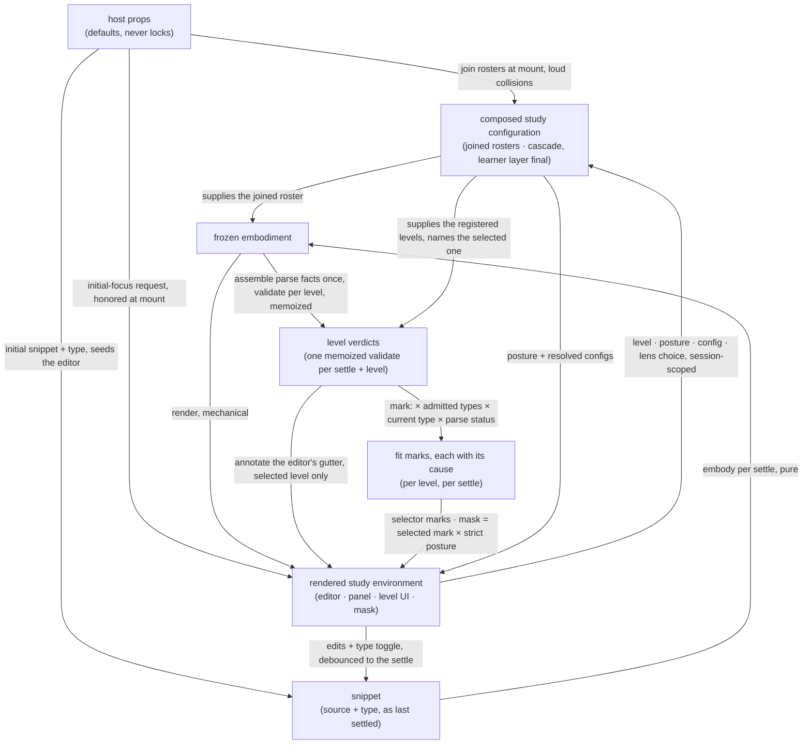

<!-- cspell:ignore renderable affordances -->

# orchestrate — Architecture & Decisions

Region-level architecture for the orchestrator described in
[README.md](./README.md). The package sketch ([../DOCS.md](../DOCS.md)) owns the
package-level shape — this region is its keeper: the four package phases happen
here or are driven from here. This document constrains the region at its root
abstraction; each rendered surface and derivation library zooms in below.

## Architectural sketch

> Written Phase 0, before implementation. The Refactor step is held against this
> document — not what the code does, but what shape it takes.

## Execution phases

1. **Compose** — two cadences. At mount, sync and loud: the default lens roster
   joins the host's injected lenses, the built-in levels join the injected ones
   — append-only, collisions fail loudly. Continuously: the configuration
   cascade re-resolves per lens name over the layers this region sees — the
   configs prop, then a recommendation's opening overrides when the open lens
   arrived that way, then the learner's tweaks, always final. Input: the host
   props + session choices. Output: the composed study configuration.

2. **Derive** (sync, pure, per settle) — the settled snippet is embodied with
   the joined roster; the parse facts a level consumes are assembled once from
   the embodiment's stage values; one memoized validate runs per registered
   level; the fit marks derive from those verdicts, the levels' admitted snippet
   types, the current type, and the parse-stage status. All of it in pure
   functions — level logic never lives inside a React component. Input: the
   settled snippet + the composed study configuration. Output: the frozen
   embodiment + the level verdicts + the fit marks.

3. **Render** (mechanical) — the five-phase panel renders the embodiment; the
   level UI renders the verdicts and marks; the mask derives here, from the
   selected level's fit mark — carrying its cause — crossed with the strict
   posture, classifying surfaces into the three classes; an initial-focus
   request mounts here, through its honor path; recommendations render here,
   ranked, through the mask. Input: embodiment + verdicts + composed study
   configuration. Output: the rendered study environment.

4. **Interact** (async at the edges) — each control re-enters its own phase:
   source edits re-enter Derive at the next settle; the snippet-type toggle
   re-enters Derive immediately; level selection, posture, and configuration
   tweaks re-enter through the composed study configuration with no re-parse;
   opening a lens mounts it with the frozen embodiment and its resolved config.
   Input: the rendered environment + learner intent. Output: a new settle or a
   re-render.

## Data flow

## Structural constraints

- **Zero fit or accessibility derivation.** Both are embody's; this region
  renders what the embodiment carries and recovers its own renderable lenses by
  filtering its own roster against the attached refs — no casts.
- **Pure derivation libraries, thin components.** The fit marks, the mask
  classification, the config resolution, and the parse-facts assembly live in
  pure functions; components render their outputs.
- **One memoized validate per settle and per level** — the selector, the gutter,
  and the mask share it; nothing validates twice.
- **The single writer.** Only the editor mutates the source; every derived state
  re-derives per settle.
- **Append-only composition, loud collisions.** Built-ins are never replaced or
  shadowed; failure happens at mount, at the author's desk.
- **Class-2 controls never mask.** Any control whose change can restore
  conformance — and the guide — stays alive under every posture.
- **The undetermined carve-out wins.** While the code does not parse, the mask
  names no violation and the parse phases' supports stay uncovered — regardless
  of type admission.
- **Display labels live here.** The five phases' learner-facing labels and the
  none-state's display string are this region's presentation concern; the data
  names are the other regions'.

## Decisions

- **Why the composition root is here.** One place joins, so one place can be
  loud: collisions surface at mount, at the author's desk, never as silent
  shadowing discovered by a learner.
- **Why memoization is here.** Three consumers — selector, gutter, mask —
  project one verdict; owning the memoization beside the consumers keeps one
  validate per settle and per level, and one place that assembles the parse
  facts.
- **Why the mask derives at render.** Mask state follows the settled fit mark,
  so it never flaps mid-keystroke; deriving it any earlier would couple
  enforcement to typing. The mask re-derives nothing: the marking library
  classified once, and the mask projects the selected level's classification.
- **Why components stay thin.** Every level-aware derivation is a pure function
  that tests without a DOM; the React layer renders results and routes intent,
  nothing more.

## Out of scope

- **Fit and accessibility** — embody's derivation, rendered here untouched.
- **Lens and evaluator internals** — a mounted lens owns its view; evaluators
  are its own imports; this region never touches an evaluator.
- **Level content** — validators, docs, support data, and models belong to their
  levels; this region consults and projects.
- **Level-UI rendering and bus wiring** — how the selector and toggles render
  their intent affordances and how bus subscriptions are wired belongs to the
  level-ui and event-bus internals, documented there. Session choices themselves
  have one owner, the top component — no surface holds one.
- **The embedding site's composition** — whatever layers produce the configs
  value upstream are the host's build, invisible here.
- **Learner identity, progress, grading** — the embedding LMS's.
