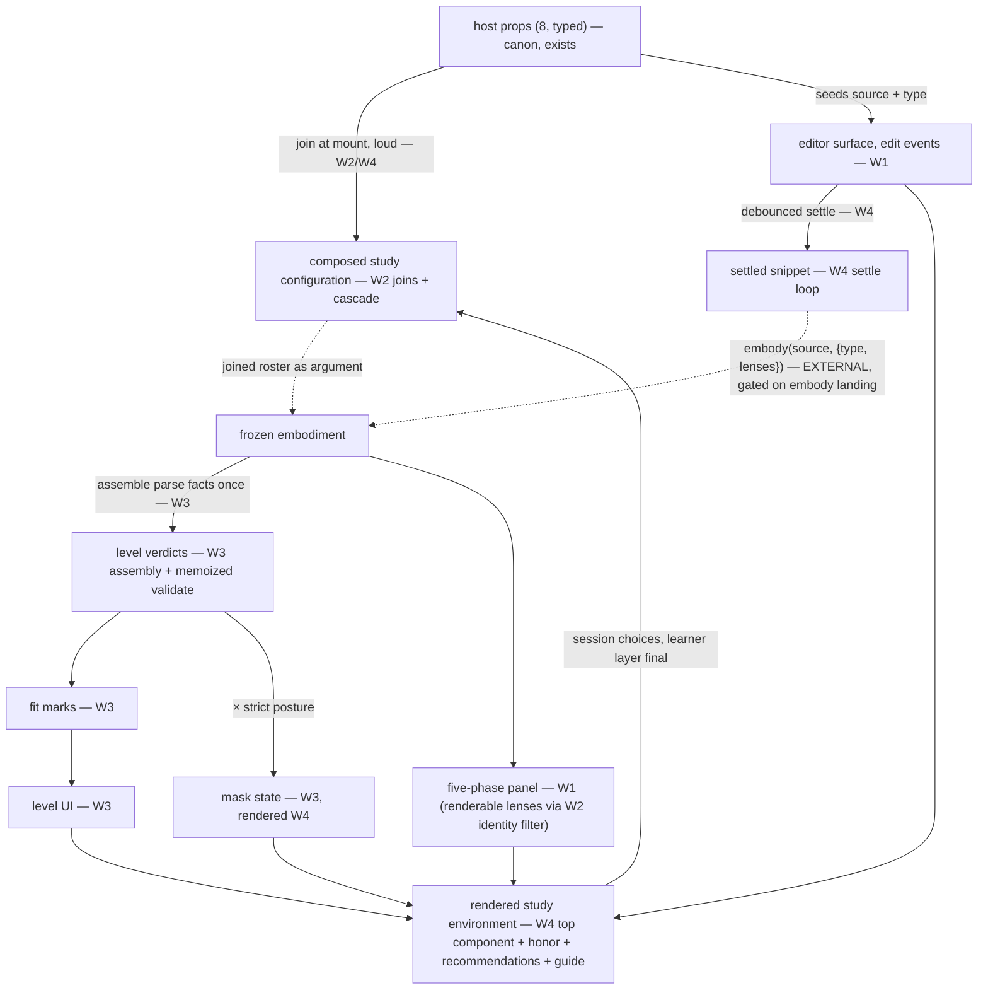

<!-- cspell:ignore Gateable entwined memoized unparsed renderable gateables -->

# orchestrate — Phase-1 campaign brief and launch prompts

Transitional scaffolding (like `../evaluators/PHASE-1-HANDOFF.md`): the
maintainer deletes this file and its two `PHASE-1-REFERENCE-*.md` siblings when
the campaign completes. It is the entry point for every executing agent. The
region's end-state truth lives in [README.md](./README.md),
[DOCS.md](./DOCS.md), and [types.ts](./types.ts) — this file carries only the
campaign's process.

## Ground truth (at campaign approval, 2026-07-18)

- **Campaign baseline SHA: `aaa4d0d93d6cdc786c1ace1c68bd4e33917a7d62`** — AR-5
  diffs `baseline..HEAD` scoped to this campaign's paths only (other streams
  commit into the same range by design).
- This region is docs+types only. Zero lenses exist; `language-levels/jej/` has
  Wave-0 modules but no spine object; `embody()` does not exist yet (the embody
  stream is building it — its uncommitted work may sit in the worktree).
- **Never stage foreign paths.** At approval these carried other streams'
  uncommitted work: `AGENTS.md`, `DEV.md` (governance edits = LIVE POLICY:
  step-7b patch-or-reroll, AR-4 PAUSE discard-default — honor them, never commit
  them), the deleted `.planning-handoffs/study-lenses-jej-notional-machine.md`,
  `src/lib/study-lenses/embody/*` untracked files,
  `src/lib/study-lenses/language-levels/jej/types.ts`. Re-check
  `git status --short` yourself; the set will have changed.
- **Authoritative process docs for this stream**: this file. Peers:
  `../evaluators/PHASE-1-HANDOFF.md` (current, its own stream),
  `.planning-handoffs/study-lenses-embody-phase1.md` (embody stream; ground
  truth block stale, rulings live).
  `.planning-handoffs/study-lenses-phase1-entry.md` is BADLY STALE — nothing
  vouches for it; do not plan from it.
- ParseFacts extend-vs-replace is RULED (recorded at `9d037d8`): ParseFacts is
  KEPT and will be EXTENDED with entwined/scope facts; this region assembles it
  from embody's Facts. See FLAG F4 for the not-yet-landed criterion.
- This file and its two `PHASE-1-REFERENCE-*.md` siblings were committed at
  campaign Step 0 (by the planning session). Executors treat all three as
  READ-ONLY inputs — they are never part of any wave's commit; updates to them
  are the orchestrator's or the maintainer's alone.

## Binding maintainer rulings (2026-07-17/18)

1. Walking skeleton first; 🔍 sandbox checkpoints early.
2. Parallel-but-guarded vs the embody stream: no runtime edge to embody until
   Wave 4; Wave 4 serialized behind `embody()` landing.
3. Staggered Phase-0s: Wave 0 = region decomposition + Wave-1/2 sub-Phase-0s
   only; Waves 3 and 4 open with their own Phase-0s + AR-1/AR-2 + human gate.
4. Layout: `lib/{composing,validating,marking,masking,honoring,recommending}/`
   plus root-level `editor/ phases-panel/ level-ui/ guide/ event-bus/` and the
   top component. Names refinable at AR-1; the grouping is not.
5. Editor v1 = plain CodeMirror 6 + settle callbacks; no level channels, no
   diagnostics (selected-level gutter deferred — FLAG F3). QUARRY for every
   "port the deprecated …" instruction:
   `src/lib/study-lenses--deprecated-architecture/orchestrate/` —
   `lib/editing/create-editor.ts`, `lib/editing/build-extensions.ts`,
   `editor/index.tsx`, `event-bus.ts`, `tests/study-lenses.test.tsx`, each with
   its tests. Copy patterns, re-point contracts; never import from it.
6. Scaffolding level lives at `../language-levels/<key>/` (real directory, spine
   object + tests) WITH the approved canon amendment to
   `../language-levels/README.md`: "never a built-in directory" → "never on the
   built-in roster". Injected via props only; Wave-2 join tests pin its absence
   from the built-in roster.
7. Sandbox pages at `spiralearn/sandbox/` (repo root).
8. Other agent streams are live and non-overlapping; expect HEAD movement;
   explicit-path staging always.

## Execution model

Executors are launched by the maintainer (opus agents in ultracode, parallel or
sequential per § Orchestrated delegation). Every executing agent:

- Launch brief = this file + the governance router + your wave/cluster
  assignment. Read the governance chain FIRST: repo `CLAUDE.md` routes opus
  agents to `AGENTS.md` and fable agents to `AGENTS.fable.md`; both point into
  `DEV.md`. This brief does not replace governance.
- Re-verify live state at start: `git log --oneline -5`, `git status --short`,
  and your wave's entry gate. Handoffs describe the past; git describes the
  present.
- AR dispatch: invoke registered `ar-1`..`ar-5` by name, NEVER pass a `model`
  parameter (pins live in the agents' frontmatter). Every AR prompt states:
  STRICTLY READ-ONLY — no writes, moves, or deletes.
- Human gates stay human: the Wave-0/3/4 Phase-0 gates, every 🔍 checkpoint, AR
  PAUSE resolutions, and the push. At a gate: STOP and report. Never
  self-approve across a gate.
- Report DONE | BLOCKED | FLAG — no fourth channel. Announce every commit with
  its full SHA and message.

## Per-increment ceremony checklist (EVERY increment, Waves 1–4)

This checklist adapts DEV.md's per-increment workflow to this campaign (per-file
lint checkpoints; path-scoped quality checks — whole-repo `npm run lint` hits
pre-existing foreign-stream debt and is NOT a per-increment step here). Where
the step lists differ, these 18 steps bind for campaign increments;
`npm run validate` fires once, at Phase 2.

1. JSDoc/TSDoc (contract + `@remarks` why where names don't suffice)
2. Stub (inline `export default function` for behavior files; named-then-export
   for constants)
3. Placeholder types (`unknown` to unblock; tightened at step 12)
4. Lint checkpoint 1 — `npx eslint <new-file>`
5. ONE failing test in ZOMBIES order (`tests/`, `.test.ts` or `.test.tsx`,
   explicit vitest imports, inline data, one assertion per `it`; jsdom
   increments add `// @vitest-environment jsdom` + explicit
   `afterEach(cleanup)`). Ask: could a hardcoded return pass? If yes, name the
   second test now.
6. **AR-3** — provide: test path, stub/types paths, the sub-directory DOCS.md,
   related tests. Resolve verdict per DEV.md rules.
7. Lint checkpoint 2 — `npx eslint <test-file>`
8. Implement minimal green (Fake It legitimate for test 1, expires at test 2).
   Step-7b patch-or-reroll: green from guessing or backtracking → discard and
   re-implement fresh, naming the confusion.
9. Lint checkpoint 3 — `npx eslint <impl-file>`
10. Refactor against the sub-directory DOCS sketch (phases named, no Fake-It
    residue, ubiquitous language; ephemeral intra-file Mermaid; any inter-file
    two-tier trigger → STOP, check in with the human)
11. Lint checkpoint 4 — `npx eslint` on all modified code;
    `npx markdownlint-cli2 "<file>"` for any `.md` (TRAP: it lints the whole
    repo regardless of arguments — act only on findings in our files);
    `npx cspell <file>` (prefer per-file ignore comments over editing the shared
    `cspell.json` — cross-stream contention)
12. Update types (the sub-directory `types.ts`)
13. Self-review — your governance file's two checklists (opus: AGENTS.md § LLM
    Anti-Patterns + Pre-Proposal Checklist; fable: AGENTS.fable.md § Self-Review
    Checklists)
14. **AR-4** — PAUSE before commit → default proposal is discard-and-retry (live
    policy).
15. Quality checks — `npm run test:unit && npm run typecheck`; show real output;
    read all three vitest summary lines (`Test Files | Tests | Errors`)
16. 🔍 Sandbox checkpoint when user-observable (named action + named observation
    — scripts inline in the wave sections) — else the explicit skip declaration.
    Behavioral defects block the commit; cosmetic redirects roll forward. Dev
    server `npm start`, reuse hot reload.
17. Docs-match check (the touched directory's README/DOCS still true)
18. Commit: `git add <explicit paths only>` → `git status --short` +
    `git diff --staged --stat` (the staged diff must be EXCLUSIVELY yours; never
    the foreign paths in § Ground truth) → `git commit -m "add: …"` → announce
    full SHA + message.

## WAVE 0 — region decomposition + Wave-1/2 Phase-0s (docs only)

Exit: one `docs:` commit + HARD human gate.

- **0.1 Ubiquitous language** (drafted here; homed in the region README glossary
  and in the 0.2 sub-READMEs as they are written): settle loop (edit event ≠
  settle); level verdict (≠ fit mark ≠ lens fit — pin the three-way
  near-homonym); session choices (+ their single owner); blocked state; built-in
  roster; scaffolding level; display labels (+ the none-state display string).
- **0.2 README specs** — end-state voice ONLY: update region README § What lives
  here with the ruled layout (ALL sub-directories named, including Wave-3/4 ones
  — the tree is end-state; only their Phase-0 zoom-ins are staggered); new
  README.md for each Wave-1/2 sub-directory:
  - `editor/` — single writer; end-state includes the level-adapter seam and
    orchestrator-supplied diagnostics EXCLUSIVELY (the double-parse guard, as a
    structural constraint); the settle debounce is NOT the editor's (top
    component's). Edit events per keystroke.
  - `phases-panel/` — pure presentation; ordered phase list AS A PROP (the panel
    never mints an order — second-truth guard); barred renders barred with
    cause; a zero-lens phase renders present-but-empty; display labels.
  - `lib/composing/` — the joins (append-only, loud collisions, `''` reserved),
    the cascade (configs prop layer → learner layer final; resolution runs
    through the lens's own `config` factory WHEN the lens declares one, else
    through the shared deep-merge — not a design choice, this is canon per
    `Lens.config`'s doc in `../lenses/types.ts`; an `undefined`-valued override
    key is absent, `null` is a value), renderable-lens recovery (identity
    filter, no casts; unknown attached ref → dev-mode report, dropped — a
    proposal for AR-1 to challenge), and the built-in roster constant files
    (both empty arrays today; the Interfaces tests pin them scaffold-free).
  - `lib/honoring/` — the honor path (a phase-declaring lens is honored iff
    attached to an accessible phase; a panel-excluded lens via its applicability
    at mount; otherwise fallback; never a throw).
  - `lib/recommending/` — ranking only (relevance descending, stable ties).
  - `event-bus/` — per-instance, synchronous, snapshot-at-dispatch, caught
    listener throws, idempotent unsubscribe, `clear()`; taxonomy proposal:
    `level-selected · posture-toggled · type-toggled · lens-opened · settled`
    (AR-1 challenges); dispatch-ordering rules.
- **0.3 AR-1** — provide paths: all new READMEs, region README/DOCS/types,
  package README/DOCS/WORKFLOWS, the four sibling `types.ts`, the rulings above
  verbatim, and the carried opens (the gate agenda Q1–Q6 + the FLAG ledger).
  Focus: homonym collisions, sub-context sizing, second-truth risks (phase
  order, the SnippetType mirror), scaffolding-level key + validate semantics
  (proposal: key `scaffold`, validate flags `debugger` statements — all four fit
  marks reachable).
- **0.4 types.ts** per Wave-1/2 sub-directory (internal contracts; the region
  `types.ts` stays the only public surface). AR-refinable candidates: editor
  `EditorCallbacks { onEdit(source) }`; phases-panel ordered-phase-list props
  and open-lens intent; composing joined-roster + cascade types; honoring
  mount-decision union (honored-in-phase | honored-panel-excluded | fallback);
  recommending ranked-proposals output; event-bus `EventPayloadMap`.
- **0.5 DOCS.md sketches** per Wave-1/2 sub-directory: named phases in domain
  terms; `## Data flow` Mermaid — data-state diagrams for composing / honoring /
  recommending / event-bus; the presentation-component EXCEPTION
  (props-down/callbacks-up wiring; prop names allowed) for editor and
  phases-panel; structural constraints (double-parse guard, loud vs graceful);
  out-of-scope sections. Readable in 60 seconds each.
- **0.6 AR-2** — provide every new DOCS + README + types + region/package DOCS.
  Doubles as the intra-region coherence audit: sub-diagrams compose into the
  region diagram; no smuggled fit/accessibility derivation, second parse, or
  second phase-order truth; the presentation exception correctly applied.
- **0.7 Review · commit · gate** — read-together predictability check (DEV.md
  0.7); lint all new files; `npm run typecheck`. Commit (explicit paths):
  `docs: establish orchestrate wave-1/2 sub-region domain models and sketches`.
  Announce SHA. **STOP — human gate.** Agenda:
  - Q1 scaffolding-level key + `debugger`-flagging validate +
    `snippetTypes: ['module']` (location + canon amendment already ruled).
  - Q2 `type` prop default `'module'` — doc-comment amendment to the region
    types.ts + README (public surface — needs ratification).
  - Q3 event taxonomy + session-choices owner (as proposed in 0.1/0.2).
  - Q4 FLAG routing: the runtime phase-order constant → embody stream (a tiny,
    dependency-free `embody/lifecycle-phase-order.ts`); the ParseFacts extension
    → jej/maintainer, pre-Wave-3.
  - Q5 DAG lock for fan-out (§ Orchestrated delegation); 🔍-bearing increments
    stay with the orchestrator.
  - Q6 sandbox page shape: `.mdx` under `spiralearn/sandbox/` importing region
    components under `@docusaurus/BrowserOnly` (Docusaurus pre-renders pages in
    node — unguarded CodeMirror breaks the build).
  - Context-free handoff validation (the invariant — #11 in AGENTS.md, #12 in
    AGENTS.fable.md): a fresh agent with NO session context validates the Wave-1
    launch/decomposition before fan-out; apply must-fix findings.

## WAVE 1 — skeleton surfaces (editor + phases-panel)

Entry: Wave-0 gate passed; the orchestrator seeds `spiralearn/sandbox/index.mdx`
(commit `docs: seed the sandbox content tree`). Exit: both surfaces checkpointed
on sandbox pages; all increments committed green.

- **W1-E1 `createEditor`** (`editor/lib/`) — port the quarry's
  `create-editor.ts`, v1-trimmed extensions (basicSetup + JS language + change
  listener; NO lint/autocomplete/hover/format). Async factory → `EditorInstance`
  (get/set content, destroy, destroyed-sentinel; callbacks never see CodeMirror
  types). jsdom. Z: create-then-destroy on empty source, no callback fires. Skip
  🔍 (declared: internal factory, surfaced at W1-E3). Commit:
  `add: createEditor — async CodeMirror factory behind a callback boundary`
- **W1-E2 edit events** — one `onEdit(source)` per document change; an own-write
  set does not echo. jsdom. O: one edit → one call; M: n → n; B: setContent → no
  echo. Skip 🔍 (declared). Commit:
  `add: createEditor emits one edit event per change, without own-write echo`
- **W1-E3 `Editor` component** — port the quarry's async-mount lifecycle
  (cancellation flag, mount-race recovery, error fallback with a data
  attribute). jsdom; tests render inside `<React.StrictMode>`; assert exactly
  one live editor via `EditorView.findFromDOM`. 🔍 page
  `spiralearn/sandbox/editor/index.mdx`: type + multi-line paste → keystrokes
  render, exactly one editor, browser console clean. Commit:
  `add: Editor component — StrictMode-safe async CodeMirror mount`
- **W1-P1 `PhasesPanel`** — ordered-phase-list prop → five sections in the given
  order with display labels; an accessible phase lists its lens names (intent
  callback up); a barred phase shows its cause; a zero-lens phase is
  present-but-empty; data-attribute selectors (tests anchor on attributes, never
  label text). jsdom. Z: five accessible phases, zero lenses; O/M; B: barred +
  cause; I: intent payload. 🔍 page `spiralearn/sandbox/phases-panel/index.mdx`
  with TWO hand-built Embodiment literals (one parsing, one tokens-failure):
  spec order + labels; the barred variant shows the parser's cause; a click
  echoes intent. Hand-built literals in tests/pages are scaffolding data at the
  component's production contract — never a production-dispatch fixture; W2-C1
  pins the roster guard. Commit:
  `add: PhasesPanel — mechanical render of the study layer, barred with cause`

## WAVE 2 — pure derivations + event bus (node)

Entry: Wave-0 types committed (may fan out alongside Wave 1 per the locked DAG).
Every Wave-2 increment declares at step 16: "no sandbox checkpoint: pure
derivation" (W2-B1: "no sandbox checkpoint: pure infrastructure").

- **W2-C1 `joinLensRoster`** — built-ins + injected, append-only, a name
  collision throws naming the lens; an Interfaces test pins that the built-in
  roster contains NO scaffolding entry. Frozen output (`deepFreezeExcept`, lens
  refs excepted — freeze-what-you-own). Z: no injections → the built-in roster
  (currently empty). Commit:
  `add: joinLensRoster — append-only join with loud name collisions`
- **W2-C2 `joinLevelRoster`** — same for levels; injecting key `''` throws
  (reserved none-state); a key collision throws; the scaffolding level is
  asserted absent from built-ins. Commit:
  `add: joinLevelRoster — append-only join, none-state key reserved`
- **W2-C3 `resolveLensConfig`** — the lens's `config` factory when declared,
  else the shared deep-merge (canon: `Lens.config` doc in `../lenses/types.ts` —
  both paths are required behavior, not a choice), over the configs-prop layer,
  learner layer final; an `undefined`-valued key is absent, `null` is a value
  (mind `exactOptionalPropertyTypes` in test literals). Z: no overrides →
  factory defaults; triangulate three-layer precedence on one key AND the
  no-factory path. Commit:
  `add: resolveLensConfig — cascade per lens name, learner layer final`
- **W2-C4 `recoverRenderableLenses`** — reference-identity filter of the joined
  roster against a phase's attached Gateable refs → renderable lenses, no casts;
  unknown ref handled per the Wave-0 ruling. Z: empty attached → empty. Commit:
  `add: recoverRenderableLenses — identity filter over the joined roster, no casts`
- **W2-H1 `honorFocusRequest`** — request + roster + Embodiment → mount-decision
  union. Z: no request → fallback; unknown name → fallback (never a throw); B:
  attached-but-barred → fallback; panel-excluded → applicability runs once at
  mount. Commit:
  `add: honorFocusRequest — honored through fit and accessibility, never a bypass`
- **W2-R1 `rankRecommendations`** — relevance descending, stable ties, frozen.
  Z: empty → empty; M makes hardcoding impossible. Commit:
  `add: rankRecommendations — relevance-ranked, stable ties`
- **W2-B1 `createEventBus`** — port the quarry's bus semantics with the Wave-0
  taxonomy (snapshot dispatch via `Array.from` + the documented
  `unicorn/prefer-spread` disable — the Babel mistranspile; DEV.md § 13 bans
  `Set` on frozen surfaces anyway). Z: dispatch with no listeners is a no-op.
  Commit:
  `add: createEventBus — per-instance synchronous bus with snapshot dispatch`

## WAVE 3 — level machinery + level UI

**Entry Phase-0 first**: READMEs/types/DOCS for `lib/validating/` `lib/marking/`
`lib/masking/` `level-ui/` + the scaffolding level directory + the APPROVED
canon amendment to `../language-levels/README.md` ("never a built-in directory"
→ "never on the built-in roster") → AR-1 → AR-2 → commit
`docs: establish orchestrate level-machinery sub-regions and the scaffolding level`
→ **human gate**. Gate agenda: session-state home finalization if still open;
verify the ParseFacts extension landed per the F4 CRITERION (fields beyond
`{tokens, comments, ast}` — the three-field shape in the file at plan-write is
PRE-extension); if not landed, FLAG-hold W3-V1. Key contract candidates:
`LevelVerdict` (undetermined | validated + violations), `VerdictsByLevel`
(record by level key), `SurfaceClass` (editor-based | meta-control | maskable),
`MaskState` (unmasked | masked + level label + violation-or- type-admission
cause).

- **W3-D1 scaffolding level** (`../language-levels/<key>/`) — the spine object:
  deterministic validate flagging `debugger` statements (Violation with
  offsets + node path), `snippetTypes: ['module']`, minimal docs strings, stub
  editorSupport channels, empty models. node. Z: empty program → no violations;
  O: one `debugger` → one violation with the correct range; M. Skip 🔍
  (declared: no UI consumer yet). Commit:
  `add: <key> scaffolding level — trivially conforming, injected-only`
- **W3-V1 `assembleParseFacts`** — Facts → ParseFacts when tokens + ast are
  `ok`, else the undetermined signal (NO level consulted — undetermined is the
  caller's own verdict). Real acorn parses inline in tests (a real leaf
  dependency; never a mock of embody). node. Z: failed tokens stage →
  undetermined; triangulate values-not-envelopes threading (tokens, comments,
  ast — plus whatever fields the F4 extension has added by then). Commit:
  `add: assembleParseFacts — one assembly from the embodiment's stage values`
- **W3-V2 memoized validate** — settled `(source, type)` identity + level key →
  exactly one `validate` call per (settle, level) across repeated reads
  (argument spy on a locally built level object — not `vi.mock`). node. Z: zero
  levels → empty record; O: one level read thrice, validated once. Commit:
  `add: one memoized validate per settle and per level`
- **W3-M1 `deriveFitMarks`** — verdicts + each level's admitted types + the
  current type + parse status → a FitMark per level. node. Z: unparsed → every
  mark `undetermined`; then fits / does-not-fit / not-applicable-for-type; B:
  unparsed AND type-not-admitted → `undetermined` (the carve-out wins). Commit:
  `add: deriveFitMarks — four-valued marks, undetermined carve-out wins`
- **W3-K1 `deriveMask`** — the selected level's verdict × posture + the
  type-admission check → MaskState + surface classification. node. Z: warn →
  never masked; strict + violations → masked naming the level + first violation;
  strict + type-inadmissible (parsed) → the type-admission cause; strict +
  undetermined → NOT masked. Commit:
  `add: deriveMask — verdict crossed with posture over the three surface classes`
- **W3-L1 `LevelSelector` + strict toggle** — closed face (selected level's
  state), open list (a fit mark per registered level + the none-state label
  entry), docs on hover, the strict toggle; props down / intent up;
  data-attribute selectors; NO geometry assertions (pixel truth is 🔍-only).
  jsdom. Z: levels registered, none selected → the none-state face; O/M: marks
  per level; I: select/toggle intents. 🔍 page
  `spiralearn/sandbox/level-ui/index.mdx`: a harness injects the scaffolding
  level and wires the real `deriveFitMarks` over prepared parse states → all
  four marks reachable; hover shows the level's docs; the closed face tracks
  selection; the strict toggle is visible. Commit:
  `add: LevelSelector — fit marks, none-state, docs on hover`

## WAVE 4 — integration (fully serialized; orchestrator only)

**Hard entry gate**: `embody()` exported + committed + covered by the embody
stream; the runtime phase-order constant exists in embody (FLAG F1); Waves 1–3
committed. Seam-read embody's committed contract first. Wave-4 Phase-0
(top-component/settle-loop docs zoom-in + remaining types, incl. the Q2
`type`-default doc-comment) → AR-1/AR-2 → commit → gate; context-free validation
of the Wave-4 brief.

- **W4-S1 settle loop** — trailing-edge debounce (`@utils/debounce`, `.cancel()`
  inside the ALWAYS-returned idle-safe effect cleanup — the sonarjs trap); the
  type toggle re-derives immediately and cancels any pending settle; staleness
  keyed by the settled `(source, type)`. jsdom, fake timers, StrictMode. Z: no
  edits → no settle; O; M: a burst → one trailing settle; B: toggle mid-debounce
  cancels + re-derives now. Skip 🔍 (declared). Commit:
  `add: settle loop — trailing-edge debounce, type toggle re-derives immediately`
- **W4-S2 `deriveStudyState`** — FIRST: the embody-conformance test (real
  `embody()` on known snippets asserts the invariants earlier waves' data
  assumed: frozen; five `study` keys; barred-cause carriage; success-only
  source/type arms). Then the pure per-settle composition:
  `embody(source, { type, lenses })` → `assembleParseFacts` → memoized validates
  → marks; frozen output. node; REAL embody + the scaffolding level (no mocks).
  Z: empty source; O: a parsing program; E: an unparsable program → barred
  phases + all-undetermined marks. Skip 🔍 (declared). Commit:
  `add: deriveStudyState — one derivation per settle over the joined roster`
- **W4-T1 `StudyLenses` composition root** — mount-time joins (loud), session
  choices per the Wave-0 ruling, a bus instance, the settle loop wired, phase
  order from embody's runtime constant + display labels; renders Editor +
  PhasesPanel (via `recoverRenderableLenses`) + LevelSelector + the type toggle.
  jsdom integration (real CodeMirror, `waitFor` mount, act-wrapped dispatch —
  quarry exemplar mechanics). Z: `snippet` alone mounts the whole instrument
  with defaults. 🔍 page `spiralearn/sandbox/orchestrate/index.mdx` with the
  scaffolding level injected: type until the debounce settles → phases
  re-render; break the parse → downstream phases bar with the cause; fix it →
  they reopen. Commit:
  `add: StudyLenses — composition root joins, settles, and renders the instrument`
- **W4-T2 enforcement mask render** — an inert overlay from `deriveMask` over
  class-3 surfaces; mounted lenses keep state beneath it; the blocked state
  names the level + first violation or the type-admission cause; class-2
  controls + the editor stay alive. jsdom. Z: warn → no overlay anywhere. 🔍:
  select the scaffolding level, enable strict, type a `debugger` statement →
  masked, naming it; delete it → unmasks; break the parse under strict → NO
  mask, the parse phases' supports stay uncovered; editor, selector, toggles,
  guide operable throughout. Commit:
  `add: enforcement mask — inert overlay, class-2 alive, undetermined carve-out`
- **W4-T3 focus honor at mount** — wire `honorFocusRequest`; the mask applies to
  a focus-mounted lens identically. Z: an unknown `lens` prop → normal
  rendering, no crash. 🔍: page variants (a nonexistent lens → normal; a
  page-injected panel-excluded lens → mounted via its applicability, masked like
  everything else). Commit:
  `add: initial focus honored through fit and accessibility`
- **W4-T4 recommendations through the mask** — collect fitting lenses'
  `recommend()`, rank via W2-R1, render through the mask. Z: no recommending
  lenses → no recommendation surface. 🔍 via a page-injected recommending lens.
  Commit:
  `add: recommendations — lens-proposed, ranked, rendered through the mask`
- **W4-G1 embedded guide** — static authored topics behind a reveal; never
  masked. jsdom. Z: collapsed by default. 🔍 rolls into the final gate. Commit:
  `add: embedded guide — help never withheld`
- **🔍 Phase-level full-instrument gate** — the WORKFLOWS.md learner
  walkthrough, live: paste broken JS → explained + barred; fix → phases open;
  level + strict → masked only while out of level; toggle type → the
  not-applicable path; every control alive.
- **Phase 2** — `npm run validate` (report, do not fix, pre-existing foreign
  debt) → **AR-5** (provide the campaign baseline SHA + the explicit path scope:
  `src/lib/study-lenses/orchestrate/**`, the scaffolding level's directory,
  `spiralearn/sandbox/**`; instruct a path-scoped diff — `baseline..HEAD`
  contains other streams' commits by design) → resolve → final commit → "Sprint
  complete — ready to push to main" (the push is the maintainer's).

## Data-path assembly across waves



Until Wave 4 the surfaces run on injected props and hand-built literals (tests +
sandbox pages) — the walking skeleton; Wave 4 swaps in the live loop without
changing any surface contract.

## Orchestrated delegation (after each wave's gate; DAG locked at Q5)

Ultracode mapping: "orchestrator" = whichever agent runs the wave; "worker" = a
subagent it spawns OR a parallel agent the maintainer launches. Either way the
DAG, the guard, and the 🔍 reservation bind identically.

- The orchestrator holds the spine: every `orchestrate/**/types.ts`, all DOCS
  diagrams, the plan/gate ledger, `spiralearn/sandbox/index.mdx`, and the seam
  reads at DAG joins; it serializes its own spine edits and writes no per-worker
  churn.
- 🔍-bearing increments NEVER fan out (W1-E3, W1-P1, W3-L1, all of Wave 4).
- Fan-out A (post Wave-0 gate): worker 1 = W1-E1→E2 (serial inside); worker 2 =
  W2-C1→C2→C3→C4 (serial — shared composing types); workers 3/4/5 = W2-H1,
  W2-R1, W2-B1. Guard clearance: disjoint directories; no shared `types.ts`
  edits (a needed type change is a FLAG the orchestrator applies serially);
  per-file cspell only; no dev server in workers. When in doubt, serialize.
- Join 1: seam-read composing/honoring; the orchestrator runs W1-E3 and W1-P1
  with their checkpoints.
- Wave 3 (post its gate): worker = W3-D1; worker = W3-V1→V2 (serial inside);
  then W3-M1 ∥ W3-K1 (both read validating's committed types; no mutual edge).
  Join 2: the orchestrator runs W3-L1.
- Wave 4: orchestrator-run, fully serialized (spine + the embody seam).
- Context-free validation of each fan-out decomposition before launching it.

## FLAG ledger (maintainer routes)

- **F1** runtime `LifecyclePhaseOrder` constant → embody stream (tiny,
  dependency-free `embody/lifecycle-phase-order.ts`); needed by the W4-T1 entry
  gate. Fallback if stalled: a local mint pinned
  `satisfies LifecyclePhaseOrder` + a named Wave-4 deletion increment.
- **F2** `embody()` landing gates Wave 4 (already the embody stream's mission).
- **F3** editor-adapter contract + the selected-level gutter → a named follow-on
  campaign (the verdict data exists from Wave 3; only the editor diagnostics
  channel is missing — and it must feed EXCLUSIVELY from the shared memoized
  validate, never an editor-side validator).
- **F4** the ParseFacts ruled extension must land in
  `../language-levels/types.ts` before W3-V1 locks (jej/maintainer's commit).
  **Criterion — do not misread**: "landed" means `ParseFacts` has GAINED
  entwined/scope-facts fields BEYOND `{tokens, comments, ast}`. The three-field
  shape in the file at plan-write is the PRE-extension shape; the ruling
  (`9d037d8`) defines the extension as future work, NOT landed as of 2026-07-18.
- **F5** uncommitted AGENTS/DEV governance edits — the maintainer owns
  committing them; agents honor them and never stage them.

## Risk register (mitigation baked into named increments)

| Risk                         | Carrier                | Mitigation                                                                                                                                                |
| ---------------------------- | ---------------------- | --------------------------------------------------------------------------------------------------------------------------------------------------------- |
| StrictMode double-invoke     | W1-E3, W4-S1/T1        | Port the quarry's cancellation-flag lifecycle; ALL component tests under `<React.StrictMode>`; one-live-instance assertion                                |
| jsdom geometry gaps          | W1-P1, W3-L1, W4-T2    | Data-attribute/state assertions only; pixel truth is 🔍-only; no splitter in scope                                                                        |
| Debounce/timer leak          | every jsdom file       | Explicit `afterEach(cleanup)` (the unit project runs globals:false); `.cancel()` in the always-returned cleanup                                           |
| Double-parse regression      | W3-V1/V2 + editor DOCS | Editor v1 ships NO validator; DOCS constraint: diagnostics exclusively orchestrator-fed; W3-V2's call-count test                                          |
| Fixture on the dispatch path | W2-C1/C2, W3-D1        | Built-in rosters pinned scaffold-free by Interfaces tests; the scaffolding level imported only by tests/pages; no source-text branching (AR-4 focus note) |
| Concurrent HEAD movement     | every commit           | Explicit-path staging + staged-diff verification; foreign paths never staged; AR-5 path-scoped                                                            |
| Docusaurus SSR crash         | W1-E3 page             | `@docusaurus/BrowserOnly` wrap from the first page; the earliest checkpoint proves the mount path                                                         |

## Verification

- Tests: `npm run test:unit`; single file:
  `npx vitest run --project unit <test-file>`; full: `npm test`. The browser
  project matches `*.browser.test.ts` only — none needed this campaign (no
  Worker/SharedArrayBuffer surface; declared deliberately).
- Lint per file: `npx eslint <file>`; `npx markdownlint-cli2 "<file>"`
  (whole-repo trap); `npx cspell <file>`. `npm run lint` short-circuits at
  lint:js.
- Types: `npm run typecheck`. Phase-2 gate: `npm run validate`.
- Sandbox: `npm start`; pages under
  `spiralearn/sandbox/{editor,phases-panel,level-ui,orchestrate}/`; the
  checkpoint scripts are inline in each wave section.

## Canon amendments

- APPROVED (maintainer, 2026-07-18): `../language-levels/README.md` § Adding a
  level — "never a built-in directory" → "never on the built-in roster" (lands
  with the Wave-3 Phase-0 docs commit; AR-2 reviews the wording).
- To ratify at the Wave-0 gate: the `type` default `'module'` doc-comment (Q2);
  the region README § What lives here sub-directory tree (0.2/0.7).
- Routed, not this stream's: embody's runtime order constant (F1).

## Launch prompts

<!-- cspell:disable -->

### Wave-0 executor

```text
You are the Wave-0 executor for the orchestrate campaign in
/Users/master/Documents/0-teach-code/0-spiralearn/0-curriculum-committee/0-curricula.
Read, in order, END-TO-END: CLAUDE.md (the governance router — follow it to
YOUR governance file), then src/lib/study-lenses/orchestrate/PHASE-1-HANDOFF.md
(your campaign brief). Re-verify live state (git log --oneline -5, git status
--short); never stage the foreign paths the brief's § Ground truth names.
Then read the canon: src/lib/study-lenses/{README,DOCS,WORKFLOWS}.md,
orchestrate/{README,DOCS,types.ts}, and the four sibling types.ts files
(embody, lenses, language-levels, evaluators). Execute § WAVE 0 exactly:
0.1 → 0.7, with AR-1 at 0.3 and AR-2 at 0.6 (registered agents, no model
param, STRICTLY READ-ONLY clause in their prompts). Docs + types only — no
implementations, no tests (0.4's types.ts files ARE Wave-0 deliverables).
Do not start the dev server: spiralearn/sandbox/ is a registered but empty
docs instance until the Wave-1 seed lands — npm start failing on it is
expected, not an environment block.
Commit with the message the brief specifies, announce the full SHA,
and STOP at the human gate, presenting the Q1–Q6 agenda. Report
DONE | BLOCKED | FLAG.
```

### Fan-out worker (template — fill the CLUSTER line)

```text
You are a worker in the orchestrate campaign in
/Users/master/Documents/0-teach-code/0-spiralearn/0-curriculum-committee/0-curricula.
CLUSTER: <e.g. W2-C1 → W2-C2 → W2-C3 → W2-C4, serialized in order>.
Increment-letter → directory map: E = editor/, P = phases-panel/,
C = lib/composing/, H = lib/honoring/, R = lib/recommending/, B = event-bus/,
V = lib/validating/, M = lib/marking/, K = lib/masking/, L = level-ui/,
D = the scaffolding level under ../language-levels/, S/T/G = Wave-4 region
root.
Read, in order, END-TO-END: CLAUDE.md (follow the router to YOUR governance
file), then src/lib/study-lenses/orchestrate/PHASE-1-HANDOFF.md — your
increments' specs are in its wave sections and the per-increment ceremony
checklist (all 18 steps) is binding for every increment, including AR-3 and
AR-4 (registered agents, no model param, STRICTLY READ-ONLY clause). Also
read the sub-directory README/DOCS/types for your cluster (committed at
Wave 0) and the reference files PHASE-1-REFERENCE-*.md beside the brief.
Re-verify live git state first; stage explicit paths only; verify every
staged diff is exclusively yours; announce every commit (full SHA + message).
You own your cluster's directory ONLY — a needed change to any types.ts or
DOCS you do not own is a FLAG, not an edit. No dev server. Report
DONE | BLOCKED | FLAG — "green but unverified" is BLOCKED, never DONE.
```

### Wave-3 entry executor

```text
You are the Wave-3 entry executor for the orchestrate campaign in
/Users/master/Documents/0-teach-code/0-spiralearn/0-curriculum-committee/0-curricula.
Read, in order, END-TO-END: CLAUDE.md (follow the router to YOUR governance
file), then src/lib/study-lenses/orchestrate/PHASE-1-HANDOFF.md. Entry
condition to verify FIRST: Waves 1–2 committed (check git log against the
brief's wave commit messages). Execute § WAVE 3's entry Phase-0: READMEs,
types.ts, and DOCS sketches for lib/validating, lib/marking, lib/masking,
level-ui, plus the scaffolding level directory under
src/lib/study-lenses/language-levels/ and the APPROVED canon amendment to
language-levels/README.md ("never a built-in directory" → "never on the
built-in roster"). AR-1 then AR-2 (registered agents, no model param,
read-only clause). Commit as specified, announce the SHA, and STOP at the
human gate — including the F4 ParseFacts check by the brief's CRITERION
(fields beyond {tokens, comments, ast}). Report DONE | BLOCKED | FLAG.
```

### Wave-4 entry executor

```text
You are the Wave-4 entry executor for the orchestrate campaign in
/Users/master/Documents/0-teach-code/0-spiralearn/0-curriculum-committee/0-curricula.
Read, in order, END-TO-END: CLAUDE.md (follow the router to YOUR governance
file), then src/lib/study-lenses/orchestrate/PHASE-1-HANDOFF.md. HARD entry
gate to verify FIRST — do not start if any fails: (1) embody() is exported,
committed, and covered (read src/lib/study-lenses/embody/ yourself); (2) the
runtime phase-order constant exists in embody (FLAG F1); (3) Waves 1–3 are
committed. Seam-read embody's committed contract before building on it.
Execute the Wave-4 Phase-0 (top-component/settle-loop docs + remaining types
incl. the Q2 type-default doc-comment), AR-1/AR-2, commit, STOP at the human
gate. After the gate: the Wave-4 increments run fully serialized in one
session, each with the full 18-step ceremony and its 🔍 checkpoint, ending in
Phase 2 (npm run validate → AR-5 with the campaign baseline SHA
aaa4d0d93d6cdc786c1ace1c68bd4e33917a7d62 + path scope → final commit → push
prompt). Report DONE | BLOCKED | FLAG.
```

<!-- cspell:enable -->

## Campaign log (appended per the maintainer's 2026-07-18 mandate)

- 2026-07-18 — Wave 0 closed: `c9452c5` (region decomposition + wave-1/2
  sub-Phase-0s; AR-1 CONSIDER ×11 fixed, AR-2 CONSIDER ×11 fixed; notable
  resolutions: marking owns the one per-level classification, cascade gains the
  `opened` layer, honoring catches throwing applicability). Human gate waived by
  maintainer override; Q1–Q6 defaults adopted, ratification items reported in
  session. FLAGs open: F1 (embody runtime order constant), F4 (ParseFacts
  extension pre-W3-V1). Carried to Wave-4 Phase-0: the `opened` layer's
  lifecycle; package-DOCS verdicts-node label amendment (maintainer).
