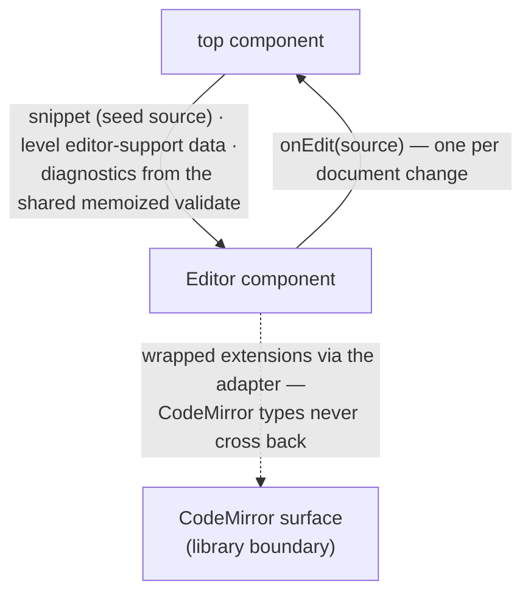

# editor — Architecture & Decisions

Architecture for the editing surface described in [README.md](./README.md). The
region sketch ([../DOCS.md](../DOCS.md)) owns the region shape; this document
constrains only this surface.

## Architectural sketch

> Written Phase 0, before implementation. The Refactor step is held against this
> document — not what the code does, but what shape it takes.

## Execution phases

1. **Mount** (async, cancellable) — the factory builds the CodeMirror surface
   behind the callback boundary. A mount superseded before it resolves —
   StrictMode's double-invoke, a prop change mid-flight — destroys what it built
   and leaves exactly one live surface. Construction failure renders the
   fallback, marked with a data attribute; the page never goes down. Input: the
   seed source. Output: one live editing surface, or the fallback.

2. **Edit relay** (sync) — every learner document change raises one edit event
   carrying the full source. A throwing consumer is caught and warned — a
   misbehaving listener never destabilizes the surface. Input: a document
   change. Output: one edit event.

3. **External write** (sync) — a programmatic content write replaces the
   document without raising an edit event: an own-write never comes back as an
   edit. Input: replacement source. Output: the updated document, silently.

4. **Teardown** (sync, idempotent) — destroy releases the surface; the instance
   stays callable as a dead sentinel and no callback ever fires again.

## Data flow

This is a presentation surface owning no derivation — a component/prop-flow
diagram (the documented exception; prop and callback names are the content).

## Structural constraints

- **No validator lives here.** Every diagnostic rendered arrives
  orchestrator-supplied from the region's one memoized validate — the
  double-parse guard. CodeMirror's own tokenizer highlights; it never judges.
- **The callback boundary is total** — no CodeMirror type crosses out of this
  directory, in props, callbacks, or returns.
- **No settling here** — edit events fire per document change; the settle
  debounce is the top component's.
- **One live surface** — cancellation on unmount and on superseded mounts; never
  two editors for one component. The component owns this policing entirely: the
  factory builds wherever it is pointed and never distinguishes a legitimate
  second editor from a stale superseded mount.
- **Data attributes are the selector contract** — the mounted host carries
  `data-editor-host`; the construction-failure fallback carries
  `data-editor-host` and `data-editor-error` together. Tests and consumers
  anchor on these, never on markup shape.
- **Always alive** — surface class 1; no posture masks the editor.

## Out of scope

- The settle loop and its debounce (the top component's).
- Validation, verdicts, marks (the derivation libraries').
- The level's editor-support data content (each level ships its own; the adapter
  here only applies it).
- Lens mounting and the study panel (siblings').
