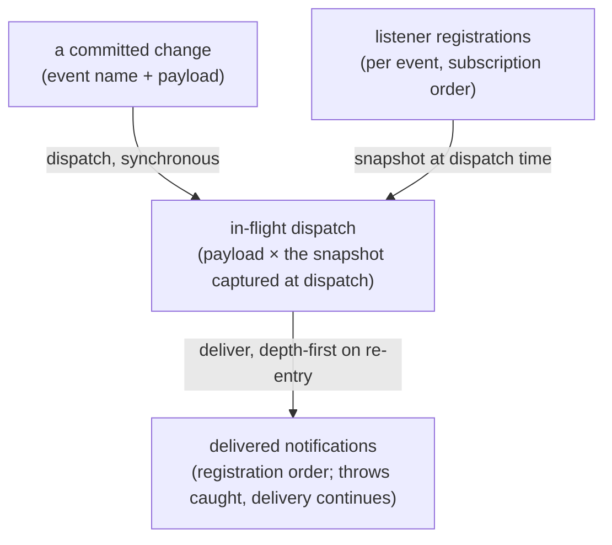

<!-- cspell:ignore entrancy -->

# event-bus — Architecture & Decisions

Architecture for the internal bus described in [README.md](./README.md). The
region sketch ([../DOCS.md](../DOCS.md)) owns the region shape; this document
constrains only this bus.

## Architectural sketch

> Written Phase 0, before implementation. The Refactor step is held against this
> document — not what the code does, but what shape it takes.

## Execution phases

1. **Register** (sync) — a listener subscribes to one event by identity;
   re-subscribing the same listener is idempotent, and the returned teardown is
   idempotent too — StrictMode's subscribe → cleanup → subscribe holds. Input:
   an event name + a listener. Output: the teardown.

2. **Dispatch** (sync) — an announcement snapshots the event's listener set and
   delivers to the snapshot in registration order, before returning. A listener
   that throws is caught and warned, and later listeners still fire; a listener
   that dispatches re-enters depth-first on its own snapshot; a listener that
   mutates registration affects only future dispatches. Input: an event name +
   its payload. Output: delivered notifications.

3. **Clear** (sync) — every listener drops; a test-isolation affordance.

## Data flow

## Structural constraints

- **Per-instance isolation** — one bus per mount; no shared or module-level
  listener state between instances.
- **Announcements, never intent** — dispatch happens after the owning state
  commit; surfaces raise intent through callbacks, not the bus.
- **Ordering** — binds the dispatching owner, recorded here as part of the
  taxonomy's contract: a choice announcement precedes the settle announcement it
  causes; one settle announcement per settle, after derived state commits.
- **A close rides its own arm's event** — the pane holds one of several
  occupants, and each announces its own close: the lens arm's close is its own
  event carrying no name, the generator's is its own boolean. No arm ever
  announces another's close, so a subscriber that cares about one occupant never
  has to disambiguate a shared event.
- **Internal only** — the bus never appears on the host surface.

## Decisions

- **Why no standalone unsubscribe.** The subscribe-returned teardown is the one
  removal path — it matches the effect-cleanup idiom, and it removes the misuse
  of unsubscribing a listener never subscribed. Identity registration makes it
  idempotent — with one accepted aliasing edge: subscribing the same listener
  function twice registers it once, and either teardown removes it. Callers
  subscribe distinct closures (React effects always do), so the edge is named,
  not guarded.
- **Why snapshot-at-dispatch.** A listener mutating registration mid-dispatch
  must not affect the in-flight delivery; each dispatch owns its snapshot, so
  re-entrancy is depth-first per call rather than interleaved.
- **Why an occupant change is more than one event.** The lens arm's announcement
  carries a lens NAME, so there is no honest payload on it for an occupant that
  is not a lens: a `null` there would mean "no lens open", which is true of an
  open generator and says nothing about it. A second event with a boolean
  payload keeps the taxonomy's shape — one fact per event — and makes "the
  generator opened over a lens" two announcements rather than one overloaded
  value. The cost is that subscribers watching the pane subscribe twice; the
  alternative cost was a payload that lies.

## Out of scope

- What is announced and when (the session-choice owner's — the top component's).
- Async delivery, buffering, replay — the bus is synchronous by design.
