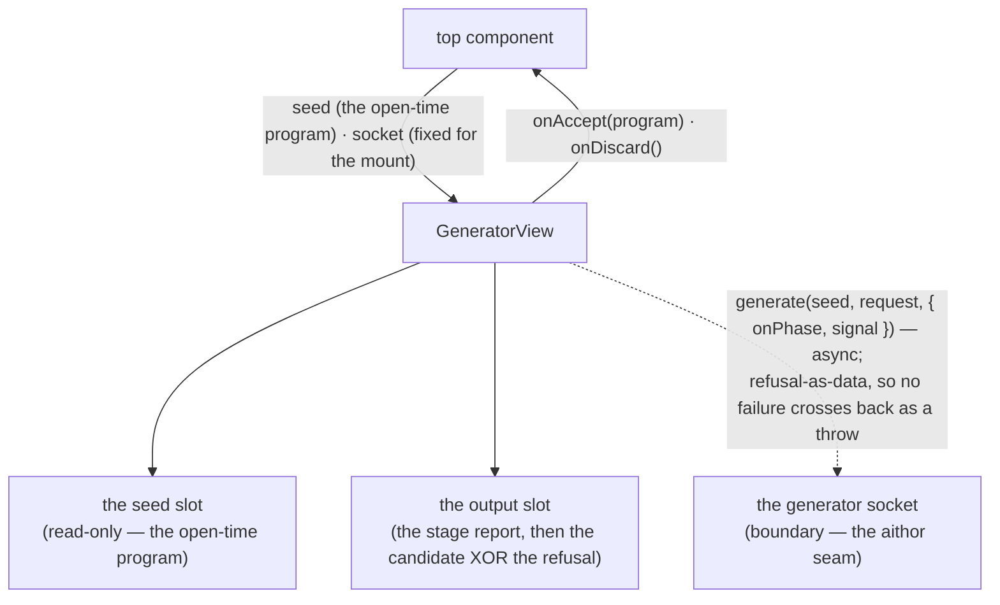
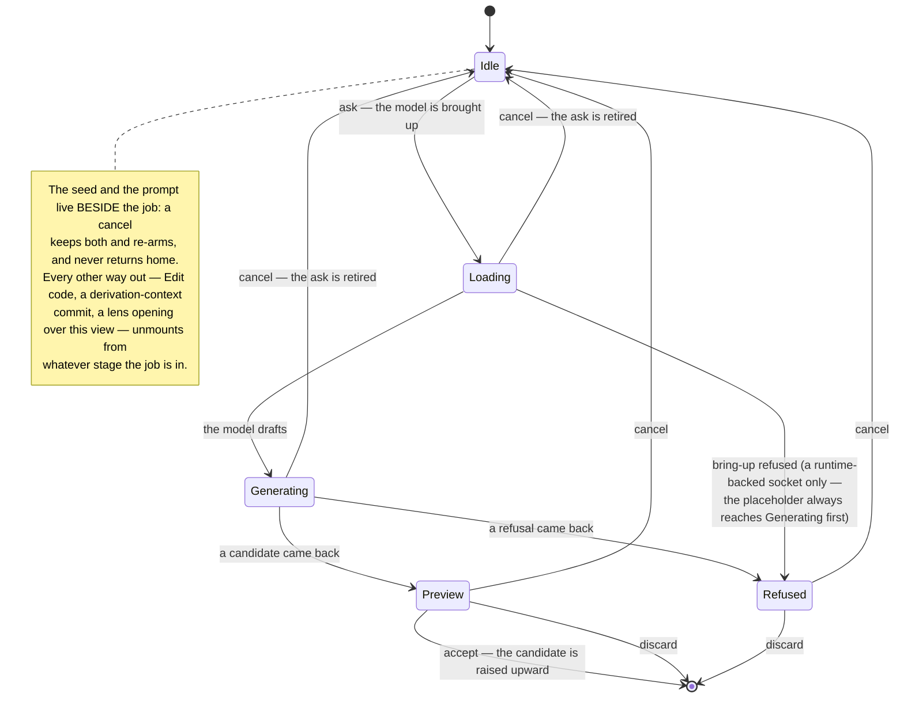

<!-- cspell:ignore affordances affordance -->

# generator — Architecture & Decisions

Architecture for the AI-authoring view described in [README.md](./README.md).
The region sketch ([../DOCS.md](../DOCS.md)) owns the pane model, the dispose
rules, and the mask classes; this document constrains only this view.

## Architectural sketch

> Written Phase 0, before implementation. The Refactor step is held against this
> document — not what the code does, but what shape it takes.

## Execution phases

1. **Seat the seed** (sync) — the view mounts over the program exactly as it
   stood at the open. The seed renders read-only, the prompt starts empty, and
   the warning is present before the first click: it names both facts, that
   generation is slow and that leaving this view ends it. Input: the frozen
   open-time program + the socket. Output: an idle view over its seed.

2. **Ask** (async, retirable) — one ask at a time leaves with the seed and the
   learner's prompt; the view reports bring-up, then drafting, as the socket
   announces them — never a stage it guessed at. Cancelling retires the ask and
   re-arms this phase over the retained prompt, so the next ask starts from what
   the learner already wrote. Input: the seed + the prompt. Output: a candidate
   program, a refusal, or a retired ask and an idle view.

3. **Present** (sync) — a candidate renders in the output slot for the learner's
   judgment, together with what produced it and how many passes it took: the
   producer is never a black box, and a placeholder that names itself is as
   honest an answer as a model that names itself. A refusal renders there
   instead, as one learner-worded sentence for its cause plus its next-step line
   when one rides along; the machine's own vocabulary never reaches the slot.
   Input: what came back. Output: the rendered candidate or refusal.

4. **Resolve** (sync) — the learner's choice leaves the view. Accepting raises
   the candidate upward for the owner to commit; discarding raises the return
   home; the reset control — one control, labelled for the stage it is offered
   at — retires instead and hands the loop back to Ask. Exactly one intent
   leaves the view, and the mount ends with it. Input: the choice. Output: one
   raised intent.

5. **Retire** (sync — on cancel and on unmount) — the shared retirement act both
   Ask and Resolve reach. Retiring an ask abandons it: neither its answer nor
   any later stage it announces can change what the view shows. An unmount
   retires and additionally aborts the underlying work best-effort, so what a
   retired ask produces cannot even be seen. Input: a cancel or an unmount.
   Output: a retired ask.

## Data flow

This is a presentation surface owning no derivation — a component/prop-flow
diagram (the documented exception; prop and callback names are the content). The
only shape it assembles is the request it hands straight across the socket; the
candidate arrives from the socket and goes upward unchanged, the refusal copy is
render-local formatting, and the job stage is per-mount and unobservable outside
this view. That classification is conditional, and the condition is worth
holding the next author to: were the model to become a learner-visible choice
that outlives the mount, or were this view to accumulate a history of
candidates, it would own a shape a consumer reads and would owe a data-state
diagram instead.

The socket is drawn as a boundary because the view holds it as an injected seam
and knows nothing behind it — not because its default implementation lives
elsewhere. That default is this directory's own, and it is scripted (below).

## The generation job

Per-mount and view-local. Cancel is a retire-and-re-arm, not an exit: it
abandons the ask and returns the job to idle, and the view stays.

## Structural constraints

- **One ask in flight per mount** — the ask affordance is spent while an ask is
  live; a second ask begins only once the first is answered or retired. A cancel
  followed straight away by a re-ask leaves exactly one live ask, the re-ask.
- **An ask needs something to work from** — a prompt, a seed, or both. An empty
  prompt over a non-empty seed is a legitimate ask (vary this program); an empty
  prompt over an empty seed asks nothing, and the affordance is not live for it.
- **Retirement is total** — a retired ask's answer changes nothing, and neither
  does any stage it announces afterward: a late bring-up report cannot drag an
  idle view back into a stage with no ask behind it. Cancel and unmount both
  retire; only the unmount also aborts the underlying work.
- **Refusal-as-data is total, and a well-formed answer is the socket's to
  guarantee** — the socket resolves, always, so the job carries no error arm. A
  rejected promise is an invariant violation; so is a resolution the result
  shape cannot serve — a success carrying no program, a refusal carrying no
  cause. Both are loud in dev AND prod, like the region's pane-coherence
  invariants. The view never synthesizes a cause it was not given: every cause
  it could name would be a lie.
- **Every cause has a sentence** — the copy is total over the transcribed
  refusal causes and next-step categories BY TYPE, so a cause the copy has not
  learned fails the type-check rather than rendering an empty slot. The guard
  binds the copy to the transcription, not the transcription to the contract
  behind the socket: a cause that appears upstream reaches this view when the
  transcription learns it.
- **The socket is fixed for the mount** — the composition root creates it once,
  so no re-render can change the seam a live ask is bound to.
- **The seed is read-only** — this view proposes; it never edits. The only text
  the learner writes here is the prompt.
- **The warning names both facts** — that generation is slow, and that leaving
  this view ends it. A derivation-context commit is one click away in the same
  band, and it takes an in-flight ask with it; the learner is told before they
  start, not after they lose one.
- **Inline text only, no heading elements** — the instrument's sole headings are
  the guide's topic titles, and this view leaves the document outline untouched.
- **Data attributes are the selector contract** — the view root and every
  affordance are anchored by attribute; label text is never a test anchor.
- **The view commits nothing** — accepting and discarding are intents raised
  upward; the owner writes, so the region keeps one edit intake.
- **The default socket is scripted and self-labelling** — it announces both
  stages across a real, injectable delay, marks its own output as machine-free,
  names ITSELF as the producer in the meta slot, and reserves one prompt prefix
  as the refusal demonstration. It never simulates a model, and nothing it
  returns pretends one ran. Its every learner-visible value is written down
  VERBATIM in [README.md](./README.md) § The placeholder socket — the literal
  marker comment, the producer id, the default delay, the refusal grammar —
  because a value nobody specified is a value someone invents.
- **A generated program is syntactically whole** — whatever a socket returns can
  land in the learner's buffer on Accept and be parsed there, so anything a
  socket composes around learner text has to survive that text. The placeholder
  comments with line comments and normalizes the prompt's whitespace for exactly
  this reason; a socket that interpolated a prompt into a block comment would
  emit a broken program the first time a learner wrote `*/`.
- **What a socket builds, it freezes** — the socket object and every result it
  resolves with, on the region's usual terms. The contract's `readonly`
  modifiers bind well-typed callers; the freeze is what holds against the
  untyped one.
- **Abort obliges the producer, not the promise** — an aborted signal stops the
  socket announcing and stops it scheduling; it never converts a resolution into
  a rejection, and a socket that never settles afterward is conformant. The
  guarantee the view depends on is retirement, which it owns; abort is the
  courtesy that stops the machine working for nothing.

## Decisions

- **Why the job is view-local.** The pane occupant is frozen for the excursion,
  and a stage that changes several times per ask has no business riding it. Held
  in the view, the job inherits the region's residency rule for ephemeral
  per-surface state — and its death becomes structural: the unmount that ends
  the excursion is the same event that retires the ask, so "a commit cancels the
  job" needs no bookkeeping anywhere.
- **Why cancel retires and re-arms instead of returning home.** The two acts
  answer different questions — "not this answer" and "not this excursion".
  Collapsing them would cost the learner their prompt on every retry, which is
  the common case: a first answer that missed is what prompts the second ask.
  Retiring rather than merely resetting is what makes the re-arm safe — an
  abandoned ask that could still land would turn the next prompt into a race.
- **Why the result vocabulary is transcribed rather than imported.** The
  generative core lives in another tree. A transcription keeps this view's
  compile independent of it and costs one file; an import would bind this
  region's build to work it does not own. The request is the consumer's own
  shape rather than a transcription of anything — it is narrower than the core's
  config by construction, and it stays this view's to define.
- **Why the model is not a control here.** The request carries the pick-for-me
  model ask, so the runtime chooses and reports back what it chose. A model
  picker is a configuration surface, and this view's whole subject is one
  program and one prompt; the copy for a misnamed model exists because the
  socket can still produce that cause, not because anything here can ask for it.
- **Why the stages are announced, not inferred.** Bring-up and drafting take
  unpredictable time on a learner's own device; a view that timed its own
  transitions would lie under load. The socket reports what happened, and the
  view renders only that.

## Out of scope

- Committing an accepted candidate — the owner's, through the region's one edit
  intake.
- The pane swap, the dispose rules, and the mask — the region's
  ([../DOCS.md](../DOCS.md)).
- The model runtime and the generative core behind the socket — another tree's.
- Model selection — the request carries the pick-for-me ask and nothing here
  offers a choice.
- Config knobs, lifecycle profiles, host-curated defaults, and an honored-focus
  arm — outside this view's contract entirely.
