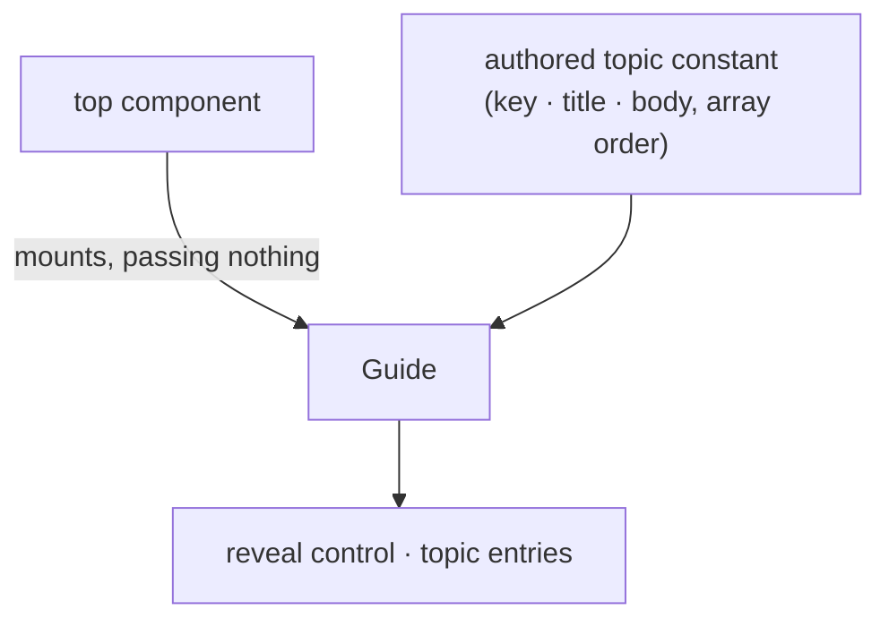

<!-- cspell:ignore affordances -->

# guide — Architecture & Decisions

Architecture for the embedded guide described in [README.md](./README.md). The
region sketch ([../DOCS.md](../DOCS.md)) owns the region shape; this document
constrains only this surface.

## Architectural sketch

> Written Phase 0, before implementation. The Refactor step is held against this
> document — not what the code does, but what shape it takes.

## Execution phases

1. **Reveal render** (sync, mechanical) — the disclosure control, collapsed by
   default, `aria-expanded` reflecting the component-local open flag; a click
   toggles it. No heading element — the control is a labeled button. Input: the
   open flag. Output: the reveal control.

2. **Topic render** (sync, mechanical) — one entry per authored topic, in array
   order, mounted only while open: the title at `h4`, the plain-text body
   beneath, each entry anchored by its stable key. Input: the guide's own topic
   constant + the open flag. Output: the topic entries.

## Data flow

This is a presentation surface owning no derivation and taking no props — the
degenerate case of the component/prop-flow exception: nothing flows in, no
intent flows out.

## Structural constraints

- **Zero derivation, zero props** — the topics are the guide's own constant;
  nothing arrives, nothing is computed, no intent goes up.
- **Order arrives, never minted** — topics render in the authored array order.
- **Data-attribute selectors** — `data-guide`, `data-guide-reveal`,
  `data-guide-topic="<key>"`; title and body text are never test anchors.
- **Never masked** — surface class 2; alive under every posture.
- **No headings above `h4`** — the region's embedding constraint (the panel's
  `h3` phase headings are the instrument's shallowest) stays true.
- **Orientation-only content** — topic bodies never restate single-sourced canon
  (display-label strings, glossary definitions, level docs).

## Decisions

- **Why no props.** The guide's content is its own, like a level's docs are the
  level's own; a host-curated guide would be a second documentation channel to
  keep true. Nothing configures the guide.
- **Why reveal/topic vocabulary, not level-ui's face/list.** The affordances
  differ: the selector's face shows the current selection's state and doubles as
  the toggle; the guide's reveal is a pure disclosure over static content. The
  divergence is deliberate, not drift.
- **Why collapsed by default.** The guide is ambient help, not a first-run tour;
  permanent presence with one-click reach satisfies "help never withheld"
  without competing with the study surfaces. The trade — a stuck learner is one
  click from help at the moment help matters most — is accepted deliberately;
  the blocked state's own copy carries the immediate explanation.

## Out of scope

- Rich topic rendering (markdown, code samples) — plain text v1, consistent with
  the level-docs hover precedent; the rendered-rich-text surface is a flagged
  follow-on.
- Host-injected or host-curated topics (no such channel exists).
- Program explanation and level documentation (lens work; each level's own).
- Session choices (the guide holds none; open/closed is ephemeral).
