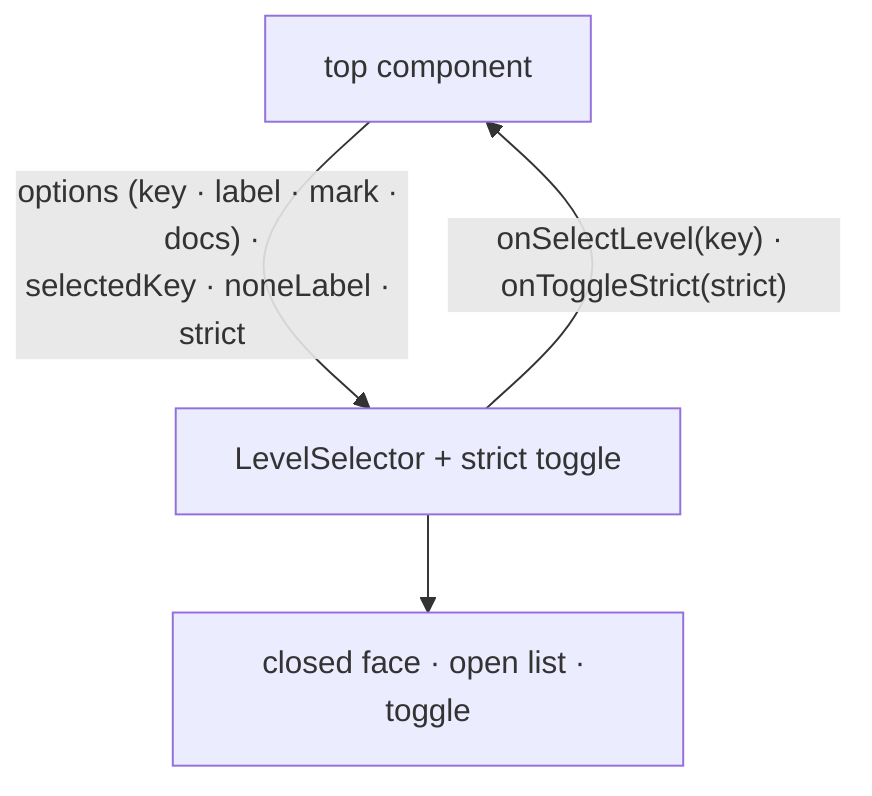

# level-ui — Architecture & Decisions

Architecture for the level surfaces described in [README.md](./README.md). The
region sketch ([../DOCS.md](../DOCS.md)) owns the region shape; this document
constrains only this surface.

## Architectural sketch

> Written Phase 0, before implementation. The Refactor step is held against this
> document — not what the code does, but what shape it takes.

## Execution phases

1. **Closed-face render** (sync, mechanical) — the selected level's label and
   mark, or the none-state display string; anchored by data attributes. Input:
   the options, the selected key, the none-state label. Output: the closed face.

2. **Open-list render** (sync, mechanical) — one entry per given option, in the
   given order, plus the none-state entry; each level entry carries its label,
   its mark as a data-attribute value, and its docs on hover. Input: the
   options + the none-state label. Output: the option entries.

3. **Posture render** (sync, mechanical) — the strict toggle reflects the given
   posture. Input: the posture. Output: the toggle.

4. **Intent routing** (sync) — selecting an entry raises the select intent with
   the entry's key (the none-state raises `''`); flipping the toggle raises the
   posture intent. Nothing commits here. Input: a click. Output: one intent
   callback.

## Data flow

This is a presentation surface owning no derivation — a component/prop-flow
diagram (the documented exception; prop and callback names are the content).

## Structural constraints

- **Zero derivation** — keys, labels, marks, and docs arrive computed; the
  surface renders them and routes intent, nothing more.
- **The order arrives, never minted** — options render in the given order; the
  none-state entry's position is a presentation decision, not a sort.
- **Data-attribute selectors** — every entry and control anchored by attribute +
  value; the four mark strings are attribute values, label text never a test
  anchor.
- **Never masked** — surface class 2; alive under every posture.
- **No geometry assertions in tests** — pixel truth is checkpoint-only.

## Out of scope

- Mark derivation, verdicts, the mask (the derivation libraries').
- Session-choice state (the top component commits; this surface only asks).
- The editor gutter (the editor's surface, fed by the shared validate).
- Hover timing and visual treatment (checkpoint-observed, not test-pinned).
