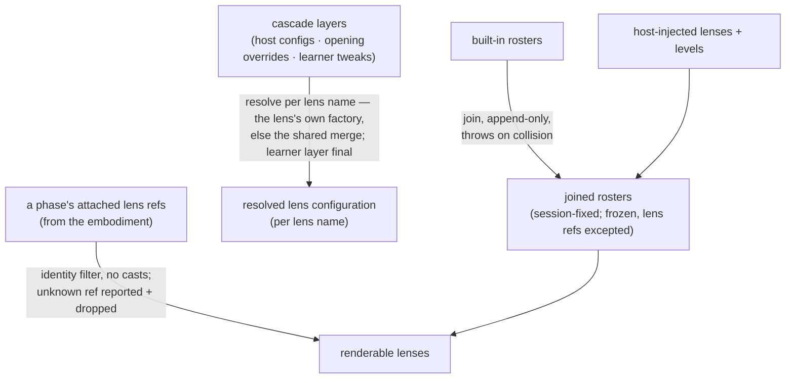

<!-- cspell:ignore renderable -->

# composing — Architecture & Decisions

Architecture for the composition library described in [README.md](./README.md).
The region sketch ([../../DOCS.md](../../DOCS.md)) owns the region shape; this
document constrains only this library.

## Architectural sketch

> Written Phase 0, before implementation. The Refactor step is held against this
> document — not what the code does, but what shape it takes.

## Execution phases

1. **Join** (at mount, sync, throws) — the built-in rosters are appended with
   the host's injections; a duplicate lens name or level key throws naming the
   offender, and the reserved empty level key throws on injection. Input: the
   built-in rosters + the host's injections. Output: the joined rosters,
   session-fixed, frozen except the lens refs.

2. **Resolve** (continuous, pure) — the cascade's three layers merge per lens
   name, weakest first, learner last — through the lens's own configuration
   factory when it declares one, else the shared deep-merge. Input: the cascade
   layers + a lens name. Output: that lens's resolved configuration.

3. **Recover** (per render, pure) — a phase's attached refs filter the joined
   lens roster by reference identity into the renderable lenses; a ref missing
   from the roster is a broken upstream invariant, reported loudly and dropped
   from the render. Input: the joined lens roster + a phase's attached refs.
   Output: the phase's renderable lenses.

## Data flow

## Structural constraints

- **Loud at the author's desk** — every join collision throws at mount; nothing
  is silently replaced or shadowed.
- **Graceful at the learner's** — recovery never throws at render; the
  unreachable unknown-ref branch reports loudly and drops.
- **No identity games** — recovery is reference identity only; no casts, no
  name-based matching.
- **Layer order is fixed** — host, then opening overrides, then learner; an
  `undefined`-valued override key is absent, `null` is a value.
- **Frozen outputs** — everything leaving this library is frozen; lens refs stay
  excepted, owned by their defining modules.

## Out of scope

- Holding the joined rosters or cascade layers between calls (the top
  component's state).
- Session-choice ownership (the top component's).
- Gating and attaching lenses to phases (embody's).
- What any lens's configuration means (each lens's own).
