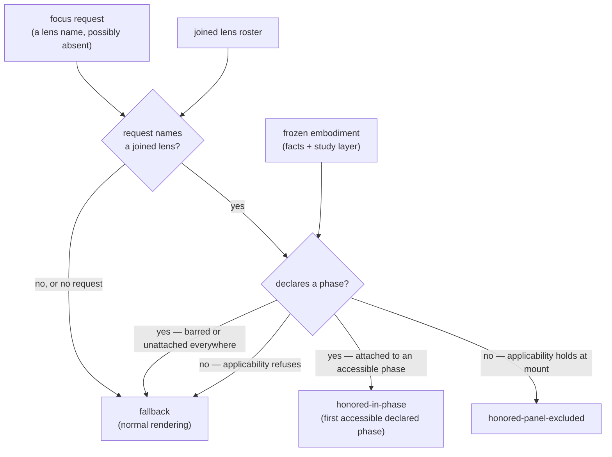

# honoring — Architecture & Decisions

Architecture for the honor path described in [README.md](./README.md). The
region sketch ([../../DOCS.md](../../DOCS.md)) owns the region shape; this
document constrains only this library.

## Architectural sketch

> Written Phase 0, before implementation. The Refactor step is held against this
> document — not what the code does, but what shape it takes.

## Execution phases

1. **Resolve the request** (pure) — the requested name is looked up in the
   joined lens roster; no request, or an unknown name, resolves the whole path
   to the fallback. Input: the focus request + the joined roster. Output: the
   requested lens, or the fallback.

2. **Judge the mount** (pure) — a phase-declaring lens is judged by the
   embodiment's study layer: honored at the first accessible phase of its own
   declared order, fallback when every declared phase is barred or lacks the
   attachment. A panel-excluded lens is judged by its own applicability over the
   embodiment's facts, run once, at mount — and this is the region's one
   applicability call outside embody's wrapper, so the wrapper's rule applies
   here too: a throwing applicability is caught, reported loudly, and resolves
   to fallback. Input: the lens + the frozen embodiment. Output: the mount
   decision.

## Data flow

## Structural constraints

- **Never a throw** — every input, however wrong, resolves to an arm of the
  decision; a wrong request is an authoring slip, not a failure.
- **Applicability runs once, at mount** — never re-run per render.
- **No bypass** — the decision reads fit and accessibility exactly as embody
  derived them, and it decides mounting only; the enforcement mask applies to a
  focus-mounted lens identically.
- **One phase-order truth** — the multi-phase tie-break follows the lens's own
  declared order, never a locally minted lifecycle order.

## Out of scope

- Mounting the decided lens and masking it (the top component's).
- Fit and accessibility derivation (embody's).
- The joined roster's construction (composing's).
