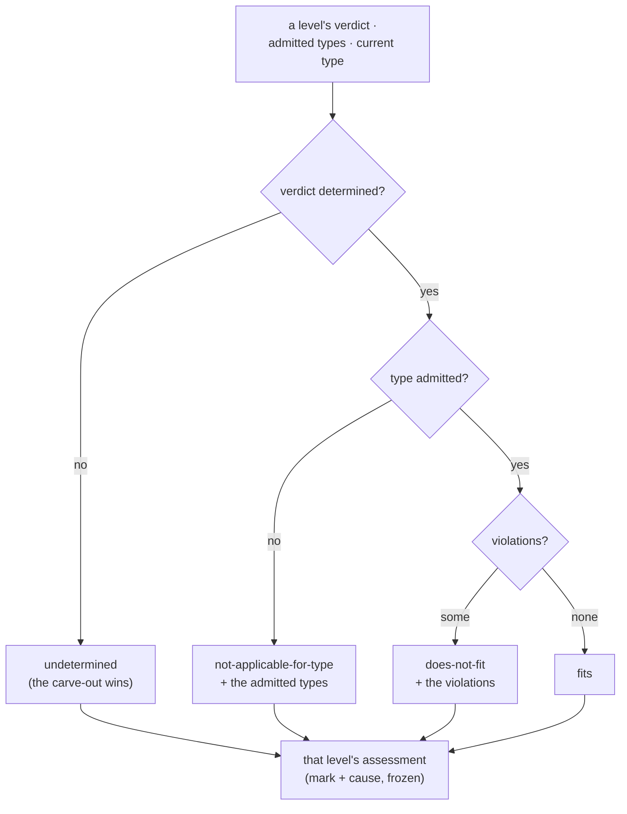

# marking — Architecture & Decisions

Architecture for the classification library described in
[README.md](./README.md). The region sketch ([../../DOCS.md](../../DOCS.md))
owns the region shape; this document constrains only this library.

## Architectural sketch

> Written Phase 0, before implementation. The Refactor step is held against this
> document — not what the code does, but what shape it takes.

## Execution phases

1. **Classify** (per settle and per level, pure) — the three inputs fold into
   one assessment, with the undetermined carve-out judged first: an undetermined
   verdict classifies undetermined no matter what type admission would say — the
   verdict already encodes the parse status, so no separate parse input exists.
   Determined: type admission next (not applicable, carrying the admitted
   types), then the verdict's violations (does not fit, carrying them), else
   fits. Input: a level's verdict + its admitted types + the current type.
   Output: that level's assessment, frozen.

## Data flow

## Structural constraints

- **The undetermined carve-out wins** — judged before type admission, always;
  the parse phases' supports are never the price of a wrong toggle.
- **Cause travels with the mark** — an assessment carries what its mark needs
  downstream (violations, admitted types); no surface re-derives.
- **Classified once** — the selector and the mask project the same assessment;
  neither computes its own.
- **Pure and frozen** — no memoization here (validating owns the memo), no
  React, frozen outputs.

## Out of scope

- Producing verdicts (the validating library's).
- The strict posture and the mask (the masking library's).
- Rendering marks (the level UI's).
