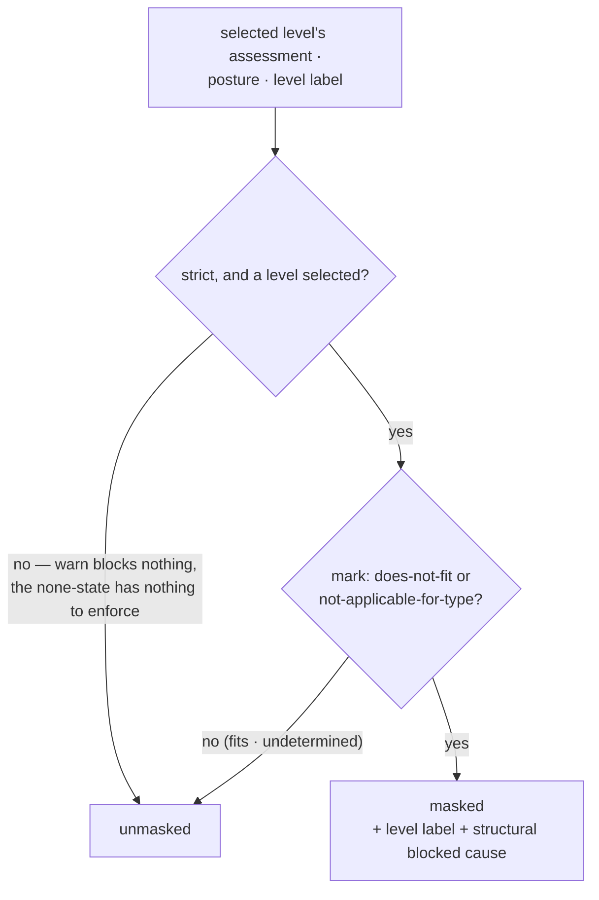

# masking — Architecture & Decisions

Architecture for the mask library described in [README.md](./README.md). The
region sketch ([../../DOCS.md](../../DOCS.md)) owns the region shape; this
document constrains only this library.

## Architectural sketch

> Written Phase 0, before implementation. The Refactor step is held against this
> document — not what the code does, but what shape it takes.

## Execution phases

1. **Project** (at render, pure) — the selected level's assessment crossed with
   the posture: warn, the none-state, fits, and undetermined all yield the
   unmasked state; strict over does-not-fit or not-applicable-for-type yields
   the masked state carrying the level's label and the structural blocked cause
   (the first violation, or the admitted types). Input: the selected level's
   assessment (or none) + the posture + the level's label. Output: the mask
   state, frozen.

## Data flow

## Structural constraints

- **Mask, not filter** — the output covers surfaces at render; nothing here
  edits fit, accessibility, or any derived state.
- **No re-derivation** — the assessment arrives classified; this library never
  touches verdicts, admitted types, or the parse status. The undetermined
  carve-out is inherited, not re-implemented.
- **Structure out, prose upstream** — the mask state carries the cause
  structurally; the top component formats the blocked sentence, the same single
  owner that formats the barred-phase cause.
- **Derives at render** — mask state follows the settled assessment, so it never
  flaps mid-keystroke.

## Out of scope

- Rendering the overlay and classifying concrete surfaces (the top component's
  render — a surface's class is a static fact of what the surface IS, and no
  runtime derivation or containment decides it).
- The assessment's derivation (the marking library's).
- Session posture state (the top component owns session choices).
