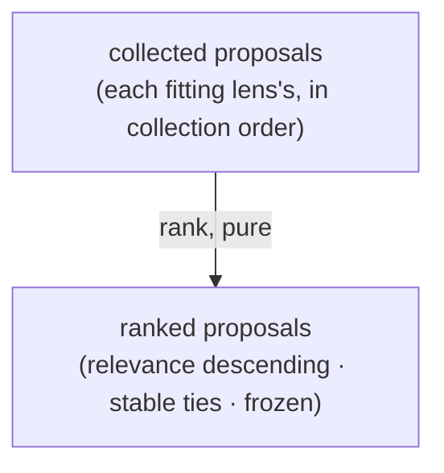

# recommending — Architecture & Decisions

Architecture for the ranking library described in [README.md](./README.md). The
region sketch ([../../DOCS.md](../../DOCS.md)) owns the region shape; this
document constrains only this library.

## Architectural sketch

> Written Phase 0, before implementation. The Refactor step is held against this
> document — not what the code does, but what shape it takes.

## Execution phases

1. **Rank** (pure) — the collected proposals order by relevance, descending on
   the contract's shared 0–1 scale; equal relevance keeps the collected order.
   The scale is trusted, never re-validated. Input: the collected proposals, in
   collection order. Output: the ranked proposals, frozen.

## Data flow

## Structural constraints

- **Ordering only** — no proposal is added, dropped, deduplicated, or altered;
  ranking changes order and nothing else.
- **Stable ties** — indistinguishable relevance is never reordered.
- **Trusted scale** — an out-of-range relevance is the proposing lens's contract
  bug; ranking neither clamps nor repairs.

## Out of scope

- Producing proposals (each lens's `recommend`).
- Collecting them across the fitting lenses (the derive composition's walk).
- Rendering the ranked list, through the mask (the top component's render).
