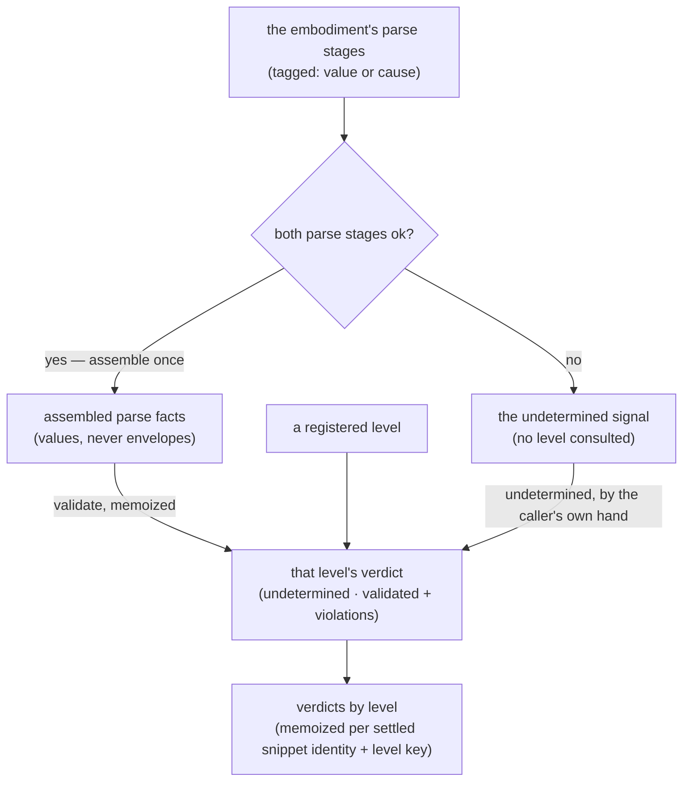

# validating — Architecture & Decisions

Architecture for the validation library described in [README.md](./README.md).
The region sketch ([../../DOCS.md](../../DOCS.md)) owns the region shape; this
document constrains only this library.

## Architectural sketch

> Written Phase 0, before implementation. The Refactor step is held against this
> document — not what the code does, but what shape it takes.

## Execution phases

1. **Assemble** (per settle, pure) — the embodiment's parse stages yield the
   parsed values a level consumes, once. Both parse stages succeeded: the
   assembled parse facts. Either failed: the undetermined signal — nothing is
   assembled and no level is ever consulted about it. Input: the embodiment's
   facts. Output: the assembled parse facts, or the undetermined signal.

2. **Validate, memoized** (per settle and per level, pure behind the memo) — a
   level's validator answers over the assembled facts; the answer is held keyed
   by the settled snippet identity and the level key, so repeated reads within
   one settle never consult the level again. An unparsed settle skips
   consultation entirely: every level's verdict is undetermined by the caller's
   own hand. A throwing validator is caught, reported loudly as a defect, and
   answers undetermined — the region's third-party-callback posture, shared with
   honoring. Input: the assembled facts + a registered level. Output: that
   level's verdict.

## Data flow

## Structural constraints

- **Values, never envelopes** — no stage envelope, no cause, and no embody type
  crosses into a level; the assembly projects values only.
- **No level consulted while unparsed** — the undetermined verdict is produced
  by this library's caller-side logic, never by asking a level.
- **One validate per settle and per level** — the memo key is the settled
  snippet identity (source and type) plus the level key; nothing validates
  twice, and no consumer holds its own copy of the truth. Realized as ONE held
  settle whose record keys by level: the roster is session-fixed, so the
  identity never keys on the levels, and a new settle replaces the held record
  wholesale — nothing accumulates across an editing session (ruled with the
  Wave-4 test package, 2026-07-20).
- **No second parse** — the assembly reads the embodiment's stage values;
  nothing here parses source text.
- **Frozen outputs** — the assembled facts and every verdict leave this library
  frozen; the memo the caller holds returns those same frozen values.

## Out of scope

- Classification into fit marks (the marking library's).
- The mask (the masking library's).
- Where the memo lives across renders (the top component holds it).
- Level content and validator behavior (each level's own).
