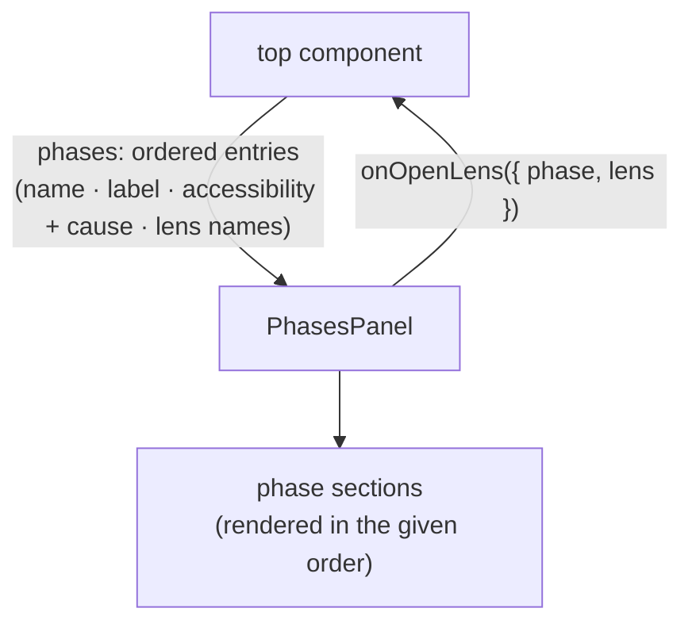

<!-- cspell:ignore affordances -->

# phases-panel — Architecture & Decisions

Architecture for the study panel described in [README.md](./README.md). The
region sketch ([../DOCS.md](../DOCS.md)) owns the region shape; this document
constrains only this surface.

## Architectural sketch

> Written Phase 0, before implementation. The Refactor step is held against this
> document — not what the code does, but what shape it takes.

## Execution phases

1. **Section layout** (sync, mechanical) — one section per given entry, in
   exactly the given order, headed by the entry's display label and anchored by
   a data attribute carrying the entry's data name. Input: the ordered entries.
   Output: the sectioned panel.

2. **Accessible render** (sync) — an accessible entry lists its lens names as
   open-intent affordances; an empty list renders the section present-but-empty.
   Input: an accessible entry. Output: its affordances.

3. **Barred render** (sync) — a barred entry renders visibly barred with its
   cause in place of a lens list; the section stays present and named. Input: a
   barred entry. Output: the barred section.

4. **Intent routing** (sync) — an affordance click raises the open-lens intent,
   carrying the phase and lens names. Nothing mounts here. Input: a click.
   Output: one intent callback.

## Data flow

This is a presentation surface owning no derivation — a component/prop-flow
diagram (the documented exception; prop and callback names are the content).

## Structural constraints

- **The order is never minted** — sections render in the given order; the panel
  neither sorts nor knows the canonical five. One phase-order truth, elsewhere.
- **Zero derivation** — fit, accessibility, causes, and labels all arrive
  computed; the panel formats nothing but layout.
- **Data-attribute selectors** — every section and affordance is anchored by
  attribute + value; label text is never a test anchor.
- **Present-but-empty** — a zero-lens accessible phase renders its section;
  absence of lenses is not absence of the phase.

## Out of scope

- Mounting an opened lens, and masking it (the top component's).
- Deriving anything (embody's and the derivation libraries').
- The display labels' values (passed in with each entry).
