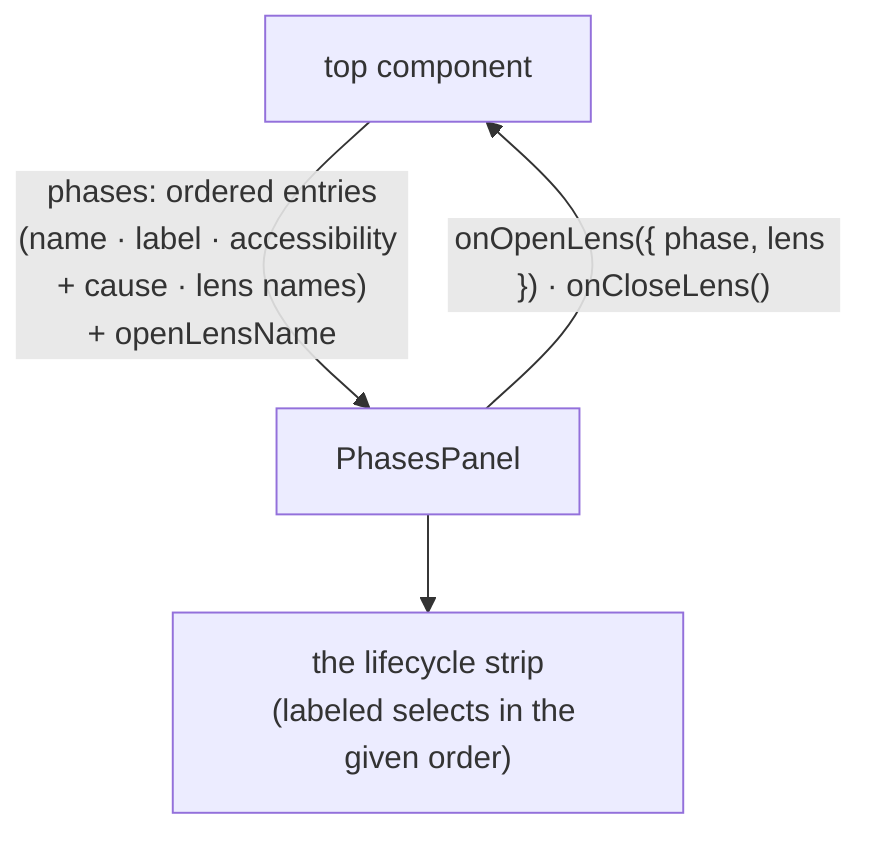

<!-- cspell:ignore affordances -->

# phases-panel — Architecture & Decisions

Architecture for the study panel described in [README.md](./README.md). The
region sketch ([../DOCS.md](../DOCS.md)) owns the region shape; this document
constrains only this surface.

## Architectural sketch

> Written Phase 0, before implementation. The Refactor step is held against this
> document — not what the code does, but what shape it takes.

## Execution phases

1. **Strip layout** (sync, mechanical) — one labeled entry per given phase, in
   exactly the given order, laid out as one horizontal strip; each entry
   anchored by a data attribute carrying the phase's data name and showing its
   display label as inline text (never a heading — the strip leaves the document
   outline untouched). Input: the ordered entries. Output: the strip.

2. **Accessible render** (sync) — an accessible entry renders a select of its
   lens names headed by a none entry; the select's value tracks the given open
   lens, so the strip signals what is open and where. An empty lens list renders
   the select disabled with only the none entry — present-but-empty. Input: an
   accessible entry + the open lens. Output: its select.

3. **Barred render** (sync) — a barred entry renders a disabled select whose
   only entry is the cause (also the native tooltip); the entry stays present
   and named. Input: a barred entry. Output: the barred select.

4. **Intent routing** (sync) — choosing a lens raises the open-lens intent,
   carrying the phase and lens names; choosing the none entry over the open lens
   raises the close intent. Nothing mounts or closes here — the top component
   commits both. Input: a selection change. Output: one intent callback.

## Data flow

This is a presentation surface owning no derivation — a component/prop-flow
diagram (the documented exception; prop and callback names are the content).

## Structural constraints

- **The order is never minted** — sections render in the given order; the panel
  neither sorts nor knows the canonical five. One phase-order truth, elsewhere.
- **Zero derivation** — fit, accessibility, causes, and labels all arrive
  computed; the panel formats nothing but layout.
- **Data-attribute selectors** — every section and affordance is anchored by
  attribute + value; label text is never a test anchor.
- **Present-but-empty** — a zero-lens accessible phase renders its disabled
  select; absence of lenses is not absence of the phase.
- **No headings** — the labels are inline text; the strip contributes nothing to
  the document outline.

## Out of scope

- Mounting an opened lens, closing it, and masking it (the top component
  commits; the strip only asks).
- Deriving anything (embody's and the derivation libraries').
- The display labels' values (passed in with each entry).
