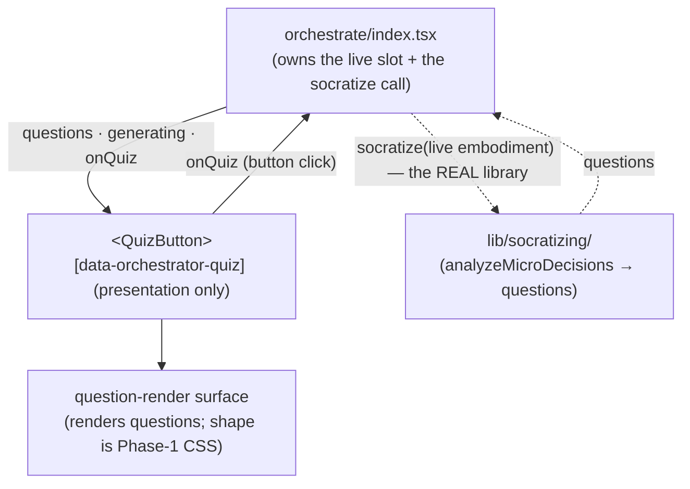

# quiz-button — Architecture & Decisions

## Why this module exists

The Quiz button is the omnipresent region's first **generative** tool: it
produces something _about the program_ (Socratic questions) on demand. It is a
button, not a lens — it does not target a station and does not enter lens mode.
Module-folder presentation keeps the affordance + its render surface separable
from the orchestrator, which owns the generator call.

The locked placement and tool-kind classification live at
[`../README.md` § The omnipresent region](../README.md) and
[`../DOCS.md` § The omnipresent region](../DOCS.md). This sketch covers the
module-internal structure only.

## Data flow

## Structural constraints

- **Presentation only.** No `embody` import, no socratize call inside the
  component, no EventBus dispatch, no orchestrator-state ownership. The
  component is a pure function of its props.
- **Generator behind the orchestrator.** The orchestrator invokes the real
  `socratize` (`lib/socratizing/`) on the live embodiment and passes `questions`
  down. The button's prop contract is the plug-and-play seam: the future
  block-model Quiz engine swaps in orchestrator-side with no button change.
- **Program-dependent, not meta.** Quiz reads the current program (via the
  orchestrator's call); contrast the embedded guide, which is
  program-independent.
- **"Panel" stays reserved.** The question-render surface is named otherwise
  (the phases panel owns "panel"); its exact shape (inline / modal) is a Phase-1
  presentational choice.

## Out of scope

- **The socratize call + question lifecycle** — the orchestrator
  ([`../index.tsx`](../index.tsx)).
- **The socratizing analysis itself** — owned by
  [`../lib/socratizing/`](../lib/socratizing/).
- **The block-model Quiz engine** — a separate later DDD (deferred backlog); the
  Cycle-3 button calls `socratize` directly.
- **The dock and the embedded guide** — sibling region modules.
