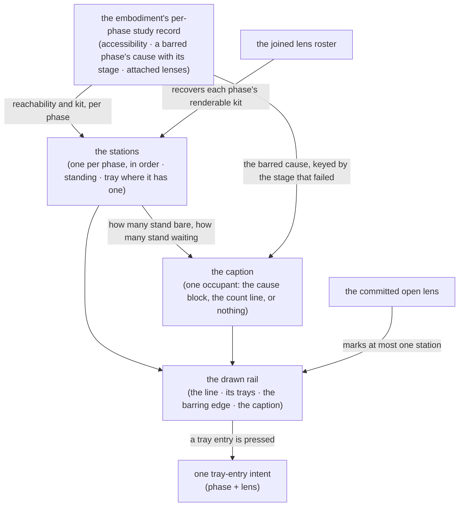

# rail — Architecture & Decisions

Architecture for the rail described in [README.md](./README.md). The region
sketch ([../DOCS.md](../DOCS.md)) owns the region shape; this document
constrains only this surface.

## Architectural sketch

> Written Phase 0, before implementation. The Refactor step is held against this
> document — not what the code does, but what shape it takes.

## Execution phases

1. **Derive the stations** (sync, pure, per settle) — one station per phase in
   the machine's fixed order, each carrying its phase, its two labels, its
   standing, and its tray where it has one. The standing is a projection of
   reachability and kit; the kit is the phase's attached lenses recovered on the
   joined roster. Input: the embodiment's per-phase study record + the joined
   lens roster. Output: the ordered stations.

2. **Derive the caption** (sync, pure, per settle) — resolve one slot's total
   precedence and produce the arm it holds. The counts are read off the stations
   phase 1 produced; the cause is read from the study record, because one cause
   is drawn once beneath the rail and no station carries it. Input: the
   stations + the study record. Output: the caption.

3. **Draw the line** (mechanical) — the stations in the given order, the barring
   edge between the last reachable and the first waiting, the marked station
   where the open lens's name matches, and the caption beneath. Input: the
   stations + the caption + the open lens's name. Output: the rail.

4. **Route intent** (sync) — pressing a tray entry raises one intent carrying
   the phase and the lens. Nothing opens or closes here. Input: a press. Output:
   one intent callback.

## Data flow

## Structural constraints

- **The order is never minted** — stations draw in the given order; the rail
  neither sorts nor knows the canonical five. One phase-order truth, elsewhere.
- **The caption resolves its precedence BEFORE it has anything to draw.** One
  slot, two producers, a total order between them — a render path that consults
  both producers and then chooses between two rendered strings is a structural
  defect, not a cosmetic one.
- **The counts are read off the stations that render**, which is what makes the
  rail and its caption incapable of disagreeing. Two counts over two predicates,
  never both on screen, and neither ever standing in for the other.
- **The barring edge and the occupant dot are drawn, never stored.** The edge's
  position follows from the standing sequence; the dot follows from the
  committed open lens. Storing either would put a second source of truth beside
  the first.
- **Data-attribute selectors** — every station and affordance is anchored by
  attribute and value; drawn copy is never a test anchor.
- **No headings** — every station name and tray label is inline text; the
  structure a screen reader traverses comes from named regions and groups, not
  from a heading outline.
- **Class 3, whole.** The rail takes none of the four routes into class 2, so a
  posture may withdraw it — and it dims whole rather than in parts, because
  partial dimming of a lifecycle line reads as a machine state rather than as a
  posture.

## Where this surface's projection lives, and why it is stated rather than assumed

The two derivations sit **in this directory** rather than under
[`../lib/`](../lib/README.md), where the region's other pure functions live. The
reason is what they derive: `lib/` holds the region's domain derivations — fit
marks, mask classification, config resolution, parse-facts assembly — each
consumed by several surfaces, while the stations and the caption are this one
surface's view model and nothing downstream of the rail reads them. Recorded
here rather than left implicit, because the region's own constraint reads "pure
derivation libraries, thin components", and a reader is owed the distinction
between a derivation library and a surface's own projection.

## Out of scope

- Mounting a lens, closing it, and masking it — the top component commits; the
  rail only asks, and one intent is all it raises.
- Fit and accessibility — embody's, arriving computed.
- The strings the rail draws — [`../display-labels.ts`](../display-labels.ts)
  keys every one; the rail imports and never spells.
- The narrow-viewport geometry — the honest small-screen form is a vertical
  list: the same parts in the same order, one station per phase, an optional
  tray per station, and the barring edge between two of them. Only the direction
  of the line changes, so it is a stylesheet debt rather than a second contract.
