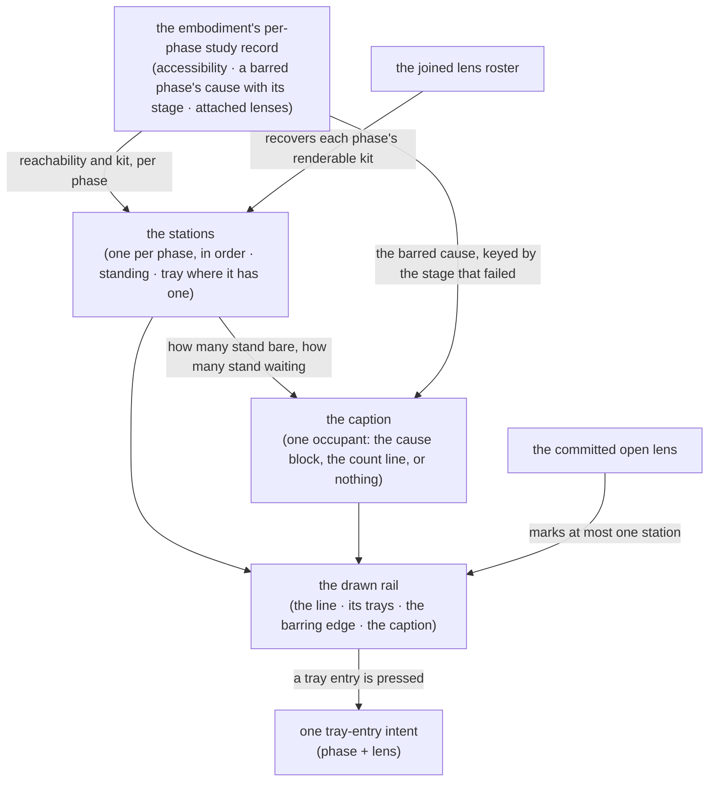

# rail — Architecture & Decisions

Architecture for the rail described in [README.md](./README.md). The region
sketch ([../DOCS.md](../DOCS.md)) owns the region shape; this document
constrains only this surface.

## Architectural sketch

> Written Phase 0, before implementation. The Refactor step is held against this
> document — not what the code does, but what shape it takes.

## Execution phases

1. **Derive the stations** (sync, pure, per settle) — one station per phase in
   the machine's fixed order, each carrying its phase, its standing, and its
   tray where it has one. The standing is a projection of reachability and kit;
   the kit is the phase's attached lenses recovered on the joined roster. Input:
   the embodiment's per-phase study record + the joined lens roster. Output: the
   ordered stations.

2. **Derive the caption** (sync, pure, per settle) — resolve one slot's total
   precedence and produce the arm it holds. **The arm is chosen off the stations
   alone**: a barring edge is drawn wherever a station stands `waiting`, so the
   input that decides the arm is the same one that draws the edge its precedence
   rule names. Both counts come from those same stations. The cause arrives as
   PAYLOAD rather than as a second thing to decide from — one cause is drawn
   once beneath the rail, and no station carries it. Input: the stations + the
   barred cause, or nothing where none is barred. Output: the caption.

3. **Draw the line** (mechanical) — the stations in the given order, the barring
   edge between the last reachable and the first waiting, the marked station
   where the open lens's name matches, and the caption beneath. Input: the
   stations + the caption + the open lens's name. Output: the rail.

4. **Route intent** (sync) — pressing a tray entry raises one intent carrying
   the phase and the lens. Nothing opens or closes here. Input: a press. Output:
   one intent callback.

## Data flow

## Structural constraints

- **The order is never minted** — stations draw in the given order; the rail
  neither sorts nor inserts. It knows the five phase NAMES, because it keys copy
  against that vocabulary; knowing the names is not knowing the ORDER, and the
  order has exactly one truth, elsewhere.
- **The caption resolves its precedence BEFORE it has anything to draw.** One
  slot, two producers, a total order between them — a render path that consults
  both producers and then chooses between two rendered strings is a structural
  defect, not a cosmetic one.
- **The arm AND the counts are read off the stations that render**, which is
  what makes the rail and its caption incapable of disagreeing about either. Two
  counts over two predicates, never both on screen, and neither ever standing in
  for the other.
- **The count domains are narrowed, and the narrowing THROWS.** Counting
  stations yields a number and the caption's counts are literal domains, so the
  deriver narrows explicitly and raises outside them. That is not a defensive
  branch: it is unreachable by contract, and reaching it means the cause and the
  standings disagree. Reported loudly for the same reason an unrecoverable
  attached lens is — a broken invariant is a defect, and nothing in the study
  surface throws at the learner.
- **The barring edge and the occupant dot are drawn, never stored.** The edge's
  position follows from the standing sequence; the dot follows from the
  committed open lens. Storing either would put a second source of truth beside
  the first.
- **Data-attribute selectors** — every station and affordance is anchored by
  attribute and value; drawn copy is never a test anchor.
- **No headings** — every station name and tray label is inline text; the
  structure a screen reader traverses comes from named regions and groups, not
  from a heading outline.
- **Class 3, whole.** The rail takes none of the four routes into class 2, so a
  posture may withdraw it — and it dims whole rather than in parts, because
  partial dimming of a lifecycle line reads as a machine state rather than as a
  posture.

## Where this surface's projection lives, and why it is stated rather than assumed

The two derivations sit **in this directory** rather than under
[`../lib/`](../lib/README.md), where the region's other pure functions live. The
deciding test is ownership of a shape a downstream consumer reads: `lib/` holds
the region's domain derivations — fit marks, mask classification, config
resolution, parse-facts assembly — each projected by several surfaces, while the
only consumer of a station or a caption is this surface's own props.

**The region has precedent on both sides and neither settles it alone**:
`../generator/create-generator-socket.ts` sits directly in its surface's
directory, while the editor's own factory sits under a surface-local
`../editor/lib/`. What decides it here is the consumer test above, not the
precedent count.

**And this is a composition rather than a self-contained view model.** The kit
half is already built and covered in
[`../lib/composing/`](../lib/composing/README.md); `derive-stations.ts` calls
its recovery and does not re-implement it. So the rule this section states is
narrower than "derivations live with their surface": a surface may own the
derivation of its OWN props, composing over the region's libraries to do it.

Recorded rather than left implicit, because the region's own constraint reads
"pure derivation libraries, thin components", and a reader is owed the
distinction between a derivation library and a surface's own projection.

## Out of scope

- **The region's voice.** The rail carries no live region: two of the three
  utterances are not on it, and it goes inert under strict. The announcer holds
  them, at the top component, outside both maskable containers.
- **Reporting an unrecoverable attached lens.** That contract and its coverage
  are [`../lib/composing/`](../lib/composing/README.md)'s, where the recovery
  lives; this surface composes over it and asserts nothing about it.
- **Focus placement across a pane swap.** A recorded defect of the standing
  scaffolding — focus falls to the document body — whose remedy spans the
  editor, the pane and the top component, so it is not the rail's to constrain.
  Named rather than left silent, because silence in a document about boundaries
  reads as "not a concern".
- Mounting a lens, closing it, and masking it — the top component commits; the
  rail only asks, and one intent is all it raises.
- Fit and accessibility — embody's, arriving computed.
- The strings the rail draws — [`../display-labels.ts`](../display-labels.ts)
  keys every one of the strings this region owns, and the rail imports rather
  than spells them. A lens's own label is the LENS's and travels on the tray
  entry — carried, not keyed.
- The narrow-viewport geometry — the honest small-screen form is a vertical
  list: the same parts in the same order, one station per phase, an optional
  tray per station, and the barring edge between two of them. Only the direction
  of the line changes, so it is a stylesheet debt rather than a second contract.
