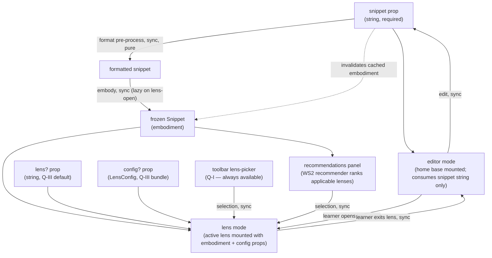

# compose — Architecture & Decisions

## Why this peer exists

`compose/` is the React-aware peer of the three-peer architecture.
It owns:

- The public API surface (`<StudyLenses>`, exported from
  [`./orchestrator/`](./orchestrator/)).
- The home-base editor (the only writer of snippet state) at
  [`./editor/`](./editor/).
- The pure-TS analysis libs every consumer uses, at
  [`./lib/`](./lib/).

[`embody/`](../embody/) and [`lenses/`](../lenses/) are pure-TS
peers; `compose/` is the seam where React enters and where the
learner-facing experience is assembled. Concentrating everything
React-aware here keeps the substrate testable in vitest without
`jsdom` and limits framework-portability concerns to one peer.

## Architectural sketch

> Written Phase 0, before implementation. The Refactor step of each
> increment is held against this sketch. Domain terms only.

### Peer-level data flow

The diagram covers the steady-state lifecycle:

- `<StudyLenses>` ingests the `snippet` prop.
- Format pre-processing runs lazily (on need; not every keystroke).
- `embody()` turns formatted snippet into a frozen `Snippet` —
  also lazy (built when a lens or evaluation needs it).
- The orchestrator switches between **editor mode** (home base
  active, no lens) and **lens mode** (active lens mounted with
  embodiment + config props).
- The toolbar lens-picker (Q-I) is always visible; the
  recommendations panel (Q-II auto-paths; Q-III ranking-overrides
  extend it via WS3 increments L7/L8) opens via toolbar button.
  Q-IV (per-snippet manual study paths) is DEFERRED entirely.
- An edit in the editor produces a new snippet string; any cached
  embodiment is discarded; the next lens-open or evaluation
  triggers a fresh embody.

### Pyramid mapping

`compose/` ships **the orchestrator side of Layers I-III** of the
Explorotron pyramid (per `../README.md` § Pedagogical first
principles):

| Layer                              | What `compose/` provides                                                                       | Subdir(s) involved                                                       |
| ---------------------------------- | ---------------------------------------------------------------------------------------------- | ------------------------------------------------------------------------ |
| Layer I (Lenses & defaults)        | Toolbar lens-picker dropdown over the registered lens roster                                   | `compose/orchestrator/`                                                  |
| Layer II (Path generation)         | Recommendations panel UI consuming the WS2 recommender's filtered + ranked grid                | `compose/orchestrator/` (UI) + `compose/lib/recommender/` (engine)       |
| Layer III (Manual recommendations) | `lens` + `config` prop seam pre-filled by per-fence info-string and `lenses.json` cascade      | `compose/orchestrator/` (consumes the props)                             |
| Layer IV (Manual study paths)      | DEFERRED at snippet scope (per `03-orchestrator-and-contracts.md` § Layer IV)                   | n/a                                                                      |

The pyramid base (Progress modelling) and top (Monitored learning)
are explicitly NOT owned by `compose/` — those belong to the
embedding LMS.

### Cross-module effect topology

The system-wide React-effect picture spans three modules. Specific
deps and ordering pin during F1's Phase 0; the categorization is
locked here.

| Module                           | Effect category                       | Triggers on                             | What it does                                                                                |
| -------------------------------- | ------------------------------------- | --------------------------------------- | ------------------------------------------------------------------------------------------- |
| `compose/orchestrator/`          | Embody trigger                        | mode → lens transition                  | Format pre-process → `embody(snippet)` → cache embodiment in state                           |
| `compose/orchestrator/`          | Lens-switch dispatch                  | active-lens change while in lens mode   | Fire `lens-switched` on the internal bus                                                     |
| `compose/orchestrator/`          | Embodiment-on-edit invalidation       | snippet change while in editor mode     | Discard cached embodiment; next lens-open builds a fresh one                                 |
| `compose/editor/`                | Editor mount / teardown               | editor mode entered / exited            | Construct CodeMirror EditorView async; append to host; tear down (`destroy()`) on cleanup    |
| `lenses/<name>/` (per lens)      | Lens-internal effects (per lens)      | lens-component mount / unmount          | Lens-author concern (e.g. parsons shuffle, blanks state, async language modules)             |

See [`./orchestrator/DOCS.md` § Effect topology](./orchestrator/DOCS.md)
and [`./editor/DOCS.md` § Lifecycle](./editor/DOCS.md) for the
module-level details.

### Structural constraints

- **Single-writer state.** Only [`./editor/`](./editor/) mutates
  snippet source. Every other surface is a read-only consumer.
  Lenses receive `embodiment` via props; they cannot push snippet
  changes back.
- **Internal-only EventBus** (per WS3 handoff F5 — see
  `../.planning-handoffs/03-orchestrator-and-contracts.md`). The
  orchestrator's bus coordinates intra-component communication
  (picker → orchestrator → mounted lens). No outbound `subscribe`
  prop on `<StudyLenses>` until a concrete LMS integration
  target exists.
- **Lazy embodiment.** The orchestrator builds a new `embodiment`
  only when something downstream needs it (lens-open from editor,
  evaluation trigger inside a mounted lens). No re-embody on every
  keystroke; no debounced background re-embody; no speculative
  pre-build.
- **Disposable practice.** When the snippet changes, all active
  lenses are unmounted; remount happens against the new
  embodiment. Lens-internal UI state is per-mount only.
- **Editor mode vs lens mode.** The orchestrator's UI is in
  exactly one of two modes at a time. Editor mode = home base
  mounted, no lens, no embodiment. Lens mode = active lens
  mounted with frozen embodiment + config; snippet is read-only.
- **Dependency rules** (per `../DOCS.md` § Dependency rules):
  - `compose/` may import from `compose/lib/*`, `embody/`,
    `lenses/`, `@-utils`.
  - `compose/lib/*` may import from sibling `compose/lib/*`,
    `embody/`, `@-utils`. Never from `lenses/`.
  - `lenses/<lens>/*` receives `embodiment` via props from the
    orchestrator. May import (type-only) from `embody/types.ts`
    and (runtime + type) from `compose/lib/*` and `@-utils`.
    Never imports runtime values from `embody/` (top) or
    `compose/` (top).

### Out of scope

- **System-wide learner state, knowledge graph, ZPD positioning** —
  LMS's job per `../DOCS.md` § "What we explicitly do NOT own".
- **Multi-snippet path arrangement** — LMS's job. Each
  `<StudyLenses>` instance is one stepping stone; the LMS arranges
  them.
- **Grade reports / LMS integration / cheating detection** — top
  of the pyramid; LMS responsibility.
- **An outbound data-emit protocol** — DEFERRED until a concrete
  LMS integration target exists (per `../DOCS.md` § "What we
  explicitly do NOT own"). Internal events stay internal.
- **Recommender engine itself** — owned by WS2
  (`02-analysis-and-recommender.md`). `compose/orchestrator/`
  consumes the engine's output via the panel UI; it does not
  re-implement the applicability filter or ranking engine.
- **Per-snippet manual study tours (Q-IV)** — DEFERRED entirely
  per `03-orchestrator-and-contracts.md` § Layer IV. Auto-
  recommended Q-II tours via the panel are sufficient.

## Why the editor is a peer, not a lens

In the pre-refactor architecture the editor was a `LensModule`
named `'editor'` — also the unknown-name fallback target. That
made it look like just-another-lens, but it was structurally
different: only the editor lens was meant to mutate snippet state;
every other lens was read-only. The framework-agnostic `LensMount`
contract didn't enforce this distinction.

The new architecture makes the distinction structural:

- `compose/editor/` is a peer subdirectory, not a lens. It's the
  always-present home base.
- The editor's React component takes an `onSnippetChange` callback
  prop — the only mutation surface for snippet state in the whole
  system.
- Lenses receive `embodiment` (frozen) via props; they have no
  mutation surface.

The single-writer model is enforced at the type level: only the
`compose/editor/` component's prop signature accepts an
`onSnippetChange` callback. A lens's `LensProps` (in
`../lenses/types.ts`) has no such field.

## Why internal-only EventBus

The pre-refactor design implicitly assumed an LMS would consume
events from the orchestrator (lens-mounted, exercise-completed,
etc.). The new architecture defers that protocol entirely until
a concrete integration target exists.

Reasons for deferral:

- **Premature interface design risks lock-in.** Without a real
  LMS in hand, we'd guess at event payload shapes, subscribe-prop
  signatures, and timing semantics. Wrong guesses become hard to
  reverse once curriculum authors depend on the contract.
- **Internal coordination is enough today.** The picker + the
  recommendations panel + the editor all live inside the same
  React tree; React's natural component composition + a private
  EventBus suffice for intra-`<StudyLenses>` plumbing.
- **The event taxonomy can mature internally.** As lenses ship and
  the orchestrator's coordination needs grow, the internal events
  evolve. When an LMS appears, the externalized protocol can be a
  curated subset of the internal events that proved useful.

The internal EventBus inherits from the pre-refactor Inc-9
EventBus pattern (`bus.dispatch`, `bus.subscribe`, `bus.clear`)
but is not exposed on `<StudyLenses>`'s prop surface.

## Why lazy embodiment

The pre-refactor design built embodiments eagerly: every effect
re-run rebuilt or revalidated. That was fine because the
"embodiment" was light (a parsed AST). The new `embody()` factory
is heavier — it composes parse, validation, scope analysis,
metrics, and (eventually) entwined event streams.

Building embodiments on every keystroke would be wasteful when
most keystrokes are mid-statement and not yet parseable. The lazy
strategy ties embody construction to **explicit user actions**
(open a lens, run/predict an evaluation phase) — moments where the
learner has paused and the snippet is meaningful to inspect.

This also aligns the **error-surfacing UX**: format / validate /
parse errors appear at lens-open time (not while typing), and
evaluation errors appear at run/predict time (not statically).
Per the lifelong-learning autonomy principle, this avoids
intruding on the learner's typing with real-time syntax-error
spam.

## Module ownership

This peer owns:

- The React seam ([`./orchestrator/`](./orchestrator/)).
- The home-base editor ([`./editor/`](./editor/)).
- The analysis libs index ([`./lib/`](./lib/)) — per-lib content
  is owned by WS2 (recommender, analysis) and per-lib sessions
  (socratizing, completing, editing, error-interpreting,
  jej-documentation).

This peer does NOT own:

- The `embody()` factory or its substrate (lives in
  [`../embody/`](../embody/)).
- Specific lens implementations (live in
  [`../lenses/`](../lenses/)).
- The Docusaurus plugin's prop emission contract (lives in
  `src/plugins/study-lenses/`; alignment is flagged in
  `03-orchestrator-and-contracts.md` Cross-handoff impact).

## Future direction

- Outbound LMS event protocol — designed when a concrete
  integration target appears. The internal EventBus is the
  wire-tap point; the public contract stays minimal until then.
- Per-snippet manual study tours (Q-IV) — re-introducible if a
  curriculum need surfaces. Per `03-orchestrator-and-contracts.md`
  § Layer IV, the path is a `sequence` field inside `config` (no
  new top-level prop) plus a sequential-walk-through component
  inside `compose/orchestrator/`.
- `compose/lib/` index — as more analysis libs land, the index
  README may grow into a richer per-lib summary table.
